Dự án: TBA 110kV T3 và đường dây 110kV T3 – Trạm 220kV Tân Định, tỉnh Bình Dương

# CHƯƠNG I
# CƠ SỞ LẬP PHƯƠNG ÁN TỔ CHỨC THI CÔNG

Biện pháp tổ chức thi công Gói thầu SPC-T3-PC-08: Cung cấp xây dựng và lắp đặt thiết bị trạm biến áp, đường dây thuộc Công trình: TBA 110kV T3 và đường dây 110kV T3 – Trạm 220kV Tân Định, tỉnh Bình Dương - Dự án: TBA 110kV T3 và đường dây 110kV T3 – Trạm 220kV Tân Định, tỉnh Bình Dương được lập dựa trên các cơ sở sau:

## I. QUY CHUẨN, TIÊU CHUẨN VÀ CĂN CỨ PHÁP LUẬT

- Bộ luật Lao động của nước Cộng hòa Xã hội Chủ nghĩa Việt Nam.

- Luật Xây dựng số 50/2014/QH13 ngày 18/06/2014 của Quốc hội khoá XIII nước Cộng hòa Xã hội Chủ nghĩa Việt Nam.

- Luật Đấu thầu số 43/2013/QH13 ngày 26/11/2013 của Quốc hội khoá XIII.

- Luật "Sửa đổi, bổ sung một số điều của các luật liên quan đến đầu tư xây dựng cơ bản" số 38/2009/QH12 của Quốc hội.

- Nghị định số 63/2014/NĐ-CP ngày 26/06/2014 của Chính phủ: Quy định chi tiết thi hành một số điều của Luật Đấu thầu về lựa chọn nhà thầu theo Luật xây dựng.

- Nghị định số 59/2015/NĐ-CP ngày 18/6/2015 về Quản lý dự án đầu tư xây dựng công trình.

- Nghị định số 46/2015/NĐ-CP ngày 12/5/2015 của Chính phủ về quản lý chất lượng và bảo trì công trình xây dựng.

- Thông tư số 26/2016/TT-BXD ban hành ngày 26/10/2016 của bộ Xây dựng về việc Quy định chi tiết một số nội dung về quản lý chất lượng và bảo trì công trình xây dựng.

- Thông tư số 16/2016/TT-BXD ngày 30/6/2016 hướng dẫn thực hiện một số Điều của Nghị định số 59/2015/NĐ-CP về hình thức tổ chức quản lý dự án đầu tư xây dựng;

- Quyết Định số 19/2003/BXD-QĐ ngày 03/07/2004 của Bộ trưởng Bộ Xây dựng ban hành Quy định điều khiển năng lực hoạt động xây dựng.

- Thông tư số 12/2010/TT-BCT ngày 15/4/2010 của Bộ Công thương về quy định hệ thống điện truyền tải.

- Quy định quản lý chất lượng công trình trong tập đoàn điện lực Việt Nam - Ban hành kèm Quyết định số 60/QĐ-EVN ngày 17/02/2014 của Tập đoàn Điện lực Việt Nam

- Nghị định số 14/2014/NĐ-CP ngày 26/02/2014 của Chính phủ: Qui định chi tiết thi hành Luật Điện lực về an toàn điện.

- Quy phạm trang bị điện 11TCN-18-2006, 11TCN-19-2006, 11TCN-20-2006, 11TCN-21-2006

- Quyết định số 959/QĐ-EVN ngày 09/8/2018 của Tập đoàn Điện lực Việt Nam về việc ban hành Quy trình An toàn điện trong EVN;

- Các Quy định hiện hành về bảo hộ lao động, trật tự an toàn giao thông đô thị, bảo vệ môi trường và các văn bản có liên quan khác.

Gói thầu SPC-T3-PC-08: Cung cấp, xây dựng và lắp đặt vật tư, thiết bị trạm biến áp, đường dây


---


Dự án: TBA 110kV T3 và đường dây 110kV T3 – Trạm 220kV Tân Định, tỉnh Bình Dương

| STT | Vật liệu | Tiêu chuẩn |
|-----|----------|------------|
| 1 | Xi măng: | |
| | Xi măng Poóc lăng - Yêu cầu kỹ thuật | TCVN 2682 : 2009 |
| | Xi măng Poóc lăng hỗn hợp - Yêu cầu kỹ thuật | TCVN 6260 : 2009 |
| | Xi măng xây trát | TCVN 9202:2012 |
| 2 | Cát xây dựng.Yêu cầu kĩ thuật. | TCVN 1770-1986 |
| 3 | Vữa xây dựng. Yêu cầu kĩ thuật | TCVN 4314-2003 |
| 4 | Đá dăm, sỏi dăm, sỏi, cát vàng dùng trong xây dựng. | TCVN-7570- 2006<br>TCVN-7572-1 đến 20 -<br>2006 |
| 5 | Cốt liệu và nước trộn cho bê tông và vữa: | |
| | Cốt liệu cho bê tông và vữa - Yêu cầu kỹ thuật | TCVN 7570: 2006 |
| | Cốt liệu cho bê tông và vữa - Các phương pháp thử | TCVN 7572: 2006 |
| | Nước trộn bê tông và vữa - Yêu cầu kỹ thuật | TCVN - 4506 :2012 |
| 6 | Bê tông: | |
| | Hỗn hợp Bê tông trộn sẵn -Các yêu cầu cơ bản đánh giá chất lượng và nghiệm thu | TCXDVN 374: 2006 |
| | Bê tông - Quy định chung, yêu cầu bảo dưỡng | TCVN-5540-91,<br>TCVN-5592-91 |
| | Các công tác bê tông | TCVN-4452-87 |
| | Hỗn hợp bê tông, tính toán và kiểm tra | TCVN-4453-95 |
| | Phương pháp thử cường độ nén | TCVN-3118-93 |
| | Phương pháp thử độ sụt | TCVN-3106-93 |
| 7 | Cốt thép cho bê tông: | |
| | Thép cốt bê tông - Thép vằn | TCVN 6285: 1997 |
| | Thép cốt bê tông - Lưới thép hàn | TCVN 6286: 1997 |
| | Thép cốt bê tông cán nóng | TCVN-1650-85,<br>TCVN-1651-85 |
| | Kéo uốn thử cốt thép | TCVN-197-2002 |
| 8 | Thép cốt bê tông - Hàn hồ quang | TCVN 9392:2012 |
| 9 | Kim loại – Phương pháp thử kéo | TCVN-197-2002 |
| | Kim loại – Phương pháp thử uốn | TCVN-198-1985 |
| 10 | Thép: | |
| | Thép làm móng, thép hình các loại | TCVN-1765 -75<br>TCVN -2001 |

Gói thầu SPC-T3-PC-08: Cung cấp, xây dựng và lắp đặt vật tư, thiết bị trạm biến áp, đường dây


---


Dự án: TBA 110kV T3 và đường dây 110kV T3 – Trạm 220kV Tân Định, tỉnh Bình Dương

| STT | Vật liệu | Tiêu chuẩn |
|-----|----------|------------|
|     | Mác thép | SS41, BCT3, SS55 |
| 11  | Tiêu chuẩn cột điện | TCVN-5846-94;<br>TCVN-5847-94 |
| 12  | Mạ kẽm nhúng nóng | 18TCN 04-92 |
| 13  | Bu lông, đai ốc | TCXDVN 338:2005,<br>TCVN 1896-76,<br>TCVN 1876-76 |
| 14  | Vòng đệm phẳng | TCVN-134-77,<br>TCVN 2061-77 |
| 15  | Vòng đệm vênh | TCVN 130-77 |

## Yêu cầu về quy phạm, tiêu chuẩn thi công và nghiệm thu

| STT | Vật liệu | Tiêu chuẩn |
|-----|----------|------------|
| 1   | Quy phạm kỹ thuật an toàn trong xây dựng | TCVN 5308-91 |
| 2   | Tổ chức thi công | TCVN 4055- 1985 |
| 3   | Nghiệm thu chất lượng thi công công trình xây dựng | TCVN 371-2006 |
| 4   | Nghiệm thu các công trình xây dựng | TCVN 4091-1985 |
| 5   | Công tác hoàn thiện trong xây dựng - Thi công và nghiệm thu. Phần 1 : Công tác lát và láng trong xây | TCVN 9377-1:2012 |
| 6   | Công tác đất- Quy phạm thi công và nghiệm thu | TCVN 4447-2012 |
| 7   | Đất xây dựng - Phương pháp phóng xạ xác định độ ẩm và độ chặt của đất tại hiện trường | TCVN 9350:2012 |
| 8   | Công tác nền móng- Thi công và nghiệm thu | TCVN 9361-2012 |
| 9   | Kết cấu gạch đá- Quy phạm thi công và nghiệm thu | TCVN 4085-1985 |
| 10  | Gạch rỗng, đất sét nung | TCVN 1450-1998 |
| 11  | Gạch đặc, đất sét nung | TCVN 1451-1998 |
| 12  | Hướng dẫn pha trộn và sử dụng vữa xây dựng | TCVN 4459-1987 |
| 13  | Vữa dán gạch ốp lát. Yêu cầu kĩ thuật và phương pháp thử | TCVN 336-2005 |
| 14  | Kết cấu bê tông cốt thép toàn khối.<br>Quy phạm thi công và nghiệm thu | TCVN 4453-1995 |

Gói thầu SPC-T3-PC-08: Cung cấp, xây dựng và lắp đặt vật tư, thiết bị trạm biến áp, đường dây


---


Dự án: TBA 110kV T3 và đường dây 110kV T3 – Trạm 220kV Tân Định, tỉnh Bình Dương

| STT | Vật liệu | Tiêu chuẩn |
|-----|----------|------------|
| 15 | Bê tông nặng. Phương pháp xác định hàm lượng clorua trong cốt liệu và bê tông | TCVN 262-2001 |
| 16 | Bê tông nặng. Phương pháp xác định cường độ nén | TCVN 3118-1993 |
| 18 | Kết cấu Bê tông và bê tông lắp ghép. Quy phạm thi công và nghiệm thu | TCVN 4452-1995 |
| 19 | Bê tông nặng. Yêu cầu bảo dưỡng ẩm tự nhiên | TCVN 5592-1991 |
| 20 | Thép cốt bê tông cán nóng | TCVN 1651-2008 |
| 21 | Cửa sổ và cửa đi bằng khung nhựa cứng uPVC. Yêu cầu kĩ thuật | TCVN 7451-2004 |
| 22 | Kính xây dựng- kính dán nhiều lớp và kính dán an toàn nhiều lớp. Phần 2- kính dán an toàn nhiều lớp | TCVN 7364-2004 |
| 23 | Hệ thống cấp thoát nước bên trong nhà và công trình. Quy phạm thi công và nghiệm thu | TCVN 4519-1988 |
| 24 | Thép Cacbon cán nóng dùng trong xây dựng. Yêu cầu kĩ thuật | TCVN 5709-1993 |
| 25 | | JISG 3101-1995 |
| 26 | | JISG 3106-1999 |
| 27 | | JISG 3192-1994 |
| 29 | Bu long, vít, vít cấy và đai ốc. Yêu cầu kĩ thuật | TCVN 1916-1995 |
| 30 | Sơn bảo vệ kết cấu thép - Qui trình thi công và nghiệm thu | TCVN 8790:2011 |
| 31 | Vòng đệm- Kích thước | TCVN 2061-1977 |
| 32 | Vòng đệm lò xo- Kích thước và yêu cầu kĩ thuật | TCVN 130-1977 |
| 33 | Kết cấu thép gia công, lắp ráp và nghiệm thu - Yêu cầu kỹ thuật | TCVN 170-2007 |
| 34 | Que hàn điện dùng thép Cac bon thấp và hợp kim thấp. Kí hiệu, kích thước và yêu cầu chung | TCVN 3223-2000 |
| 35 | Que hàn điện dùng thép Cac bon thấp và hợp kim thấp. Phương pháp thử | TCVN 3909-2000 |

Gói thầu SPC-T3-PC-08: Cung cấp, xây dựng và lắp đặt vật tư, thiết bị trạm biến áp, đường dây


---


Dự án: TBA 110kV T3 và đường dây 110kV T3 – Trạm 220kV Tân Định, tỉnh Bình Dương

| STT | Vật liệu | Tiêu chuẩn |
|-----|----------|------------|
| 36 | Mối hàn hồ quang điện bằng tay, kiể và kích thước cơ bản | TCVN 1961-1975 |
| 37 | Quy phạm về hàn kết cấu thép | AWS D1.1-1998 |
| 38 | Quy phạm sơn thiết bị và kết cấu thép trong XDDD& CN | TCXDVN 334-2005 |
| 39 | Nền đường ô tô. Quy phạm thi công và nghiệm thu | TCVN 9436-2012 |
| 40 | Công tác trắc địa trong xây dựng – Yêu cầu chung | TCVN 9398-2012 |
| 41 | Công tác nền móng – Thi công và nghiệm thu | TCVN 9361-2012 |

## II. QUY CHUẨN, TIÊU CHUẨN PHẦN ĐIỆN VÀ VIỄN THÔNG

- Quy chuẩn kỹ thuật quốc gia về kỹ thuật điện QCVN QTĐ-7 : 2009 BCT Ban hành kèm theo quyết định số: 40/2009/TT-BCT ngày 31 tháng 12 năm 2009;

- Quy chuẩn kỹ thuật quốc gia về kỹ thuật điện hạ áp QCVN QTĐ-8 : 2010 BCT Ban hành kèm theo quyết định số: 04/2011/TT-BCT ngày 16 tháng 2 năm 2011;

- Các tiêu chuẩn của ngành bưu chính viễn thông: TCN 68;

- Tiêu chuẩn ITU-T;

- IEC 62271-100 tiêu chuẩn máy cắt;

- IEC 62271-102 tiêu chuẩn dao cách ly;

- IEC 60044-1 tiêu chuẩn biến dòng điện;

- IEC 60044-5 tiêu chuẩn biến điện áp kiểu tụ và IEC 60044-2 tiêu chuẩn biến điện áp kiểu cảm ứng;

- IEC 60099-4 tiêu chuẩn chống sét van;

- IEC-60255 Tiêu chuẩn Rơ le điện;

- IEC 61089-Tiêu chuẩn về dây dẫn;

- IEC 60273- Tiêu chuẩn về cách điện đứng;

- IEC 60305- Tiêu chuẩn về cách điện;

- TCVN 9206 -2012 Quy phạm đặt đường dây điện trong nhà ở và công trình công cộng;

- Quy phạm trang bị điện 11TCN - 18,19,20,21-2006 - Bộ Công nghiệp nay là Bộ Công thương;

- TCVN 7114 - 2002: Nguyên lý ECGÔNÔMI thị giác chiếu sáng cho hệ thống làm việc trong nhà;

- QCXDVN 09: 2005 : Các công trình xây dựng sử dụng năng lượng có hiệu quả.

- Hướng dẫn thiết kế lắp đặt điện theo tiêu chuẩn quốc tế IEC;

- TCXDVN 9207:2012: Lắp đặt thiết bị điện trong nhà ở và công trình công cộng;

Gói thầu SPC-T3-PC-08: Cung cấp, xây dựng và lắp đặt vật tư, thiết bị trạm biến áp, đường dây


---


Dự án: TBA 110kV T3 và đường dây 110kV T3 – Trạm 220kV Tân Định, tỉnh Bình Dương

- XCVN 9385-2012: Chống sét cho công trình xây dựng - Hướng dẫn thiết kế, kiểm tra và bảo trì hệ thống;
- TCVN 9358:2012: Lắp đặt hệ thống nối đất thiết bị cho các công trình công nghiệp "Yêu cầu chung;
- TCVN 9208:2012: Lắp đặt cáp và dây điện cho các công trình công nghiệp;
- TCVN 7447 (gồm 14 TCVN): Hệ thống lắp đặt điện hạ áp;
- TCVN 3288:1979: Hệ thống thông gió - Yêu cầu chung về an toàn;
- TCVN 5687-2010: Thông gió, điều tiết không khí, sưởi ấm.

Gói thầu SPC-T3-PC-08: Cung cấp, xây dựng và lắp đặt vật tư, thiết bị trạm biến áp, đường dây


---


Dự án: TBA 110kV T3 và đường dây 110kV T3 – Trạm 220kV Tân Định, tỉnh Bình Dương

## CHƯƠNG II
## GIỚI THIỆU CHUNG VỀ DỰ ÁN VÀ GÓI THẦU

### 1. Mục tiêu của Gói thầu:

Dự án "Trạm 110kV T3 và đường dây 110kV T3-Trạm 220kV Tân Định, tỉnh Bình Dương" được thực hiện nhằm mục đích:

Đảm bảo nhu cầu phụ tải cho Khu công nghiệp Kim Huy, Sóng Thần 3 và khu dân cư lân cận trong các năm tới, san tải cho TBA llOkV Bàu Bèo T2, Hòa Phú, đáp ứng tiêu chí N-l.

Cải thiện chất lượng điện áp, giảm tổn thất điện năng trên lưới điện phân phối.

Tăng cường khả năng kết nối lưới 110kV, nâng cao độ tin cậy cung cấp điện cho khu vực. Góp phần thúc đẩy phát triển kinh tế - xã hội thành phố Thủ Dầu Một nói riêng và tỉnh Bình Dương nói chung.

### 2. Địa điểm trạm:

Địa điểm xây dựng trạm biến áp dự kiến tại khu đất trống trên lô đất PC-D33 đã quy hoạch vị trí trạm T3. Cụ thể như sau:

Phía Đông Bắc giáp: Đường số 93.

Phía Tây Nam giáp: Đường số 51.

Phía Đông Nam giáp: Đường số 112.

Phía Tây Bắc giáp: Đường số 110A.

Vị trí trạm đã được UBND tỉnh Bình Dương thỏa thuận tại văn bản số 4763/UBND-KTN ngày 08/10/2018 của UBND tỉnh Bình Dương về việc thỏa thuận vị trí trạm biến áp 110kV T3 và đường dây đấu nối.

+ Diện tích xin cấp đất cho dự án là 6629m1, trong đó:

+ Phần xây dựng trạm biến áp là 5245m2;

+ Phần đường vào trạm biến áp là 11 lm2;

+ Phần móng trụ đấu nối 110kV là 1273 m2.

### 3. Đấu nối 110kV:

Đường dây được xây dựng mạch kép và đấu nối tại TC110 Trạm 500/220kV Tân Định. Đoạn đấu nối 110kV dự kiến tuyến gồm 2 đoạn:

+ Đoạn 1: Kéo dây 02 mạch trên đường dây 04 mạch hiện có từ Trạm 500/220kV Tân Định đen cột TI 1 rẽ vào trạm Bàu Bèo-T2. Tuyến đi qua địa phận phường Phú Tân, thành phố Thủ Dầu Một và chiều dài toàn tuyến là 1.861m.

Cấp điện áp của MBA: 115 ± 9xl,78%/23/l lkV

Công suất: 3 x 63MVA . Lắp đặt trong giai đoạn này 2 x 63MVA.

### 4. Sơ đồ đấu nối:

a. Phía 110kV: Sử dụng sơ đồ thanh cái đơn có phân đoạn, bao gồm 07 ngăn lộ như sau:

+ 02 ngăn đường dây 110kV đến TBA 500kV Tân Định.

Gói thầu SPC-T3-PC-08: Cung cấp, xây dựng và lắp đặt vật tư, thiết bị trạm biến áp, đường dây


---


+ 02 ngăn phân đoạn 110kV, trong đó ngăn phân đoạn 2 chỉ lắp 01 dao cách ly 110kV giai đoạn này, làm sẵn móng thiết bị để hoàn thiện vào giai đoạn sau.

+ 01 ngăn MBA T1.

+ 01 ngăn MBA T2.

+ 01 ngăn MBA T3 (làm sẵn móng, thiết bị sẽ được lắp đặt vào giai đoạn sau).

b. Phía 22kV: Hệ thống phân phối 22kV đặt trong nhà với sơ đồ 1 thanh cái có phân đoạn, cụ thể:

+ 10 Ngăn đường dây.

+ 02 Ngăn MBA.

+ 01 Ngăn phân đoạn.

+ 02 Ngăn máy biến điện áp.

+ 02 Ngăn MBA tự dùng

+ 02 Ngăn tụ bù

+ 02 Ngăn cầu dao cắm (dự phòng để đấu nối phân đoạn 3).

+ Dự phòng vị trí để lắp đặt phân đoạn 3 vào giai đoạn sau.

Hệ thống điều khiển, bảo vệ, đo lường: trang bị các thiết bị mới. Đảm bảo yêu cầu điều khiển tại chỗ và từ xa của các thiết bị đóng cắt. Hệ thống bảo vệ, đo lường trang bị theo quy định hiện hành.

## 4. Đường dây đấu nối 110kV:

Đấu nối và ngăn xuất tuyến 110kV tại trạm 220kV Tân Định hiện hữu.

Cấp điện áp: 110kV

Số mạch: 02 mạch phân pha.

Điểm đầu: Thanh cái 110kV TBA 500/220/110kV Tân Định

Điểm cuối: Cột cổng 110kV TBA 110kV T3

Chiều dài: 4.232 m.

Đường dây xây dựng mới: 2.460 m.

Treo dây trên cột hiện hữu: 1.772 m.

Dây dẫn: Dây nhôm lõi thép 2xACSR 240/32

Dây chống sét: Sử dụng dây cáp thép TK-70.

Dây cáp quang: Sử dụng dây OPGW70

Cách điện: Sử dụng cách điện Polyme

Cột: Dùng cột thép hình mạ kẽm nhúng nóng.

Móng: Bê tông cốt thép đúc tại chỗ

Tiếp địa: Dùng tia kết hợp cọc kiểu giếng khoan.

Giao chéo của tuyến đường dây: Giao chéo với đường dây 220kV Tân Định – Bình Hòa.

## 5. Đường dây 22kV đấu nối

Cấp điện áp 22kV

Kết cấu lưới: 3 pha, 4 dây

Dự án: TBA 110kV T3 và đường dây 110kV T3 – Trạm 220kV Tân Định, tỉnh Bình Dương

Gói thầu SPC-T3-PC-08: Cung cấp, xây dựng và lắp đặt vật tư, thiết bị trạm biến áp, đường dây


---


Dự án: TBA 110kV T3 và đường dây 110kV T3 – Trạm 220kV Tân Định, tỉnh Bình Dương

Số mạch: 2 mạch phân pha

Điểm đầu: Các máy cắt xuất tuyến tại giàn phân phối 22kV tại TBA 110kV T3

Điểm cuối : Tại các cột đấu nối cáp ngầm đầu tuyến.

Chiều dài : 4.232m.

+ Đường dây đi ngầm XDM: 210 m cho 10 xuất tuyến.

+ Đường dây cải tạo: 1.130m.

Dây dẫn: Sử dụng dây nhôm bọc cách điện AlWB-12,7/22(24)kV tiết diện 240mm2 cho đường dây trung áp đi trên không và cáp ngầm ruột đồng Cu/XLPE/PVC/DSTA/PVC-(3x300) cho đường dây trang áp đi ngầm. Dây trung tính từ các tủ máy cắt đến cột cáp ngầm đầu tuyến sử dụng dây đồng bọc CXV-150mm2

Cách điện:

+ Cách điện đứng: Sử dụng cách điện loại Linepost.

+ Cách điện néo: Sử dụng cách điện polymer.

Cột: Dùng cột bê tông ly tâm và cột thép hình mạ kẽm nhúng nóng.

Móng : Bê tông cốt thép đúc tại chỗ.

Tiếp địa: Dùng tia kết hợp cọc.

**Phạm vi gói thầu:** Gói thầu SPC-T3-PC-08: Cung cấp xây dựng và lắp đặt thiết bị trạm biến áp, đường dây thuộc Công trình: TBA 110kV T3 và đường dây 110kV T3 – Trạm 220kV Tân Định, tỉnh Bình Dương - Dự án: TBA 110kV T3 và đường dây 110kV T3 – Trạm 220kV Tân Định, tỉnh Bình Dương

+ Giải phóng mặt bằng đền bù phục vụ thi công.

+ Thi công xây lắp công trình theo tiên lượng mời thầu.

+ Cung cấp và lắp đặt vật tư thiết bị theo tiên lượng mời thầu.

+ Thí nghiệm hiệu chỉnh, bàn giao, bảo hành theo luật định.

+ Thực hiện công tác quản lý môi trường trong quá trình thi công.

+ Thực hiện mua bảo hiểm cho quá trình thi công.

**Hoàn thành nghiệm thu đóng điện công trình**.

Gói thầu SPC-T3-PC-08: Cung cấp, xây dựng và lắp đặt vật tư, thiết bị trạm biến áp, đường dây


---


Dự án: TBA 110kV T3 và đường dây 110kV T3 – Trạm 220kV Tân Định, tỉnh Bình Dương

## CHƯƠNG III
## CHUẨN BỊ VẬT TƯ VẬT LIỆU.

Vật tư Nhà thầu đưa vào sử dụng công trình đảm bảo về chất lượng, chủng loại và số lượng đúng như CĐT quy định trong hồ sơ mời thầu cũng như trong bản vẽ thiết kế KTTC của Đơn vị tư vấn thiết kế.

Thường xuyên phối hợp chặt chẽ với Phòng Vật tư Chủ đầu tư để thống nhất chủng loại và phương án cấp VTTB.

Vật tư được Nhà thầu chuyển từ Nhà cung cấp về chân công trình Bằng xe tải 7-15 tấn, riêng đối với hạng mục cột thép Nhà thầu có thể sử dụng xe tải đến 40 tấn để vận chuyển.

Vật tư chúng tôi cấp sử dụng cho công trình. (Theo Bảng cam kết vật tư và các hồ sơ kèm theo)

### 1. Xi măng:

- Xi măng đưa vào công trình là xi măng đầy đủ chứng chỉ xuất xưởng, số lô, chất lượng tuân thủ theo **TCVN 2682-2009**; TCVN 6260-2008.

- Xi măng sử dụng loại PCB40 - Duyên Hà, Chifon, Hà Tiên, Nghi Sơn và các loại xi măng khác đạt TCVN.

- Xi măng nhập về kho theo từng lô và có đầy đủ phiếu xuất nhập kho, chứng chỉ chất lượng của nhà cấp hàng và cùng 1 nguồn cung cấp.

- Xi măng được giữ tại công trường trong kho kín, thoáng khí, có mái che không bị dột nước và được đặt trên sàn gỗ cách mặt đất 400 mm.

Xi măng được xếp thành hàng chồng lên nhau, độ cao 7 bao trở xuống, cách nước, thoáng khí. Xi măng vận chuyển vào kho trước được đưa ra sử dụng trước. Sau 15 ngày xi măng chưa được sử dụng nhập kho nhưng chưa được sử dụng chúng tôi cho bộ phận công nhân chuyển, đảo, lật các bao từ dưới lên trên, từ trên xuống dưới.

### 2. Cát.

* Yêu cầu:

- Cát sử dụng được kiểm tra thử nghiệm của cơ quan có thẩm quyền và được sự đồng ý của Chủ đầu tư và lấy từ nơi có khả năng cung cấp ổn định, phẩm chất, đều đặn và đủ khối lượng trong suốt quá trình thi công. Khi có sử thay đổi nguồn Nhà thầu có văn bản thỏa thuận đồng ý của Chủ đầu tư.

Cát dùng trộn bê tông và vữa xây đáp ứng các yêu cầu sau:

| Tên các chỉ tiêu                   | Yêu cầu |
| ---------------------------------- | ------- |
| Mô đun độ lớn                      | >2      |
| Khối lượng thể tích xốp (kg/m3)    | >1300   |
| Sét, á sét các tập chất ở dạng cục | Không   |
| Phần trăm khối lượng hạt trên 5mm  | <10     |


Gói thầu SPC-T3-PC-08: Cung cấp, xây dựng và lắp đặt vật tư, thiết bị trạm biến áp, đường dây


---


*Dự án: TBA 110kV T3 và đường dây 110kV T3 – Trạm 220kV Tân Định, tỉnh Bình Dương*

| Phần trăm khối lượng hạt dưới 0,14mm | <10 |
| Phần trăm khối lượng bùn, bụi, sét | <3% |

Cát dùng trộn vữa trát đáp ứng các yêu cầu sau:

| Tên các chỉ tiêu | Yêu cầu |
| Mô đun độ lớn | 0,7< modul≤2 |
| Khối lượng thể tích xốp (kg/m3) | >1200 |
| Sét, á sét các tập chất ở dạng cục | Không |
| Phần trăm khối lượng hạt trên 5mm | 0% |
| Phần trăm khối lượng hạt dưới 0,14mm | <35% |
| Phần trăm khối lượng bùn, bụi, sét | <10% |

* Thí nghiệm:

- Nhà thầu sẽ tiến hành các thử nghiệm xác định mô đun độ lớn, khối lượng thể tích xốp, thành phần hạt của cát. Việc thử nghiệm được tiến hành theo các tiêu chuẩn từ TCVN339-1986 đến TCVN343-1986, TCVN 7572-1:2006 đến TCVN 7572-20: 2006

* **Bảo quản**

- Cát để ở sân bãi hoặc trong khi vận chuyển không để đất, rác hoặc các tạp chất khác lẫn vào.

**3. Đá dăm, sỏi dăm:**

* Yêu cầu đối với vật liệu:

- Đá dăm được lấy từ nguồn đã được chấp nhận và có khả năng cung cấp đá có phẩm chất đều đặn và đảm bảo tiến độ trong suốt thời gian thi công công trình.

- Khi có sự thay đổi về nguồn cung cấp đá dăm sẽ có sự thống nhất bằng văn bản với CĐT.

- Trước khi tiến hành công tác thi công, Nhà thầu sẽ tổ chức nghiệm thu mẫu đá dùng trong công trình với sự tham gia của giám sát thi công CĐT. Việc lấy mẫu sẽ được lập thành biên bản lấy mẫu vật liệu theo TCVN 7570:2006. số lượng mẫu thử là 2 mẫu với lô < 200m3.

- Đối với kết cấu bê tông cốt thép, kích thước hạt đá dăm lớn nhất không được vượt quá % khoảng cách thông thủy nhỏ nhất giữa các thanh cốt thép.

*Bảo quản:

- Đá được rửa sạch, phân loại và nếu cần trộn với nhau cho phù hợp với các giới hạn về cấp và sai biệt như đã nêu trong TCVN 7570:2006.

**4. Nước.**

*Gói thầu SPC-T3-PC-08: Cung cấp, xây dựng và lắp đặt vật tư, thiết bị trạm biến áp, đường dây*


---


Dự án: TBA 110kV T3 và đường dây 110kV T3 – Trạm 220kV Tân Định, tỉnh Bình Dương

Tất cả nước dùng để trộn bê tông phải là nước sạch, không ăn mòn đối với bê tông, kkông có dầu, axit, chất kiềm và những chất hữu cơ gây hại đến quá trình đông kết. Nước để trộn bê tông và bảo dưỡng bê tông phải thỏa mãn các yêu cầu TCVN 302:2004.

Nhà thầu phải chịu mọi chi phí về việc đảm bảo cung cấp nước (kể cả các bể chứa) để phục vụ thi công

## 5. Phụ gia bê tông:

Việc sử dụng phụ gia Nhà thầu thực hiện phù hợp với thiết kế hoặc trong trường hợp có sự đồng ý bằng văn bản của CĐT.

Yêu cầu đối với phụ gia

Nhà thầu cung cấp cho CĐT các điểm sau trước khi được chấp thuận cho sử dụng phụ gia:

- Nguồn gốc, xuất xứ của phụ gia, tên nhà sản xuất

- Định lượng tiêu chuẩn và ảnh hưởng của việc định lượng quá cao hay quá thấp.

- Tên hóa học và thành phần chính của phụ gia.

- Liều lượng thiết kế và cách thức sử dụng.

- Các kết quả thí nghiệm

Thí nghiệm

Khi có 2 hay nhiều phụ gia phối hợp trong hỗn hợp bê tông, sự tương thích phải được xác định bằng văn bản của nhà chế tạo.

Khi có yêu cầu về việc sử dụng các phụ gia, Chúng tôi trộn thử các mẫu trộn bê-tông để so sánh chủng loại bê-tông có phụ gia và không có phụ gia và từ đó xác định được đặc tính của chất phụ gia.

Bảo quản

Các chất phụ gia được tiếp nhận và bảo quản theo đúng quy định của nhà sản xuất.

## 6. Sơn.

Sử dụng đúng màu sắc, chủng loại theo yêu cầu thiết kế. Không dùng sơn quá hạn sử dụng.

## 7. Vật liệu san nền.

Nguồn gốc, chủng loại vật liệu san nền đúng theo thiết kế và được CĐT đồng ý trước khi đưa vào sử dụng.

## 8. Cốt thép.

* Yêu cầu đối với vật liệu:

Trước khi sử dụng, Nhà thầu trình chứng nhân nguồn gốc, các chứng chỉ chất lượng và các kết quả thử nghiệm theo TCVN 197-2002 và TCVN 198-2002 của cốt thép sẽ được sử dụng cho CĐT xem xét. Được CĐT chấp nhận mới đưa vào sử dụng.

Gói thầu SPC-T3-PC-08: Cung cấp, xây dựng và lắp đặt vật tư, thiết bị trạm biến áp, đường dây


---


Dự án: TBA 110kV T3 và đường dây 110kV T3 – Trạm 220kV Tân Định, tỉnh Bình Dương

Cốt thép thay đổi chủng loại Nhà thầu có thống nhất bằng văn bản với CĐT

Cốt thép đưa vào sử dụng phải đảm bảo bề mặt sạch, không bị rỉ sét, vảy cán, không dính bùn đất, dầu mỡ, hay bất kỳ vật liệu khác ảnh hưởng đến độ bám dính của bê tông vào cốt thép hay làm phân rã bê tông. Nghiêm cấm việc sử dụng cốt thép xử lí nguội thay thế cốt thép cán nóng.

Các thông tin cho mỗi lô thép được trình trong vòng 21 ngày sau khi chúng được giao đến công trường với một báo cáo giao nhận cốt thép.

* Thí nghiệm:

Các mẫu thép thử thêm được lấy tại công trường và mang đi thí nghiệm tại một phòng thí nghiệm do CĐT chỉ định.

Mỗi lô thép giao đến công trường có khối lượng <=20 tấn, sẽ lấy 01 nhóm mẫu thử để kiểm tra, bao gồm tất cả các chủng loại cốt thép trong lô, mỗi loại lấy 03 thanh dài từ 0.5m-0.8m theo TCVN 197-2002 và TCVN 198-2002.

Các thông số cần kiểm tra là:

Hình dạng.

Trọng lượng riêng.

Diện tích tiết diện ngang tính toán.

Thành phần hóa học

ứng suất tại giới hạn chảy, giới hạn bền

Độ giãn dài tương đối.

Cường độ uốn (khi cần có thể bỏ qua thông số này nếu được CĐT chấp thuận).

Kết quả kiểm tra sẽ được trình cho CĐT không chậm hơn 14 ngày sau ngày lấy mẫu. Nếu kết quả kiểm tra trên không đạt thì lô thép, đó sẽ bị loại ra khỏi công trường.

* Bảo quản:

Cốt thép sẽ được phân loại để bảo quản, vận chuyển theo kích cỡ, loại và chiều dài, cách ly khỏi mặt đất bằng các miếng kê hoặc được clạứa trên những bề mặt được tráng nhựa hay nền láng xi-măng.

**9. Thép hình các loại:**

Trước khi sử dụng, Nhà thầu trình chứng nhận nguồn gốc, các chứng chỉ chất lượng và các kết quả thử nghiệm theo TCVN 197-1985 và TCVN 198-1985 của thép hình sẽ được sử dụng cho CĐT xem xét. Được CĐT chấp nhận mới đưa vào sử dụng.

Thép thay đổi chủng loại Nhà thầu có thống nhất bằng văn bản với CĐT

**10. Thép mạ kẽm các loại (tiếp địa, xà, cột thép, trụ đỡ thiết bị ...):**

- Sử dụng đúng chủng loại, qui cách và các yêu cầu kỹ thuật khác như đã nêu trong hồ sơ thiết kế.

- Thép mạ kẽm ghi rõ tên nhà sản xuất thép (thép hình và đế) và nhà sản suất bulong, đai ốc, vòng đệm.

- Các loại thép được sử dụng để chế tạo phải nguyên chưa qua sử dụng, các thanh thép không được nối ngoại trừ những điểm nối theo yêu cầu của bản vẽ chế tạo và đảm bảo các

Gói thầu SPC-T3-PC-08: Cung cấp, xây dựng và lắp đặt vật tư, thiết bị trạm biến áp, đường dây


---


yêu cầu về chủng loại, cường độ chịu lực theo hồ sơ thiết kế. Các bulong, đai ốc và vòng đệm đúng theo TCVN 72-63 và TCVN 102-63.

- Toàn bộ trụ, bulong, đai ốc và vòng đệm được mạ kẽm nhúng nóng đúng theo tiêu chuẩn ngành 18TCN 04-92 Bề dày lớp mạ như sau:

| STT | LOẠI CHI TIẾT                                    | BỀ DÀY LỚP MẠ (μm)   |
| --- | ------------------------------------------------ | -------------------- |
| 1   | Chi tiết, kết cấu có bề dày:<br/>< 6mm<br/>≥ 6mm | <br/>≥ 100<br/>≥ 110 |
| 2   | Bulon, đai ốc, vòng đệm                          | ≥ 55                 |


- Nếu có sự khác biệt về chiều dày lớp mạ giữa bản vẽ thiết kế và bảng trên, Nhà thầu sẽ áp dụng chiều dày lớp mạ ở bảng trên để sản xuất.

- Cột thép, Trụ đỡ máy thiết bị, trụ đỡ máy biến áp tự dùng, … được cung cấp có bản vẽ hoàn công và bao gồm các tài liệu sau:

* Phiếu kiểm nghiệm xuất xưởng (bao gồm cả công tác mạ kẽm).

* Bản vẽ hoàn công cho từng loại trụ, cột...

* Kết quả thí nghiệm thép (cho tất cả các chủng loại thép sản xuất).

* Kết quả thí nghiệm bulong (cho tất cả các chủng loại bulong để lắp ráp).

- Nhà thầu sẽ gửi đến CĐT kết quả thử nghiệm về chủng loại thép, thử nghiệm về mạ kẽm để kiểm tra thống nhất trước khi lắp đặt cho công trình.

## 11. Gạch các loại:

Sử dụng đúng chủng loại, quy cách theo yêu cầu thiết kế.

Viên gạch sử dụng phải có quy cách, cường độ đúng với thiết kế, còn nguyên hình dạng, không bị nứt, trầy xước hoặc các khuyết tật khác.

## 12. Đá hộc:

Sử dụng đúng chủng loại, quy cách theo yêu cầu thiết kế.

Không được sử dụng đá bị rạn nứt hoặc đá phong hóa.

## 13. VTTB điện nhất thứ, nhị thứ:

- Căn cứ vào bản vẽ thiết kế, bản vẽ của nhà chế tạo và khối lượng theo Hợp đồng xây lắp. Chúng tôi tiếp nhận đúng số lượng, đúng quy cách (Đối với vật tư A cấp).

- Cung cấp các VTTB điện Nhất thứ, nhị thứ do Nhà thầu cấp.

- Các kiện đựng VTTB được Nhà thầu tiếp nhận tại kho CĐT vận chuyển về kho công trường và được đặt lên những tấm kê, giá cách ly với mặt đất và được bảo quản tránh trầy xước, vỡ, hư hỏng kiện bảo vệ.

- Các kiện VTTB được phân loại rõ ràng, không để lẫn nhau.

Dự án: TBA 110kV T3 và đường dây 110kV T3 – Trạm 220kV Tân Định, tỉnh Bình Dương

Gói thầu SPC-T3-PC-08: Cung cấp, xây dựng và lắp đặt vật tư, thiết bị trạm biến áp, đường dây


---


Dự án: TBA 110kV T3 và đường dây 110kV T3 – Trạm 220kV Tân Định, tỉnh Bình Dương

## CHƯƠNG IV
## GIẢI PHÁP KỸ THUẬT,
## BIỆN PHÁP THI CÔNG CHỦ YẾU CHO CÔNG TÁC CHÍNH

### I. CÔNG TÁC CHUẨN BỊ KHỞI CÔNG:

1. Nhận thông báo "Lệnh khởi công" của chủ đầu tư.
2. Kiểm tra điều kiện khởi công theo luật xây dựng.
3. Chuẩn bị công việc khởi công:
   - Kiểm tra chọn vị trí chọn làm khu vực khởi công.
   - Thiết kế các hạng mục như: Sân khấu, bandroll, banner, smarket, thẻ BTC….và thiết kế tổng thể phù hợp với địa hình vị trí khởi công.
   - Lên danh sách khách mời và mời khách.
   - Thực hiện công tác phát quang, vệ sinh, dọn dẹp mặt bằng vị trí khởi công.
   - Chuẩn bị trang thiết bị cần thiết như hộc cát, xẻng, bao tay, mũ bảo hộ dùng cho lễ khởi công.
   - Chuẩn bị khán đài sân khấu, phông màn, bàn ghế, bục phát biểu, trang trí, hệ thống điện, âm thanh, nhân sự…..
4. Thực hiện công việc khởi công:
   - Dẫn chương trình.
   - Thông báo mục đích.
   - Giới thiệu thành phần tham gia.
   - Giới thiệu đại diện chủ đầu tư phát biểu khởi công, đọc diễn văn …
   - Giới thiệu đại diện đơn vị thi công phát biểu.
   - Giới thiệu đại diện ĐVTV phát biểu.
   - Giới thiệu các khách mời phát biểu.
   - Các chương trình khác …
5. Kết thúc lễ khởi công.
   
   Phân chia nhân viên đón khách, mời nước, tặng quà, giữ xe...

### II. TRÌNH TỰ CÔNG TÁC THI CÔNG:

1. Nhận hồ sơ thiết kế phê duyệt của Chủ đầu tư giao.
2. Đọc, kiểm tra hồ sơ, bản vẽ thiết kế.
3. Lập tiên lượng của công trình.
4. Lập kế hoạch và hợp đồng mua vật tư vật liệu.
5. Thí nghiệm cấp phối bê tông, thí nghiệm thép móng.
6. Giao nhiệm vụ cho các Đội Xây lắp Điện, Công ty thành viên thi công.
7. Gia công cốt thép, bu lông neo, tiếp địa móng, cốp pha móng.
8. Tổ chức đoàn đi giao nhận mặt bằng công trình cùng với CĐT, Tư vấn Thiết kế.
9. Hoàn công tim, mốc mặt bằng công trình và so sánh với đề án thiết kế.

Gói thầu SPC-T3-PC-08: Cung cấp, xây dựng và lắp đặt vật tư, thiết bị trạm biến áp, đường dây


---


Dự án: TBA 110kV T3 và đường dây 110kV T3 – Trạm 220kV Tân Định, tỉnh Bình Dương

10. Thuê trụ sở Ban chỉ huy công trình, kho, bãi để vật tư, vật liệu.
11. Lập biện pháp tổ chức thi công trình gửi CĐT.
12. GPMB đền bù đất mượn thi công, đường tạm thi công, bãi tập kết vật tư, vật liệu.
12. Thi công san nền trạm, đường vào trạm, tường chắn.
13. Thi công hệ thống thoát nước
14. Thi công đường vào trạm
15. Cổng và hàng rào trạm.
16. Phần xây dựng nhà điều khiển.
17. Xây dựng nhà bơm, nhà bảo vệ.
18. Đào đúc bể nước cứu hỏa, bể dầu sự cố.
19. Thi công móng MBA, móng cột cổng, móng trụ đỡ thiết bị.
- Kiểm tra lại tim móng, các cọc bảo vệ, hướng móng.
- Đào móng, vận chuyển cát đá, cốt thép, bu lông móng, dụng cụ thi công.
- Nghiệm thu kích thước hố đào móng.
- Đổ bê tông lót.
- Nghiệm thu bê tông lót.
- Đặt buộc cốt thép móng, bu lông móng.
- Ghép cốp pha.
- Nghiệm thu đặt buộc cốt thép, cốp pha chuyển bước thi công.
- Đổ bê tông bản đế.
- Ghép cốp pha trụ móng.
- Định vị bu lông móng (bằng Gabari).
- Đổ bê tông trụ móng.
- Tháo cốp pha bê tông móng.
- Bảo dưỡng bê tông móng.
- Nghiệm thu bê tông móng.
- Lấp móng.
- Nghiệm thu móng với CĐT (hoặc Đơn vị tư vấn giám sát do CĐT thuê).
- Hoàn công phần móng.
20. Xây dựng hệ thống mương cáp.
21. Hệ thống tiếp địa.
22. Hệ thống cấp thoát nước nội bộ trong trạm.
23. Hệ thống PCCC (Đối với giàn phun sương MBA lắp đặt sau khi lắp MBA).
24. Thi công dựng cột đấu nối, cột, trụ thép TBA.
- Bố trí kho, bãi.
- Chuyên chở cột, trụ đến vị trí lắp dựng.
- Kiểm tra, phân loại, cột, đoạn cột, bu lông của từng chủng loại cột.
- Vận chuyển cột cho các đơn vị thi công tại các vị trí móng.
- Vận chuyển DCTC dựng cột.

Gói thầu SPC-T3-PC-08: Cung cấp, xây dựng và lắp đặt vật tư, thiết bị trạm biến áp, đường dây


---


Dự án: TBA 110kV T3 và đường dây 110kV T3 – Trạm 220kV Tân Định, tỉnh Bình Dương

- Bố trí mặt bằng và đưa cẩu vào vị trí dựng cột.
- Kiểm tra mặt bằng và chiều cao của trụ móng.
- Soạn và sắp đặt đoạn cột theo từng phân đoạn.
- Lắp dựng cột thép, trụ thép.
- Thu hồi DCTC.
- Hoàn trả mặt bằng, vệ sinh môi trường.
- Lập bản vẽ hoàn công cột, trụ thép.
- Nghiệm thu cột, trụ với CĐT (hoặc Đơn vị tư vấn giám sát do CĐT thuê).

25. Kéo, rải căng dây, lấy độ võng giàn cột cổng thanh cái TBA/Kéo dây đấu nối
- Vận chuyển dây, sứ, phụ kiện dây dẫn, dây chống sét đến vị trí thi công.
- Vận chuyển dụng cụ thi công.
- Đào hố thế để tăng néo cột, giá đỡ cuộn dây, máy kéo dây.
- Tăng cột, xà; treo sứ cột.
- Đưa cuộn dây lên giá ra dây; đưa tời máy kéo dây vào vị trí.
- Tăng hãm giá đỡ ra dây, tời máy.
- Kéo rải cáp mồi.
- Kéo dây dây dẫn.
- Ép khoá néo.
- Lấy độ võng dây dẫn.
- Đo điện trở tiếp xúc.
- Hoàn công phần kéo dây.
- Thu hồi dụng cụ thi công.
- Nghiệm thu dây với CĐT (hoặc Đơn vị tư vấn giám sát do CĐT thuê).
- Hoàn công phần dây, sứ, phụ kiện với Chủ đầu tư (CĐT).

26. Thi công lắp đặt thiết bị TBA.
- Lắp đặt thiết bị phân phối 110 kV, 22kV.
- Thi công hệ thống điện tự dùng, điện năng lượng mặt trời.
- Lắp đặt hệ thống chiếu sáng, camera.
- Phối hợp lắp đặt điện nhị thứ, hệ thống thông tin liên lạc.
- Phối hợp thí nghiệm, hiệu chỉnh trạm.

27. Thi công phần đường dây 22kV

28. Nghiệm thu toàn bộ công trình.

Gói thầu SPC-T3-PC-08: Cung cấp, xây dựng và lắp đặt vật tư, thiết bị trạm biến áp, đường dây


---


Dự án: TBA 110kV T3 và đường dây 110kV T3 – Trạm 220kV Tân Định, tỉnh Bình Dương

# CHƯƠNG V
# TỔ CHỨC MẶT BẰNG CÔNG TRƯỜNG

## I. KẾ HOẠCH HUY ĐỘNG THIẾT BỊ THI CÔNG

- Tùy từng giai đoạn thi công nhà thầu sẽ bố trí, huy động máy móc thiết bị thi công cho phù hợp (Đính kèm biểu đồ huy động thiết bị thi công).

- Đối với các thiết bị thi công phục vụ san nền, đào móng như: Máy xúc, máy ủi, Xe lu, Ô tô sẽ được điều động lên công trường 3 ngày trước khi bắt đầu thi công

- Các thiết bị phục vụ công tác thi công: máy phát điện, máy trộn bê tông, đầm bê tông... sẽ được vận chuyển lên ngay khi bắt đầu triển khai thi công công trình

## II. KẾ HOẠCH HUY ĐỘNG VẬT TƯ VÀ VẬT LIỆU CHÍNH TRƯỚC KHI THI CÔNG

- Vật tư, vật liệu cho thi công sẽ được đưa vào công trường phù hợp với từng thời điểm thi công hạng mục, để không làm diện tích kho bãi, lán trại tăng, ảnh hưởng đến việc thi công các hạng mục khác.

- Cán bộ kỹ thuật và vật tư thường xuyên kiểm tra, tính toán và gửi đề nghị cấp vật tư thiết bị 02 tuần trước khi sử dụng vào công tác thi công.

## III. TỔ CHỨC MẶT BẰNG CÔNG TRƯỜNG

### 1. Mặt bằng bố trí công trình tạm, thiết bị thi công, kho bãi tập kết vật liệu, chất thải:

*Bản vẽ 01 minh họa kèm theo*

#### *1.1 Công trình tạm, thiết bị thi công (Ban chỉ huy công trường).*

Ban CHCT (48m² nhà ở + 36m² phòng làm việc).

+ Các thiết bị văn phòng: Bàn ghế, máy vi tính, máy in, máy scan, điện thoại, máy Fax...

+ Nhà ở cho công nhân các đội thi công:

Trong giai đoạn cao điểm số công nhân tham gia thi công là 150 người do vậy diện tích lán trại: 150 người x 4 m² = 600 m².

Chúng tôi thuê nhà cho các cán bộ công nhân viên của các đội thi công nằm gần công trường, tiện đi lại trên để phù hợp với quá trình vận chuyển và thi công.

#### *1.2. Kho bãi tập kết vật liệu, chất thải*

Vị trí bố trí: Kho bãi phục vụ cho thi công được thể hiện trên bản vẽ mặt bằng tổ chức thi công, gồm: 01 kho chính và 01 kho phụ.

#### *1.2.1. Kho chính*

Kho chính được bố trí cạnh sân dự phòng của trạm gần văn phòng điều hành của ban chỉ huy công trường. Kho chính là nơi duy nhất tiếp nhận vật tư A cấp.

Kho chính bao gồm:

+ Kho kín 450m²: Chia làm 03 gian kho, trong đó:

- Kho để xi măng diện tích: 300 m²

Gói thầu SPC-T3-PC-08: Cung cấp, xây dựng và lắp đặt vật tư, thiết bị trạm biến áp, đường dây


---


Dự án: TBA 110kV T3 và đường dây 110kV T3 – Trạm 220kV Tân Định, tỉnh Bình Dương

- Kho để sứ, phụ kiện... diện tích: 75 m²
- Kho để dụng cụ thi công... diện tích 75 m²
+ Kho hở 500m²: Chứa thiết bị, dây, cột thép, cốt thép móng, cốp pha...
- Bãi tạm tập kết vật liệu: 1000mm².

## 1.2.2. Kho phụ

Các Đơn vị thi công sẽ được nhận vật tư tại kho chính và kho phụ của Ban.

+ Bãi vật liệu: chứa cát, đá, sỏi đồng thời cũng là nơi gia công ván khuôn, cốt thép.

## 2. Bố trí cổng ra vào, rào chắn, biển báo

- Ngăn cách hẳn khu vực công trường thi công với khu vực xung quanh bằng hàng rào, băng cảnh báo. Tuyệt đối không để những người không có phận sự đi vào công trường.

- Có biển báo công trường, hướng dẫn người và phương tiện ra vào khu vực thi công.

- Có bảng nội quy ghi rõ giờ giấc làm việc, ra vào công trường của công nhân cũng như những người liên quan.

- Khi làm việc trong công trường ở những vị trí gần đường giao thông hay gần nơi vận chuyển đi lại của xe máy thi công của những hạng mục công trình khác phải có biển báo công trường.

- Thường xuyên có đội bảo vệ trên công trường 24/24 buổi tối có điện sáng bảo vệ công trình.

## 3. Giải pháp cấp điện, cấp nước, thoát nước, giao thông, liên lạc trong quá trình thi công

### 3.1. Cung cấp điện cho công trường.

Nhà thầu sẽ liên hệ với Điện lực địa phương để làm thủ tục mua bán điện. Nguồn cung cấp điện sẽ đảm bảo đủ công suất phục vụ thi công lắp máy, lọc dầu MBA, thí nghiệm hiệu chỉnh, PCCC…

Tủ điện tổng được đặt tại vị trí gần nhà điều khiển trung tâm (Là loại tủ đặt ngoài trời theo đúng tiêu chuẩn). Từ vị trí tủ điện tổng các đơn vị sẽ đặt tủ điện của mình, xin phép Ban chỉ huy công trình để sử dụng điện phục vụ thi công. Quá trình đấu nối sử dụng điện sẽ được cán bộ kỹ thuật giám sát đảm bảo đấu nối theo đúng tiêu chuẩn đảm bảo an toàn điện.

### 3.2. Cung cấp nước, thoát nước, giao thông, liên lạc.

- Nước: Nguồn nước thi công và sinh hoạt chúng tôi sẽ liên hệ trực tiếp với các địa phương để sử dụng, đồng thời xin phép khoan giếng lấy nước phục vụ sinh hoạt và thi công nếu nguồn nước đảm bảo chất lượng.

- Thoát nước: để thực hiện việc thoát nước mặt, nước mưa cho khu vực thi công, đơn vị sẽ làm các rãnh thoát nước và hố thu nước, hồ lắng, sử dụng máy bơm nước từ các hố thu, theo đường ống PVC dẫn nước ra hệ thống chung của khu vực. Ban chỉ huy công trường liên hệ trước với cơ quan quản lý môi trường tại địa phương để xin cấp phép trước khi thi công.

- Cử cán bộ cảnh giới, đặt biển báo, hướng dẫn đi lại trong công trường, đảm bảo an toàn cho cán bộ công nhân viên trên công trường. Thông tin liên lạc sử dụng bộ đàm và điện thoại cầm tay.

Gói thầu SPC-T3-PC-08: Cung cấp, xây dựng và lắp đặt vật tư, thiết bị trạm biến áp, đường dây


---


Dự án: TBA 110kV T3 và đường dây 110kV T3 – Trạm 220kV Tân Định, tỉnh Bình Dương

# CHƯƠNG V
# HỆ THỐNG TỔ CHỨC VÀ NHÂN SỰ

Căn cứ khối lượng công việc, tiến độ thực hiện của công trình. Căn cứ năng lực xe máy, thiết bị dụng cụ thi công, nhân lực, nguồn lực và kinh nghiệm của Nhà thầu PCC1 tổ chức công trường để thi công Gói thầu SPC-T3-PC-08: Cung cấp xây dựng và lắp đặt thiết bị trạm biến áp, đường dây thuộc Công trình: TBA 110kV T3 và đường dây 110kV T3 – Trạm 220kV Tân Định, tỉnh Bình Dương - Dự án: TBA 110kV T3 và đường dây 110kV T3 – Trạm 220kV Tân Định, tỉnh Bình Dương

Gói thầu SPC-T3-PC-08: Cung cấp, xây dựng và lắp đặt vật tư, thiết bị trạm biến áp, đường dây


---


Dự án: TBA 110kV T3 và đường dây 110kV T3 – Trạm 220kV Tân Định, tỉnh Bình Dương

## 1. Tổ chức tổng thể tại trụ sở của Nhà thầu

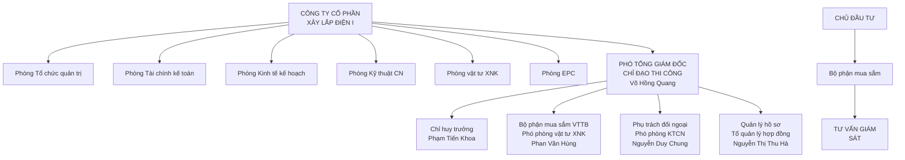

Gói thầu SPC-T3-PC-08: Cung cấp, xây dựng và lắp đặt vật tư, thiết bị trạm biến áp, đường dây


---


Dự án: TBA 110kV T3 và đường dây 110kV T3 – Trạm 220kV Tân Định, tỉnh Bình Dương

## 2. Tổ chức tại công trường

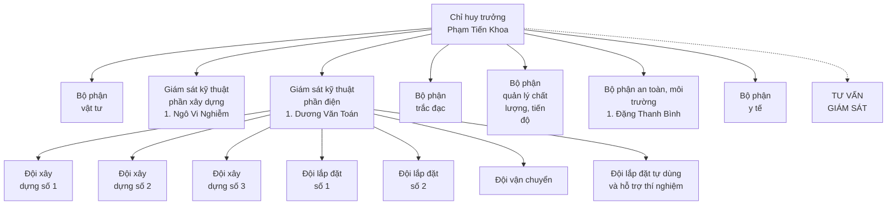

Gói thầu SPC-T3-PC-08: Cung cấp, xây dựng và lắp đặt vật tư, thiết bị trạm biến áp, đường dây


---


Dự án: TBA 110kV T3 và đường dây 110kV T3 – Trạm 220kV Tân Định, tỉnh Bình Dương

1.1. Đội xây dựng

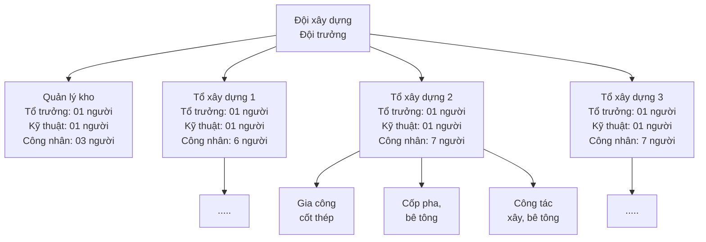

Ghi chú: - Nhân lực cho đội: 30 người/01 đội

Gói thầu SPC-T3-PC-08: Cung cấp, xây dựng và lắp đặt vật tư, thiết bị trạm biến áp, đường dây


---


Dự án: TBA 110kV T3 và đường dây 110kV T3 – Trạm 220kV Tân Định, tỉnh Bình Dương

## 2.2. Đội lắp đặt

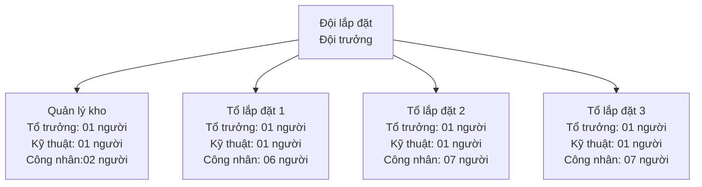

**Ghi chú: - Nhân lực cho đội: 30 người/01 đội**

Gói thầu SPC-T3-PC-08: Cung cấp, xây dựng và lắp đặt vật tư, thiết bị trạm biến áp, đường dây


---


Dự án: TBA 110kV T3 và đường dây 110kV T3 – Trạm 220kV Tân Định, tỉnh Bình Dương

## 3. Thuyết minh sơ đồ tổ chức hiện trường:

Khi trúng thầu, Tổng Giám đốc Công ty ký hợp đồng xây lắp với Chủ đầu tư. Tổng Giám đốc Công ty là người chịu trách nhiệm trước Nhà nước và Chủ đầu tư về chất lượng, tiến độ thi công, ATLĐ trong việc thực hiện gói thầu.

**Ban điều hành tại trụ sở chính của Nhà thầu:**

- Tổng Giám đốc Công ty ủy quyền cho Phó tổng giám đốc phụ trách cùng với các phòng, ban của Công ty liên hệ với Chủ đầu tư trong suốt quá trình thi công gói thầu, chỉ đạo và giao nhiệm vụ cụ thể từng hạng mục, từng công việc cho các phòng Kinh tế Kế hoạch, Kỹ thuật Công nghệ và Phòng Vật tư Xuất nhập khẩu, Phòng Tài chính Kế toán... để chỉ đạo và phục vụ cho Ban chỉ huy công trường hoàn thành công trình với chất lượng cao, thực hiện quản lý chất lượng công trình theo Tiêu chuẩn ISO, đúng tiến độ, ATLĐ tuyệt đối.

- Trách nhiệm của ban điều hành tại trụ sở chính:

+ Chỉ đạo chung toàn bộ hoạt động thi công xây lắp bao gồm kế hoạch thi công, kỹ thuật thi công, nhân lực thi công, vật lực và tài lực thi công...

+ Lo mọi thủ tục pháp lý (hợp đồng, công văn) với các bên liên quan để giải quyết mọi công tác phục vụ thi công công trình, đảm bảo tiến độ kịp thời.

+ Yêu cầu Ban chỉ huy công trường lập tiến độ thi công định kỳ theo tuần, nêu các vướng mắc liên quan để giải quyết kịp thời.

+ Thường xuyên đôn đốc kiểm tra: tiến độ, chất lượng thi công, khối lượng thực hiện, an toàn lao động và vệ sinh môi trường.

**Ban điều hành thi công tại công trường:**

*Tổ chức và trách nhiệm của Ban chỉ huy Công trường:*

Ban CHCT chịu mọi sự chỉ đạo và mệnh lệnh của Tổng Giám đốc Công ty, báo cáo Tổng Giám đốc Công ty mọi hoạt động thi công (01 tuần/1 lần, vào chiều thứ 6 hàng tuần).

Ban chỉ huy Công trường trực tiếp quan hệ cán bộ giám sát kỹ thuật của Chủ đầu tư, Tư vấn Thiết kế, đền bù A, chính quyền địa phương và các cơ quan hữu quan có liên quan đến việc thi công công trình như đường điện, đường giao thông, đường thông tin, đường sông...

Ban chỉ huy Công trường trực tiếp nhận và bảo quản vật tư dây, sứ và phụ kiện từ Chủ đầu tư để cung ứng vật tư, vật liệu cho các đơn vị thi công.

Ban chỉ huy Công trường trực tiếp chỉ đạo, hướng dẫn, giám sát kỹ thuật, giám sát ATLĐ, phân công và đôn đốc công việc cho các đơn vị thi công.

+ Tham gia họp giao ban với Chủ đầu tư tại công trường.

+ Nghiệm thu từng phần công việc hoàn thành để chuyển bước thi công và nghiệm thu hoàn thành công trình.

Nhiệm vụ của Ban chỉ huy Công trường là đảm bảo chất lượng công trình, hoàn thành đúng tiến độ yêu cầu, tuyệt đối an toàn, đảm bảo vệ sinh môi trường tốt.

**Nhân lực của Ban chỉ huy:** *(Bảng đề xuất nhân sự chủ chốt đính kèm - Mẫu số 11A)*

**Các nhân sự bộ phận khác:**

Gói thầu SPC-T3-PC-08: Cung cấp, xây dựng và lắp đặt vật tư, thiết bị trạm biến áp, đường dây


---


Dự án: TBA 110kV T3 và đường dây 110kV T3 – Trạm 220kV Tân Định, tỉnh Bình Dương

- Ngoài ra nhà thầu bố trí 01 cán bộ phụ trách quản lý chất lượng công trình, 01 cán bộ giám sát trực tiếp thi công phần san nền, móng, kè; 01 cán bộ giám sát thi công lắp dựng cột và 01 cán bộ giám sát thi công phần lắp đặt điện nhất thứ.

- 01 Cán bộ kế hoạch - có trên 5 năm kinh nghiệm giám sát thi công nhiều công trình đường dây và trạm biến áp có cấp điện áp tới 500kV được điều từ biên chế của Công ty khi bắt đầu triển khai dự án.

- 01 Cán bộ vật tư - có trên 5 năm kinh nghiệm cung ứng VTTB công trình đường dây và trạm biến áp có cấp điện áp tới 500kV được điều từ biên chế của Công ty khi bắt đầu triển khai dự án.

Các bộ phận khác: 04 người, làm nhiệm vụ chăm sóc sức khoẻ cho cán bộ công nhân viên tham gia thi công nhân viên tiếp nhận vật tư thiết bị, thủ kho, bảo vệ và các công việc hành chính khác.

Bộ phận chuyên trách đền bù giải quyết các vướng mắc đền bù trong quá trình thi công. Bộ phận An toàn vệ sinh môi trường, vệ sinh môi trường kiểm tra, nhắc nhở các tổ đội thi công trên công trường và xử lý các ảnh hưởng thi công đến môi trường và người lao động.

Nhà thầu cam kết nhân sự đề xuất cho dự án này không tham gia dự án nào khác cùng thời điểm với dự án này cũng như bố trí đủ nhân sự chủ chốt thi công công trình.

**c. Mối quan hệ giữa trụ sở chính và ban chỉ huy công trường**

- Trụ sở chính của Nhà thầu có trách nhiệm giúp đỡ về mọi mặt kỹ thuật, vật tư, xe máy, nhân lực, nhất là nguồn tài chính đảm bảo cho Chỉ huy trưởng công trường hoàn thành dự án.

- Quan hệ với các cấp, các ngành, các địa phương giúp cho Chỉ huy trưởng có nhiều thuận lợi trong công việc chỉ đạo công việc của mình.

- Thường xuyên kiểm tra đôn đốc để công trình hoàn thành đúng tiến độ như đã thống nhất trong hợp đồng.

- Các phòng EPC, KTCN, phòng kinh tế - kế hoạch, phòng vật tư XNK, phòng tài chính kế toán tạo mọi điều kiện thuận lợi giúp Chỉ huy trưởng công trường hoàn thành nhiệm vụ.

**d. Bảng phân công trách nhiệm và thẩm quyền cho cán bộ chủ chốt tại công trường**

***Chỉ huy trưởng công trình:***

- Chỉ huy trưởng công trường thay mặt cho Công ty tại hiện trường trực tiếp điều hành công việc tổ chức thi công, điều phối các hoạt động quản lý các đơn vị thi công, chịu trách nhiệm hàng ngày về tiến độ thi công, chất lượng và an toàn công trình. Chỉ huy trưởng là người được uỷ quyền trực tiếp làm việc với bên A giải quyết những vấn đề vướng mắc trong quá trình thi công.

***Trách nhiệm của chỉ huy trưởng công trường:***

- Tổ chức thi công đảm bảo tiến độ, chất lượng công trình theo Hợp đồng đã ký với chủ đầu tư, định kỳ báo cáo tiến độ và tình hình thi công tại hiện trường theo tuần và tháng.

- Giải quyết những vướng mắc và các yêu cầu của Chủ đầu tư trong công tác thi công tại công trường.

- Quan hệ trực tiếp với địa phương nơi thi công đảm bảo an ninh trật tự trong công trường không để mất mát thiết bị, vật tư và những trở ngại khác như ách tắc giao thông, điện lưới v.v. làm ảnh hưởng đến tiến độ, chất lượng.

- Giải quyết những vấn đề tồn tại và phát sinh trong thực tế thi công tại hiện trường.

Gói thầu SPC-T3-PC-08: Cung cấp, xây dựng và lắp đặt vật tư, thiết bị trạm biến áp, đường dây


---


Dự án: TBA 110kV T3 và đường dây 110kV T3 – Trạm 220kV Tân Định, tỉnh Bình Dương

- Tổ chức công trường khoa học, phối hợp tốt các lực lượng thi công: cơ giới, thủ công để công việc tiến triển tốt không chồng chéo nhằm nâng cao năng suất lao động và đảm bảo an toàn trong quá trình thi công xây lắp.

- Liên hệ với các cơ quan quản lý đường dây điện lực, đường dây thông tin để thi công đảm bảo an toàn và hạn chế thời gian cắt điện một cách thấp nhất.

* Bộ phận kỹ thuật:

- Bộ phận quản lý chất lượng và kỹ thuật, an toàn của Ban chỉ huy công trường bao gồm các cán bộ có trình độ về kỹ thuật, trình độ an toàn, có kinh nghiệm về công tác tổ chức thi công.

- Thực hiện việc kiểm tra xác định tim mốc, cao trình, cao độ, giám sát về kỹ thuật và chất lượng thi công, kiểm soát các biện pháp kỹ thuật an toàn, quy trình quy phạm an toàn. Khi phát hiện các sai phạm về kỹ thuật chất lượng, an toàn trong thi công có quyền kiến nghị với chỉ huy trưởng và báo cáo cấp trên có biện pháp xử lý kịp thời mới được tiếp tục thi công.

- Chịu trách nhiệm thường xuyên và liên tục có mặt tại hiện trường để theo dõi, chỉ đạo trong quá trình thi công, thực hiện đầy đủ các nội dung kiểm tra, nghiên cứu các bản vẽ thiết kế, kịp thời phát hiện các sai sót, đề xuất các ý kiến với chỉ huy trưởng công trình, kỹ thuật giám sát bên A xem xét và giải quyết các tồn tại, vướng mắc

- Báo cáo, viết nhật ký hàng ngày. Lập kế hoạch, tiến độ, yêu cầu vật tư, nhân lực, thiết bị máy móc cho yêu cầu của sản xuất.

- Ngoài việc kiểm tra ngoài hiện trường, các vật tư đưa vào công trình cũng phải được kiểm tra chặt chẽ về mặt chất lượng, nghiệm thu trước khi đưa vào công trình.

- Tổ chức quản lý hồ sơ thi công và nghiệm thu qua mỗi giai đoạn xây dựng, nghiệm thu chất lượng để chuyển bước thi công.

- Lập hồ sơ hoàn công, khối lượng nghiệm thu thanh toán khối lượng hoàn thành với Chủ đầu tư.

- Kiểm tra thường xuyên tình trạng hoạt động của xe máy, có phương án điều chuyển xe máy trong nội bộ Công ty khi tiến độ yêu cầu.

- Định kỳ báo cáo tiến độ và tình hình thi công tại hiện trường theo tuần và tháng.

- Giải quyết những vướng mắc và các yêu cầu của Chủ đầu tư trong công tác thi công tại công trường.

- Quan hệ trực tiếp với địa phương nơi thi công đảm bảo an ninh trật tự trong công trường không để mất mát thiết bị, vật tư và những trở ngại khác như ách tắc giao thông, điện lưới v.v. làm ảnh hưởng đến tiến độ, chất lượng.

- Giải quyết những vấn đề tồn tại và phát sinh trong thực tế thi công tại hiện trường.

- Tổ chức công trường khoa học, phối hợp tốt các lực lượng thi công: cơ giới, thủ công để công việc tiến triển tốt không chồng chéo nhằm nâng cao năng suất lao động và đảm bảo an toàn trong quá trình thi công xây lắp.

- Liên hệ với các cơ quan quản lý đường dây điện lực, đường dây thông tin để thi công đảm bảo an toàn và hạn chế thời gian cắt điện một cách thấp nhất.

Gói thầu SPC-T3-PC-08: Cung cấp, xây dựng và lắp đặt vật tư, thiết bị trạm biến áp, đường dây


---


Dự án: TBA 110kV T3 và đường dây 110kV T3 – Trạm 220kV Tân Định, tỉnh Bình Dương

**Các đơn vị thi công trực tiếp:**

Để đảm bảo thi công hoàn thành dự án theo đúng tiến độ, nhà thầu dự kiến bố trí 04 đội thi công xây lắp, 01 đơn vị vận chuyển, 01 đơn vị thi công thông tin, SCADA, 01 đơn vị thí nghiệm đây là những đơn vị chủ lực của Công ty.

**- Đội xây dựng số 1:** Tổng số khoảng 30 công nhân lành nghề lắp trạm với bậc thợ bình quân 3/7 cùng các dụng cụ phương tiện thi công đầy đủ để thực hiện các công việc xây dựng.

**- Đội xây dựng số 2:** Tổng số khoảng 30 công nhân lành nghề lắp trạm với bậc thợ bình quân 4/7 cùng các dụng cụ phương tiện thi công đầy đủ để thực hiện các công việc xây dựng.

**- Đội xây dựng số 3:** Tổng số khoảng 30 công nhân lành nghề lắp đường dây với bậc thợ bình quân 4/7 cùng các dụng cụ phương tiện thi công đầy đủ để thực hiện các công việc xây dựng và lắp đặt ĐZ 110kV đấu nối.

**- Đội xây lắp đặt số 1:** Tổng số khoảng 30 công nhân lành nghề lắp trạm với bậc thợ bình quân 4/7 cùng các dụng cụ phương tiện thi công đầy đủ để thực hiện các công việc lắp đặt điện.

**- Đội xây lắp đặt số 2:** Tổng số khoảng 30 công nhân lành nghề lắp trạm với bậc thợ bình quân 4/7 cùng các dụng cụ phương tiện thi công đầy đủ để thực hiện các công việc lắp đặt điện.

**- Đội lắp đặt điện tự dùng, chiếu sáng và hỗ trợ thí nghiệm hiệu chỉnh:** Tổng số khoảng 10 kỹ thuật viên lành nghề cùng các dụng cụ phương tiện thi công đầy đủ để thực hiện các công việc thi công hệ thống điện tự dùng, chiếu sáng, pin mặt trời và hỗ trợ Đơn vị thí nghiệm.

**- Đội vận chuyển:** Chúng tôi ký hợp đồng thầu phụ với các đơn vị vận tải cơ giới tại địa phương để đảm nhận công tác vận chuyển vật tư thiết bị về công trường.

**Trách nhiệm của các đơn vị thi công trực tiếp:**

- Chịu sự điều hành trực tiếp của Ban chỉ huy công trường

- Chịu trách nhiệm trực tiếp tổ chức quản lý sản xuất, chỉ đạo các tổ thi công hoàn thành khối lượng được giao đảm bảo chất lượng kỹ thuật, đúng tiến độ, an toàn lao động.

- Đảm bảo trật tự an ninh, giữ gìn cảnh quan vệ sinh môi trường.

- Trực tiếp điều động nhân lực trong tổ để thi công đảm bảo chất lượng kỹ - mỹ thuật, đúng tiến độ và an toàn lao động.

**3. Chuẩn bị xe, máy móc thi công:**

Chúng tôi huy động, và đáp ứng đầy đủ số lượng xe máy, thiết bị thi công đảm bảo phục vụ thi công đạt tiến độ. Chủng loại, số lượng, chất lượng các loại xe máy, thiết bị thi công được thể hiện trong bản danh sách máy móc và dụng cụ thi công.

**(Mẫu số 11D: Bảng kê khai thiết bị)**

**4. Chuẩn bị các hồ sơ thi công**

Trước khi chuẩn bị thi công chúng tôi sẽ tiến hành chuẩn bị các hồ sơ kĩ thuật sau đây:

- Hồ sơ thiết kế kỹ thuật thi công;

Gói thầu SPC-T3-PC-08: Cung cấp, xây dựng và lắp đặt vật tư, thiết bị trạm biến áp, đường dây


---


Dự án: TBA 110kV T3 và đường dây 110kV T3 – Trạm 220kV Tân Định, tỉnh Bình Dương

- Đăng ký tạm trú, khai trình lao động với chính quyền địa phương;

- Các chứng chỉ xuất xứ, chất lượng nguồn vật liệu đưa vào công trường;

- Các chứng chỉ xuất xưởng, nguồn gốc thiết bị điện, vật liệu điện, thiết bị điện chiếu sáng...;

- Các phiếu thí nghiệm vật liệu;

- Nhật kí thi công tại công trường;

- Chuẩn bị các phiếu công tác cao áp;

- Tiến độ thi công chi tiết các hạng mục;

- Biện pháp thi công;

- Các biểu mẫu, biên bản nghiệm thu theo đúng Nghị định số 46/2015/NĐ-CP ngày 12/05/2015 của Chính phủ về quản lý chất lượng và bảo trì công trình xây dựng và theo Biểu mẫu do Chủ đầu tư quy định.

Gói thầu SPC-T3-PC-08: Cung cấp, xây dựng và lắp đặt vật tư, thiết bị trạm biến áp, đường dây


---


Dự án: TBA 110kV T3 và đường dây 110kV T3 – Trạm 220kV Tân Định, tỉnh Bình Dương

## CHƯƠNG VI
## BIỆN PHÁP TỔ CHỨC THI CÔNG

### I. GIẢI PHÁP TRẮC ĐẠC ĐỂ ĐỊNH VỊ CÁC VỊ TRÍ MÓNG CỦA CÔNG TRÌNH.

- Công tác trắc đạc đóng vai trò hết sức quan trọng, nó giúp cho việc thi công xây dựng được chính xác hình dáng, kích thước về hình học của công trình, đảm bảo độ thẳng đứng, độ nghiêng kết cấu, xác định đúng vị trí tim trục của các công trình, của các cấu kiện và hệ thống kỹ thuật, đường ống…, loại trừ tối thiểu những sai sót cho công tác thi công. Công tác trắc đạc phải tuân thủ theo TCVN 3972-85.

- Định vị công trình: Khảo sát, kiểm tra và nhận bàn giao của Bên A và TVTK về mặt bằng, mốc, tọa độ và cốt của khu vực.

Sau khi thực hiện định vị vị trí công trình Nhà thầu tiến hành nhận, kiểm tra và lấy cốt cao ± 0,000 của công trình và các hạng mục công trình dựa vào tổng mặt bằng khu vực, sau đó làm văn bản xác nhận với Ban quản lý dự án trên cơ sở tác giả thiết kế chịu trách nhiệm về giải pháp kỹ thuật vị trí, cốt cao ± 0,000. Định vị công trình trong phạm vi đất theo thiết kế.

- Thành lập lưới khống chế thi công làm phương tiện cho toàn bộ công tác trắc đạc. Tiến hành đặt mốc quan trắc cho công trình. Các quan trắc này nhằm theo dõi ảnh hưởng của quá trình thi công đến biến dạng của bản thân công trình.

- Các mốc quan trắc, thiết bị quan trắc phải được bảo vệ quản lý chặt chẽ, sử dụng trên công trình phải có sự chấp thuận của chủ đầu tư. Thiết bị đo phải được kiểm định hiệu chỉnh, phải trong thời hạn sử dụng cho phép.

- Công trình được đóng ít nhất là 18 cọc mốc chính và các các cọc bảo vệ. Cọc bảo vệ mốc cách xa mép công trình ít nhất là 3 mét. Khi thi công dựa vào cọc mốc triển khai đo chi tiết các trục định vị của nhà và các hạng mục xây dựng khác.

- Lập hồ sơ các mốc quan trắc và báo cáo quan trắc thường xuyên theo từng giai đoạn thi công công trình để theo dõi biến dạng và những sai lệch vị trí, kịp thời có giải pháp giải quyết.

### II. BIỆN PHÁP TỔ CHỨC THI CÔNG HẠNG MỤC SAN LẤP MẶT BẰNG:

#### 1. Thi công đường vào khu vực san nền:

Công việc thi công đường dẫn vào khu vực san nền được triển khai thi công bằng cơ giới là chính. Các bước thi công như sau:

+ Định vị vị trí thi công bằng máy toàn đạc điện tử qua các điểm tọa độ đã nhận của TVTK

+ Trước khi tiến hành san nền đường cần thỏa thuận, bàn giao mặt bằng với các chủ sở hữu vật dụng kiến trúc để thực hiện giải tỏa.

+ Bóc lớp thực vật trước khi vận chuyển lấp cát nền đường.

+ Tiến hành lu lèn đảm bảo độ chặt của nền đường. Thiết bị thi công là tổ hợp ô tô vận chuyển, ủi 110CV, lu rung 10 tấn, xe tưới nước.

Biện pháp thi công chi tiết:

Gói thầu SPC-T3-PC-08: Cung cấp, xây dựng và lắp đặt vật tư, thiết bị trạm biến áp, đường dây


---


Dự án: TBA 110kV T3 và đường dây 110kV T3 – Trạm 220kV Tân Định, tỉnh Bình Dương

- Công tác định vị trí thi công trên thực địa được thực hiện bằng máy toàn đạc điện tử kết hợp với thước thép để xác định và dùng cọc tre đóng xuống nền hiện trạng để đánh dấu các vị trí.

- Toàn bộ các điểm giáp danh với vật dụng kiến trúc xung quanh, Nhà thầu thường xuyên theo dõi ảnh hưởng đến kết cấu để thay đổi phương án thi công phù hợp.

- Sau khi hoàn thành công tác gia cố tại các điểm giáp danh (các vật dụng kiến trúc) nhà thầu sử dụng máy đào, đào bỏ lớp đất hữu cơ mặt (20cm) và đưa trực tiếp lên ô tô tự đổ, đổ ra bãi thải. Các lớp đất sau được đào và đổ vào bãi gom đất tạm phục vụ công tác san nền trạm. Đất hữu cơ được đào bỏ hết khỏi phạm vi nền đường. Trong quá trình thi công nếu nước mặt nhiều thì phải tiến hành bơm hút cạn nước ra khỏi phạm vi thi công.

- San gạt lại lớp đất nền đường bằng máy ủi 110CV (trong qua trình san cần chú ý đến độ dốc ngang, dốc dọc của nền đường).

- Tiến hành lu nền đường bằng lu bánh sắt và ru lung loại 10 tấn để đảm bảo độ chặt. Trong quá trình lu lèn nếu độ ẩm đất khô cần sử dụng xe tưới nước để tưới ẩm đất đảm bảo độ ẩm tối ưu.

Nhà thầu sẽ bảo vệ nền đường khỏi bị hư hại bằng cách thi hành các biện pháp bảo vệ bảo đảm bề mặt nền đường luôn được giữ trong điều kiện sẵn sàng thoát nước.

## 2. Thi công san nền:

Công việc thi công san nền được triển khai thi công bằng cơ giới là chính. Các bước thi công như sau:

+ Định vị vị trí thi công TBA theo Bảng tọa độ mốc Ranh.

+ Dùng máy đào bánh hơi 0,5m3 kết hợp máy ủi 110CV đào bỏ lớp đất thực vật bề mặt (10cm) và nghiệm thu bóc lớp thực vật bằng máy toàn đạc điện tử.

+ Đắp cát nền theo từng lớp tiến hành lu đầm đảm bảo độ chặt K≥0.95 và triển khai thi công đến cao độ thiết kế.

### * Biện pháp thi công:

- Công tác định vị trí thi công trên thực địa được thực hiện bằng máy toàn đạc điện tử kết hợp với thước thép để xác định và dùng cọc tre đóng xuống nền hiện trạng để đánh dấu các vị trí. Trước khi triển khai thi công nhà thầu đo đạc mặt bằng hiện trạng theo lưới ô vuông với các bước lưới như trong thiết kế.

### - Bóc lớp thực vật, đào gốc cây, nạo vét bùn:

Nhà thầu sẽ làm việc với CĐT và các hộ dân để thỏa thuận, giải quyết theo quy định, chính sách. Sau khi CĐT và các hộ dân bàn giao mặt bằng Nhà mới tiến hành thi công các khu vực này.

+ Phần lớn diện tích nền trạm chủ yếu là cây ăn trái có địa hình kênh, rạch nhỏ chũng ngập nước, vì vậy cần bố trí máy bơm để hút nước khỏi mặt bằng sau đó dùng máy đào bánh xích để thực hiện công tác bóc lớp thực vật. Thực vật bóc được gom thành đống và đưa lên xe ben đưa ra bãi thải theo quy định.

+ Đối với các khu vực còn lại sử dụng máy ủi 110CV tiến hành ủi gạt lớp bùn, đất hữu cơ gom thành từng đống từ 20-30m3 sau đó sử máy máy đào gầu bánh lốp 0,5m3 đưa lên ô tô tự đổ. Bùn, đất hữu cơ được gạt, đào bỏ hết khỏi phạm vi khu vực san nền.

+ Trong quá trình thi công nếu nước mặt nhiều thì phải tiến hành bơm hút cạn nước ra khỏi phạm vi của nền.

Gói thầu SPC-T3-PC-08: Cung cấp, xây dựng và lắp đặt vật tư, thiết bị trạm biến áp, đường dây


---


Dự án: TBA 110kV T3 và đường dây 110kV T3 – Trạm 220kV Tân Định, tỉnh Bình Dương

+ Đối với các gốc cây lớn, nhỏ trong khu vực san nền được máy đào gầu đào loại bỏ tại chỗ toàn bộ gốc và rễ gom thành từng đống.

+ Bùn, đất hữu cơ, gốc cây loại bỏ được ô tô ben vận chuyển đến bãi đổ do nhà thầu chỉ định và được chủ đầu tư chấp thuận.

- Tiến hành nghiệm thu bóc lớp bùn đất hữu cơ về: cao độ, kích thước hình học

## MẶT CẮT NGANG BÓC LỚP ĐẤT HỮU CƠ

![Diagram showing cross-section of organic soil layer removal with two bulldozers working from both sides towards the center, with labels indicating "ĐẤC HỮU CƠ" (organic soil) on both sides, "CAO ĐỘ MATBSA ĐÃO ĐẤT HỮU CƠ" (elevation of organic soil excavation) at the top, "MẶC ĐỈNH CV" (CV top surface) on both bulldozers, and "HỆ THỐNG SA VIÊN" (grid system) at the bottom]

### - San, đầm đất, cát nền trạm.

- Đối với các khu vực tận dụng lại đất, cát ở các vị trí đào móng Đơn vị thi công dùng máy đào gầu đào đất tại các vị trí móng đưa lên ô tô ben và đổ vào khu vực nền trạm có cao độ âm thấp nhất tại TBA, đổ thành từng đống. Trước khi đắp, đất được làm thí nghiệm để xác định các chỉ tiêu cơ lý.

- Tương tự đối với cát cần mua bổ sung để san, đắp nền chúng tôi cũng tiến hành thí nghiệm cơ lý và trình hồ sơ lên chủ đầu tư xem xét, chấp thuận sau đó mới tiến hành san lấp đồng loạt. Các ô tô chở cát trước khi san nền được kiểm tra chất lượng, khối lượng và đổ theo lưới chia ô khu vực đã đánh dấu trên bản vẽ.

- San gạt lớp cát toàn bộ mặt bằng trạm bằng máy ủi (trong quá trình san cần chú ý đến độ dốc ngang, dốc dọc của bãi san nền). Các lớp cát được ủi theo từng lớp theo thiết kế sau đó tiến hành lu đầm.

- Tiến hành lu đầm lớp cát đắp đạt độ chặt K≥0.95 và tiến hành nghiệm thu.Theo tiêu chuẩn 4447-2012 và TCXD 309-2004 (Cao độ, khích thước hình học, độ chặt). Trong quá trình lu lèn nếu độ ẩm cát đắp, đất đắp không đạt yêu cầu cần sử dụng xe tưới nước để tưới ẩm cát đảm bảo độ ẩm tối ưu. Quá trình trên được tiến hành lập đi lập lại và được thi công đến cao độ thiết kế.

Gói thầu SPC-T3-PC-08: Cung cấp, xây dựng và lắp đặt vật tư, thiết bị trạm biến áp, đường dây


---


Dự án: TBA 110kV T3 và đường dây 110kV T3 – Trạm 220kV Tân Định, tỉnh Bình Dương

![Diagram showing a road roller compacting layers of material on a road surface with a stone embankment on the right side]

## 3. Giải pháp xử lý bùn, thực vật, đất thừa.

- Sau khi có thông báo trúng thầu của Chủ đầu tư, Nhà thầu triển khai ngay công tác thỏa thuận về bãi đổ bùn, đất, thực vật và chất thải trong thi công với UBND tỉnh Bình Dương và các sở Tài nguyên môi trường, sở Xây dựng.

- Căn cứ vào khối lượng bản vẽ thiết kế Nhà thầu đăng ký chi tiết khối lượng bùn đất, thực vật và quy trình phân loại …

- Đăng ký làm thủ tục vận chuyển bùn đất, thực vật với sở giao thông, chính quyền địa phương.

- Có báo cáo hàng kỳ về tình hình chuyên chở bùn đất, các tác động đến môi trường xung quanh khu vực thi công và môi trường địa phương. Có phương án giảm thiểu các nguy hại trong quá trình vận chuyển, thi công.

- Bãi đổ thải được xin cấp phép đảm bảo diện tích bãi đổ, cách xa khu vực dân cư và có khoảng cách ngắn nhất .

- Khi chất dứt các hoạt động thi công chuyển chở bùn đất, thực vật, đất thừa trong thi công Công trình, Nhà thầu có văn bản thông báo cho các sở ban ngành tỉnh Bình Dương và chính quyền địa phương nơi đặt công trình.

## III. THI CÔNG MÁI TALUY TRẠM, HỆ THỐNG THOÁT NƯỚC, CỐNG QUA ĐƯỜNG.

### 1. Thi công mái taluy.

- Sau khi lu nèn phần đất, cát taluy quanh trạm, nhà thầu tiến hành gọt mái taluy.

- Sử dụng máy xúc 0,5m3, ô tô ben 7-15 tấn để đắp và gọt mái ta luy.

Gói thầu SPC-T3-PC-08: Cung cấp, xây dựng và lắp đặt vật tư, thiết bị trạm biến áp, đường dây


---


Dự án: TBA 110kV T3 và đường dây 110kV T3 – Trạm 220kV Tân Định, tỉnh Bình Dương

![Diagram showing excavation process with Taluy slopes, excavator, and truck labeled "Ô tô Ben 15T" and "Cốt nền trạm"]

- Máy xúc sau khi múc ta luy đến cao độ đúng bản vẽ thiết kế sẽ sử dụng gầu gạt làm phẳng mái ta luy.

- Đất, cát thừa trong quá trình cắt gọt mái taluy sẽ được sử dụng để san nền trạm.

- Sau khi thi công và nghiệm thu với chủ đầu tư xong phần ta luy sẽ tiến hành xây kè mái dốc bảo vệ ta luy.

* Phần kè Chân và thân mái taluy.

- Đào móng chân kè, và làm phẳng bề mặt kè.

- Dùng máy trộn bê tông, vữa XM 350l để thi công. Bê tông, vữa XM được chở đến khu vực thi công bằng xe cút kít và máng đổ.

- Phần chân và mái taluy âm được xây kè đá bằng vữa xi măng M75 theo kích thước trong bản vẽ thi công. Khi xây kè đá thực hiện nguyên tắc chêm chèn đá nhỏ vào kẽ hở đá lớn, cho vữa chèn khít các khe đá. Vữa được trộn đều đúng tỉ lệ cấp phối được duyệt, lượng vữa trộn đủ dùng không vượt quá thời gian quy định. Đá có đủ cường độ, không phong hoá, không nứt nẻ, được A chấp nhận.

- Thành phần vữa xây trộn đúng tỷ lệ thiết kế cấp phối.

## 2. Thi công hệ thống thoát nước.

- Toàn bộ nước thải, nước sinh hoạt và nước mưa được thu qua hệ thống mương dẫn, ống dẫn qua hố thu nước thải, qua xử lý cục bộ sau đó được đưa vào hệ thống thoát nước khu vực.

* Hệ thống thoát nước sinh hoạt, nước mưa dùng ống nhựa thao tác nối ống được tiến hành như sau:

+ Kiểm tra lần cuối tính đồng bộ của hai ống trước khi nối.

+ Vệ sinh điểm nối của cả hai ống bằng giẻ sạch, mới, không xơ, không bụi.

+ Bôi keo một lượt đều ở cả hai ống (nghiêm cấm việc bôi keo một đầu ống)

+ Bôi keo xong phải nối ống ngay không được để chậm quá 30 giây nối xong giữ cố định trong 5 phút.

+ Sau các điểm nối đường ống đều có đai giữ vào tường hoạc chèn bằng cát đệm để đường ống không phải chịu tải trọng của toàn bộ đường ống.

+ Khi các mối nối đã ổn định, Nhà thầu tiến hành lấp đất, đất lấp có độ đồng đều cao, hạt nhỏ, được lấp đều cả hai bên thành ống, tưới nước và đầm nhẹ từng lớp mỏng.

* Hệ thống thoát nước quanh trạm.

<page_footer>
Gói thầu SPC-T3-PC-08: Cung cấp, xây dựng và lắp đặt vật tư, thiết bị trạm biến áp, đường dây
</page_footer>

---


Dự án: TBA 110kV T3 và đường dây 110kV T3 – Trạm 220kV Tân Định, tỉnh Bình Dương

Song hành cùng với thi công mái taluy, chúng tôi cũng tiến hành xây đá hộc hệ thống mương thoát nước bên dưới để đảm bảo thu nước về hệ thống thoát nước khu vực, tránh xả tràn ra khu vực xung quanh và đảm bảo nền đất xung quanh trạm.

Sau khi xây đá hộc xong phần đáy rãnh thoát nước chúng tôi tiến hành xây đá thành rãnh theo đúng thiết kế.

Tại mỗi thi công đều có trắc địa kiểm tra và đánh dấu để đảm bảo theo đúng thiết kế.

[Diagram showing a cross-section of an embankment with stone protection layers and a person operating machinery on the right side]

## 3. Thi công tường chắn nền trạm.

Tường chắn đất được thi công song song với quá trình san nền trạm.

- Đào móng chân tường, và làm phẳng bề mặt móng.

- Đóng 03 hàng cừ chàm (dài 4,5m; loại D=80-100mm; khoảng cách a = 200) móng tường chắn.

- Dùng máy trộn bê tông 350l để thi công đổ bê tông lót M100. Bê tông được chở đến khu vực thi công bằng xe cút kít và máng đổ.

- Tường chắn được xây đá hộc bằng vữa xi măng M75 theo kích thước trong bản vẽ thi công. Khi xây kè đá thực hiện nguyên tắc chêm chèn đá nhỏ vào kẽ hở đá lớn, cho vữa chèn khít các khe đá. Vữa được trộn đều đúng tỉ lệ cấp phối được duyệt, lượng vữa trộn đủ dùng không vượt quá thời gian quy định. Đá có đủ cường độ, không phong hoá, không nứt nẻ, được A chấp nhận.

- Thành phần vữa xây được thi công đúng tỷ lệ thiết kế cấp phối.

## 4. Thi công cống qua đường.

Sau khi hoàn thành công tác san nền trạm, nhà thầu tiến hành đào cống thoát nước qua tường chắn đất và cống qua đường của đoạn đường vào trạm để đảm bảo thoát nước trên mặt bằng trạm.

B1: Sử dụng máy xúc nhỏ, đào dọc vị trí lắp đặt ống thoát nước quy cách phù hợp với độ dốc của đường ống

Gói thầu SPC-T3-PC-08: Cung cấp, xây dựng và lắp đặt vật tư, thiết bị trạm biến áp, đường dây


---


Dự án: TBA 110kV T3 và đường dây 110kV T3 – Trạm 220kV Tân Định, tỉnh Bình Dương

![Technical diagram showing installation of conduit using excavator with detailed cross-section view]

B2: Sửa hố đặt cống bằng thủ công theo đúng bản vẽ thiết kế, đầm chặt bằng đầm cóc
Tiếp tục sử dụng máy xúc để lắp đặt cống vào vị trí,

![Technical diagram showing excavator placing conduit with worker supervision, including plan view and cross-section with dimension W marked]

B3: Kiểm tra lại độ dốc để căn chỉnh và lấp đất (hoặc cát) theo thiết kế. Sử dụng đầm cóc để đầm chặt.

Gói thầu SPC-T3-PC-08: Cung cấp, xây dựng và lắp đặt vật tư, thiết bị trạm biến áp, đường dây


---


Dự án: TBA 110kV T3 và đường dây 110kV T3 – Trạm 220kV Tân Định, tỉnh Bình Dương

![Diagram showing construction method with workers performing "CÁT LẤP" (sand filling) and "ĐẦM CÓC" (tamping) operations, with cross-sectional view showing width "W"]

## IV. BIỆN PHÁP THI CÔNG PHẦN MÓNG, MƯƠNG CÁP.

* Sau khi chủ Đầu tư giải phóng và giao mặt bằng. Chúng tôi tiến hành kiểm tra mặt bằng so với thiết kế trình chủ đầu tư khi được sự đồng ý của chủ đầu tư chúng tôi mới tiến hành thi công.

* Nhà thầu triển khai thi công móng, các cấu kiện xây dựng tại các vị trí bàn giao mặt bằng trước (nếu đến thời điểm thi công chưa bàn giao xong mặt bằng TBA) để tận dụng đất, cát đào hố móng san nền xuống các khu vực khác.

### 1. Công tác chuẩn bị:

#### a. Thiết kế cấp phối bê tông:

- Khảo sát tìm nguồn vật liệu cát, đá tại địa phương hoặc các vùng lân cận. Mẫu cát, đá được thí nghiệm và thiết kế thành phần cấp phối bê tông tại cơ quan có đầy đủ chức năng và tư cách pháp nhân.

- Kết quả thiết kế thành phần cấp phối bê tông được gửi Chủ đầu tư bằng văn bản (kèm theo kết quả thử nghiệm và chứng chỉ chất lượng sắt thép, xi măng...)

#### * Thiết kế thành phần bê tông mác 150 trở lên:

Thành phần vật liệu trong bê tông mác 150 trở lên được thiết kế thông qua phòng thí nghiệm (tính toán và đúc mẫu thí nghiệm), lấy mẫu bê tông theo TCVN 4453-1995. Khi thiết kế thành phần bê tông phải đảm bảo sử dụng đúng các vật liệu sẽ dùng để thi công.

Cường độ nén của mẫu chuẩn được xác định bằng từ trung bình giá trị cường độ nén của các viên trong tổ mẫu chuẩn theo công thức sau:

R = Rn (1-1.64V)    (công thức 2.1-TCVN 5574:1991)

Trong đó

R: Cường độ chịu nén khối vuông

Gói thầu SPC-T3-PC-08: Cung cấp, xây dựng và lắp đặt vật tư, thiết bị trạm biến áp, đường dây


---


Dự án: TBA 110kV T3 và đường dây 110kV T3 – Trạm 220kV Tân Định, tỉnh Bình Dương

Rn: giá trị trung bình cường độ các mẫu thử chuẩn

v=0.15: hệ số biến động về cường độ bê tông

Cụ thể :

| Giá trị trung bình cường độ các mẫu thử chuẩn Rn(kG/cm2) | 199 | 265 | 332 | 398 |
|-----------------------------------------------------------|-----|-----|-----|-----|
| Cường độ chịu nén khối vuông R(kG/cm2)                   | 150 | 200 | 250 | 300 |

Thành phần vật liệu của mẫu thử chuẩn thỏa mãn yêu cầu thiết kế nếu cường độ chịu nén khối vuông R tương ứng không nhỏ hơn cường độ thiết kế, và sự khác biệt giữa cường độ giữa các viên mẫu không nhiều hơn 15% của giá trị trung bình Rn.

Việc hiệu chỉnh thành phần bê tông tại hiện trường được tiến hành theo nguyên tắc không làm thay đổi tỉ lệ N/X của thành phần bê tông đã thiết kế:

Mỗi loại cấu kiện bê tông phải lấy ít nhất một tổ mẫu gồm 03 viên mẫu được lấy cùng một lúc ở cùng một chỗ theo TCVN 3105-1993.

Khi cốt liệu ẩm cần giảm bớt lượng nước trộn, giữ nguyên độ sụt yêu cầu.

Khi cần tăng độ sụt cho phù hợp với điều kiện thi công thì có thể đồng thời thêm nước và xi măng để giữ nguyên tỉ lệ N/X.

## * Thiết kế thành phần bê tông mác 100:

Đối với bê tông mác 100 có thể sử dụng bảng tính sẵn trong TCVN 4453-1995 như sau

Bảng thành phần vật liệu cho lm³ bê tông nặng mác 100

| Cốt liệu và quy cách | Xi măng (kg) | Cát (kg) | Đá sỏi (kg) | Nước (lít) |
|----------------------|--------------|----------|-------------|------------|
| Cát có ML=2.1-3.5 Đá dăm cỡ hạt Dmax=l0mm | 265 | 615 | 1260 | 195 |
| Cát có ML=2.1-3.5 Đá dăm cỡ hạt Dmax=20mm | 245 | 665 | 1190 | 185 |
| Cát có ML=2.1-3.5 Đá dăm cỡ hạt Dmax=40mm | 224 | 680 | 1240 | 180 |
| Cát có ML=2.1-3.5 Đá dăm cỡ hạt Dmax=70mm | 219 | 725 | 1270 | 170 |

ML: Mô đun độ lớn

Dmax: Kích thước cạnh lớn nhất

## b. Vật tư, cốt liệu:

* Về chất lượng Xi măng, sắt thép, cát đá, nước phải đảm bảo theo những yêu cầu kỹ thuật đã trình bày.

## c. Ván khuôn:

## * Vật liệu dùng làm ván khuôn:

Gói thầu SPC-T3-PC-08: Cung cấp, xây dựng và lắp đặt vật tư, thiết bị trạm biến áp, đường dây


---


Dự án: TBA 110kV T3 và đường dây 110kV T3 – Trạm 220kV Tân Định, tỉnh Bình Dương

- Ván khuôn dùng đổ bê tông của các kết cấu chính trong công trình như: móng trụ được dùng bằng thép. Trong các kết cấu phụ khác nhà thầu có thể đề nghị dùng gỗ hay vật liệu khác song phải có sự đồng ý của GSTCCĐT trước khi dùng.

- Ván khuôn không dùng đến cần được vệ sinh, bôi dầu và cất giữ. Lưu ý giữ phẳng và bảo vệ tốt, tránh các biến dạng lớn do độ ẩm.

**Thiết kế ván khuôn và dàn giáo:**

- Ván khuôn và dàn giáo được nhà thầu thiết kế đảm bảo độ cứng, ổn định, dễ tháo lắp, không gây khó khăn cho việc đặt cốt thép, đổ và đầm bê tông. Việc tính toán thiết kế được thực hiện theo phụ lục A- TCVN4453-1995.

- Trước khi thi công ván khuôn, các bản vẽ ván khuôn và giàn chống của nhà thầu đều được GSTCCĐT chấp thuận.

**Làm sạch ván khuôn:**

Ván khuôn được vệ sinh sạch sẽ trước khi đổ bê-tông. Ván khuôn tiếp xúc với bê-tông được giữ sạch sẽ và quét một lớp dầu lót khuôn thích hợp, cẩn thận không để chất dầu lót này tiếp xúc với cốt thép hay với bê-tông ở các mối nối liên kết khác. Ván khuôn phải được làm sạch hoàn toàn sau khi sử dụng. Ván khuôn bị hư hỏng hay méo mó sẽ không được sử dụng.

**Sai lệch cho phép đối với ván khuôn dàn giáo**

| Tên sai lệch                                                                        | Mức cho phép (mm) |
| ----------------------------------------------------------------------------------- | ----------------- |
| Sai lệch mặt phẳng ván khuôn so với phương thẳng đứng hoặc độ nghiêng thiết kế Móng | 20                |
| Trụ móng                                                                            | 10                |
| Sai lệch trục ván khuôn so với thiết kế                                             |                   |
| Móng                                                                                | 15                |
| Trụ móng                                                                            | 8                 |


**e. Cốt thép:**

- Cốt thép dùng trong công trình đảm bảo các yêu cầu của thiết kế về chủng loại, cường độ, đồng thời phù hợp với các quy định - Vật liệu dùng trong xây dựng

- Cốt thép trước khi gia công và trước khi đổ bê tông đảm bảo bề mặt sạch, không bị rỉ sét, vảy cán, không dính bùn đất, dầu mỡ, hay bất kỳ vật liệu khác ảnh hưởng xấu đến độ bám dính của bê tông vào cốt thép hay làm phân rã bê tông. Các thanh thép được kéo, uốn và nắn thẳng.

- Nghiêm cấm việc sử dụng cốt thép xử lí nguội thay thế cốt thép cán nóng.

**Cắt và uốn cốt thép:**

- Cắt và uốn cốt thép được thực hiện bằng các phương pháp cơ học, khi thay thế phương án nhà thầu có văn bản thống nhất với CĐT. Các thanh thép đường kính lớn sẽ được gia công uốn nóng.

Gói thầu SPC-T3-PC-08: Cung cấp, xây dựng và lắp đặt vật tư, thiết bị trạm biến áp, đường dây


---


Dự án: TBA 110kV T3 và đường dây 110kV T3 – Trạm 220kV Tân Định, tỉnh Bình Dương

- Khi cần bẻ cong các cốt thép lòi ra khỏi bê-tông, việc bẻ cong và làm thẳng lại sẽ được thực hiện với điều kiện bán kính trong của các móc cong không nhỏ hơn 4 lần đường kính của cốt thép mềm hoặc 6 lần đường kính của cốt thép có cường độ cao.

**Nối chồng cốt thép:**

- Việc nối chồng cốt thép phải thỏa mãn các yêu cầu sau:

- Trong một mặt cắt ngang của tiết diện kết cấu không nối quá 25% diện tích tổng cộng của cốt thép chịu lực đối với thép tròn trơn và không quá 50% đối với thép có gờ. Không nối cốt thép ở vị trí chịu lực lớn và chỗ uốn cong.

- Chiều dài nối chồng cốt thép không được nhỏ hơn trị số cho trong bảng Chiều dài nối buộc cốt thép.

- Khi nối chồng, cốt thép ở vùng chịu kéo phải uốn móc đối với thép tròn trơn, cốt thép có gờ không uốn móc.

- Dây buộc thép dùng loại dây thép mềm đường kính lmm Trong các mối nối buộc ít nhất là 3 vị trí (ở giữa và 2 đầu).

Bảng chiều dài nối buộc cốt thép

| Loại cốt thép           | Chiều dài nối buộc<br/>Vùng chịu kéo<br/>Dầm hoặc tường | Chiều dài nối buộc<br/>Vùng chịu kéo<br/>Kết cấu khác | Chiều dài nối buộc<br/>Vùng chịu nén<br/>Đầu cốt thép có móc | Chiều dài nối buộc<br/>Vùng chịu nén<br/>Đầu cốt thép không có móc |
| ----------------------- | ------------------------------------------------------- | ----------------------------------------------------- | ------------------------------------------------------------ | ------------------------------------------------------------------ |
| Cốt thép trơn cán nóng  | 40d                                                     | 30d                                                   | 20d                                                          | 30d                                                                |
| Cốt thép có gờ cán nóng | 40d                                                     | 30d                                                   |                                                              | 20d                                                                |


**Hàn cốt thép:**

- Cốt thép không được phép hàn trừ phi được chỉ định trên bản vẽ xây dựng và với điều kiện cốt thép là loại có thể hàn được.

- Công tác hàn được thực hiện bởi thợ hàn có tay nghề thích hợp. Việc hàn cốt thép sẽ thống nhất với GSTCCĐT. Sai lệch cho phép đối với mối hàn không được vượt quá trị số theo TCVN 4453-95.

- 6 mẫu cho 100 mối hàn ghép nối sẽ được kiểm nghiệm, 3 mẫu để thử kéo, 3 mẫu để thử uốn.

**Sai lệch cho phép đối với cốt thép:**

| Tên sai lệch                                                            | Mức cho phép (mm) |
| ----------------------------------------------------------------------- | ----------------- |
| Sai lệch về khoảng cách giữa các cốt thép chịu lực của:                 |                   |
| Móng, bản, tường                                                        | ±20               |
| Trụ, dầm                                                                | ±10               |
| Sai lệch về khoảng cách giữa các hàng cốt thép chịu lực theo chiều cao: |                   |
| Móng                                                                    | ±20               |


Gói thầu SPC-T3-PC-08: Cung cấp, xây dựng và lắp đặt vật tư, thiết bị trạm biến áp, đường dây


---


Dự án: TBA 110kV T3 và đường dây 110kV T3 – Trạm 220kV Tân Định, tỉnh Bình Dương

| Dầm và bản dày hơn 100mm | ±5 |
| Sai lệch về khoảng cách giữa các cốt thép đai của dầm cột: | ±10 |
| Sai lệch cục bộ về chiều dày lớp bê tông bảo vệ | |
| Móng | ±10 |
| Trụ, dầm | ±5 |
| Sai lệch về độ nghiêng của cốt đai | ±10 |

**Vận chuyển cốt thép:**

Khi vận chuyển cốt thép đã gia công đảm bảo không làm hư hỏng và biến dạng sản phẩm cốt thép, cốt thép từng thanh cần được buộc thành từng lô theo chủng loại và số lượng để tránh nhầm lẫn khi sử dụng.

## 2. Công tác giác móng:

Bộ phận trắc địa, dùng máy toàn đạc hoặc kinh vĩ kiểm tra trục tim móng, hướng móng, cốt và tim mốc của từng loại móng.

Gửi các tim mốc ra ngoài khu vực hố đào, đánh dấu bằng cọc gỗ kích thước 40×40×500mm và bảo vệ cẩn thận không cho đất lấp lên hoặc người dẫm đạp lên. Tiến hành giác móng để giới hạn và đóng bốn cọc bằng gỗ tại bốn góc của miệng trên hố đào.

**Sơ đồ giác móng theo bản vẽ sau:**

**- Sơ đồ giác móng.**

![Diagram showing: A rectangular pit with 500mm spacing marked. Points marked with circles (⊙ and ●) indicating: "Miệng hố móng sẽ đào" (pit opening to be excavated), "Cọc để xác định miệng hố móng" (stakes to determine pit opening), "Cọc để xác định tim móng" (stakes to determine pit centerline), and "Cọc xác định tim tuyến" (stakes to determine alignment centerline)]

## 3. Tiêu nước:

Trước khi đào hố móng Nhà thầu xây dựng hệ thống tiêu nước bề mặt. Không để nước chảy tràn qua mặt bằng và không để hình thành vũng đọng trong quá trình thi công. Tùy theo địa hình và tính chất công trình Nhà thầu lập biện pháp tổ chức thi công các công việc cần thiết để đào rãnh, đắp bờ con trạch ngăn không cho nước chảy vào hố móng công trình.

Nước từ hệ thống tiêu nước thoát ra bảo đảm thoát nhanh, nhưng phải tránh xa những công trình sẵn có hoặc đang xây dựng, cấm không được làm ngập úng, xói lở đất và công trình.

Gói thầu SPC-T3-PC-08: Cung cấp, xây dựng và lắp đặt vật tư, thiết bị trạm biến áp, đường dây


---


Dự án: TBA 110kV T3 và đường dây 110kV T3 – Trạm 220kV Tân Định, tỉnh Bình Dương

Để phòng ngừa vữa bị rửa trôi khỏi khối xây Nhà thầu làm các rãnh thoát nước và các giếng thu nước. Nước ngấm vào hố móng trong thời gian xây móng nhất thiết phải bơm ra, không cho phép lớp bê tông hay vữa mới thi công ngập nước chừng nào chưa đạt 30% cường độ thiết kế.

**4. Đào đất (chắn cừ, bảo vệ thành vách hố móng); lấp đất.**

*4.1. Biện pháp thi công đào hố móng*

Trước khi thi công đào móng, chúng tôi tiến hành đo trắc đạc và cắm mốc theo đúng kích thước, vị trí tọa độ nêu trong hồ sơ thiết kế.

- Ép cọc cừ:

- Bước 1: Máy ép thanh cọc cừ đầu tiên đến chiều sâu quy định.

- Bước 2: Máy ép thanh cọc cừ thứ 2 và xác định mức chịu tải của cọc.

- Bước 3: Nâng thân máy lên và dừng lại ở ở vị trí cái kẹp cọc thấp hơn đầu cọc 5 m.

- Bước 4: Sau khi ổn định nâng máy ép cọc cừ lên.

- Bước 5: Đẩy bàn kẹp cọc đầu búa về phía trước xoay bàn kẹp từ phải sang trái.

- Bước 6: Điều chỉnh đầu búa vào cọc cừ để đặt cọc xuống từ từ.

- Để cọc không bị xiên, chúng tôi dùng biện pháp quả rọi để điều chỉnh độ thẳng đứng của cọc theo cả 2 phương.

- Rút cọc: cừ được rút khi thi công xong móng.

- Khi rút cừ cũng dùng máy ép, trình tự thi công ngược lại so với quá trình ép. Lưu ý khi nhổ cừ lên sẽ sinh ra lỗ hổng trong nền đất, để khắc phục điều này, song song với quá trình nhổ cọc nhà thầu sẽ cho tiến hành chèn lại bằng cát, dùng nước xối để cát dễ dàng lấp đầy lỗ hổng trên để hoàn trả lại mặt bằng cho Chủ đầu tư.

Thi công đào móng tiến hành phù hợp với quy phạm công tác đất, đảm bảo ổn định của các mái dốc, đảm bảo an toàn cho người, thiết bị và công trình trong công tác đào móng.

- Trước khi đào hố móng phải xây dựng hệ thống tiêu nước. Đất thừa không đảm bảo chất lượng phải đổ ra bãi thải quy định, không đổ bừa bãi làm ảnh hưởng các công trình khác và làm trở ngại quá trình thi công.

- Xác định độ mở taluy theo cấp đất để có biện pháp chống sạt lở, lún và làm biến dạng các công trình lân cận khi đào.

- Thi công đào hố móng bằng máy xúc bánh hới có dung tích là 0,5m³, kết hợp với đào thủ công sau đó sửa thủ công.

- Đất đào đổ ra miệng hố đào là 1m. Đất đào lên được đắp thành đê quây xung quanh móng, và san mặt bằng chỗ để vật liệu. Xung quanh đáy hố móng đào rãnh thoát nước chảy về hố ga thu nước, nếu có nước dùng máy bơm hút sạch đảm bảo khô ráo trong quá trình đúc bê tông.

- Sau khi đào xong hố móng chúng tôi làm phẳng đáy hố móng bằng thủ công kết hợp máy đầm cóc.

Chúng tôi dùng máy kinh vĩ xác định tim móng, tim trụ của tất cả các trụ đỡ thiết bị, bể nước,...... và các kích thước cho đúng thiết kế.

Gói thầu SPC-T3-PC-08: Cung cấp, xây dựng và lắp đặt vật tư, thiết bị trạm biến áp, đường dây


---


Dự án: TBA 110kV T3 và đường dây 110kV T3 – Trạm 220kV Tân Định, tỉnh Bình Dương

![Diagram showing excavation layout during rainy season with labels: "Máy bơm nước" (water pump), "Đường bao chắn các tấm tôn" (protective sheet metal barrier), "Diện tích hố đào" (excavation area), "Khu vực đổ đất đào" (excavated soil disposal area), and dimension "1.5 ÷ 2m"]

**Sơ đồ đào móng khi mùa mưa**

* Yêu cầu về chiều sâu và độ mở khi thi công đào móng.

| Loại đất                                                  | Độ dốc lớn nhất cho phép khi chiều sâu của hố móng bằng<br/>1,5m<br/>Góc nghiêng của mái dốc (độ) | Độ dốc lớn nhất cho phép khi chiều sâu của hố móng bằng<br/>1,5m<br/>Tỷ lệ độ dốc (độ) | Độ dốc lớn nhất cho phép khi chiều sâu của hố móng bằng<br/>3m<br/>Góc nghiêng của mái dốc (độ) | Độ dốc lớn nhất cho phép khi chiều sâu của hố móng bằng<br/>3m<br/>Tỷ lệ độ dốc (độ) | Độ dốc lớn nhất cho phép khi chiều sâu của hố móng bằng<br/>5m<br/>Góc nghiêng của mái dốc (độ) | Độ dốc lớn nhất cho phép khi chiều sâu của hố móng bằng<br/>5m<br/>Tỷ lệ độ dốc |
| --------------------------------------------------------- | ------------------------------------------------------------------------------------------------- | -------------------------------------------------------------------------------------- | ----------------------------------------------------------------------------------------------- | ------------------------------------------------------------------------------------ | ----------------------------------------------------------------------------------------------- | ------------------------------------------------------------------------------- |
| Đất mượn                                                  | 56                                                                                                | 1:0,67                                                                                 | 45                                                                                              | 1:1                                                                                  | 38                                                                                              | 1:1,25                                                                          |
| Đất cát và cát cuội ẩm                                    | 63                                                                                                | 1:0,5                                                                                  | 45                                                                                              | 1:1                                                                                  | 45                                                                                              | 1:1                                                                             |
| Đất cát pha                                               | 76                                                                                                | 1:0,25                                                                                 | 56                                                                                              | 1:0,67                                                                               | 50                                                                                              | 1:0,85                                                                          |
| Đất thịt                                                  | 90                                                                                                | 1:0                                                                                    | 63                                                                                              | 1:0,5                                                                                | 53                                                                                              | 1:0,75                                                                          |
| Đất sét                                                   | 90                                                                                                | 1:0                                                                                    | 76                                                                                              | 1:0,25                                                                               | 63                                                                                              | 1:0,5                                                                           |
| Hoàng thổ và những loại đất tương tự trong trạng thái khô | 90                                                                                                | 1:0                                                                                    | 63                                                                                              | 1:0,5                                                                                | 63                                                                                              | 1:0,5                                                                           |


## 4.2. Công tác san đầm đất

Việc san lấp được tiến hành sau khi bê tông móng được bảo dưỡng đủ thời gian quy định và được Chủ đầu tư cho phép.

Đất dùng để san lấp móng đảm bảo yêu cầu kỹ thuật, đất được đổ thành từng lớp và đầm kỹ theo chỉ dẫn của thiết kế.

Đất đắp được lấy từ hố móng đào lên, trường hợp thiếu đất sẽ dùng đất chuyển từ nơi khác đến. Không dùng đất sát vị trí móng để lấp chân cột. Đất thừa có thể đắp vào chân móng trong phạm vi chiếm đất vĩnh viễn, được phép đắp đất cao đến cách mặt trụ móng

Gói thầu SPC-T3-PC-08: Cung cấp, xây dựng và lắp đặt vật tư, thiết bị trạm biến áp, đường dây


---


Dự án: TBA 110kV T3 và đường dây 110kV T3 – Trạm 220kV Tân Định, tỉnh Bình Dương

10cm, phần còn lại chúng tôi tiến hành vận chuyển đến nơi đã được Chủ đầu tư cho phép để đổ.

## 5. Biện pháp thi công ép cọc.

### 5.1 Công tác chuẩn bị:

#### a. Chuẩn bị mặt bằng thi công:

+ Khu vực xếp cọc phải nằm ngoài khu vực ép cọc, đường đi từ chỗ xếp cọc đến chỗ ép cọc phải bằng phẳng không ghồ ghề lồi, lõm.

+ Cọc phải vạch sẵn đường tâm để khi ép tiện lợi cho việc cân, chỉnh.

+ Loại bỏ những cọc không đảm bảo yêu cầu về kĩ thuật.

+ Chuẩn bị đầy đủ các báo cáo kĩ thuật của công tác khảo sát địa chất, kết quả xuyên tĩnh….

+ Định vị và giác móng công trình

#### b. Thiết bị thi công

**Thiết bị ép cọc:**

Thiết bị ép cọc phải có các chứng chỉ, có lý lịch máy do nơi sản xuất cấp và cơ quan thẩm quyền kiểm tra xác nhận đặc tính kỹ thuật của thiết bị.

Đối với thiết bị ép cọc bằng hệ kích thuỷ lực cần ghi các đặc tính kỹ thuật cơ bản sau:

+ Lưu lượng bơm dầu

+ áp lực bơm dầu lớn nhất

+ Diện tích đáy pittông

+ Hành trình hữu hiệu của pittông

+ Phiếu kiểm định chất lượng đồng hồ đo áp lực đầu và van chịu áp do cơ quan có thẩm quyền cấp.

Thiết bị ép cọc được lựa chọn để sử dụng vào công trình phải thoả mãn các yêu cầu sau:

+ Lực ép lớn nhất của thiết bị không nhỏ hơn 1.4 lần lực ép lớn nhất (P<sub>ep</sub>)<sub>max</sub> tác động lên cọc do thiết kế quy định

+ Lực ép của thiết bị phải đảm bảo tác dụng đúng dọc trục cọc khi ép đỉnh hoặc tác dụng đều trên các mặt bên cọc khi ép ôm.

+ Quá trình ép không gây ra lực ngang tác động vào cọc

+ Chuyển động của pittông kích hoặc tời cá phải đều và khống chế được tốc độ ép cọc.

+ Đồng hồ đo áp lực phải phù hợp với khoảng lực đo.

+ Thiết bị ép cọc phải có van giữ được áp lực khi tắt máy.

+ Thiết bị ép cọc phải đảm bảo điều kiện vận hành theo đúng các quy định về an toàn lao động khi thi công.

Giá trị áp lực đo lớn nhất của đồng hồ không vượt quá hai lần áp lực đo khi ép cọc. Chỉ nên huy động khoảng 0,7 – 0,8 khả năng tối đa của thiết bị.

**Chọn máy ép cọc:**

- Dùng các khối bê tông có kích thước 1.0 × 1.0 × 2.0 (m) có trọng lượng 5 (T) làm đối trọng, mỗi bên dàn ép đặt 20 khối bê tông có tổng trọng lượng là 100 (T)

Gói thầu SPC-T3-PC-08: Cung cấp, xây dựng và lắp đặt vật tư, thiết bị trạm biến áp, đường dây


---


Dự án: TBA 110kV T3 và đường dây 110kV T3 – Trạm 220kV Tân Định, tỉnh Bình Dương

- Đặc biệt khi ép cọc trục 1 của công trình do vướng bờ tường của công trình bên cạnh nên không thể chất tải đối xứng trên dàn ép mà ta phải chất tải bất đối xứng nên có điều kiện dự phòng số khối bê tông có thể nhiều hơn so với tính toán.

## 5.2 Công tác chuẩn bị mặt bằng:

Chuẩn bị mặt bằng, dọn dẹp và san bằng các chướng ngại vật.

Vận chuyển cọc bêtông đến công trình. Đối với cọc bêtông cần lưu ý: Độ vênh cho phép của vành thép nối không lớn hơn 1‰ so với mặt phẳng vuông góc trục cọc. Bề mặt bê tông đầu cọc phải phẳng. Trục của đoạn cọc phải đi qua tâm và vuông góc với 2 tiết diện đầu cọc. Mặt phẳng bê tông đầu cọc và mặt phẳng chứa các mép vành thép nối phải trùng nhau. Chỉ chấp nhận trường hợp mặt phẳng bê tông song song và nhô cao hơn mặt phẳng mép vành thép nối không quá 1 mm.

## 5.3 Trình tự thi công.

Quá trình ép cọc trong hố móng gồm các bước sau:

### a. Chuẩn bị:

- Xác định chính xác vị trí các cọc cần ép qua công tác định vị và giác móng.

- Nếu đất lún thì phải dùng gỗ chèn lót xuống trước để đảm bảo chân đế ổn định và phẳng ngang trong suốt quá trình ép cọc.

- Cẩu lắp khung đế vào đúng vị trí thiết kế.

- Chất đối trọng lên khung đế.

- Cẩu lắp giá ép vào khung đế, định vị chính xác và điều chỉnh cho giá ép đứng thẳng.

### b. Quá trình thi công ép cọc:

**Bước 1:** Ép đoạn cọc đầu tiên C₁, cẩu dựng cọc vào giá ép, điều chỉnh mũi cọc vào đúng vị trí thiết kế và điều chỉnh trục cọc thẳng đứng.

Độ thẳng đứng của đoạn cọc đầu tiên ảnh hưởng lớn đến độ thẳng đứng của toàn bộ cọc do đó đoạn cọc đầu tiên C₁ phải được dựng lắp cẩn thận, phải căn chỉnh để trục của C₁ trùng ví đường trục của kích đi qua điểm định vị cọc. Độ sai lệch tâm không quá 1 cm.

Đầu trên của C₁ phải được gắn chặt vào thanh định hướng của khung máy... Nếu máy không có thanh định hướng thì đáy kích ( hoặc đầu pittong ) phải có thanh định hướng. Khi đó đầu cọc phải tiếp xúc chặt với chúng.

Khi 2 mặt ma sát tiếp xúc chặt với mặt bên cọc C₁ thì điều khiển van tăng dần áp lực. Những giây đầu tiên áp lực đầu tăng chậm đều, để đoạn C₁ cắm sâu dần vào đất một cách nhẹ nhàng với vận tốc xuyên không quá 1 cm/ s.

Khi phát hiện thấy nghiêng phải dừng lại, căn chỉnh ngay.

Gói thầu SPC-T3-PC-08: Cung cấp, xây dựng và lắp đặt vật tư, thiết bị trạm biến áp, đường dây


---


Dự án: TBA 110kV T3 và đường dây 110kV T3 – Trạm 220kV Tân Định, tỉnh Bình Dương

![Diagram showing pile driving equipment with labeled components including: Cọc (pile), Xylanh ép cọc (pile pressing cylinder), Cabin điều khiển ép cọc (control cabin for pile pressing), Cabin điều khiển cẩu (crane control cabin), Cọc đào kết về công trường (piles delivered to construction site), Mâm giữ cọc (pile holding plate)]

Bước 1:
- Di chuyển máy vào vị trí tâm cọc đã xác định.
- Đưa đoạn cọc đầu nhất vào vị trí. Ép đoạn cọc này nhất cần cao độ ~1,2;-
~1,4 m so với mặt đất hiện trạng.

**Bước 2:** Tiến hành ép đến độ sâu thiết kế (ép đoạn cọc trung gian C₂):

Khi đã ép đoạn cọc đầu tiên C₁ xuống độ sâu theo thiết kế thì tiến hành lắp nối và ép các đoạn cọc trung gian C₂.

Kiểm tra bề mặt hai đầu của đoạn C₂, sửa chữa cho thật phẳng.

Kiểm tra các chi tiết mối nối đoạn cọc và chuẩn bị máy hàn.

Lắp đặt đoạn C₂ vào vị trí ép. Căn chỉnh để đường trục của C₂ trùng với trục kích và đường trục C₁. Độ nghiêng của C₂ không quá 1 %.Trước và sau khi hàn phải kiểm tra độ thẳng đứng của cọc bằng ni vô .Gia lên cọc một lực tạo tiếp xúc sao cho áp lực ở mặt tiếp xúc khoảng 3 - 4 KG/cm² rồi mới tiến hành hàn nối cọc theo quy định của thiết kế.

Tiến hành ép đoạn cọc C₂. Tăng dần áp lực nén để máy ép có đủ thời gian cần thiết tạo đủ lực ép thắng lực ma sát và lực kháng của đất ở mũi cọc để cọc chuyển động.

Thời điểm đầu C₂ đi sâu vào lòng đất với vận tốc xuyên không quá 1 cm/s.

Khi đoạn C₂ chuyển động đều thì mới cho cọc chuyển động với vận tốc xuyên không quá 2 cm/s.

Khi lực nén tăng đột ngột tức là mũi cọc đã gặp lớp đất cứng hơn (hoặc gặp dị vật cục bộ) cần phải giảm tốc độ nén để cọc có đủ khả năng vào đất cứng hơn (hoặc phải kiểm tra dị vật để xử lý) và giữ để lực ép không vượt quá giá trị tối đa cho phép.

Trong quá trình ép cọc, phải chất thêm đối trọng lên khung sườn đồng thời với quá trình gia tăng lực ép. Theo yêu cầu, trọng lượng đối trọng lên khung sườn đồng thời với quá trình gia tăng lực ép. Theo yêu cầu,trọng lượng đối trọng phải tăng 1,5 lần lực ép. Do cọc gồm nhiều đoạn nên khi ép xong mỗi đoạn cọc phải tiến hành nối cọc bằng cách nâng khung di động của giá ép lên, cẩu dựng đoạn kế tiếp vào giá ép.

Gói thầu SPC-T3-PC-08: Cung cấp, xây dựng và lắp đặt vật tư, thiết bị trạm biến áp, đường dây


---


[Technical diagram showing pile driving equipment with labeled components: Cọc, Xy lanh ép cọc, Caban điều khiển cần, Caban điều khiển ép cọc, Mâm gá cọc, Vữa gắn cọc. Additional detail showing "Rọoc 2: Cho đoạn cọc tiếp tục cần gắn cọc, ở lần đoạn cọc trước đó cần đặt ≈0 1c≈ ≈0,2 mỉ lớp hành hàn nối cọc, sau đó tiếp tục ép nghiêng đoạn 1 ép đoạn 2 lặp lại như đoạn 1, tương tự ép đoạn thứ 3, ép đoạn thứ 4 đến cần đủ ≈1,0≈ ≈1,2" and "Cọc ép lõi và cống trượng" with circular arrangement diagram]

## Yêu cầu đối với việc hàn nối cọc:

- Trục của đoạn cọc được nối trùng với phương nén.
- Bề mặt bê tông ở 2 đầu đọc cọc phải tiếp xúc khít với nhau, trường hợp tiếp xúc không khít phải có biện pháp làm khít.
- Kích thước đường hàn phải đảm bảo so với thiết kế.
- Đường hàn nối các đoạn cọc phải có đều trên cả 4 mặt của cọc theo thiết kế.
- Bề mặt các chỗ tiếp xúc phải phẳng, sai lệch không quá 1% và không có ba via.

**Bước 3**: ép âm Khi ép đoạn cọc cuối cùng (đoạn thứ 3) đến mặt đất, cẩu dựng đoạn cọc lõi (bằng thép) chụp vào đầu cọc rồi tiếp tục ép lõi cọc để đầu cọc cắm đến độ sâu thiết kế. đoạn lõi này sẽ được kéo lên để tiếp tục cho cọc khác.

**Bước 4**: Sau khi ép xong một cọc, trượt hệ giá ép trên khung đế đến vị trí tiếp theo để tiếp tục ép. Trong quá trình ép cọc trên móng thứ nhất, dùng cần trục cẩu dàn đế thứ 2 vào vị trí hố móng thứ hai.

Sau khi ép xong một móng, di chuyển cả hệ khung ép đến dàn đế thứ 2 đã được đặt trước ở hố móng thứ 2. Sau đó cẩu đối trọng từ dàn đế 1 đến dàn đế 2.

---


Dự án: TBA 110kV T3 và đường dây 110kV T3 – Trạm 220kV Tân Định, tỉnh Bình Dương

![Technical diagram showing a cross-sectional view of a pile pressing mechanism with labels in Vietnamese including "Cabin điều khiển ép cọc", "Mũi ép cọc", "Cabin đầu khoan cọn", and "Cọc tạp kết từ công trường"]

## Kết thúc việc ép xong một cọc:

Cọc được công nhận là ép xong khi thoả mãn hai điều kiện sau:

+ Chiều dài cọc được ép sâu trong lòng đất không nhỏ hơn chiều dài ngắn nhất do thiết kế quy định.

+ Lực ép tại thời điểm cuối cùng phải đạt trị số thiết kế quy định trên suốt chiều sâu xuyên lớn hơn ba lần đường kính hoặc cạnh cọc. Trong khoảng đó vận tốc xuyên không quá 1 cm/s.

Trường hợp không đạt hai điều kiện trên, phải báo cho chủ công trình và cơ quan thiết kế để xử lý. Khi cần thiết làm khảo sát đất bổ sung, làm thí nghiệm kiểm tra để có cơ sở kết luận xử lý.

Cọc nghiêng qúa quy định ( lớn hơn 1% ) , cọc ép dở dang do gặp dị vật ổ cát, vỉa sét cứng bất thường, cọc bị vỡ... đều phải xử lý bằng cách nhổ lên ép lại hoặc ép bổ sung cọc mới (do thiết kế chỉ định ).

Dùng phương pháp khoan thích hợp để phá dị vật, xuyên qua ổ cát, vỉa sét cứng...

Khi lực ép vừa đạt trị số thiết kế mà cọc không xuống được nữa, trong khi đó lực ép tác động lên cọc tiếp tục tăng vượt quá lực ép lớn nhất (P<sub>ep</sub>)<sub>max</sub> thì trước khi dừng ép phải dùng van giữ lực duy trì (P<sub>ep</sub>)<sub>max</sub> trong thời gian 5 phút.

Trường hợp máy ép không có van giữ thì phải ép nháy từ ba đến năm lần với lực ép (P<sub>ep</sub>)<sub>max</sub>.

## c. Sai số cho phép :

Tại vị trí cao đáy đài đầu cọc không được sai số quá 75mm so với vị trí thiết kế, độ nghiêng của cọc không quá 1% .

## d. Thời điểm khoá đầu cọc:

Thời điểm khoá đầu cọc từng phần hoặc đồng loạt do thiết kế quy định.

Mục đích khoá đầu cọc để

Gói thầu SPC-T3-PC-08: Cung cấp, xây dựng và lắp đặt vật tư, thiết bị trạm biến áp, đường dây


---


Dự án: TBA 110kV T3 và đường dây 110kV T3 – Trạm 220kV Tân Định, tỉnh Bình Dương

Huy động cọc vào làm việc ở thời điểm thích hợp trong quá trình tăng tải của công trình. Đảm bảo cho công trình không chịu những độ lún lớn hoặc lún không đều.

- Việc khoá đầu cọc phải thực hiện đầy đủ :

+ Sửa đầu cọc cho đúng cao độ thiết kế.

+ Trường hợp lỗ ép cọc không đảm bảo độ côn theo quy định cần phải sửa chữa độ côn, đánh nhám các mặt bên của lỗ cọc.

+ Đổ bù xung quanh cọc bằng cát hạt trung, đầm chặt cho tới cao độ của lớp bê tông lót.

+ Đặt lưới thép cho đầu cọc.

- Bê tông khoá đầu cọc phải có mác không nhỏ hơn mác bê tông của đài móng và phải có phụ gia trương nở, đảm bảo độ trương nở 0,02

- Cho cọc ngàm vào đài 10 cm thì đầu cọc phải nằm ở cao độ – 1,55 m.

## e. Báo cáo lý lịch ép cọc.

Lý lịch ép cọc phải được ghi chép ngay trong quá trình thi công gồm các nội dung sau :

- Ngày đúc cọc.

- Số hiệu cọc, vị trí và kích thước cọc.

- Chiều sâu ép cọc, số đốt cọc và mối nối cọc.

- Thiết bị ép cọc, khả năng kích ép, hành trình kích, diện tích pítông, lưu lượng dầu, áp lực bơm dầu lớn nhất.

- Áp lực hoặc tải trọng ép cọc trong từng đoạn 1m hoặc trong một đốt cọc -lưu ý khi cọc tiếp xúc với lớp đất lót (áp lực kích hoặc tải trọng nén tăng dần ) thì giảm tốc độ ép cọc , đồng thời đọc áp lực hoặc lực nén cọc trong từng đoạn 20 cm.

- áp lực dừng ép cọc.

- Loại đệm đầu cọc.

- Trình tự ép cọc trong nhóm.

- Những vấn đề kỹ thuật cản trở công tác ép cọc theo thiết kế, các sai số về vị trí và độ nghiêng.

Tên cán bộ giám sát tổ trưởng thi công.

## 6. Thi công BTCT bản đế móng

### 6.1. Đổ bê tông lót hố móng:

Trước khi đúc lót bê tông móng chúng tôi làm phẳng mặt móng. Dùng 4 cọc có sơn đỏ đóng vào 4 góc của móng, lắp ghép cốp pha và đánh dấu độ cao của bê tông lót vào cốp pha.

Mời cán bộ tư vấn giám sát của chủ đầu tư nghiệm thu cốt, kích thước hố móng.

Khi có sự đồng ý nghiệm thu chuyển bước thi công của giám sát A chúng tôi mới tiến hành đổ bê tông lót.

### 6.2 Đặt buộc cốt thép, ghép ván khuôn móng:

- Tiến hành dùng thước thép đo và căn chỉnh phần tim móng, tim trụ móng.

- Lắp đặt cốt thép sàn, giằng, trụ theo đúng bản vẽ thiết kế đảm bảo:

Gói thầu SPC-T3-PC-08: Cung cấp, xây dựng và lắp đặt vật tư, thiết bị trạm biến áp, đường dây


---


Dự án: TBA 110kV T3 và đường dây 110kV T3 – Trạm 220kV Tân Định, tỉnh Bình Dương

+ Cốt thép được cố định chắc chắn và đảm bảo không bị dịch chuyển trong quá trình đổ bê tông, cốt thép cho các kết cấu đã hay đang đổ bê tông dở dang cần có biện pháp bảo vệ tránh các biến dạng và hư hỏng khác.

+ Mối nối các thanh thép được cột chắc với nhau bằng dây kẽm. số lượng mối nối buộc giữa các thanh thép giao nhau không nhỏ hơn 50% số điểm giao nhau theo thứ tự xen kẽ. Trong mọi trường hợp, các góc của đai thép với thép chịu lực phải buộc hoặc hàn dính 100%.

Lắp đặt các con kê bằng bê tông 5x5x4cm phía dưới lớp thép sàn với bê tông lót.

Tuỳ theo lớp bê tông đế chúng tôi bố trí cốp pha thép phù hợp. Cốp pha liên kết với nhau bằng then cài và các bulông. Với bản đế phía ngoài dùng tre hoặc cây gỗ d=100 dài 60cm cứ cách 1m chống 1 cây. Cốp pha trụ được gông bằng 4 thanh L50x50 cứ 50cm gông 1 cái.

Tất cả các cốp pha trụ, giằng, đế kê cách cốt thép bằng con kê 5x5x4cm.

Cốp pha dùng đảm bảo các tiêu chuẩn kỹ thuật:

Đúng kích thước để đúc các khối bê tông móng theo thiết kế.

Đảm bảo độ phẳng và kín khít để không mất nước xi măng khi đầm nén.

Đảm bảo được chắc chắn, không bị biến dạng trong quá trình đổ, đầm bê tông.

Bề mặt cốp pha sạch và được bôi dầu chống dính ở mặt trong trước khi đổ bê tông.

Đà giáo thao tác và cây chống cốp pha kết hợp gỗ và sắt thép.

Tiến hành nghiệm thu nội bộ, sau đó mời GSTCCĐT xuống nghiệm thu để chuyển bước thi công.

## 5.3 Đổ bê tông móng

**Các tiêu chuẩn áp dụng:**

- Kết cấu bê tông và bê tông cốt thép- Quy phạm thi công và nghiệm thu: TCXDVN 390:2007

- Bê tông-Kiểm tra và đánh giá độ bền. Quy định chung: TCVN 5440- 1991.

- Mái và sàn BTCT trong công trình xây dựng-Yêu cầu kỹ thuật chống thấm nước: TCVN 5718- 1993

- Bê tông -Yêu cầu bảo dưỡng ấm tự nhiên: TCXDVN 391:2007

- Bê tông nặng- Lấy mẫu, chế tạo và bảo dưỡng mẫu thử: TCVN 3105-1993

- Bê tông nặng- Phương pháp thử độ sụt: TCVN 3106-1993

- Bê tông nặng- Phương pháp xác định cường độ nén bằng súng bật nhảy: TCVN 9334-2012

- Bê tông - Phân mác theo cường độ nén: TCVN 6025 1995

- Bê tông nặng- Phương pháp không phá hoại sử dụng kết hợp máy đo siêu âm và súng bật nẩy để xác định cường độ nén: TCXD 9335- 2012

Gói thầu SPC-T3-PC-08: Cung cấp, xây dựng và lắp đặt vật tư, thiết bị trạm biến áp, đường dây


---


Dự án: TBA 110kV T3 và đường dây 110kV T3 – Trạm 220kV Tân Định, tỉnh Bình Dương

- Bê tông nặng- Đánh giá chất lượng-Chỉ dẫn phương pháp xác định vận tốc xung siêu âm: TCXD 9357- 2012

- Bê tông nặng - Chỉ dẫn đánh giá cường độ trên kết cấu: TCXDVN 239:2006 công trình và các tiêu chuẩn , quy phạm khác có liên quan.

**Công tác chuẩn bị:**

- Trước khi thi công đổ bê-tông, Nhà thầu sẽ đệ trình cho GSTCCĐT các điều khoản, dữ kiện sau đây để được chấp thuận:

- Vị trí thi công đổ bê tông.

- Các kết quả thử mẫu vật liệu (thép, cát, đá, xi măng, nước)

- Thiết kế cấp phối bê tông sơ khởi

- Phương án lắp dựng ván khuôn.

- Phương án trộn bê-tông, chuyên chở, đổ và đầm nén bê tông.

Khi thi công kết cấu bê tông cốt thép, Nhà thầu sẽ phối hợp giữa các bản vẽ kết cấu với các bản vẽ thiết kế để thực hiện cho chính xác các kích thước và các chi tiết trong bê tông theo thiết kế. Nếu có sự khác biệt giữa các bản vẽ thiết kế, tiêu chuẩn kết cấu so với thiết kế Nhà thầu sẽ báo ngay cho GSTCCĐT và Thiết kế biết để xử lý.

**Trình tự thi công:**

- Xác định chính xác tâm móng, tâm trụ.

- Kiểm tra độ sâu hố móng, lấy mặt bằng đáy hố móng.

- Ghép cốp pha bản bê tông lót móng.

- Tiến hành đúc bê tông lót móng.

- Định vị lại tim móng, tim trụ, phương chiều đặt cốt thép móng (Đánh dấu điểm ở dưới lớp lót).

- Ghép cốp pha tấm bản.

- Tiến hành đặt buộc cốt thép móng.

- Tiến hành đúc bê tông tấm bản, đúc bê tông mẫu.

- Ghép cốp pha dầm, trụ móng .

- Đúc bê tông dầm trụ, móng + đặt bu lông neo.

- Bảo dưỡng ẩm bê tông.

Quá trình đặt bu lông móng được thực hiện tại thời điểm phù hợp với chiều dài bu lông trong bê tông và được cố định chắc chắn bằng Gavari trong quá trình thi công.

Sau khi công tác chuẩn bị đầy đủ tiến hành đúc bê tông lót và bê tông móng.

**\* Đúc bê tông lót móng:**

- Đối với bê tông lót móng, đúc mác M100, lớp lót móng dầy 10cm.

**\* Đúc bê tông đế M200 hoặc cao hơn:**

Gói thầu SPC-T3-PC-08: Cung cấp, xây dựng và lắp đặt vật tư, thiết bị trạm biến áp, đường dây


---


Dự án: TBA 110kV T3 và đường dây 110kV T3 – Trạm 220kV Tân Định, tỉnh Bình Dương

- Cốp pha được gia công chế tạo và ghép đảm bảo vững chắc, đúng kích thước thiết kế, kín khít trong quá trình thi công.

- Móng trụ bê tông M200.

- Trộn bê tông bằng máy trộn.

- Đầm bê tông bằng máy đầm dùi.

Vì vậy trước khi trộn bê tông, căn cứ cấp phối bê tông thiết kế cho 1m³ bê tông, kỹ thuật công trình cần tiến hành tính cấp phối bê tông cho 1 mẻ trộn là 1 bao xi măng (50kg). Có bảng ghi cấp phối bê tông để mọi người nhìn thấy và thực hiện.

- Tỷ lệ cát, đá (theo 1 bao xi măng) được thực hiện và kiểm tra bằng hộc đong cát đá. Nước được đo theo thùng tôn (loại 15 lít/thùng).

Sai lệch cho phép khi cân đong thành phần của bê tông.

| Loại vật liệu           | Sai số cho phép (% theo khối lượng ) |
| ----------------------- | ------------------------------------ |
| Xi măng                 | ± 1                                  |
| - Cát, đá dăm, hoặc sỏi | ± 3                                  |
| - Nước                  | ± 1                                  |


## BẢNG KÊ DỤNG CỤ CHO 1 TỔ THI CÔNG ĐÚC MÓNG

| Số<br/>TT | Tên dụng cụ                 | Đơn<br/>vị | Số<br/>lượng | Ghi chú                                  |
| --------- | --------------------------- | ---------- | ------------ | ---------------------------------------- |
| 1         | Máy trộn bê tông 350 lít    | Cái        | 1            |                                          |
| 2         | Tôn 2 ly ( 2m x 3m-10m )    | Tấm        | 4            |                                          |
| 3         | Thuyền rửa đá bằng tôn      | Cái        | 1            |                                          |
| 4         | Thùng phi đựng nước 200 lít | Cái        | 1            | Đúc, bảo dưỡng bê tông                   |
| 5         | Ni vô                       | Cái        | 1            | Kiểm tra móng                            |
| 6         | Hộc đong cát, đá            | Cái        | 10           |                                          |
| 7         | Dụng cụ cầm tay             | Bộ         | 1            | Cuốc chim, xẻng đào, xà beng, choòng đục |
| 8         | Cốp pha thép                | Bộ         | 1            |                                          |
| 9         | Đầm dùi                     | Cái        | 1            |                                          |
| 10        | Thước thép                  | Cái        | 1            |                                          |
| 11        | Xô múc nước loại 10 lít     | Cái        | 2            |                                          |


**+ Trộn bê tông bằng máy:**

- Cho máy trộn vận hành, đổ 1 ít nước (khoảng 15% ÷ 20% lượng nước của 1 mẻ trộn) vào thùng trộn. Tiếp tục nạp cốt liệu đá, rồi đến cát và xi măng. Khi nạp cốt liệu đá, cát, xi

Gói thầu SPC-T3-PC-08: Cung cấp, xây dựng và lắp đặt vật tư, thiết bị trạm biến áp, đường dây


---


Dự án: TBA 110kV T3 và đường dây 110kV T3 – Trạm 220kV Tân Định, tỉnh Bình Dương

măng đồng thời cho dần tỷ lệ nước cho đến hết. Thời gian máy trộn sau khi nạp xong là 2 phút (máy trộn 350lít). Sau đó hỗn hợp bê tông đã trộn được đổ xuống máng dẫn bê tông xuống bàn trộn phụ. Dùng xẻng xúc bê tông đổ vào móng. Sau thời gian làm việc, hỗn hợp bê tông dễ bám dính vào thùng trộn, vì vậy cứ sau 2h làm việc thì đổ toàn bộ cốt liệu lớn (đá) và nước của 1 mẻ trộn và cho quay trong vòng 5 phút, sau đó cho cát và xi măng vào trộn tiếp theo thời gian đã quy định.

+ **Chuyển bê tông:**

- Bê tông sau khi trộn được dẫn trực tiếp xuống vị trí móng thi công bằng máng trộn (máng trộn được gia công bằng tôn 1 ly), tùy thuộc vào vị trí móng mà máng trộn bê tông có thể ngắn hoặc dài (từ 3-10m). Trong quá trình dẫn bê tông, thời gian bê tông từ máy trộn xuống móng không quá 30 phút

+ **Quy trình đầm bê tông bằng máy đầm dùi:**

- Tiến hành đầm bê tông bằng máy đầm dùi chiều dầy mỗi lớp đổ bê tông bằng 1,25 chiều dài phần công tác của đầm dùi (khoảng 20 ÷ 40cm).

- Khi đầm, thời gian đầm tại mỗi vị trí phải đảm bảo cho bê tông được đầm kỹ. Dấu hiệu để nhận biết bê tông được đầm kỹ là vữa xi măng nổi lên bề mặt và bọt khí không còn nữa. Bước di chuyển của đầm dùi không vượt quá 1,5 bán kính tác dụng của đầm và cần phải sâu vào lớp vữa đổ trước là 10 cm.

- Dùng búa gỗ gõ nhẹ thành cốp pha để tránh rỗ bề mặt bê tông.

- Bê tông được đúc liên tục để hạn chế mạch ngừng thi công, thời gian ngừng tối thiểu giữa các lần đúc không quá 60 phút. Trường hợp phải đúc bê tông buổi tối thì chúng tôi sử dụng máy phát điện để thắp sáng.

**\* Công tác bảo dưỡng bê tông:**

+ Bảo dưỡng ẩm tự nhiên của bê tông được chia làm 2 giai đoạn.

- Bảo dưỡng ẩm ban đầu: Bê tông sau khi đúc xong được phủ bề mặt bằng các vật liệu đã được làm ẩm (bao tải, bạt, nilon ...) để giữ cho bê tông không bị mất nước dưới tác dụng của nắng, gió, nhiệt độ... việc phủ kéo dài từ 2,5-5 giờ sau khi đóng rắn.

- Bảo dưỡng ẩm tiếp theo: Tiến hành ngay sau khi bảo dưỡng ẩm ban đầu và kéo dài từ 4-6 ngày (tuỳ điều kiện thời tiết). Trong thời gian này phải thường xuyên tưới nước cho bề mặt kết cấu. Số lần tưới trong ngày tuỳ thuộc vào điều kiện thời tiết nhưng phải đảm bảo cho bề mặt bê tông luôn luôn ẩm ướt.

- Nước dùng để bảo dưỡng bê tông là nước sạch, nước không có tính ăn mòn bê tông. Trong suốt thời kỹ bảo dưỡng, không được có các tác động cơ học lên khối bê tông đã đúc.

+ Thời gian bảo dưỡng như sau: (Khu vực thi công thuộc vùng A)

| Tháng  | Mùa  | Rth BD %R28 | Tc BD ngày đêm |
| ------ | ---- | ----------- | -------------- |
| 4 – 9  | Hè   | 50 – 55     | 4              |
| 10 – 3 | Đông | 40 – 50     | 6              |


Gói thầu SPC-T3-PC-08: Cung cấp, xây dựng và lắp đặt vật tư, thiết bị trạm biến áp, đường dây


---


Dự án: TBA 110kV T3 và đường dây 110kV T3 – Trạm 220kV Tân Định, tỉnh Bình Dương

Trong đó: Rth BD: Cường độ bảo dưỡng tới hạn.

Tc BD: Thời gian bảo dưỡng cần thiết.

**Công tác tháo dỡ ván khuôn móng.**

Sau quá trình bảo dưỡng bê tông móng, Chúng tôi tiến hành tháo dỡ ván khuôn móng. Thời gian từ khi đổ đến khi tháo dỡ đảm bảo bê tông đạt 50% Mac (R28 ngày) hoặc sau thời gian 7 ngày.

**Kiểm tra độ sụt bê tông:**

Trong quá trình đổ bê tông, kiểm tra độ sụt được thực hiện tại mẻ đầu tiên và giữa ca trộn.

Chúng tôi chuẩn bị một bộ dụng cụ kiểm tra độ sụt bê tông cho mỗi máy trộn hoạt động tại công trường. Kích thước các dụng cụ như sau:

Một côn hình nón cụt có d=100mm, D=200mm, h=300mm.

Một thanh thép tròn trơn đường kính 16cm dài 600mm.

Việc thử độ sụt của bê tông tiến hành theo đúng TCVN 3106-1993 gồm các bước sau:

Đặt côn lên nền ẩm cứng, phẳng, không thấm nước

Đổ bê tông qua phễu vào côn thành 3 lớp, mỗi lớp chiếm khoảng 1/3 côn, sau khi đổ dùng thanh thép chọc đều, mỗi lớp chọc 25 lần

Dùng bay gạt phẳng miệng côn, từ từ nhấc côn ra.

Đo chênh lệch giữa miệng côn và đỉnh khối bê tông.

Độ sụt của bê tông đo được phải nằm trong độ sụt cho phép từ 20-80mm

**Công tác lấy mẫu thử bê tông:**

+ Công tác lấy mẫu thử bê tông:

- Khuôn lấy mẫu được chế tạo bằng vật liệu không hút nước, đủ cứng không bị biến dạng trong quá trình đúc mẫu. Kích thước viên mẫu (150x150x150) mm, sai lệch kích thước của khuôn không quá ±1%, độ vênh các thành trong của khuôn không quá 0,06mm, sai lệch giữa các góc tạo bởi các thành trong kề nhau so với góc vuông không quá ±0.50.

- Lấy mẫu thử bê tông ngay tại địa điểm thi công bằng chính hỗn hợp bê tông đang dùng để đổ vào kết cấu. Mỗi vị trí lấy 1 tổ mẫu (gồm 3 viên). Khi đúc mẫu hỗn hợp bê tông được đổ vào khuôn 1 lần đầy hơn miệng khuôn, dùng thanh thép tròn Φ16x600 để chọc. Số lần chọc cho 1 mẫu là 23 lần (Trung bình cứ 10cm² diện tích/1 lần) đồng thời kết hợp gõ vào 2 bên thành khuôn cho đến khi hỗn hợp bê tông lún xuống và hồ xi măng nổi lên đều trên mặt mẫu, dùng bay gạt bỏ phần hỗn hợp thừa và xoa phẳng mặt mẫu.

- Tháo khuôn các mẫu được tiến hành sau 02 ngày đêm sau khi đúc mẫu, thường xuyên giữ bề mặt bê tông đủ độ ẩm, thời gian bảo dưỡng như sau:

| Loại xi măng      | Mùa hè  | Mùa đông |
| ----------------- | ------- | -------- |
| Xi măng Poóc lăng | 14 ngày | 7 ngày   |


Gói thầu SPC-T3-PC-08: Cung cấp, xây dựng và lắp đặt vật tư, thiết bị trạm biến áp, đường dây


---


Dự án: TBA 110kV T3 và đường dây 110kV T3 – Trạm 220kV Tân Định, tỉnh Bình Dương

| Xi măng Puzơlan | 28 ngày | 14 ngày |

- Dùng sơn ghi đầy đủ, rõ ràng các ký hiệu trên mặt mẫu tuyệt đối không dùng vật cứng để ghi chữ chìm trên mặt mẫu. Các ký hiệu phải ghi là:

| Tên công trình - vị trí | Ví dụ | TBA 110kV T3: MCT2-1 |
|---|---|---|
| **Ngày đúc** | | **25/4/2020** |

**Chú ý:**

Tất cả các mẫu thử bê tông sau khi đúc xong phải gửi về Ban CHCT để mang đi thử mẫu thí nghiệm. Chú ý trong quá trình bảo quản, vận chuyển mẫu tránh làm sứt vỡ các cạnh, các góc của viên mẫu.

## 6. Thi công bê tông cốt thép cổ móng

### a. Gia công lắp dựng ván khuôn, cốt thép cổ móng

+ Xác định vị trí trục và tim cột:

Để đảm bảo cột không bị sai lệch tiến hành kiểm tra lại tim cột bằng máy toàn đạc điện tử trên cơ sở mốc chuẩn ban đầu.

* **Gia công lắp dựng cốt thép cổ móng**

**Cấu tạo ván khuôn cổ móng**

Sau khi xác định trục, tim cột tiến hành căn chỉnh cốt thép cổ móng. Khi căn chỉnh xong tiến hành buộc các con kê bằng bê tông dày 2,5-5cm, khoảng cách giữa các con kê = 40-50cm. Tiến hành điều chỉnh lại khung thép bằng dây dọi và dùng cây chống xiên để ổn định tạm. Với cốt thép cột ta tiến hành lắp dựng từng thanh.

* **Gia công lắp dựng ván khuôn cổ móng.**

Sau khi lắp đặt xong cốt thép cột tiến hành lắp dựng ván khuôn cột. Ván khuôn cột được gia công tại xưởng theo đúng kích thước đã thiết kế. Tiến hành vận chuyển lên Bình Dương giàn giáo. Ván khuôn cột được liên kết trước 3 mặt, trước khi cho vào vị trí sau đó liên kết nốt mặt còn lại. Trước khi lắp đặt ván khuôn mặt trong của ván khuôn phải được quét dầu chống dính. ở chân cột để cửa dọn vệ sinh, cửa mở được đặt ở bề mặt rộng. Cố định chân cột bằng cách đổ cơ bê tông cao 5cm đúng vị trí sau đó ốp ván khuôn cột vào và dùng gông cố định chân cột, cố định ván khuôn cột bằng các cây chống xiên mỗi phía 2 cây chống.

Gói thầu SPC-T3-PC-08: Cung cấp, xây dựng và lắp đặt vật tư, thiết bị trạm biến áp, đường dây


---


Dự án: TBA 110kV T3 và đường dây 110kV T3 – Trạm 220kV Tân Định, tỉnh Bình Dương

**b. Đổ bê tông cổ móng:**

- Mời giám sát bên A tiến hành nghiệm thu ván khuôn và cốt thép cổ móng

- Bê tông được trộn tại công trường bằng máy trộn bê tông 350L và được công nhân đưa lên đổ vào cột bằng cách vận chuyển thông qua hệ thống giàn giáo. Bê tông được đổ trực tiếp vào cột qua cửa đổ ở giữa cột đổ bê tông (30-40) cm, sau mỗi lớp đổ ngừng lại để đầm nhằm đảm bảo chất lượng của bê tông.

[Hình ảnh: Sơ đồ giàn giáo và hệ thống đổ bê tông cổ móng với công nhân đang làm việc trên giàn giáo]

**7. Công tác lắp đặt Bu lông neo**

- Bu lông neo được lắp đặt cùng giai đoạn với lắp đặt cốt pha, căn chỉnh cốt thép cổ trụ.

- Sử dụng Gavari để cố định bu lông neo

- Đặt từng bu lông leo vào lỗ và sử dụng ecu để bắt tạm vào Gavari để chuẩn bị căn chỉnh vị trí và cao độ

- Đánh dấu đường tim của cổ trụ trên bộ Gavari để lắp đặt bu lông neo

- Sử dụng máy toán đạc điện tử và máy thủy bình để căn chỉnh bu lông neo

[Hình ảnh: Bu lông neo được lắp đặt và cố định trên nền móng]

- Sau khi hoàn thành căn chỉnh, sử dụng máy hàn để cố định bu lông leo vào cốt thép cổ trụ. Và sử dụng băng dính hoặc đầu bọc để bảo vệ đầu bu lông không bị dính bê tông trong quá trình đổ bê tông cổ móng.

- Sau khi bê tông đã đông kết (thời gian khoảng 24h) nhà thầu tiến hành tháo khung Gavari.

**8. Thi công hệ thống mương cáp:**

Việc đào mương cáp được thực hiện bằng máy đào, hai thành mương có lắp các tấm thép để chống cát chảy.

Gói thầu SPC-T3-PC-08: Cung cấp, xây dựng và lắp đặt vật tư, thiết bị trạm biến áp, đường dây


---


Dự án: TBA 110kV T3 và đường dây 110kV T3 – Trạm 220kV Tân Định, tỉnh Bình Dương

Sau khi đã đạt kích thước thiết kế, tiến hành đổ bê tông lót, ghép cốp pha thép và đặt buộc cốt thép. Bê tông thành mương cáp được trộn và đổ bằng máy. Trong quá trình thi công bê tông mương cáp thường xuyên kiểm tra độ thẳng và phẳng của thành mương cáp.

Các tấm đậy mương cáp bằng bê tông đúc sẵn sẽ được đổ tập trung trên công trường. Khuôn đúc tấm đan bằng thép.

Bố trí giá đỡ cáp đúng cao trình và kích thước quy định tại bản vẽ thiết kế.

## BIỆN PHÁP CHỐNG SẠT LỖ MƯƠNG CÁP NGẦM

Cọc chống bằng thép L70×5 dài 2m  
(bước đóng a = 1,5m)

```
                    Nền cát
    //////////////// Tôn dày 0.5mm ////////////////
    ////            |              |            ////
    ////            |              |            ////
    ////            |              |            ////
    ////            |              |            ////
    ////            |______________|            ////
    ////            |              |            ////
                    |              |
```

## 9. Công tác hoàn thiện

- Trong quá trình thi công móng chúng tôi ghi vào sổ nhật ký thi công có chứng kiến của giám sát Kỹ thuật B, Kỹ thuật A ký đồng ý nghiệm thu và cho chuyển bước thi công: ngày giờ, đào đất, đúc bê tông lót, đặt buộc cốt thép ghép cốp pha, đúc bê tông móng, trụ, nhiệt độ, thời tiết, ngày giờ bảo dưỡng bê tông, dải tiếp địa, lấp đầm đất hố móng và hoàn trả mặt bằng.

- Các hồ sơ được thực hiện trong nghiệm thu phần móng như sau:

+ Các bản vẽ thiết kế, có ghi đầy đủ sự thay đổi (nếu có) trong quá trình thi công Các biên bản hiện trường cho phép thay đổi các chi tiết và các bộ phận trong thiết kế.

+ Các Biên bản nghiệm thu kỹ thuật đào hố móng, Biên bản nghiệm thu đúc lót, Biên bản nghiệm thu công tác cốt thép, ván khuôn, Biên bản nghiệm thu công tác chuẩn bị đổ bê tông, Biên bản theo dõi quá trình đổ và bảo dưỡng bê tông, Biên bản lấy mẫu (nếu có).

+ Các kết quả kiểm tra mẫu thử được cấp theo thời gian quy định mẫu thử.

+ Biên bản nghiệm thu lấp đất móng.

+ Bản vẽ hoàn công phần móng được lập sau khi hoàn thành các công tác móng.

- Dụng cụ kiểm tra Thiết bị kiểm tra nghiệm thu.

Thước dài 2m, Thước dây 5m, Máy thủy chuẩn, Ống nước, Thước thăng bằng, Quả dọi

* Sai số cho phép của bê tông khô dùng để kiểm tra bê tông sau khi thi công.

| **Tên các sai lệch**                                 | **Sai số cho phép (mm)** |
| ---------------------------------------------------- | ------------------------ |
| Độ lệch mặt phẳng theo phương đứng trên lm chiều cao | 5                        |


Gói thầu SPC-T3-PC-08: Cung cấp, xây dựng và lắp đặt vật tư, thiết bị trạm biến áp, đường dây


---


Dự án: TBA 110kV T3 và đường dây 110kV T3 – Trạm 220kV Tân Định, tỉnh Bình Dương

| Độ lệch mặt phẳng theo phương đứng trên toàn bộ chiều cao móng | 20 |
| Độ lệch mặt phẳng theo phương đứng trên toàn bộ chiều cao tường | 15 |
| Độ lệch mặt phẳng theo phương đứng trên toàn bộ chiều cao cột | 10 |
| Độ lệch mặt phẳng theo phương ngang trên lm dài | 5 |
| Độ lệch mặt phẳng theo phương ngang trên toàn bộ chiều dài kết cấu | 20 |
| Độ gồ ghề của bề mặt bê tông khi kiểm tra bằng thước 2m | 7 (hoàn thiện thông thường<br>5 (hoàn thiện cấp cao) |
| Sai lệch theo chiều dài kết cấu | 20 |
| Sai lệch theo tiết diện ngang kết cấu | 8 |
| Sai lệch độ cao của bề mặt trên của mặt móng | ±2mm |
| Sai lệch độ nghiêng của bề mặt trên của mặt móng | 1/1000 |
| Xê dịch vị trí bu lông neo đối với tâm nhóm | ±l,5mm |
| Xê dịch vị trí bu lông neo đối với tâm móng | ±5mm |
| Sai lệch độ cao của đầu mút bu lông neo | +20;-0mm |

## 10. Công tác san gạt, xây kè móng

Công tác xây kè móng và rãnh thoát nước thực hiện theo tiêu chuẩn 14 TCN 12-2002: "Công trình thuỷ lợi - Xây và lát đá - Yêu cầu kỹ thuật thi công và nghiệm thu". Vữa xi măng mác 7,5 thực hiện theo tiêu chuẩn 14 TCN 80-2001: "Vữa thuỷ công - yêu cầu kỹ thuật và phương pháp thử" và tuân thủ theo một số qui định trong tiêu chuẩn 14 TCN 12-2002.

Cốt liệu (xi măng, cát) và nước dùng cho vữa xây thực hiện theo quy định như cốt liệu và nước dùng cho vữa bê tông.

Vữa xây phải đúng mác thiết kế và tuân theo các yêu cầu của TCVN.

Đất chân kè móng phải được đầm chặt hoặc nằm trên đất tự nhiên.

### Xử lý nền đất trước khi xây:

Bóc hết lớp đất hữu cơ, đất bùn, đất có lẫn vôi, gạch nát của công trình cũ để lại (nếu có), sau đó sửa phẳng mặt nền.

Khi xây đá chân kè móng phải chọn những hòn đá lớn, dỗ mạnh xuống đất nhiều lần cho viên đá ngập một phần trong đất để liên kết tốt giữa đá và đất;

Nếu trong hố móng có nước mạch: phải xử lý cho khô ráo, rồi mới xây.

### a. Thi công lớp vữa lót M100# dày 10cm

Gói thầu SPC-T3-PC-08: Cung cấp, xây dựng và lắp đặt vật tư, thiết bị trạm biến áp, đường dây


---


Dự án: TBA 110kV T3 và đường dây 110kV T3 – Trạm 220kV Tân Định, tỉnh Bình Dương

- Thi công phần vữa lót móng M100 dày 10cm, vữa được trộn bằng máy, trộn vữa theo đúng cấp phối. Nhân công vận chuyển và thi công lớp vữa lót theo đúng kích thước trong đồ án thiết kế qui định.

- Vữa lót được thi công trước để cường độ vữa đạt yêu cầu theo qui định và phải được Chủ đầu tư nghiệm thu rồi mới thi công phần xây tường đá.

## b. Công tác xây đá:

Trước khi thi công xây đá, phải tiến hành kiểm tra, nghiệm thu công tác thi công lớp vữa lót M100 dày 10cm

* Yêu cầu về đá xây: Đá hộc xây sử dụng cho công trình phải tuân thủ các qui định đã trình bày ở trên.

- Đá hộc trước khi xây phải bảo đảm đá sạch và đủ ẩm. Trong thời gian thực hiện công tác xây đá phải thường xuyên theo dõi chất lượng của vật liệu sử dụng và có biện pháp sử lý khi cần.

* Yêu cầu vữa xây: Vữa được trộn theo đúng cấp phối yêu cầu và được trộn bằng máy trộn 80lit, trước khi trộn vữa phải kiểm tra thiết bị máy móc đã đảm bảo an toàn cho quá trình thi công chưa.

- Chuẩn bị đầy đủ vật liệu, dụng cụ và các thiết bị cần thiết.

- Vữa trộn đảm bảo đúng các qui định về số lượng và chất lượng. Các vật liệu trộn cân đong phải chính xác, vữa trộn phải dẻo theo qui định thiết kế.

- Công tác vận chuyển vữa bằng thủ công, dụng cụ chứa vữa phải kín và chắc chắn để vữa không bị mất nước và đảm bảo vữa không bị phân ly, nếu vữa có hiện tượng bị phân ly phải trộn lại mới được dùng.

- Bố trí lực lượng và phương tiện vận chuyển vữa phù hợp với tốc độ trộn vữa và công tác xây trát, đảm bảo vữa trộn đến đâu thi công hết đến đó, vữa trộn không bị ứ đọng.

Quá trình thi công vữa và vận chuyển vữa phải tuân thủ theo tiêu chuẩn 14 TCN80-90 và QPTL 2-66.

* Thi công xây đá:

Đá xây phải đảm bảo đúng kích thước, cao trình và phải đạt chất lượng kỹ mỹ thuật.

+ Sử dụng công nhân có tay nghề cao để thực hiện công tác xây đá và chịu hoàn toàn trách nhiệm về kỹ thuật xây đá trong công trình. Tuy nhiên, trong bất kỳ trường hợp nào cũng phải thoả mãn các yêu cầu sau:

- Các viên đá xây có kích thước và trọng lượng lớn phải được bố trí ở các lớp dưới cùng của kết cấu đá xây.

- Các viên đá xây trong cùng một lớp phải có chiều dày tương đương nhau.

- Các viên đá xây ở mặt ngoài phải có kích thước tương đối lớn và bằng phẳng.

- Mạch vữa giữa các viên đá xây phải đầy vữa, chặt và kín nước đồng thời không có hiện tượng trùng mạch ở mặt ngoài, mặt trong và mạch đứng của khối xây.

+ Khi xây phải đặt nằm hòn đá, mạch xây phải no vữa đều, dày nhất là 3cm, đồng thời không được xây hòn đá trực tiếp tì lên nhau. Nghiêm cấm đặt đá trước đổ vữa sau, không được dùng đá dăm để kê đá hộc ở mạch ngoài.

+ Không xây trùng mạch ở mặt ngoài cũng như trong đá xây. Mạch đứng của lớp đá trên phải so le với mạch đứng của lớp đá dưới ít nhất 8cm.

+ Trong mỗi lớp đá xây 2 hàng đá ở mặt ngoài tường trước. Sau mới xây các hàng đá ở giữa, các hòn đá xây ở mặt ngoài tường phải có kích thước tương đối lớn và phải phẳng.

Gói thầu SPC-T3-PC-08: Cung cấp, xây dựng và lắp đặt vật tư, thiết bị trạm biến áp, đường dây


---


Dự án: TBA 110kV T3 và đường dây 110kV T3 – Trạm 220kV Tân Định, tỉnh Bình Dương

+ Khi tạm ngừng thi công trong thời gian ngắn, phần đá xây phải xây tiếp được đổ đầy vữa và chèn đá dăm vào tất cả các mạch vữa của kết cấu đá xây. Nếu thời gian ngừng kéo dài phải có biện pháp phủ kín và tưới nước bảo dưỡng các bề mặt kết cấu đá xây dở dang, đặc biệt trong điều kiện thời tiết khô ráo hay có nhiều gió. Trước khi xây trở lại các kết cấu đá này phải xử lý bề mặt tiếp giáp giữa khối xây cũ và mới.

+ Khi kết thúc công việc xây đá cần đảm bảo không được tác động trực tiếp hay sát cạnh kết cấu đá xây trong thời gian ninh kết của vữa và khối xây đạt cường độ thiết kế.

Nếu tại những vị trí phải đắp đất chung quanh các kết cấu đá xây chỉ được thực hiện khi kết cấu đã ổn định và đủ khả năng chịu lực theo thiết kế. Trong trường hợp muốn thực hiện công tác đắp đất sớm hơn thời gian cho phép Đơn vị phải được sự đồng ý của Chủ đầu tư.

* Bảo dưỡng khối xây:

- Để tránh vữa bị khô nứt trong thời gian vữa ninh kết phải che phủ mặt khối xây và tưới nước ẩm. Thời gian bảo dưỡng tối thiểu là 7 ngày đêm, nước phải tưới sao cho tất cả các mạch vữa được ẩm ướt. Khối xây chỉ được tiếp xúc với nước chảy sau khi khối xây đạt cường độ thiết kế.

- Trong thời gian tiếp theo cho đến hết thời gian bảo hành công trình xây dựng đã qui định phải thường xuyên theo dõi tình trạng các kết cấu đá, kịp thời phát hiện các khuyết tật hay hư hỏng và có biện pháp xử lý.

* Kiểm tra chất lượng vữa:

- Công tác kiểm tra chất lượng vữa xây và chất lượng khối xây phải được tiến hành thường xuyên và đồng thời song song với quá trình xây.

- Cứ mỗi lần sử dụng hết 50m3 vữa xây phải lấy 1 tổ (3 mẫu 7x7x7cm) để kiểm tra cường độ chịu nén. Mẫu đúc tại vị trí xây dựng công trình có chứng thực của Chủ đầu tư. Việc bảo dưỡng mẫu theo chế độ bảo dưỡng của công trình.

## V. THI CÔNG HỆ THỐNG TIẾP ĐỊA:

Sau khi đúc xong toàn bộ móng, căn cứ vào bản vẽ thiết kế hệ thống tiếp địa chúng tôi tiến hành định vị rãnh tiếp địa và đào, rải dây tiếp địa, chôn cọc tiếp địa, rãnh rải dây tiếp địa được đào và lấp bằng thủ công. Dây tiếp địa được chôn ở độ sâu theo thiết kế. Các điểm giao chéo của dây tiếp địa được hàn nối với nhau bằng kẹp ép theo thiết kế. Sau khi hoàn thành hệ thống tiếp địa chúng tôi kiểm tra liền mạch của các tia tiếp địa với nhau. Trước khi lấp đất tiếp địa chúng tôi mời cán bộ TVGS nghiệm thu công tác lắp đặt tiếp địa. Lấp đất tiếp địa cũng được tiến hành như lấp đất hố móng.

Các tia tiếp địa từ lưới tiếp địa lên trụ đỡ thiết bị, được bắt đúng vào các điểm bắt tiếp địa của trụ đỡ và vỏ thiết bị.

Sau khi thi công xong phần lấp đất móng và rãnh tiếp địa, chúng tôi cho vận chuyển toàn bộ đất thừa ra khỏi mặt bằng để lấy chỗ cho lắp cột, xà.

## VI. BIỆN PHÁP LẮP DỰNG HỆ THỐNG THANH CÁI (CỘT THÉP, XÀ THÉP, TRỤ CỔNG, KÉO DẢI CĂNG DÂY DẪN THANH CÁI VÀ ĐẤU NỐI RẼ XUỐNG THIẾT BỊ): 
*Theo trình bày tại chương IV- mục B, mục II.*

## VII. BIỆN PHÁP THI CÔNG ĐƯỜNG TRONG VÀ NGOÀI TRẠM.

### 1. Thi công nền đường

*Công tác chuẩn bị:*

Gói thầu SPC-T3-PC-08: Cung cấp, xây dựng và lắp đặt vật tư, thiết bị trạm biến áp, đường dây


---


Dự án: TBA 110kV T3 và đường dây 110kV T3 – Trạm 220kV Tân Định, tỉnh Bình Dương

Khôi phục cọc: Kiểm tra hệ thống cọc định vị các điểm đặc trưng của tuyến, kịp thời khôi phục lại những cọc đã bị thất lạc. Đo đạc kiểm tra cao độ cọc đối chiếu với hồ sơ trước khi di dời cọc.

Dời cọc: Di chuyển cọc chủ yếu của tuyến đường ra khỏi phạm vi thi công, bảo vệ nó và khi cần trả lại nó về đúng vị trí cũ, nên di chuyển lên phía cao để tránh bị vùi lấp.

Lên khuôn đường làm căn cứ thi công và kiểm tra.

Xác định phạm vi thi công: Bao gồm phạm vi nền đường phải đào đắp, nơi lấy đất, nơi đổ đất thừa, các giới hạn đỉnh taluy đào, chân taluy đắp…

**Thi công nền đường:**

Trong quá trình thi công, chúng tôi lập trình tự thi công một cách khoa học với các hạng mục đi ngầm dưới nền đường và hạng mục san nền. Nhằm đảm bảo chất lượng và tiến độ thi công.

Nền đường sẽ được thi công theo đúng chỉ dẫn trong bản vẽ. Nền đường đảm bảo sau khi thi công luôn luôn thoát nước tốt và được bảo vệ để chống lại các hư hỏng do phương tiện thi công gây ra. Các yếu tố hình học của nền đường sau khi thi công xong không vượt quá sai số cho phép so với thiết kế và được duy trì như vậy cho đến khi thi công các lớp mặt đường.

Nền đường đạt được độ chặt theo quy định của hồ sơ thiết kế. Ngoài ra, phần thân nền đắp chịu tác động của nước ngập hoặc nước ngầm đều phải đạt độ chặt tối thiểu là 0.95.

**2. Thi công lớp đá cấp phối đá dăm nền đường**

**Công tác chuẩn bị:**

Kiểm tra lại hệ thống cọc định vị tim và mép móng đường.

Tiến hành thi công lớp cấp phối đá dăm (CPĐD) khi đã nghiệm thu lớp nền.

**Thi công lớp CPĐD**

Vật liệu cho lớp CPĐD được trộn thành một hỗn hợp đồng nhất.

- Tiến hành rải hỗn hợp cốt liệu:

Hỗn hợp cốt liệu được rải trên lớp nền đường thành một lớp đồng nhất hoặc thành nhiều lớp mà mỗi lớp sau khi lu nèn không vượt quá 15cm. Trong trường hợp đặc biệt có yêu cầu cao hơn thì phải sử dụng thiết bị lu hiện đại và sơ đồ lu đặc biệt, nhưng trong mọi trường hợp không được vượt quá 18cm.

Vật liệu phải được giữ cho không bị phân tầng, mọi chỗ có vật liệu đã bị phân tầng đề phải hót đi và thay thế bằng vật liệu được trộn đều. Không được phép vá bất kỳ một miếng và bề mặt nào.

Dùng ôtô 10m³ chuyển vật liệu đổ xuống khuôn đường thành từng đống. Máy san tiến hành san thành từng lớp dày 20 - 25cm bằng phẳng, dùng máy lu rung đầm chặt quá trình tiến hành cho đến khi đạt yêu cầu về độ chặt k≥0.95 theo thiết kế được giám sát A chấp nhận. Quá trình rải đá và đầm chặt cho đến khi nền đường đạt cốt thiết kế.

Công tác kiểm tra trong quá trình thi công được thực hiện theo TCVN 889:2011.

**3. Thi công lớp mặt bê tông nhựa**

Gói thầu SPC-T3-PC-08: Cung cấp, xây dựng và lắp đặt vật tư, thiết bị trạm biến áp, đường dây


---


Dự án: TBA 110kV T3 và đường dây 110kV T3 – Trạm 220kV Tân Định, tỉnh Bình Dương

Bê tông nhựa được chúng tôi mua của nhà cung cấp có uy tín, có chứng chỉ xuất xưởng và chứng nhận chất lượng rõ ràng.

Trước khi thi công, lớp móng trên mặt bằng cấp phối đá dăm đã được nghiệm thu và Tư vấn chấp thuận.

Trước khi thi công, lớp móng cấp phối đá dăm được làm sạch, khô và bằng phẳng, xử lý độ dốc ngang theo đúng yêu cầu thiết kế. Tiến hành tưới một lớp nhựa thấm bám hoặc dính bám lên lớp móng và lên lớp bê tông nhựa khi mới rải xong.

Định vị trí và cao độ rải ở hai mép mặt đường đúng với thiết kế. Kiểm tra cao độ bằng máy cao đạc. Khi có bó vỉa ở 2 bên cần đánh dấu độ cao rải và quét lớp nhựa lỏng vào thành bó vỉa.

Khi dùng máy rải có bộ phận tự động điều chỉnh cao độ lúc rải, cần chuẩn bị cẩn thận các đường chuẩn (hoặc căng dây chuẩn thật thẳng, thật căng dọc theo mép mặt đường sẽ rải, hoặc đặt thanh dầm làm đường chuẩn, sau khi đã cao đạc chính xác dọc theo mặt đường và mép của dải sẽ rải). Kiểm tra cao độ bằng máy cao đạc. Khi lắp đặt hệ thống cao độ chuẩn cho máy rải, tuân thủ đầy đủ hướng dẫn của nhà sản xuất thiết bị và đảm bảo các cảm biến làm việc ổn định với hệ thống cao độ chuẩn này.

Việc vận chuyển hỗn hợp bê tông nhựa được thực hiện bằng xe tự đổ có tải trọng phù hợp. Thùng xe vận chuyển đảm bảo kín, sạch, được phun đều một lớp mỏng dung dịch xà phòng (hoặc các loại dầu chống dính bám) vào thành và đáy thùng. Không được dùng dầu mazut, dầu Diesel hay các dung môi làm hòa tan nhựa đường để quét lên đáy và thành thùng xe.

Tiến hành rải lớp bê tông nhựa bằng máy rải chuyên dùng. Đảm bảo các yêu cầu về mối nối dọc, mối nối ngang của lớp bê tông nhựa.

Tại những đoạn phải thi công bằng thủ công, phải được sự cho phép của Tư vấn và tuân thủ theo những quy định của nhà nước.

Tiến hành lu lèn lớp hỗn hợp bê tông nhựa theo sơ đồ lu lèn, tốc độ lu lèn sự phối hợp của các loại lu để đạt độ chặt yêu cầu tuân theo yêu cầu của Chủ đầu tư và Tư vấn giám sát.

## VIII. BIỆN PHÁP THI CÔNG XÂY DỰNG CÁC NHÀ: NHÀ ĐIỀU KHIỂN, NHÀ TRẠM BƠM …

Chúng tôi thi công các nhà ngay sau khi các công tác san lấp mặt bằng trạm xong. Các yêu cầu kỹ thuật và yêu cầu về vật liệu các bước thi công như đào móng, đặt buộc cốt thép, đổ bê tông.,. đều tuân theo như phần trên.

### 1. Thi công phần móng

#### 1.1 Công tác đào móng

Khối lượng đất đào lớn cho nên biện pháp thi công đào đất chủ yếu bằng máy đào đất và kết hợp với thủ công.

- Hố móng được đào đủ kích thước để thuận tiện cho công tác, đổ bê tông móng xây móng.

- Đất đào lên được đổ ra bên ngoài phạm vi nền móng là 0,5m.

- Tiến hành xác định kích thước móng và kiểm tra lại cốt đáy móng rồi tiến hành đúc bê tông lót.

Gói thầu SPC-T3-PC-08: Cung cấp, xây dựng và lắp đặt vật tư, thiết bị trạm biến áp, đường dây


---


Dự án: TBA 110kV T3 và đường dây 110kV T3 – Trạm 220kV Tân Định, tỉnh Bình Dương

## 1.2 Thi công đổ bê tông lót

### Đổ bê tông lót

Bê tông lót được trộn bằng máy trộn 250l tại công trường theo đúng cấp phối thiết kế và được vận chuyển đến điểm đổ bằng các dụng cụ chuyên dụng như máng đổ, xe cút kít, máng cáng.

## 1.3. Công tác ván khuôn

Dựa vào kích thước của móng, lựa chọn loại ván khuôn định hình (ván khuôn kim loại) phù hợp và tính toán khoảng cách giữa các cây chống xiên ta tiến hành liên kết các tấm lại với nhau bằng các bu lông, móc thép. Khoảng hở giữa các tấm ván khuôn kim loại kín khít để tránh hiện tượng mất nước xi măng, ván khuôn móng được lắp dựng sau khi đã đổ bê tông lót, đặt cốt thép móng và xác định lại tim móng. Cố định ván khuôn thành móng bằng các cây chống xiên, giữ thanh chống xiên bằng cọc giữ chân.

Ván khuôn cổ móng và dầm giằng được lắp dựng sau khi đã đổ xong bê tông móng và lấp đất được một phần.

## 1.4. Biện pháp gia công, lắp dựng cốt thép móng

- Dựa vào chiều dài, đường kính và loại thép đã được thiết kế tiến hành gia công cốt thép móng. Trước tiên tiến hành nắn thẳng cốt thép bằng vam và làm sạch cốt thép bằng chổi sắt. Cốt thép được uốn theo hình dạng đã được thiết kế.

- Cốt thép được vận chuyển đến từng móng và lắp trực tiếp từng thanh.

## 1.5. Công tác bê tông cốt thép

- Bê tông móng được đổ thành từng lớp mỗi lớp dày 20-30cm để đảm bảo liên kết tốt giữa các lớp.

- Bê tông được đổ xuống hố móng thông qua hệ thống máng đổ.

- Sau khi thi công xong bê tông móng, để cho bê tông đạt cường độ theo quy phạm, tiến hành tháo ván khuôn móng và lấp đất tới cốt đỉnh móng tiếp đó gia công lắp dựng ván khuôn, cốt thép giằng móng và đổ bê tông giằng móng. Khi bê tông giằng móng đạt cường độ theo thiết kế thì tháo dỡ ván khuôn giằng móng và lấp tiếp phần đất còn lại từ cốt đỉnh móng tới cốt trong nhà tầng trệt.

- Khi đã đổ được lớp bê tông dày 30 cm ta sử dụng đầm dùi để đầm bê tông.

### Kiểm tra chất lượng và bảo dưỡng bê tông:

**\* Kiểm tra chất lượng bê tông:**

Đây là khâu quan trọng vì nó ảnh hưởng trực tiếp đến chất lượng kết cấu sau này. Chúng tôi sẽ mời Chủ đầu tư kiểm tra chất lượng bê tông trước khi thi công

**\* Bảo dưỡng bê tông:**

Bê tông được chúng tôi bảo dưỡng đúng yêu cầu kỹ thuật. Đối với bê tông móng sau khi đã đạt 50% cường độ thì tiến hành lấp đất để giữ ẩm cho bê tông.

## 2 Thi công phần hầm, phần thân

### 2.1. Thi công kết cấu phần hầm, thân

### a. Gia công lắp dựng ván khuôn, cốt thép cột

+ Xác định vị trí trục và tim cột:

Gói thầu SPC-T3-PC-08: Cung cấp, xây dựng và lắp đặt vật tư, thiết bị trạm biến áp, đường dây


---


Dự án: TBA 110kV T3 và đường dây 110kV T3 – Trạm 220kV Tân Định, tỉnh Bình Dương

Để đảm bảo cột không bị sai lệch tiến hành kiểm tra lại tim cột bằng máy kinh vĩ trên cơ sở mốc chuẩn ban đầu.

*) Gia công lắp dựng cốt thép cột

**Cấu tạo ván khuôn cột**

Sau khi xác định trục, tim cột tiến hành lắp dựng cốt thép cột. Để lắp dựng cốt thép được thuận tiện ta buộc chúng thành khung trước khi lắp dựng. Khi lắp dựng xong tiến hành buộc các con kê bằng bê tông dày 2,5cm, khoảng cách giữa các con kê = 40-50cm. Tiến hành điều chỉnh lại khung thép bằng dây dọi và dùng cây chống xiên để ổn định tạm. Với cốt thép cột ta tiến hành lắp dựng từng thanh.

*) Gia công lắp dựng ván khuôn cột.

Sau khi lắp đặt xong cốt thép cột tiến hành lắp dựng ván khuôn cột. Ván khuôn cột được gia công tại xưởng theo đúng kích thước đã thiết kế. Tiến hành vận chuyển lên Bình Dương giàn giáo. Ván khuôn cột được liên kết trước 3 mặt, trước khi cho vào vị trí sau đó liên kết nốt mặt còn lại. Trước khi lắp đặt ván khuôn mặt trong của ván khuôn phải được quét dầu chống dính. ở chân cột để cửa dọn vệ sinh, cửa mở được đặt ở bề mặt rộng. Cố định chân cột bằng cách đổ cơ bê tông cao 5cm đúng vị trí sau đó ốp ván khuôn cột vào và dùng gông cố định chân cột, cố định ván khuôn cột bằng các cây chống xiên mỗi phía 2 cây chống.

**b. Đổ bê tông cột:**

- Mời giám sát bên A tiến hành nghiệm thu ván khuôn và cốt thép cột

- Bê tông được trộn tại công trường bằng máy trộn bê tông 350L và được công nhân đưa lên đổ vào cột bằng cách vận chuyển thông qua hệ thống giàn giáo. Bê tông được đổ trực tiếp vào cột qua cửa đổ ở giữa cột đổ bê tông (30-40) cm, sau mỗi lớp đổ ngừng lại để đầm nhằm đảm bảo chất lượng của bê tông.

Gói thầu SPC-T3-PC-08: Cung cấp, xây dựng và lắp đặt vật tư, thiết bị trạm biến áp, đường dây


---


Dự án: TBA 110kV T3 và đường dây 110kV T3 – Trạm 220kV Tân Định, tỉnh Bình Dương

## c. Công tác xây tường:

Công tác xây tường sau khi bê tông giằng móng đạt 75% cường độ và tuân thủ các yêu cầu kỹ thuật phần xây móng gạch.

- Tường được xây liên kết với cột bê tông bằng thép d6 cách đều 50cm, không trùng mạch vữa đối với mạch đứng. Lớp vữa chèn giữa các viên gạch trong cùng một hàng đảm bảo có độ dày không nhỏ hơn 2cm để đảm bảo tính liên kết.

- Hệ thống giàn giáo cho việc xây tường dùng giáo Minh Khai.

- Khi xây mạch đều từ 1.5-2cm không trùng mạch, các mạch được vo viên, việc bắt mỏ đảm bảo yêu cầu kỹ thuật, xây mạch thẳng và thường xuyên kiểm tra độ phẳng của mặt và độ thẳng đứng của bức tường xây.

- Dụng cụ xây gồm: dao xây, bay xây, dây gai, quả dọi, thước dài 1-2m, ni vô, búa 1-2kg, thùng đựng vữa và xô đựng nước.

**Công tác an toàn trong khi xây**

- Tập trung làm việc không đùa nghịch trên giàn giáo.

- Mỗi công nhân tự mình kiểm tra sức khoẻ trước khi lên giàn giáo. Nếu thấy không đảm bảo khi làm việc trên cao thì báo với tổ trưởng để thay đổi vị trí làm việc.

- Khi chặt hay đập gạch phải quay vào phía trong tường.

- Không đi lại hay ngồi trên tường mới xây.

- Không được gác trực tiếp các đà giáo lên tường mới xây, không chừa các lỗ giáo gần mép cửa và không chất vật liệu quá nhiều lên giàn giáo.

**Công tác an toàn trong xây tường**

Gói thầu SPC-T3-PC-08: Cung cấp, xây dựng và lắp đặt vật tư, thiết bị trạm biến áp, đường dây


---


Dự án: TBA 110kV T3 và đường dây 110kV T3 – Trạm 220kV Tân Định, tỉnh Bình Dương

## 2.2. Gia công lắp dựng cấu kiện trên mái

### a. Gia công, lắp dựng ván khuôn, cốt thép dầm, sàn mái:

**\*) Gia công, lắp dựng ván khuôn, cốt thép dầm**

- Ván khuôn được gia công tại xưởng theo đúng hình dạng, kích thước đã thiết kế

- Trước tiên lắp dựng hệ thống cây chống đơn, xà gồ đỡ đáy dầm tiếp đó điều chỉnh tim cốt đáy dầm chính xác.

- Đặt ván đáy dầm lên xà gồ, dùng đinh cố định tạm, kiểm tra lại cốt đáy dầm nếu có sai sót điều chỉnh lại ngay và cố định ván đáy dầm bằng đinh đóng xuống xà gồ đỡ ván đáy dầm.

- Sau khi ván đáy dầm được lắp đặt xong tiến hành lắp đặt cốt thép dầm. Cốt thép được làm sạch, gia công, cắt uốn trong xưởng theo các hình dạng kích thước đã được thiết kế.

- Lắp đặt cốt thép vào các dầm, nối các vị trí giao nhau, khi lắp dựng cốt thép công nhân đứng trên sàn công tác để thi công.

- Tiến hành lắp đặt ván khuôn thành dầm khi đã lắp đặt xong cốt thép dầm.

**\*) Gia công, lắp dựng ván khuôn, cốt thép sàn**

- Ván khuôn được gia công tại xưởng theo đúng hình dạng, kích thước đã thiết kế.

- Trước tiên lắp dựng hệ thống cây chống và thanh giằng. Tiếp đó lắp đặt xà gồ lớp 2 trước, xà gồ lớp 2 liên kết với cây chống bằng đinh, rồi tiếp tục đặt xà gồ lớp 1 lên trên xà gồ lớp 2 và vuông góc với xà gồ lớp 2. Ván khuôn sàn được kê trực tiếp lên xà gồ lớp 1 và vuông góc với xà gồ lớp 1. Tiến hành điều chỉnh cao trình bằng cách điều chỉnh kích đầu, kích chân của cây chống và được cố định bằng các chốt sắt

- Cốt thép sàn được làm sạch, gia công, cắt uốn trong xưởng theo các hình dạng kích thước đã được thiết kế.

- Sau khi lắp dựng xong ván khuôn sàn ta đánh dấu vị trí các thanh thép sàn và lắp trực tiếp từng thanh vào các vị trí đã được vạch sẵn, vị trí giao nhau của thép sàn được nối buộc với nhau, thép buộc dùng loại có đường kính 1 - 2mm

![Diagram showing cross-section of beam and slab formwork construction with support system]

### b. Đổ bê tông dầm, sàn mái:

**Đổ bêtông dầm, sàn:**

Công tác chuẩn bị:

Gói thầu SPC-T3-PC-08: Cung cấp, xây dựng và lắp đặt vật tư, thiết bị trạm biến áp, đường dây


---


Dự án: TBA 110kV T3 và đường dây 110kV T3 – Trạm 220kV Tân Định, tỉnh Bình Dương

- Kiểm tra lại tim cốt của dầm, sàn.

- Kiểm tra, nghiệm thu ván khuôn, cốt thép, hệ thống cây chống, dàn giáo tránh độ ổn định giả tạo.

- Ván khuôn được quét lớp chống dính và được tưới nước để đảm bảo độ ẩm cho ván khuôn.

- Lắp các con kê cốt thép và cốp pha để định vị lớp bảo vệ cốt thép.

Biện pháp đổ bê tông: Ta tiến hành đổ bê tông dầm sàn cùng một lúc. Căn cứ vào các mốc đánh dấu ở cốp pha thành dầm dùng thước gạt phẳng, và khống chế chiều dày bê tông sàn.

Đầm bê tông: Đầm bê tông sàn mái bằng máy đầm rung.

## c. Tháo dỡ ván khuôn:

Ván khuôn được tháo dỡ khi bê tông đã đạt cường độ cần thiết để chịu được trọng lượng bản thân và các tác động khác trong giai đoạn thi công sau.

Các bộ phận cốp pha, đà giáo không còn chịu lực sau khi bê tông đã đóng rắn (ván khuôn thành dầm, cột) có thể được tháo dỡ khi bê tông đạt R > 50Kg/cm2.

Đối với ván khuôn chịu lực đảm bảo bê tông đạt 70% cường độ R28 ngày mới tháo dỡ.

## 3. Thi công phần hoàn thiện:

Thi công hệ thống điện trong nhà. Công tác thi công hệ thống dây điện ngầm cho chiếu sáng, thông gió trong các nhà được triển khai song song với công tác xây nhà. Dây điện, hộp ngầm...được đặt trước khi trát tường. Khi tạo rãnh và lỗ đặt dây và hộp chôn ngầm chúng tôi dùng máy cắt gạch.

### 3.1. Công tác trát

Trộn vữa trát bằng máy trộn vữa có dung tích 350 lít.

**Phương pháp trát**

- Lớp vữa trát có chiều dày là 1,5cm. .

- Vữa trát 1 lớp có chiều dày 1.,5cm trên bề mặt tường được trát lên một lớp vữa rồi dùng thước tầm để cán đều và dùng bàn xoa để xoa nhẵn.

- Vữa trát dày hơn 1,5cm thì được trát 2 lớp. Lớp thứ nhất là lớp thô (còn gọi là lớp lót), lớp thứ 2 là lớp mặt được xoa nhẵn.

- Để đảm bảo chiều dày lớp vữa theo yêu cầu của thiết kế thì trước khi trát đặt mốc, chiều cao mốc bằng chiều dày lớp trát.

Quá trình trát được thực hiện từ trên xuống, từ góc ra và không dừng nghỉ giữa chừng.

Gói thầu SPC-T3-PC-08: Cung cấp, xây dựng và lắp đặt vật tư, thiết bị trạm biến áp, đường dây


---


Dự án: TBA 110kV T3 và đường dây 110kV T3 – Trạm 220kV Tân Định, tỉnh Bình Dương

![Công tác trát - Two technical diagrams showing plastering work: left diagram shows a worker on scaffolding plastering a wall with brick pattern, right diagram shows a worker applying plaster to a wall surface]

**Công tác trát**

## 3.2. Công tác láng:

- Trước khi láng, kết cấu đảm bảo ổn định, đã cọ sạch các vết dầu, rêu và bụi bẩn trên bề mặt láng.

- Để đảm bảo độ bám dính tốt giữa các lớp vữa láng và nền, nếu bề mặt khô phải tưới nước và băm nhám bề mặt. Nếu có lớp vữa lót thì phải khía ô có cạnh từ 10-15cm.

- Lớp láng cuối cùng bằng vữa xi măng cát. Tuỳ thuộc vào thời tiết, độ ẩm và nhiệt độ không khí, Sau khi láng xong lớp vữa cuối cùng khoảng 4 tới 6 giờ mới có thể tiến hành đánh bóng bề mặt láng bằng cách rải đều một lớp bột xi măng. Chất lượng mặt láng đảm bảm yêu cầu về độ phẳng và độ dốc theo thiết kế.

- Mặt láng đảm bảo độ bóng thiết kế, quá trình mài bóng được tiến hành đồng thời với việc vá các vết lõm cục bộ và các vết xước gợn trên bề mặt.

- Đối với những khu vực yêu cầu chống thấm cao như khu vệ sinh, bể chứa nước- ngoài việc trát láng thông thường trước đó phải thực hiện các lớp chống thấm theo thiết kế.

- Công việc kẻ chỉ thực hiện ngay sau khi vừa đánh mầu xong. Đường chỉ cần đều về chiều rộng, chiều sâu và sắc nét. Nếu dùng quả lăn có hạt chống trơn cũng lăn ngay sau khi lớp xi măng mầu chưa rắn.

## 3.3. Công tác ốp lát gạch (TCVN 4085:1985, TCVN 8264:2009)

Công tác này sẽ được thực hiện ngay sau khi kết thúc công tác lắp đặt hệ thống điện nước (Phần chìm trong tường) và phần trát.

*. Công tác ốp:

- Mẫu mã, chủng loại vật liệu thi công tuân theo đúng yêu cầu thiết kế trước khi đưa vào sử dụng.

- Chất lượng gạch phẳng nhẵn, không cong vênh, nứt nẻ, sứt góc cạnh. Không có vết xước, ố bẩn hoặc thủng, cạnh thẳng, sắc, góc vuông đều.

- Gạch ốp lát tự nhiên hay nhân tạo khi đưa đến hiện trường đều được bao gói theo đúng quy cách, có dán nhãn, ghi rõ kích thước, chủng loại, màu sắc.

- Trước khi ốp kiểm tra độ phẳng của mặt ốp, nếu mặt ốp có độ lồi lõm ±15mm tiến hành trát phẳng bằng vữa xi măng.

- Độ dẻo của vữa xi măng cát dùng cho công tác ốp phải đạt được từ 5-6cm.

Gói thầu SPC-T3-PC-08: Cung cấp, xây dựng và lắp đặt vật tư, thiết bị trạm biến áp, đường dây


---


Dự án: TBA 110kV T3 và đường dây 110kV T3 – Trạm 220kV Tân Định, tỉnh Bình Dương

- Gạch ốp được nhúng nước trước khi tiến hành ốp, các góc cạnh của gạch ốp được mài vát 45°. Các cạnh tường sau khi ốp đảm bảo thẳng, các góc của lát nền đều vuông góc.

- Khi ốp xong toàn bộ hay từng phần bề mặt kết cấu phải làm sạch các vết bẩn ố, vữa trên bề mặt ốp. Việc làm sạch bề mặt ốp chỉ nên tiến hành sau khi vữa gắn mạch ốp đã đóng rắn.

- Đối với công tác ốp tường ngoài nhà, bố trí hệ dàn giáo thi công được neo giữ chắc chắn đảm bảo phục công tác ốp tường hoàn thiện về mặt kỹ, mỹ thuật.

- Sau khi thi công xong mặt ốp thoả mãn các yêu cầu sau:

+ Tổng thể mặt ốp phải đúng hình dáng và kích thước hình học.

+ Gạch ốp phải đúng quy cách về kích thước, màu sắc, không cong vênh, sứt mẻ.

+ Các mạch vữa ngang dọc sắc nét, thẳng đều đặn và có bề rộng theo đúng quy định. Trên mặt ốp không có vết nứt, bẩn, sơn vôi.

*. Công tác lát:

- Công tác lát chỉ bắt đầu khi đã hoàn thành công việc ở phần kết cấu bên trên và xung quanh bao gồm: công tác trát trần, công tác trát và ốp tường.

- Trước khi lát nền tiến hành nghiệm thu về cao độ, bề dày, dung sai, độ sạch và các công tác chuẩn bị.

- Vật liệu lát đảm bảo đúng chủng loại và kích thước, màu sắc và tạo được hoa văn theo yêu cầu của thiết kế và được cất cẩn thận trong hộp trước khi thi công.

- Vữa lót nền dùng loại cứng đặc, chèn khe giữa các viên gạch bằng xi măng trắng, cát trắng trộn với thuốc màu để tạo màu theo đúng chỉ định.

- Xác định cốt nền, độ dốc, phương dốc của bề mặt. Kiểm tra giữa thiết kế và thực tế (được thực hiện trong quá trình chuẩn bị). Trên cơ sở đó thiết lập các mốc của bề mặt sàn, căng dây cữ lấy mạch lát.

- Tiến hành lát theo một hướng và theo từng hàng. Rải vữa lát lên bề mặt cần lát sau đó đặt viên đá vào, gõ đều các cạnh, căn chỉnh bằng cách lấy ni-vô các điểm và thước nhôm 2m kiểm tra độ phẳng và theo dây cữ để lấy độ phẳng, thực hiện xong mới chuyển sang làm việc khác, trình tự lát từ trong ra ngoài.

- Mặt lát phải phẳng, không gồ ghề, lồi lõm cục bộ. Kiểm tra bằng thước có chiều dài 2m, khe hở giữa thước và mặt lát không quá 3mm. Độ dốc và phương dốc của mặt lát theo đúng yêu cầu của thiết kế.

- Chiều dày lớp vữa lót không quá 15mm. Mạch vữa các viên gạch không quá 1,5mm và được chèn đầy bằng xi măng nguyên chất hoà với nước. Khi chưa tráng mạch không được đi lại trên bề mặt lát. Mạch vữa tráng xong, sửa ngay cho mạch sắc gọn, đồng thời lau sạch mạch không để xi măng bám dính.

- Ở những vị trí có yêu cầu về chống thấm, cũng như mạch lát và chân tường phải chèn đầy vữa xi măng.

- Công tác lát sau khi thực hiện xong đảm bảo bề mặt men của viên lát còn nguyên vẹn như của Nhà sản xuất, không rạn nứt hoặc bám bẩn của xi măng.

## 3.4. Công tác lát đá Granite:

Gói thầu SPC-T3-PC-08: Cung cấp, xây dựng và lắp đặt vật tư, thiết bị trạm biến áp, đường dây


---


Dự án: TBA 110kV T3 và đường dây 110kV T3 – Trạm 220kV Tân Định, tỉnh Bình Dương

- Xác định cốt nền, độ dốc, phương dốc của bề mặt cần lấn. Kiểm tra giữa thiết kế và thực tế (Được thực hiện trong quá trình chuẩn bị)

- Trên cơ sở đó thiết lập các mốc của bề mặt sàn, căng dây cữ lấy mạch lát.

- Tiến hành lát từng viên đá theo một hướng và theo từng hàng. Rải vữa lát lên bề mặt cần lát sau đó đặt viên đá vào, gõ đều các cạnh, căn chỉnh bằng cách lấy ni-vô các điểm và thước nhôm 2 m kiểm tra độ phẳng và theo dây cữ để lấy độ phẳng, thực hiện xong mới chuyển sang làm việc khác.

- Khi lát phân bổ đá đều màu. Trang bị cho công nhân lát đầy đủ các máy cầm tay để sửa gạch, chân viên đá sao cho mạch khít, các hoa văn sắc nét.

## 3.5. Công tác bả matít, lăn sơn:

- Vật liệu lớp bả cho sơn theo chỉ định của thiết kế. Việc sử dụng chất liệu này tuân thủ các hướng dẫn của nhà sản xuất kèm theo lô hàng.

-Vật liệu sơn, bả được đóng gói cẩn thận và còn nguyên nhãn hiệu của nhà sản xuất. Trong trường hợp bao gói hư hỏng hoặc mất nhãn hiệu hoặc có sự nghi ngờ về chất lượng, Nhà thầu tiến hành kiểm tra và trình Tư vấn giám sát, Chủ đầu tư kết quả chất lượng trước khi sử dụng cho công trình.

- Kiểm tra mặt phẳng của tường và trần. Đối với những mảng tường, trần có độ phẳng đảm bảo yêu cầu kỹ thuật tiến hành mài bavia bê tông, chỗ lồi phải đục tạo phẳng, chỗ lõm phải đục sờm bề mặt và trát lại bằng vữa xi măng để tạo phẳng. Trường hợp mặt phẳng tường, trần có độ cong vênh vượt quá 2,5cm phải xử lý bằng lưới thép, vẩy vữa xi măng xoa phẳng trước khi bả.

### * Công tác bả matít:

- Tiêu chuẩn áp dụng TCVN 5674 - 92 - "Công tác hoàn thiện trong xây dựng - Thi công và nghiệm thu"

- Làm vệ sinh mặt tường, trần.

- Quét sạch bụi bẩn trên tường, trần.

- Chuẩn bị dụng cụ, dàn giáo.

- Chuẩn bị vật liệu.

- Dùng giấy nháp đánh sạch một lần tường, trần. Sau đó lau sạch và đánh lại một lần nữa bằng giấy nháp mịn.

- Bả lớp thứ nhất: Dùng dao bả phết vữa lên mặt tường, trần, làm dứt điểm đi một lượt cho hết ma tít cần bả, miết đi miết lại hai, ba lần. Đảm bảo bả đều tay, phẳng mặt và nhẵn. Lớp bả không được dầy quá 0,3mm.

- Khi lớp bả thứ nhất thật khô, trắng mới được bả lớp thứ hai.

- Trước lúc bả lớp thứ hai dùng giấy nháp số 3 xoá cho tường, trần phẳng mới tiến hành bả.

- Ma tít có thời gian đông cứng rất nhanh nên công tác chà phẳng mặt bằng giấy nhám phải tiến hành kịp thời. Chậm nhất 24 giờ sau khi bả tiến hành chà giấy nhám.

- Bả lớp thứ hai: Theo quy trình bả như lớp thứ nhất.

Gói thầu SPC-T3-PC-08: Cung cấp, xây dựng và lắp đặt vật tư, thiết bị trạm biến áp, đường dây


---


Dự án: TBA 110kV T3 và đường dây 110kV T3 – Trạm 220kV Tân Định, tỉnh Bình Dương

- Bề mặt kết cấu cần phải khô và thời tiết không ẩm ướt mới tiến hành bả ma tít vào kết cấu, đảm bảo phẳng và được kiểm tra bằng thước dài 2m; độ hở của thước và bề mặt không vượt quá 2mm

- Sau khi bả xong các lớp, mặt tường, trần mịn, bóng, không rỗ, xước thì mới tiến hành sơn phủ bề mặt.

* Công tác sơn kết cấu công trình:

- Trước khi thực hiện công tác sơn cần phải hoàn thành những công tác sau:

+ Thi công xong công tác mái.

+ Thi công xong các lớp chống thấm

+ Lắp đặt xong cửa sổ, cửa đi.

+ Hoàn thiện công tác trát, lát, ốp.

- Vật liệu sơn được đóng gói cẩn thận và còn nguyên nhãn hiệu của nhà sản xuất. Khi bao gói hư hỏng hoặc mất nhãn hiệu hoặc có sự nghi ngờ về chất lượng Nhà thầu sẽ tiến hành kiểm tra, nghiệm thu chất lượng trước khi sử dụng cho công trình.

- Bề mặt cấu kiện trước khi sơn được làm sạch bụi, làm nhẵn bề mặt, những chỗ khiếm khuyết được trám ma tít cho nhẵn trước khi đánh giấy nhám.

- Mặt kết cấu trước khi sơn được tưới đủ nước để không hút mất nước.

- Hệ thống dàn giáo, sàn công tác đảm bảo vững chắc đầy đủ.

* Công tác sơn:

- Công tác sơn thực hiện từng lớp theo chủng loại và độ dày theo yêu cầu của thiết kế và có nghiệm thu. Chỉ được thực hiện lớp sơn kế tiếp sau khi có sự đồng ý của Tư vấn giám sát.

- Tuân theo quy trình sơn các lớp, thời gian dừng giữa lớp sơn trung gian và lớp sơn ngoài cùng đảm bảo thời gian cho sơn khô.

- Trong quá trình sơn phải tiếp tục dùng đèn kiểm tra ở mọi góc độ, các sai sót phải được kịp thời sửa chữa ngay rồi mới được sơn các lớp tiếp theo.

- Sử dụng các tấm plastic để che phủ bảo vệ những phần sơn đã hoàn thiện tại nơi có nhiều người đi lại đảm bảo công tác khác.

- Trong các điều kiện thời tiết sau đây, công việc cần được hoãn lại:

+ Nếu trời đang mưa hoặc dự báo sẽ mưa.

+ Khi bề mặt vẫn còn ướt.

+ Không thực hiện công tác sơn khi bề mặt cấu kiện có độ ẩm vượt quá độ ẩm cho phép.

Độ ẩm cho phép đối với kết cấu gỗ khi sử dụng sơn dầu là 12%.

- Bề mặt sơn phải cùng màu, mịn, bóng và không lộ lớp sơn lót bên trong.

- Công tác sơn đảm bảo khi kết thúc công việc bề mặt công trình có dạng đồng nhất, không có chỗ sót, không có vết nhạt màu, không có vết rạch, khe rạn, không có nếp nhăn hay giọt sơn và không nhìn thấy vết khi đứng xa. Đường ranh giới giữa hai diện tích sơn có màu khác nhau phải sắc gọn.

*. Sơn các cấu kiện sắt thép v.v…:

Gói thầu SPC-T3-PC-08: Cung cấp, xây dựng và lắp đặt vật tư, thiết bị trạm biến áp, đường dây


---


Dự án: TBA 110kV T3 và đường dây 110kV T3 – Trạm 220kV Tân Định, tỉnh Bình Dương

- Sơn sắt thép:

+ Sơn vào sắt thép: (Sơn lan can)

+ Làm sạch các xỉ hàn.

+ Sơn chống rỉ

+ Sơn lót.

+ Sơn hoàn thiện, mầu sơn theo chỉ định của thiết kế.

**- Sơn gỗ:**

+ Sơn lót

+ Sơn hoàn thiện, mầu sơn theo chỉ định của thiết kế.

- Đối với công tác sơn cấu kiện sắt thép được đảm bảo thực hiện theo đúng quy phạm và yêu cầu của Chủ đầu tư. Trước khi sơn các cấu kiện sắt thép, Nhà thầu đảm bảo làm sạch các mối hàn, vẩy sắt (Đánh nhẵn bằng giấy ráp hoặc máy).

- Công tác sơn này được tiến hành theo từng lớp, lớp thứ nhất là lớp sơn chống gỉ, sau đó đến 2 lớp sơn hoàn thiện với màu sắc theo yêu cầu của thiết kế.

- Sơn gỗ tiến hành tương tự.

- Công tác này sẽ được Nhà thầu thực hiện theo Thiết kế và Tiêu chuẩn Việt Nam.

**3.6. Công tác lắp đặt trần:**

- Các vật liệu và phụ kiện đi kèm được cung cấp bởi các Công ty đáp ứng yêu cầu của Hồ sơ mời thầu và được Chủ đầu tư chấp thuận. Trước khi thi công Nhà thầu trình mẫu cho Chủ đầu tư phê duyệt.

- Khi thi công trần Nhà thầu điều phối tốt việc kết hợp các công tác khác nhau liên quan đến thi công trần như để lỗ chờ cho các thiết bị điện, điều hoà, thông gió, báo cháy.

- Hệ trần lắp đặt bao gồm:

+ Lắp đặt hệ trần thạch cao.

**\* Công tác chuẩn bị:**

- Bắc giáo thi công

- Dùng máy trắc đạc xác định cao độ trần, bật mực tường theo đúng cao độ như thiết kế.

- Chia hệ khung xương theo kích thước thiết kế.

**\* Công tác thi công trần:**

- *Bước 1:*

+ Khoan lắp đặt các bu lông nở sắt ngược lên trần, dầm trần bê tông.

+ Lắp đặt các thanh treo

+ Lắp đặt hệ xương trần theo thiết kế

+ Căn chỉnh hệ xương trần bằng cách điều chỉnh độ lên xuống của các thanh treo, kiểm tra độ phẳng bằng máy thuỷ bình.

+ Nghiệm thu hệ xương trần.

- *Bước 2:*

+ Liên kết các tấm trần và hệ xương bằng vít (Đối với loại trần phẳng).

Gói thầu SPC-T3-PC-08: Cung cấp, xây dựng và lắp đặt vật tư, thiết bị trạm biến áp, đường dây


---


Dự án: TBA 110kV T3 và đường dây 110kV T3 – Trạm 220kV Tân Định, tỉnh Bình Dương

+ Lắp đặt các tấm trần kim loại và hệ xương chính.

+ Khi lắp đặt tấm trần cần định vị các lỗ chờ cho đèn, miệng điều hoà, đầu báo cháy - cho chính xác.

- *Bước 3*: Hoàn thiện bề mặt trần.

- *Bước 4*: Nghiệm thu lần cuối cùng, tháo dỡ giáo thi công.

## 3.7. Công tác thi công cửa, vách kính:

- **Vật liệu:** Công trình sử dụng loại cửa nhựa UPVC có lõi thép gia cường kính dán 2 lớp: Cửa được sản xuất theo tiêu chuẩn TCVN 7451-2004 (cửa sổ, cửa đi bằng khung nhựa cứng uPVC- quy định kĩ thuật), TCVN 7364-2: 2004 (Kính xây dựng - Kính dán nhiều lớp và kính dán an toàn nhiều lớp - Phần 2: Kính dán an toàn nhiều lớp)

- Kính không có vết xước, lỗi rạn ...v.v. Khả năng chịu lực tốt, chịu được mọi thời tiết.

- Các ô cửa gia công đúng kích thước, chắc chắn, tất cả kính được bảo quản trong hộp nơi khô ráo và được vận chuyển cẩn thận.

- Tất cả các loại cửa đều do nhà sản xuất đã được chỉ định chế tạo. Cửa đảm bảo kích thước, mẫu mã giống như trong các bản vẽ đã thống kê cửa. Trình Tư vấn giám sát, Chủ đầu tư nghiệm thu trước khi thi công hàng loạt

**Công tác trắc đạc định vị trước khi thi công:**

- Công tác trắc đạc sẽ được tiến hành ngay sau khi tiếp nhận mốc tim, cốt khống chế vị trí lắp đặt khung nhôm, cửa kính.

- Nhà thầu sẽ gửi tất cả các mốc vị trí cần lắp đặt cửa, vách lên các kết cấu bê tông có sẵn (Bật mực lên sàn và cột bê tông). Hệ thống trắc đạc định vị thực tế này sẽ được bảo vệ cho đến khi hoàn tất việc lắp đặt.

**Công tác lắp đặt cửa, vách kính:**

**Gia công khung của, vách:**

- Trước khi gia công Nhà thầu kiểm tra lại tất cả các kích thước thực tế tại hiện trường theo phương đứng, ngang, cao độ.

- Kiểm tra vị trí tim trục đã được xác định.

- Cắt, ghép và làm mộng tất cả các chi tiết theo chỉ dẫn từ tài liệu kỹ thuật gia công của Hãng sản xuất vật liệu.

- Các khung, cửa có kính thước nhỏ có thể liên kết sẵn sẽ được thực hiện tại xưởng, còn lại sẽ được thực hiện tại công trường.

- Các hệ thống liên kết theo dạng môdun sẽ được liên kết sẵn với vít thép không gỉ và chất chống thấm đặc biệt tại các vị trí tiếp giáp và tại các mạch cắt ghép.

- Các khung của phần cánh cửa sẽ được gia công sau khi lắp dựng xong phần khung xương.

- Bảo vệ và kiểm tra:

+ Cấu kiện cửa, vách sau khi gia công sẽ được chuyển đến bộ phận kiểm tra chất lượng để kiểm tra các tiêu chuẩn về kích thước, độ gia công chính xác, kín khít, màu sắc và các ký hiệu nhận dạng... sau đó chúng sẽ được bảo vệ bề mặt bằng một loại băng dính chuyên dùng để tránh hư hỏng khi vận chuyển và khi lắp đặt tại công trình. Các băng dính được chọn để

Gói thầu SPC-T3-PC-08: Cung cấp, xây dựng và lắp đặt vật tư, thiết bị trạm biến áp, đường dây


---


Dự án: TBA 110kV T3 và đường dây 110kV T3 – Trạm 220kV Tân Định, tỉnh Bình Dương

tránh các ảnh hưởng ăn mòn bề mặt hoặc làm mất vệ sinh khung nhôm sau khi tháo gỡ băng dính.

**Lắp dựng cửa, vách:**

- Cho khung vào vị trí đã được xác định theo đúng ký hiệu nhận dạng.

- Căn chỉnh khung theo phương đứng, ngang và mốc định vị đã được xác lập.

- Kỹ sư có kinh nghiệm thi công khung cửa, vách theo dõi và kiểm tra khung trước khi liên kết vào kết cấu của bê tông.

- Các khung liên kết vào bê tông bằng vít thép không gỉ hoặc tắc kê thép.

- Khe hở tiếp giáp giữa khung - tường sẽ được làm kín và chống thấm bằng chất trám chuyên dùng đảm bảo tính thẩm mỹ, khả năng chống thấm tốt và không gây bẩn cho các vật liệu kế cận.

- Phần cánh cửa sẽ được lắp đặt sau khi lắp xong phần khung xương.

- Vách, cửa sau khi hoàn thành thẳng đứng, vuông góc trong các giới hạn sau: Độ lệch theo phương ngang, phương đứng và vị trí thiết kế trong một mặt phẳng <=1mm/m và 4mm/1 cấu kiện bất kỳ. Tương tự với mối nối <1mm/1m chiều dài mối nối và tối đa là 4mm.

- Phần khung xương không bị biến dạng, không có lỗi, đảm bảo độ cứng, chịu lực uốn, nén khi đưa công trình vào sử dụng và được ổn định cục bộ theo phương ngang.

- Tất cả các góc và những nơi giao nhau phải được gia công bằng máy, lắp khít các mối nối yêu cầu độ chính xác cao, các mối nối ghép phải kín khít, chống thấm triệt để sự thấm lọt nước

**Công tác thi công phần kính:**

- Kiểm tra kích thước cụ thể của từng khung.

- Mặt bàn dùng cắt kính đảm bảo vệ sinh sạch sẽ không có mảnh vật cứng có thể làm bong hỏng lớp phản quang, trầy xước bề mặt vật liệu.

- Công tác gia công cắt kính:

+ Công nhân dùng thiết bị hút kính chuyên dùng đặt tấm kính lên mặt bàn.

+ Đo chính xác kích thước tấm kính cần sử dụng, dùng thước kẹp đánh dấu các vị trí cần cắt. Sau đó đặt thước và dùng dao chuyên dụng cắt kính hoặc các tấm kính được chuyển đến máy cắt tia lade, máy sẽ tự động thực hiện việc cắt và tách kính theo kích thước cài đặt sẵn trong bộ nhớ chương trình.

+ Kính bán thành phẩm được xếp trên giá chữ A tại các vị trí tiếp xúc giữa giá và kính phải được bọc lót cao su để tránh làm hỏng, trầy xước bề mặt kính.

- Công tác vận chuyển và lắp đặt kính:

+ Kính thành phẩm được vận chuyển bằng cẩu mini hoặc thang treo tự hành đến từng vị trí lắp đặt hoặc kho tạm tại các tầng.

+ Nhận dạng đúng tấm kính vào vị trí cần lắp đặt.

+ Khoảng cách hở giữa các cạnh khung nhôm, cạnh kính phải đúng yêu cầu kỹ thuật nhằm hạn chế ảnh hưởng về dãn nở vì nhiệt gây ra hiện tượng nứt vỡ kính và tạo các khe hở đều chống thấm.

Gói thầu SPC-T3-PC-08: Cung cấp, xây dựng và lắp đặt vật tư, thiết bị trạm biến áp, đường dây


---


Dự án: TBA 110kV T3 và đường dây 110kV T3 – Trạm 220kV Tân Định, tỉnh Bình Dương

+ Kiểm tra lại vị trí khung cần lắp (gioăng, hình dạng, rãnh thoát làm tiêu nước ra ngoài...)

+ Các tấm kính được đặt vào các vị trí bằng các dụng cụ thủ công và thiết bị đưa công nhân đến vị trí làm việc.

+ Sau đó lắp đặt các miếng đệm kính khô tại vị trí theo đúng yêu cầu kỹ thuật.

+ Lắp đặt các nẹp kính và gioăng cao su.

- Công tác chống thấm cho cửa:

- Dụng cụ thi công bao gồm:

+ Keo silicôn có đặc tính và công dụng phù hợp trong hạn sử dụng.

+ Hoá chất tẩy rửa bề mặt tuỳ theo vị trí cần sử dụng.

+ Súng bơm trám chất silicon.

+ Dao nhựa cạnh tròn.

+ Chổi lông.

+ Máy nén khí.

- Công tác chống thấm cho cửa:

+ Tẩy sạch các khuyết tật trên bề mặt và mối nối cần trám (bê tông, vữa trát bám dính, hóa chất bám lên bề mặt cần trám...).

+ Làm sạch bụi bề mặt cần trám bằng máy thổi khí hoặc hóa chất chuyên dùng.

+ Che chắn các vùng lân cận cần trám bằng băng dính (tránh chất bám dính trên bề mặt khung nhôm, tường ...).

+ Dùng súng bơm đẩy chất trám vào vị trí liên kết.

+ Cách bơm: Bơm chất trám theo một đường thẳng và liên tục. Sau khi bơm chất trám phải tiến hành dùng bay cạnh tròn ép trải đều vật liệu trám lên bề mặt sao cho vết liên kết phẳng và không có hiện tượng hở...

+ Tiến hành bóc lớp băng dính che chắn trên bề mặt vùng lân cận vùng trám.

+ Kiểm tra lại toàn bộ mối nối sao cho mối nối phù hợp với yêu cầu kỹ thuật.

* Công tác vệ sinh - làm sạch cửa:

- Pha dung dịch hóa chất theo tỷ lệ chỉ dẫn của nhà cung cấp sản phẩm.

- Dùng dao chuyên dùng tẩy sạch các khuyết tật bám trên bề mặt.

- Dùng giẻ mềm đặt dưới chân các vị trí nhôm kính để tránh dung dịch chảy xuống làm ố chân tường.

- Dùng giẻ tẩm dung dịch đã pha lau lên toàn bộ bề mặt nhôm kính.

- Lau sạch các vết bụi bẩn trên bề mặt.

- Kiểm tra lại toàn bộ bề mặt sao cho bề mặt cấu kiện phải phù hợp với yêu cầu kỹ thuật và thẩm mỹ

3.8. Các cấu kiện bê tông đúc sẵn

Các cấu kiện bê tông đúc sẵn là các tấm đậy mương cáp, chúng tôi đúc tập trung tại bãi gia công.

Gói thầu SPC-T3-PC-08: Cung cấp, xây dựng và lắp đặt vật tư, thiết bị trạm biến áp, đường dây


---


Dự án: TBA 110kV T3 và đường dây 110kV T3 – Trạm 220kV Tân Định, tỉnh Bình Dương

Căn cứ theo kích thước thiết kế, chúng tôi chế tạo khuôn đúc tấm đậy bằng thép.

Sau khi lắp đặt xong cáp và kiểm tra, chúng tôi vận chuyển các kết cấu bê tông đúc sẵn để lắp đặt.

Công tác lắp đặt bằng thủ công, tuỳ theo trọng lượng của khối bê tông mà số người tham gia lắp đặt phù hợp.

## 3.9. Hệ thống chiếu sáng trong nhà

- Vật liệu và thiết bị điện được lắp đặt theo chỉ định của Chủ đầu tư.

- Các dây dẫn, thiết bị điện trước khi sử dụng đều phải lấy mẫu và được chủ đầu tư chấp nhận mới đưa vào sử dụng.

**Công tác chuẩn bị.**

- Cán bộ kỹ thuật lập phương án xác định vị trí tuyến ngay từ khi bắt đầu thi công phần thô để chừa lỗ qua dầm cũng như đặt ống luồn dây trong bê tông tránh phải đục đến phần kết cấu chịu lực.

- Đo đạc, định vị lại vị trí tuyến chính, trục nhánh. Vị trí hộp đấu dây, ổ cắm, công tắc và vị trí lắp đặt các thiết bị trên mặt bằng cũng như vị trí không gian.

**Thi công hệ thống điện sinh hoạt:**

- Đi ống gen + chôn các đế ở hộp điện tại vị trí điện chìm.

- Luồn dây vào đầu ống và đầu dây vào các thiết bị, công tắc, ổ cắm, aptomát.

- Tiến hành lắp các thiết bị chiếu sáng cũng như các thiết bị sinh hoạt sau khi lắp các thiết bị điều khiển và thiết bị an toàn.

- Tiến hành xông điện thử.

- Sau khi đã hoàn thành xông điện từng phần, Nhà thầu sẽ tiến hành xông điện toàn bộ nhà theo công suất sử dụng tối đa.

- Phần lắp máng cáp, tủ điện kéo rải cáp phải thực hiện nghiêm chỉnh các điều kiện mà thiết kế đã nêu, đảm bảo đúng TCVN đã ban hành.

- Tiến hành lắp giá, các hộp bảng và vệ sinh công nghiệp.

## 3.10. Thi công hệ thống điều hòa, thông gió

### a. Yêu cầu trước khi thi công

- Lập bản vẽ thiết kế kỹ thuật thi công chi tiết cho từng phần công việc, lên kế hoạch triển khai cụ thể từng phần và trao đổi với ban quản lý công trình để phối hợp triển khai. Liên hệ với ban quản lý công trình chuẩn bị phương tiện, kho bãi để tập kết hàng hoá và vật tư.

- Theo lịch trình trong bảng tiến độ thi công đã trao đổi cụ thể với ban quản lý công trình tiến hành triển khai tập kết các máy móc, công cụ, thiết bị thi công, các vật tư đến chân công trình.

- Lắp đặt các vách che chắn tạm thời (vách che bạt di động) cách ly khu vực thi công và khu vực hoạt động của hệ thống các thiết bị để chuẩn bị tiến hành các công tác thi công từng phần theo kế hoạch được thống nhất nhằm không làm ảnh hưởng đến các khu vực xung quanh. Thi công theo phương pháp cuốn chiếu, thi công dứt điểm từng khu vực và từng hệ thống để đảm bảo duy trì hoạt động thường xuyên của hệ thống. Sau mỗi ngày thi công toàn

Gói thầu SPC-T3-PC-08: Cung cấp, xây dựng và lắp đặt vật tư, thiết bị trạm biến áp, đường dây


---


Gói thầu SPC-T3-PC-08: Cung cấp, xây dựng và lắp đặt vật tư, thiết bị trạm biến áp, đường dây

Dự án: TBA 110kV T3 và đường dây 110kV T3 – Trạm 220kV Tân Định, tỉnh Bình Dương

bộ các dụng cụ và thiết bị thi công phải được thu dọn vào đúng nơi quy định và tiến hành vệ sinh công nghiệp sạch để đảm bảo vệ sinh cũng như mỹ quan công trình.

## b. Trình tự thi công

**Các bước tiến hành như sau:**

1. Tiến hành khảo sát thực tế trước khi thi công.

2. Lấy dấu vị trí lắp đặt máy, vị trí các tuyến ống gió, ống dẫn gas chính, vị trí nguồn điện cấp cho các máy điều hoà. Khi xác định phải bao quát hết tất cả các trường hợp để định vị được vị trí tối ưu nhất mới tiến hành thi công lắp đặt. Các công việc này phải do các cán bộ kỹ thuật có nhiều kinh nghiệm thực hiện và nếu có sự thay đổi so với thiết kế thì phải bàn bạc và phải được sự nhất trí của chủ đầu tư, tư vấn thiết kế, tư vấn giám sát rồi mới tiến hành thi công.

3. Căn cứ vào các vị trí đã được vạch dấu tiến hành lắp đặt các giá đỡ, giá treo, kiểm tra tải trọng của các giá treo, giá đỡ này.

4. Lắp đặt các đường ống nước, ống gió và thử áp lực .

5. Gia công, chế tạo các đường ống gió.

6. Lắp đặt các đường điện chính.

7. Lắp đặt các thiết bị.

8. Kết nối các đường ống nước, đường ống gió.

9. Thử áp lực toàn bộ hệ thống.

10. Bọc cách nhiệt, cách âm các tuyến ống gió.

11. Đấu nối điện.

12. Hoàn thiện hệ thống.

13. Hiệu chỉnh, cân chỉnh hệ thống.

14. Vận hành, chạy thử.

15. Chuyển giao công nghệ, hướng dẫn vận hành, sử dụng.

16. Tiến hành bàn giao toàn bộ hệ thống.

## c. Vệ sinh công nghiệp

Quá trình thay thế lắp đặt làm theo phương án cuốn chiếu, làm khu vực nào dứt điểm khu vực đó. Trong quá trình lắp đặt, thường xuyên phải tiến hành vệ sinh công nghiệp các khu vực thi công để đảm bảo an toàn vệ sinh. Sau khi lắp đặt hoàn chỉnh hiệu chỉnh và chạy thử toàn bộ hệ thống tiến hành tổng vệ sinh toàn bộ công trình để chuẩn bị công tác đo đạc, chuyển giao công nghệ và bàn giao nghiệm thu.

Kiểm tra đo đạc các thông số của toàn bộ hệ thống.

## 3.11. Thi công hệ thống cấp thoát nước

### a. Chuẩn bị thi công.

- Vật liệu được thống nhất với Chủ đầu tư và trình các mẫu có kèm theo chứng chỉ của hãng sản xuất, khi được chủ đầu tư chấp thuận mới được đưa vào thi công cho công trình.

- Công tác chuẩn bị thi công:

---


Dự án: TBA 110kV T3 và đường dây 110kV T3 – Trạm 220kV Tân Định, tỉnh Bình Dương

+ Sau khi nhận mặt bằng thi công và hồ sơ thiết kế, cán bộ kỹ thuật phụ trách kiểm tra xác định tuyến ống cũng như vị trí các thiết bị yêu cầu thiết kế.

+ Căn cứ vào kết quả kiểm tra thực tế tại hiện trường, cán bộ kỹ thuật cùng với Chủ đầu tư định vị lại lần cuối cùng trước khi tiến hành thi công.

+ Chuẩn bị mặt bằng sàn công tác (nơi tập kết ống, nơi gia công, lắp ráp nhỏ, cắt ren).

+ Tập kết giàn giáo + bắc giáo tại các vị trí cần.

**b. Thi công hệ thống cấp nước:**

- Đo đạc khoảng cách, vị trí các thiết bị cần lắp đặt.

- Căn cứ kết quả đo đạc cho tiến hành cắt ống theo các số liệu đã đo (bằng phương pháp cắt bằng máy cắt) tuỳ theo từng kích thước ống và phụ kiện.

- Vệ sinh các mối cắt bằng chổi thép.

- Với đường kính ống Φ < 50 được nối bằng phương pháp ren đầu ống.

- Sau khi đã cắt ống theo độ dài quy định tiến hành doa đầu ống.

- Ren ống theo độ dài quy định.

- Làm sạch phần ren bằng sử dụng chổi sắt để lau sạch dần.

- Phết lớp đệm bằng keo xung quanh phần ren rồi cuốn băng keo xung quanh nó.

- Cuộn chặt ngay trước khi lớp băng keo đệm bị đông cứng.

**c. Thi công hệ thống thoát nước:**

- Toàn bộ nước thải, nước sinh hoạt và nước mưa được thu qua hệ thống ống dẫn qua hố thu nước thải, qua xử lý cục bộ bằng bể tự hoại sau đó được đưa vào hệ thống thoát nước khu vực.

- Hệ thống thoát nước dùng ống nhựa thao tác nối ống được tiến hành như sau:

+ Kiểm tra lần cuối tính đồng bộ của hai ống trước khi nối.

+ Vệ sinh điểm nối của cả hai ống bằng giẻ sạch, mới, không xơ, không bụi.

+ Bôi keo một lượt đều ở cả hai ống (nghiêm cấm việc bôi keo một đầu ống)

+ Bôi keo xong phải nối ống ngay không được để chậm quá 30 giây nối xong giữ cố định trong 5 phút.

+ Sau các điểm nối đường ống đều có đai giữ vào tường hoạc chèn bằng cát đệm để đường ống không phải chịu tải trọng của toàn bộ đường ống.

- Khi các mối nối đã ổn định, Nhà thầu tiến hành lấp đất, đất lấp có độ đồng đều cao, hạt nhỏ, được lấp đều cả hai bên thành ống, tưới nước và đầm nhẹ từng lớp mỏng.

## IX. XÂY DỰNG TƯỜNG RÀO XUNG QUANH TRẠM.

Sau khi nhận bàn giao mặt bằng san gạt chúng tôi tiến hành ngay việc đào móng tường rào. Trước khi xây tường rào chúng tôi tiến hành xác định lại các mốc giới của trạm và định vị các trụ tường.

**a. Đào đất móng tường, đổ bê tông lót.**

Đào móng tường chúng tôi sử dụng phương án thi công đào đất bằng thủ công. Đào hố móng xong tới đâu thì tiến hành đổ bê tông lót đến đấy. Bê tông lót móng M100 đá 4x6

Gói thầu SPC-T3-PC-08: Cung cấp, xây dựng và lắp đặt vật tư, thiết bị trạm biến áp, đường dây


---


Gói thầu SPC-T3-PC-08: Cung cấp, xây dựng và lắp đặt vật tư, thiết bị trạm biến áp, đường dây

Dự án: TBA 110kV T3 và đường dây 110kV T3 – Trạm 220kV Tân Định, tỉnh Bình Dương

được trộn bằng máy trộn 250l tại điểm tập kết vật liệu và vận chuyển đến điểm đổ bằng xe cút kít, xe cải tiến, máng đổ.

**b. Xây móng, đổ giằng, đổ trụ hàng rào.**

Sau khi đổ xong bê tông lót tường từng khẩu độ của trạm chúng tôi tiến hành xây móng, đổ giằng, trụ, đồng thời vẫn tiến hành đào móng, đổ bê tông lót ở đoạn tiếp theo.

**\* Xây móng tường gạch:**

Dụng cụ xây gồm: dao xây, bay xây, dây gai, quả dọi, thước dài 1-2m, ni vô, búa 1-2kg, thùng đựng vữa và xô đựng nước.

Tiến hành kiểm tra tim cốt trên lớp bê tông lót chính xác đánh dấu xuống mặt bê tông lót. Căn cứ vào dấu tim trên mặt bê tông lót xếp gạch ướm thử. Xây tuần tự giật cấp theo bản vẽ thiết kế.

Công tác xây móng đảm bảo các yêu cầu kỹ thuật:

- Gạch xây được tưới nước trước khi xây.

- Mạch vữa trong khối xây phải đông đặc từ 8 đến 15mm.

- Từng lớp xây ngang bằng nhau.

- Khối xây đảm bảo thẳng đứng.

- Mặt khối xây phẳng.

- Góc xây vuông.

- Khối xây không trùng mạch.

- Để mỏ giật bậc thang.

- Không va chạm đi lại hoặc xếp đặt vật liệu lên khối tường vừa mới xây xong.

- Các thao tác xây.

- Căng dây xây.

- Chuyển và sắp gạch

- Rải vữa

- Đặt gạch lên lớp vữa đã rải.

- Đẽo gạch và chặt gạch.

- Kiểm tra lớp xây.

- Miết mạch

Dùng bay xây (Dao xây) trải vữa thành từng lớp dày 15mm. Đặt gạch và đẩy gạch từ ngoài vào (theo mức dây) để đùn vữa phòi lên một ít ở mach đứng đầu viên gạch dùng dao xây gạt vữa phòi ra ngoài mặt tường để đổ vào mặt đứng để đổ vào mạch đứng ở phía trước hoặc đổ vào thùng. Trong quá trình xây luôn dọi để đảm bảo cho móng tường được thẳng đứng và kiểm tra mức dây để đảm bảo cho tường móng được phẳng ngang.

**\* Thi công giằng móng, trụ tường:**

Cốp thép được gia công đặt buộc theo đúng chủng loại, kích thước thiết kế. Thép giằng móng đảm bảo các yêu cầu kỹ thuật phần trên.

---


*Dự án: TBA 110kV T3 và đường dây 110kV T3 – Trạm 220kV Tân Định, tỉnh Bình Dương*

Cốp pha giằng móng, trụ tường chúng tôi dùng cốp pha thép định hình ghép trực tiếp trên mặt móng. Cốp pha chắc chắn kín khít, tại các khe hở phần tiếp giáp giữa mặt móng và cốp pha được chèn bằng giấy vỏ bao xi măng.

Bê tông được trộn bằng máy trộn bê tông 250L đảm bảo các yêu cầu kỹ thuật, được vận chuyển đến điểm đổ bằng các dụng cụ chuyên dụng như máng đổ, xe cút kít, máng cáng.

Đầm bê tông bằng đầm dùi đảm bảo các yêu cầu kỹ thuật phần trên.

## *c. Trát hoàn thiện, quét sơn.*

- Trộn vữa trát bằng máy trộn vữa có dung tích 80lít.

- Kiểm tra độ phẳng, thẳng đứng của tường.

- Để đảm bảo chiều dày lớp vữa theo yêu cầu của thiết kế thì trước khi trát đặt mốc, chiều cao mốc bằng chiều dày lớp trát.

- Quá trình trát được thực hiện từ trên xuống, từ góc ra và không dừng nghỉ giữa chừng

- Chiều dày của lớp trát, màu sơn thi công theo thiết kế.

## **X. HỆ THỐNG CHIẾU SÁNG NGOÀI TRỜI:**

- Cáp và dây điện được lắp đặt đáp ứng yêu cầu thiết kế cùng các quy trình, quy phạm hiện hành và được Chủ đầu tư phê duyệt chủng loại, nguồn gốc

- Việc kéo rải và đấu nối cáp phải đảm bảo điều kiện kỹ thuật và mỹ quan. Việc nối cáp tuyệt đối không được nối giữa chừng mà phải nối tại các vị trí như: Bảng điện, hộp điện, cực thiết bị, công tắc, ổ cắm, cực các đèn… và tại các hộp nối. Các hộp nối phải đảm bảo tiếp xúc điện tốt, được cách điện tốt, mối nối nhỏ đảm bảo mỹ quan.

- Tất cả vỏ các thiết bị dùng điện đều phải được nối đất để đảm bảo an toàn cho người.

## **XI. RẢI ĐÁ NỀN TRẠM:**

- Trước khi rải đá nền trạm cần kiểm tra cao độ hiện trạng, bổ sung đất thiếu và đầm lại đủ điều kiện rải đá.

- Đóng các cọc gỗ để đánh dấu cao độ nền rải đá.

- Rải đá theo đúng cao độ thiết kế và đúng vạch đánh dấu trên cọc gỗ.

- Sử dụng nhân công, xe rùa, cào đá để thự hiện công tác rải đá.

## **XII. BIỆN PHÁP VẬN CHUYỂN, BẢO QUẢN VÀ LẮP ĐẶT MBA, THIẾT BỊ NHẤT, NHỊ THỨ, CAMERA QUAN SÁT, ĐO ĐIỆN TRỞ TIẾP ĐỊA.**

### **1. Công tác vận chuyển, lưu kho, bảo quản thiết bị.**

Sau khi kết thúc cơ bản các hạng mục xây dựng, tiến hành tiếp nhận thiết bị để lắp đặt.

**- Kho bãi bảo quản:** Kho bãi tiếp nhận vật tư đặt tại khu vực dự phòng, quây lưới B40 bảo vệ. Toàn bộ thiết bị trước khi lắp đặt được kê kích chắc chắn và sử dụng bạt để bảo vệ. Đối với thiết bị tủ bảng đặt trong nhà phải được cho vào trong kho kín, bảo quản tránh thời tiết mưa gió.

**- Công tác kiểm đếm:** Tất cả các VTTB điện được Nhà thầu nghiên cứu kỹ bản vẽ thiết kế và catalogue của từng chủng loại thiết bị cùng với những hướng dẫn lắp đặt khác, kiểm kê tiếp nhận đầy đủ tại kho của Chủ đầu tư sau đó mới vận chuyển về kho công trường.

Khi nhận hàng, đơn vị thi công có trách nhiệm kiểm tra tình trạng hàng hoá. Trong trường hợp phát hiện có hư hỏng Đơn vị thi công cùng với bên giao hàng kiểm tra tình trạng, mức độ hư hại của hàng và lập biên bản xác nhận hiện trường.

*Gói thầu SPC-T3-PC-08: Cung cấp, xây dựng và lắp đặt vật tư, thiết bị trạm biến áp, đường dây*


---


Dự án: TBA 110kV T3 và đường dây 110kV T3 – Trạm 220kV Tân Định, tỉnh Bình Dương

- Công tác vận chuyển: Căn cứ hướng dẫn trên packing list, catalogue từng kiện hàng VTTB và tài liệu hướng dẫn Nhà cấp hàng, Nhà thầu bố trí cẩu và các xe tải riêng biệt để chở các VTTB có yêu cầu vận chuyển tương tự nhau để vận chuyển.

Tất cả các thiết bị phải được kê kích, cố định và vận chuyển đúng theo hướng dẫn của Nhà sản xuất (độ nghiêng, nhiệt độ, độ ẩm,...).

## 2. Lắp dựng kết cấu thép mạ kẽm:

### 2.1. Lắp dựng trụ đấu nối:

* Bảo dưỡng và kho bãi:

Trong kho và tại vị trí cột, tất cả thép cột phải giữ sạch và gọn. Tránh tiếp xúc với nước đọng hoặc các chất khác để lớp mạ không bị ăn mòn.

Phải chú ý quan tâm bảo quản khi vận chuyển để tránh hư hại các thanh cột hoặc hư hại lớp mạ hoặc các bảo vệ khác. Không cho phép kéo lê kết cấu thép trên mặt đất hoặc ném thép chồng lên nhau.

Mọi lớp rỉ bên ngoài, lớp muối ăn mòn và tạp chất khác xuất hiện trước hoặc trong quá trình lắp dựng đều phải khử bỏ nhưng không được gây tác hại cho lớp bảo vệ mặt của các kết cấu. Mặt khác, bất kỳ vật liệu lạ nào có khả năng dính chặt vĩnh viễn vào thanh cột đều phải loại bỏ.

* Kiểm tra mặt bằng lắp dựng trụ:

Cần xác định sai số về mặt phẳng các trụ móng, các bulông neo. Nếu các sai số nằm trong giới hạn cho phép mới được lắp dựng cột. Nếu sai số vượt quá giới hạn cho phép thì phải xử lý bề mặt trụ móng bằng vữa xi măng sao cho bề mặt các trụ móng cùng nằm trên một mặt phẳng, hoặc chỉnh bu lông neo. Nếu sai số quá lớn không xử lý được Nhà thầu báo Thiết kế và Chủ đầu tư để thống nhất phương án xử lý.

* Công tác chuyển bước thi công lắp dựng cột: Phải có sự đồng ý nghiệm thu chuyển bước thi công bê tông hố móng, tiếp địa, lấp đắp đất theo đúng thiết kế đủ điều kiện dựng cột.

* Chuẩn bị nhân lực, máy móc thi công:

- Toàn bộ công nhân tham gia thi công được sát hạch an toàn lao động, cấp thẻ an toàn trong năm.

**Bảng liệt kê dụng cụ thi công (Tính cho 1 bộ dựng/1 đội thi công)**

| Số TT | Tên dụng cụ                     | Đơn vị tính | Số lượng | Ghi chú                     |
| ----- | ------------------------------- | ----------- | -------- | --------------------------- |
| 1     | Cẩu 25-50 tấn                   | cái         | 01       |                             |
| 2     | Trụ leo Φ120 x12 m              | Bộ          | 01       |                             |
| 3     | Cáp tăng trụ Φ 11,5 x 70m       | Sợi         | 04       |                             |
| 4     | Múp 1 tầng-1,5 tấn lắp đầu trụ  | Bộ          | 01       |                             |
| 5     | Múp 1 tầng-1,5 tấn chuyển hướng | Bộ          | 02       | 01 chuyển hướng, 01 lên trụ |
| 6     | Cáp nâng vật Φ 11,5 x 100m      | Sợi         | 01       |                             |
| 7     | Cáp buộc đầu trụ Φ11,5 x 1m     | Sợi         | 04       |                             |


Gói thầu SPC-T3-PC-08: Cung cấp, xây dựng và lắp đặt vật tư, thiết bị trạm biến áp, đường dây


---


Dự án: TBA 110kV T3 và đường dây 110kV T3 – Trạm 220kV Tân Định, tỉnh Bình Dương

| Số<br>TT | Tên dụng cụ | Đơn vị tính | Số<br>lượng | Ghi chú |
|---|---|---|---|---|
| 8 | Cáp buộc chân trụ Φ15,5 x<br>2m | Sợi | 02 | |
| 9 | Cáp buộc múp chuyển hướng<br>Φ13,5 x 2m | Sợi | 02 | |
| 10 | Cáp buộc hố thế Φ11,5 | Sợi | 05 | |
| 11 | Pa lăng xích 3 tấn | Bộ | 01 | |
| 12 | Tời máy tải trọng 3 tấn | Bộ | 01 | |
| 13 | Tời cối xay 1,5 tấn | Bộ | 04 | |
| 14 | Cờlê lực | Bộ | 01 | |
| 15 | Dây thừng nilong Φ16x100m | Sợi | 08 | |
| 16 | Pu ly M1P - 5 (thép) | Cái | 08 | |
| 17 | Hố thế 3 tấn | Cái | 05 | |
| 18 | Bộ đàm | cái | 02 | |
| 19 | Dụng cụ khác (Cờ lê...) | Bộ | 06 | |
| 20 | Máy tời 5 tấn | Cái | 01 | |

*Quy trình lắp dựng cột:*

Các cột thép đều được lắp dựng bằng phương pháp trụ leo, nội dung tổng quát của phương pháp như sau:

+ *Chọn mặt bằng, bố trí dụng cụ, phương tiện.*

Ưu tiên các diện tích mặt bằng thuận lợi nhất để bố trí hố thế buộc cáp cánh gà néo đầu trụ và tời chính.

+ *Bố trí hố thế và tời hãm đầu trụ:*

- Số lượng hố thế và tời hãm đầu trụ để dựng cho 1 vị trí không ít hơn 3.

- Khoảng cách các hố thế hãm đầu trụ tới tim cột không nhỏ hơn 1,2H.

- Kết cấu hố thế ổn định, vững chắc đảm bảo được lực kéo ≥3 tấn.

- Tời để hãm dây néo đầu trụ đảm bảo loại tời >=3 tấn (tời có cá hãm).

- Vị trí quay tời phải được phát quang để dễ quan sát và thực hiện theo lệch của người chỉ huy.

+ *Bố trí hố thế và tời để nâng:*

- Vị trí cách tim cột > H cột.

Gói thầu SPC-T3-PC-08: Cung cấp, xây dựng và lắp đặt vật tư, thiết bị trạm biến áp, đường dây


---


Dự án: TBA 110kV T3 và đường dây 110kV T3 – Trạm 220kV Tân Định, tỉnh Bình Dương

- Mặt bằng tương đối bằng phẳng.

- Hố thế hãm tời đảm bảo được: Hố thế ≥ 5tấn, tời cối xay loại 5 tấn còn đầy đủ thiết bị an toàn (cá hãm).

+ Bố trí múp chuyển hướng cho cáp tời chính:

- Một múp bố trí gần chân trụ.

- Một múp bố trí gần chân cột tiện cho việc luồn cáp ra tời chính.

+ Bố trí mặt bằng soạn thanh cột:

- Thanh cột được vận chuyển và sắp đặt theo từng đoạn, xung quanh mặt bằng móng (tránh khu vực cáp tời hoạt động). Các thanh và các chi tiết sắp đặt theo trình tự dựng.

+ Chuẩn bị bộ dựng và phương tiện dựng cột:

- Trụ leo để dựng cột phải đảm bảo các tiêu chuẩn sau:

Không cong vênh hoặc bị dập, rỗ, trụ đã sử dụng lâu năm đã được thử nghiệm lại tránh các trụ đã bị ăn mòn bên trong không đảm bảo chịu lực khi làm việc (trụ bằng thép ống dài 11 ÷ 13m, có lực nén dọc trục > 3,5 tấn).

Trường hợp các trụ được lắp bằng các đoạn khác nhau cần đảm bảo đồng trục, thẳng, bu lông liên kết đủ, chắc chắn mặt bích phải kín, khít.

Trong quá trình sử dụng khi thấy trụ xuất hiện các triệu chứng yếu hoặc hư hỏng được lập tức thay thế ngay.

- Cáp hãm đầu trụ: Dùng cáp thép φ11,5 trở lên.

- Cáp tời vật φ13,5 trở lên có lực kéo tương đương là 8,5 tấn.

- Múp nâng vật trên đầu trụ và các múp khác là múp 1 tầng 1,5 tấn hoặc lớn hơn.

- Cáp hãm chân trụ vào thanh chính của cột không bé hơn φ 22 và được chằng buộc để cho 3 vòng dây làm việc đồng thời.

- Cáp buộc múp chuyển hướng không bé hơn φ15.

- Cáp buộc hố thế không nhỏ hơn 2 x φ22 (cáp φ22 chập đôi ).

- Kiểm tra cao độ các chân trụ móng và độ sai lệch kích thước các chân trụ so với thiết kế.

- Đệm các chân đế cột bằng các lá thép mỏng để mặt bằng các trụ móng nằm trên cùng một mặt phẳng.

a. Lắp dựng đoạn gốc:

Dựng trụ leo trên mặt hố móng theo sơ đồ và tiến hành lắp dựng đoạn gốc. Việc dựng trụ leo trên mặt bằng móng bằng chạc tự tạo và các hệ thống tời sau đó giữ trụ bằng các dây néo đầu trụ và các hố thế, tời hãm. Chống lún, chống trượt và cố định chân trụ bằng gỗ và cáp. Lắp bản đế vào bu lông neo sau khi đã căn chỉnh thăng bằng. Các đai ốc không vặn quá chặn, để hơi lỏng một chút. Tiếp đó lắp 4 thanh chính của đoạn gốc và xiết chặt bu lông neo vào bản đế, lắp các thanh giằng chính để tạo khung vững chắc, sau đó lắp đan các thanh giằng nhỏ, và sau đó lắp các thanh giằng bụng (chống xoắn, định vị); xiết chặt các bu lông liên kết.

Gói thầu SPC-T3-PC-08: Cung cấp, xây dựng và lắp đặt vật tư, thiết bị trạm biến áp, đường dây


---


Dự án: TBA 110kV T3 và đường dây 110kV T3 – Trạm 220kV Tân Định, tỉnh Bình Dương

![Diagram showing tower assembly with labeled components including "Mặt đất", "Cáp neo dây dẫn", "Cáp neo dây chống sét", "Cáp neo dây dẫn", "Trạm thường", "Mặt đất", "Đá vỡ"]

## b. Lắp dựng đoạn thân

Tiến hành tuần tự như với đoạn gốc.

### - Di chuyển trụ:

Bước di chuyển trụ từ vị trí cố định ở mặt đất lên bám vào thanh chính ở một góc cột để dựng đoạn tiếp theo. Vị trí trụ sẽ đặt ở góc nào thuận lợi cho việc lắp dựng phải căn cứ vào mặt bằng thực tế, đặc biệt phải chú ý ưu tiên cho việc thao tác dây chằng ở phía sau trụ và sự thuận lợi cho việc thi công hố thế để giữ dây chằng này. Trong quá trình thực hiện việc nâng trụ phải quan sát và tuyệt đối tuân thủ mệnh lệnh người chỉ huy, nhất là việc xông các dây chằng phải nhịp nhàng, tránh hiện tượng nhao trụ do một sợi cáp bị chùng quá không còn tác dụng giữ cho trụ ổn định; Cố định chân trụ vào cột bằng cáp và các khoá CK12.

Hoàn thiện đoạn thân,

![Two diagrams showing tower assembly stages with labeled components and support structures]

## c. Lắp dựng đoạn ngọn:

Sau khi hoàn thiện đoạn thân và siết tạm bu lông nhà thầu tiến hành lắp dựng đoạn ngọn và xà chống sét, xà dây dẫn

Gói thầu SPC-T3-PC-08: Cung cấp, xây dựng và lắp đặt vật tư, thiết bị trạm biến áp, đường dây


---


Dự án: TBA 110kV T3 và đường dây 110kV T3 – Trạm 220kV Tân Định, tỉnh Bình Dương

Tiến hành lắp dựng các cánh xà dây chống sét và dây dẫn.

Tiến hành lần lượt theo thứ tự từ trên xuống dưới.

[Two technical diagrams showing transmission tower structures with power lines and guy wires attached. The towers are lattice-type structures with multiple conductor lines extending from the top. The left tower shows lines extending to the left side, while the right tower shows lines extending to both sides. Both towers are shown with foundation details at the base.]

* Chuẩn bị trước khi lắp dựng:

Trước khi tiến hành dựng cột, lắp xà, chúng tôi đánh dấu cao độ nền trạm lên toàn bộ đầu trụ móng, để lấy cốt đặt đế cột trụ.

## 2.2. Lắp dựng dàn trụ cổng:

* Chúng tôi sẽ lắp dựng cột, xà bằng cần cẩu:

- Dùng cần cần cẩu 10-20 tấn, tầm với 25m để nâng cột theo chiều thẳng đứng. Đỉnh cột được buộc hai dây thừng nylon để điều chỉnh ngọn cột luôn thẳng đứng.

- Dùng cần cẩu có tầm với 30 m để nâng xà lên, đầu xà được buộc 2 dây thừng nylon để điều chỉnh xà vào gối đỡ được dễ dàng.

- Sau khi lắp cột và xà chúng tôi dùng máy kinh vĩ ngắm kiểm tra lại độ thẳng đứng của cột và độ thăng bằng của xà, điều chỉnh cho dãy xà thẳng hàng với nhau và siết chặt toàn bộ bu lông bằng cờ lê lực.

Lắp dựng cột cổng thanh cái bằng cần cẩu:

[Two technical diagrams showing crane installation methods. Left diagram shows a mobile crane lifting a tower section with labels "Vị trí buộc cáp cẩu", "Dây thừng nylon", and "Móng cột". Right diagram shows a gantry-style installation setup with "Cáp ø22" and "Điều chỉnh xà" labels, featuring a truck-mounted crane.]

## 2.3. Lắp dựng trụ đỡ thiết bị

Gói thầu SPC-T3-PC-08: Cung cấp, xây dựng và lắp đặt vật tư, thiết bị trạm biến áp, đường dây


---


Dự án: TBA 110kV T3 và đường dây 110kV T3 – Trạm 220kV Tân Định, tỉnh Bình Dương

- Trụ đỡ thiết bị được lắp đặt bằng tay. Sau khi lắp đặt hoàn thiện, cần kiểm tra độ thẳng đứng kết cấu thép bằng dụng cụ máy móc đặt biệt như Ni vô, máy thủy bình, máy toàn đạc.

- Sau khi hoàn thành công việc căn chỉnh, tất cả bu lông được siết chặt theo bảng tra lực siết bu lông, tiếp địa trụ đỡ thiết bị được bắt vào trụ.

![Diagram showing installation components including Thanh chính (main beam), Thanh giằng (bracing beam), Móng trụ đỡ thiết bị (equipment support foundation), and Cao độ nền đất (ground level)]

## 3. Lắp đặt chuỗi cách điện và kéo dây trụ đấu nối, giàn thanh cái TBA.

### 3.1. Kéo dây giàn trụ đấu nối.

a, Trang bị dụng cụ cho mỗi một đơn vị thi công rải căng dây gồm có:

| Stt                     | Tên, quy cách dụng cụ, máy thi công | Đơn vị | SL   | Ghi chú |
| ----------------------- | ----------------------------------- | ------ | ---- | ------- |
| **Dụng cụ rải dây:**    |                                     |        |      |         |
| 1                       | Máy hãm 3 - 10 tấn                  | Bộ     | 2    |         |
| 2                       | Tời máy thuỷ lực                    | Bộ     | 2    |         |
| 2.1                     | Tời máy                             | Bộ     | 2    |         |
| 3                       | Giá đỡ lô dây có phanh hãm 3T       | Bộ     | 6    |         |
| 4                       | Mễ thu dây mồi                      | Cái    | 6    |         |
| 5                       | Dây thừng Φ16 x80m                  | Sợi    | 10   |         |
| 6                       | Cáp thép Φ11,5                      | m      | 1000 |         |
| 7                       | Con quay 4T                         | Cái    | 05   |         |
| 8                       | Rọ cáp dây dẫn                      | Cái    | 02   |         |
| 9                       | Puly M1P-7 (Tính cả cho cáp quang)  | Cái    | 25   |         |
| 10                      | Đối trọng cáp quang                 | Bộ     | 01   |         |
| 11                      | Rọ cáp dây cáp quang                | Cái    | 01   |         |
| 12                      | Bộ đàm                              | Bộ     | 4    |         |
| **Dụng cụ néo tạm cột** |                                     |        |      |         |
| 13                      | Cáp Φ11,5 x 60m                     | Sợi    | 06   |         |
| 14                      | Hố thế 5 tấn                        | Hố     | 06   |         |


Gói thầu SPC-T3-PC-08: Cung cấp, xây dựng và lắp đặt vật tư, thiết bị trạm biến áp, đường dây


---


Dự án: TBA 110kV T3 và đường dây 110kV T3 – Trạm 220kV Tân Định, tỉnh Bình Dương

| Stt                         | Tên, quy cách dụng cụ, máy thi công  | Đơn vị | SL | Ghi chú       |
| --------------------------- | ------------------------------------ | ------ | -- | ------------- |
| ***Dụng cụ căng dây***      |                                      |        |    |               |
| 17                          | Khoá MK                              | Cái    | 04 |               |
| 18                          | Cáp treo múp Φ13,5x6m                | Sợi    | 04 | Tết 2 đầu     |
| 19                          | Cáp hố thế Φ18-10m                   | Sợi    | 05 | Cả HT néo tạm |
| 20                          | Múp 1 tầng 3 T                       | Bộ     | 01 |               |
| 21                          | Múp 2 tầng 10T                       | Bộ     | 02 |               |
| 22                          | Múp 1 tầng 10 T                      | Bộ     | 01 |               |
| 23                          | Cáp trung gian Φ20x60m               | Sợi    | 01 |               |
| 24                          | Cáp luồn múp Φ13,5x250m              | Sợi    | 01 |               |
| 25                          | Chống xoắn múp 100 kg                | Bộ     | 01 | Tết 2 đầu     |
| 26                          | Hố thế 10T                           | Cái    | 01 |               |
| 28                          | Lực kế 5 tấn                         | Cái    | 01 |               |
| 29                          | Cáp giữ đầu dây để ép nối Φ15,5x 25m | Sợi    | 02 |               |
| 30                          | Nhiệt kế dài 60cm                    | Cái    | 02 |               |
| 31                          | Thước ngắm                           | Cái    | 06 |               |
| 32                          | Khoá néo cáp quang                   | Bộ     | 01 |               |
| 33                          | ***Dụng cụ lắp dây vào chuỗi đỡ***   |        |    |               |
| 34                          | Pa lăng 2 T                          | Cái    | 04 |               |
| 35                          | Cáp Φ 8,5x 60 - 70m                  | Sợi    | 02 |               |
| 36                          | Thang 6,5m + lồng thao tác           | Cái    | 02 |               |
| ***Dụng cụ ép nối***        |                                      |        |    |               |
| 37                          | Máy ép thuỷ lực 100T                 | Máy    | 02 | Ép nối dây    |
| 38                          | Các loại hàm ép                      | Bộ     | 04 |               |
| ***Các loại dụng cụ khác*** |                                      |        |    |               |
| 39                          | Cẩu tự hành 5T                       | Cái    | 01 |               |
| 40                          | Dụng cụ cầm tay                      | Bộ     | 04 |               |
| 41                          | Tiếp địa di động                     | Bộ     | 04 |               |


b. Bố trí nhân lực cho 01 đội thi công (15 ÷ 20 người = 02 tổ)

- Vận hành lô dây, máy hãm dây: 3 người

Gói thầu SPC-T3-PC-08: Cung cấp, xây dựng và lắp đặt vật tư, thiết bị trạm biến áp, đường dây


---


Dự án: TBA 110kV T3 và đường dây 110kV T3 – Trạm 220kV Tân Định, tỉnh Bình Dương

- Vận hành tời, lô quấn cáp mồi: 3 người
- Thông tin, tín hiệu bằng bộ đàm, cờ: 4 người
- Giám sát cảnh báo an toàn thi công gần đường dây mang điện: 4 người
- Kéo rải cáp mồi + gác dàn giáo 5 ÷ 10 người (Tuỳ thuộc từng khoảng néo để bố trí người cụ thể; trường hợp đặc biệt có thể thuê thêm nhân công địa phương).

c. Tiến hành thi công

*. Trình tự thi công

- Chuẩn bị bố trí dụng cụ, máy thi công theo phương án.
- Treo puly...
- Tăng néo tạm cột néo hai đầu.
- Rải cáp mồi.
- Tời thu cáp mồi, kéo dẫn dây dẫn.
- Ép khoá néo treo trái.
- Ép nối dây dẫn bằng máy ép thuỷ lực 100 tấn.
- Căng dây lấy độ võng theo thiết kế.
- Ép khoá néo treo phải.
- Xuống dây vào khoá đỡ các vị trí cột đỡ (nếu có).
- Thi công lèo và hoàn thiện.

*. Sơ đồ bố trí rải dây. Chi tiết bản vẽ số 37 kèm theo

- Lô dây được đặt trên mễ ra dây có phanh hãm đặt ở đầu khoảng néo.
- Tời máy, lô thu cáp mồi được đặt ở cuối khoảng néo.
- Cáp mồi nối với dây dẫn bằng rọ cáp đơn, nối dây với dây khi kéo bằng rọ cáp đôi. Khoảng cách 250m cáp mồi được nối với nhau bằng con quay chống xoắn.
- Lô dây, máy hãm được hãm bằng hố thế.
- Đưa lô dây lên mễ: Các vị trí xe cẩu có thể vào được sử dụng xe cẩu.

+ Lực căng khi rải và căng dây:

- Lực căng khi rải dây nên điều chỉnh ở lực kéo từ 1,5 tấn đến 2 tấn (tương đương độ võng 25 ÷ 30m).
- Lực căng khi lấy độ võng: Từ 3,4 tấn ÷ 4,8tấn.
- Lực căng khi mắc dây cố định: Từ 6 tấn ÷ 8 tấn

1.4.3. Công tác treo puly - rải cáp mồi

- Sử dụng loại Puly7, Puly được treo trên cột bằng sợi cáp φ =11,5 tết 2 đầu, dài 1m. (Vì loại Puly7 to và nặng nên khi treo cần dùng dây thừng nilông và puly5 để kéo lên).
- Thực hiện tiếp địa ngay Puly7 sau khi được treo lên cột để tránh điện cảm ứng.
- Tiến hành rải cáp mồi cho cả khoảng néo, nếu tiến hành rải 3 pha thì phải lưu ý khi rải pha dưới trước, pha trên sau; khi lấy độ võng thì lấy pha trên trước, pha dưới sau để tránh bị rối dây.
- Dùng dây nilông kéo đầu cáp mồi qua Puly từng cột.

Gói thầu SPC-T3-PC-08: Cung cấp, xây dựng và lắp đặt vật tư, thiết bị trạm biến áp, đường dây


---


Dự án: TBA 110kV T3 và đường dây 110kV T3 – Trạm 220kV Tân Định, tỉnh Bình Dương

### 1.4.4. Công tác kéo căng dây dẫn

- Sau khi rải xong cáp mồi, tiến hành nối đầu dây cáp mồi với đầu dây dẫn bằng rọ cáp. Đầu rọ cáp với cáp mồi bằng con quay chống xoắn.

- Đúc rọ vào đầu dây dẫn, nối rọ với cáp mồi thông qua con quay. Kiểm tra hệ thống tín hiệu để chuẩn bị kéo dây. Khi tín hiệu thông suốt không có gì vướng mắc thì phát lệnh kéo dây. Kéo từ từ để điều chỉnh hệ thống phanh lô dây, phanh máy hãm. Sau khi dây ra khỏi pu ly cột thứ nhất thì duy trì tốc độ kéo dây 20 ÷ 30 m/phút. Điều chỉnh phanh để đảm bảo bụng dây khi thấp nhất cách mặt đất tự nhiên 25 ÷ 30 cm để tránh tổn thương dây dẫn trong khi kéo.

- Trong khi kéo dây thấy dây trôi khác thường cần thông tin kiểm tra xem có kẹt dây, mắc vật gì không. Khi có sự cố thì phải dừng tời xử lý xong mới được kéo dây. Kéo dây bằng phương pháp này đòi hỏi thông tin phải kịp thời chính xác.

- Nối dây bằng ống nối dây dẫn, thực hiện nối dây bằng máy ép thuỷ lực 100 tấn. Mối nối dây phải được thi công theo tiêu chuẩn TCN11-84 và theo quy phạm hiện hành.

- Kéo dây dẫn vượt qua cột néo khoảng 15 ÷ 20 m, tiến hành ép đầu cốt khoá néo sau đó lắp vào chuỗi sứ và thực hiện treo trái.

- Tại cột néo phải: Luồn cáp thép d=19 để lấy độ võng qua 2 múp thép. Dùng 2 khoá MK bắt vào dây dẫn cách nhau 1 m có treo đối trọng và con quay chống xoắn. Điểm bắt khoá MK sao cho khi căng đạt độ võng, con quay cách múp 0,5 - 1m.

**+ Tiến hành rút dây - Ngắm độ võng:**

- Buộc thước ngắm: Tại 2 cột của khoảng cột ngắm độ võng, buộc thước ngắm (Thước 50x5x2500, bào nhẵn, sơn trắng, đỏ).

+ Khoảng cách từ điểm buộc thước ngắm đến mặt dưới bụng dây dẫn:

b= Độ võng (f) +a. (theo hình vẽ)

Trong đó a: Khoảng cách dây treo Puly tính từ mặt dưới của xà đến mặt trên của rãnh puly.

- Đặt thước ngắm và ngắm độ võng tại các khoảng cột theo quy định của thiết kế. Trị số độ võng được xác định theo nhiệt độ môi trường, khi nhiệt độ môi trường không trùng trong bảng căng dây phải dùng phương pháp nội suy. Khi dây dẫn đã căng đến thời điểm đạt độ võng theo thiết kế thì dừng lại. Hãm tời, giữ dây ở trạng thái căng trong thời gian khoảng từ 30-40 phút để dây tự điều chỉnh cân bằng các khoảng cột nếu độ võng không thay đổi thì đánh dấu điểm lấy độ võng.

+ Đánh dấu điểm cắt dây: Sau khi ngắm đạt độ võng, kéo dây ngang điểm bắt chuỗi sứ vào xà (lỗ táp treo sứ), đánh dấu vào dây dẫn bằng sơn đỏ (hay bút dạ).

Hạ dây xuống, điểm cắt dây là điểm cách điểm đánh dấu về phía khoảng lấy độ võng, bằng chiều dài chuỗi sứ néo.

Gói thầu SPC-T3-PC-08: Cung cấp, xây dựng và lắp đặt vật tư, thiết bị trạm biến áp, đường dây


---


Dự án: TBA 110kV T3 và đường dây 110kV T3 – Trạm 220kV Tân Định, tỉnh Bình Dương

Chiều dài chuỗi néo
(Sứ+Phụ kiện)

```
                    ←──────────────→
    ═══════════════════════════════════════════════════════════════════════════
                    ↑               ↑                           ↑
              Điểm bắt          Điểm                      Dây dẫn
              khoá néo        đánh dấu
```

Chiều dài chuỗi sứ (cả phụ kiện): Ls

Khi lắp chuỗi sứ để chiều dài chuỗi ở mức trung bình (Mắt điều chỉnh để ở lỗ giữa)

Tiến hành cắt dây và ép khoá néo treo cố định.

+ Treo dây khoá phải: Cố định đầu dây bằng 2 khoá thi công và nối vào hệ thống tời - cáp, căng dây như khi lấy độ võng, sau đó tời rút cáp để đưa đầu dây lên treo. Tời rút cáp căng dây lấy độ võng và treo dây: cho tời hoạt động rút cáp từ từ (tốc độ kéo 20÷30m/phút) để căng dây và treo dây;

Kéo rút dây sau khi đã ép khoá néo, bắt vào chuỗi sứ néo.

+ Trong quá trình kéo dây, lấy độ võng thông tin bằng bộ đàm được thông suốt liên tục khi đang thi công.

Như vậy đã thực hiện việc căng dây xong.

- Tiến hành bắt toàn bộ phụ kiện dây dẫn.

## 3.2 Lắp đặt dây dẫn giàn thanh cái và cách điện, phụ kiện:

Trước khi triển khai treo dây nhôm lõi thép và phụ kiện, chúng tôi xiết kiểm tra toàn bộ các cột xà.

Cuộn dây nhôm lõi thép được đặt trên giá ra dây, dây được dỡ ra khỏi giá theo chiều mũi tên quy định trên mặt lô. Dây trải ra không kéo lê trên mặt đất mà được lót bằng các tấm nylon.

Các cách điện và phụ kiện treo sứ, trước khi được lắp lên xà được kỹ sư giám sát thi công hoặc tổ trưởng trực tiếp kiểm tra: số lượng bát, chốt chẻ, bu lông, tất cả đều được lau sạch.

Treo puly tại các xà CCTC, vận hành tời máy qua hệ thống cáp mồi, puly căng dây lấy độ vòng từng pha của giàn CCTC.

Đánh dấu độ võng thiết kế trên thân cột và dùng thước ngắm đặt trên cột đối diện để xác định độ võng.

Sau khi treo dây xong, kiểm tra và điều chỉnh độ võng lại cho đều cả 3 pha, ép khóa néo dây dẫn bằng máy ép 100T và bắt vào chuỗi phụ kiện

Gói thầu SPC-T3-PC-08: Cung cấp, xây dựng và lắp đặt vật tư, thiết bị trạm biến áp, đường dây


---


Dự án: TBA 110kV T3 và đường dây 110kV T3 – Trạm 220kV Tân Định, tỉnh Bình Dương

## CÁCH BUỘC DÂY TREO CÁCH ĐIỆN

[Diagram showing cable attachment method with labeled components: "Tải treo cách điện" (insulator load), "Cách điện" (insulator), "Puly", "Cốt" (core), and "Cáp kéo" (pulling cable)]

## 4. Lắp đặt giá đỡ và máy cắt

### 4.1. Lắp đặt máy cắt 110kV.

a, Chuẩn bị:

- Cẩu 10-20T thuỷ lực tầm với (10÷25)m.
- Cáp móc cẩu dùng đai cẩu nylon.
- Các dụng cụ cơ khí cầm tay khác.
- Kiểm tra sơ bộ bên ngoài xem máy cắt có bị xây xước, rạn nứt hay không.
- Dụng cụ thi công, clê lực, nivô, vải lau, nhiệt kế, van giảm áp v.v…
- Trước lúc lắp đặt: các trụ đỡ máy cắt được kiểm tra bằng nivô và quả rọi. Các trụ dựng thẳng đứng không bị nghiêng lệch. Các bu lông đã được kiểm tra siết chặt bằng clê lực.

b, Trình tựu lắp đặt như sau:

| B1 | Lắp khung trụ đỡ và thân máy cắt                     |
| -- | ---------------------------------------------------- |
| B2 | Chuyển và đặt máycắt vào vị trí: pha A, pha B, pha C |
| B3 | Lắp kẹp đầu cực, vòng đẳng áp cho buồng cắt          |
| B4 | Lắp hộp truyền động, tủ vận hành                     |
| B5 | Tính toán, kiểm tra, bơm mồi khí SF6                 |
| B6 | Bơm hoàn thiện khí SF6                               |
| B7 | Kiểm tra, chạy thử và hoàn tất.                      |


Bước 1: Lắp khung trụ đỡ và thân máy cắt

- Dùng cẩu nâng thân máy cắt đặt nằm ngang, 2 đầu được kê gỗ

Gói thầu SPC-T3-PC-08: Cung cấp, xây dựng và lắp đặt vật tư, thiết bị trạm biến áp, đường dây


---


Dự án: TBA 110kV T3 và đường dây 110kV T3 – Trạm 220kV Tân Định, tỉnh Bình Dương

![Technical diagram showing X minimum = 260 mm measurement with arrows indicating assembly direction and component labeled =X/2]

- Lắp khung trụ đỡ đầy đủ:

![Technical diagram showing installation of support frame with two sets of x2 bolts labeled "H M16-35 18 daN.m" on each side]

Bước 2 : Chuyển và đặt máy cắt vào vị trí: pha A, pha B, pha C
- Dùng cẩu để nâng máy cắt, chuyển vào vị trí và bắt chặt vào đế móng.

Gói thầu SPC-T3-PC-08: Cung cấp, xây dựng và lắp đặt vật tư, thiết bị trạm biến áp, đường dây


---


Dự án: TBA 110kV T3 và đường dây 110kV T3 – Trạm 220kV Tân Định, tỉnh Bình Dương

![Technical diagram showing installation of circuit breaker clamps on top and bottom sections, including a crane vehicle, pole installation details, and component assembly views]

Bước 3: Lắp các kẹp đầu cực phần trên và dưới của máy cắt

![Technical diagram showing installation of transmission housing with bolts marked "x 4", "H M12-70", "5 daN.m" for upper section and "x 4", "H M12-45", "5 daN.m" for lower section]

Bước 4: Lắp hộp truyền động, tủ vận hành

Gói thầu SPC-T3-PC-08: Cung cấp, xây dựng và lắp đặt vật tư, thiết bị trạm biến áp, đường dây


---


Dự án: TBA 110kV T3 và đường dây 110kV T3 – Trạm 220kV Tân Định, tỉnh Bình Dương

![Technical diagram showing SF6 circuit breaker components and assembly]

Bước 5: Tính toán, kiểm tra, bơm mồi khí SF6

Bước 6: Bơm hoàn thiện khí SF6

Bước 7: Kiểm tra, chạy thử và hoàn tất.

## 4.2. Lắp đặt máy cắt 110kV.

### a. Chuẩn bị:

- Cẩu 10-20T thuỷ lực tầm với (10÷25)m.
- Cáp móc cẩu dùng đai cẩu nylon.
- Các dụng cụ cơ khí cầm tay khác.
- Kiểm tra sơ bộ bên ngoài xem máy cắt có bị xây xước, rạn nứt hay không.
- Dụng cụ thi công, clê lực, nivô, vải lau, nhiệt kế, van giảm áp v.v…

- Trước lúc lắp đặt: các trụ đỡ máy cắt được kiểm tra bằng nivô và quả rọi. Các trụ dựng thẳng đứng không bị nghiêng lệch. Các bu lông đã được kiểm tra siết chặt bằng clê lực.

### b. Lắp máy cắt:

- Lắp trụ đỡ máy cắt trước, lắp xong kiểm tra độ thẳng đứng và bằng nhau của 2 trụ bằng quả dọi với nivô.

- Lắp đế máy cắt.

- Lắp tủ truyền động vào đế máy cắt.

- Cẩu lắp các pha máy cắt bằng dây cẩu nylon theo đúng ký tự đã đánh dấu trên đế và pha máy cắt, lau sạch bên ngoài các pha máy cắt trước lúc lắp.

- Nối thanh truyền động của tủ truyền động với các pha, nối các ống dẫn khí SF₆ từ tủ tới các pha, đấu dây dẫn cho đồng hồ chỉ áp lực khí SF₆ (nếu đồng hồ áp lực khí SF₆ lắp trên đế máy cắt).

- Nạp khí SF₆ bằng bộ van giảm áp tới trị số áp lực phù hợp với bảng đồ thị áp lực khí SF₆ - nhiệt độ máy theo catalog của máy.

Gói thầu SPC-T3-PC-08: Cung cấp, xây dựng và lắp đặt vật tư, thiết bị trạm biến áp, đường dây


---


Dự án: TBA 110kV T3 và đường dây 110kV T3 – Trạm 220kV Tân Định, tỉnh Bình Dương

- Kiểm tra các cực máy cắt xem có bị rò rỉ khí SF₆ hay không bằng bộ cảm biến khí SF₆ hoặc nước xà phòng.

- Sau khi lắp xong dùng cờ lê lực để kiểm tra các bu lông đai ốc.

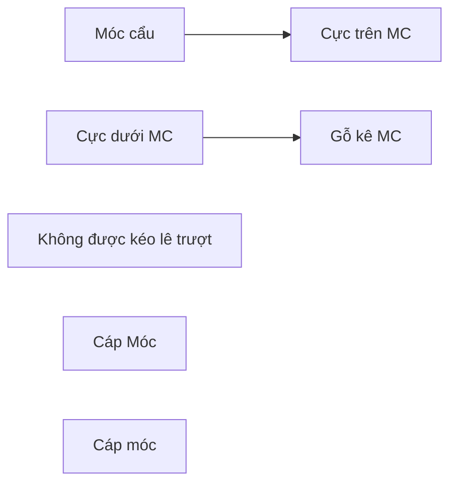

## TRÌNH TỰ LẮP ĐẶT MÁY CẮT

Lắp đặt theo trình tự : từ 01 đến 07
- 01: Lắp trụ đỡ máy cắt
- 02: Lắp giá đỡ máy cắt
- 03: Lắp hộp truyền động
- 04: Lắp pha thứ nhất
- 05: Lắp pha thứ hai
- 06: Lắp pha thứ ba
- 07: Lắp thanh nối truyền động
- 08: Tháo giá thi công.
- 09: Căn chỉnh và siết chặt bulông

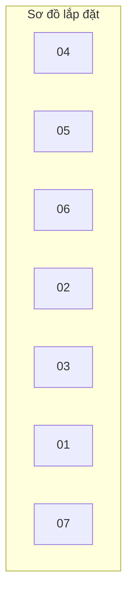

## 5. Lắp đặt biến dòng điện

* Kiểm tra, chuẩn bị trước lúc lắp đặt:

- Cẩu 10-20T thuỷ lực tầm với (10÷25)m..
- Cáp móc cẩu dùng đai cẩu nylon.
- Kiểm tra sơ bộ bên ngoài xem có bị xây xước, rạn nứt hay không.
- Dụng cụ thi công, cờ lê lực, nivô, vải lau v.v...
- Đặt tỷ số biến đổi theo thiết kế.
- Kiểm tra mức dầu của máy biến dòng điện (nếu là máy biến dòng điện cách điện bằng giấy tẩm dầu).

Gói thầu SPC-T3-PC-08: Cung cấp, xây dựng và lắp đặt vật tư, thiết bị trạm biến áp, đường dây


---


Dự án: TBA 110kV T3 và đường dây 110kV T3 – Trạm 220kV Tân Định, tỉnh Bình Dương

- Trước lúc lắp đặt: các trụ đỡ máy biến dòng điện được kiểm tra bằng nivô. Các trụ máy biến dòng điện được lắp thẳng đứng, các bu lông được kiểm tra độ siết chặt bằng clê lực, kích thước lỗ bắt biến dòng điện và trụ đỡ.

- Lau sạch bên ngoài các cực máy biến dòng điện trước lúc lắp.

* Lắp đặt máy biến dòng điện:

- Thi công lắp máy biến dòng điện bằng cẩu thuỷ lực.

- Đặt đúng chiều P1 và P2 của cuộn dây sơ cấp của các biến dòng điện phù hợp với bản vẽ thiết kế.

[Two technical diagrams showing:
Left diagram: Side view of electrical transformer installation showing "Móc cẩu" (crane hook), "Biến dòng điện" (current transformer), and "Trụ đỡ" (support pillar)
Right diagram: Detailed view of transformer showing "Móc cẩu" (crane hook), "Cực máy biến dòng điện" (transformer terminal), "Chỉ thị dầu" (oil indicator), "Móc thi công" (construction hook), and "Trụ đỡ" (support pillar)]

## 6. Lắp đặt biến điện áp

Kiểm tra độ thẳng đứng của các trụ đỡ và độ thăng bằng của giá đỡ. Các cực của phía sơ cấp phải được lắp đúng theo thiết kế điều khiển và bảo vệ. Các cuộn dây sơ cấp và thứ cấp đều được thiết kế để sử dụng cho nhiều công năng vì vậy căn cứ thiết kế mà đặt lại con nối tỷ số biến, đấu nối đúng các cuộn dây thứ cấp cho mạch bảo vệ, mạch chạm đất, mạch đo lường... Đối với biến điện áp một đầu của cuộn dây nhất thứ phải được nối đất, các cuộn dây thứ cấp của biến áp đo lường đều thiết kế tiếp đất tại tủ bảo vệ hoặc tại máy vì vậy phải căn cứ thiết kế mà nối đất cho đúng.

Trước khi lắp đặt cần kiểm tra sơ bộ bên ngoài xem có bị xây xước, rạn nứt hay không, nghiên cứu kỹ bản vẽ thiết kế, hướng dẫn lắp đặt máy biến điện áp, kiểm tra mức dầu của máy biến điện áp, lau sạch bên ngoài các cực máy biến điện áp trước lúc lắp.

Lắp đặt máy biến điện áp mọi thao tác của cẩu nhẹ nhàng, chính xác.

Kiểm tra các máy biến điện áp phải ngay thẳng bằng dọi.

Nối tất cả các trụ và vỏ máy biến điện áp với hệ thống nối đất chung theo thiết kế.

Gói thầu SPC-T3-PC-08: Cung cấp, xây dựng và lắp đặt vật tư, thiết bị trạm biến áp, đường dây


---


Dự án: TBA 110kV T3 và đường dây 110kV T3 – Trạm 220kV Tân Định, tỉnh Bình Dương

[Two diagrams showing equipment setup with labeled components:
- Left diagram: Mobile crane setup with labels "Móc cầu" (hook), "Biên điện áp" (voltage terminal), "Trụ đỡ" (support pole)
- Right diagram: Tower structure with labels "Móc cầu" (hook), "Cực máy biến điện áp" (voltage transformer terminal), "Móc thi công" (construction hook), "Trụ đỡ" (support pole)]

## 7. Lắp đặt dao cách ly

Trước khi lắp các dao cách ly lên giá đỡ chúng tôi tiến hành kiểm tra độ thăng bằng cũng như độ chắc chắn của toàn bộ mặt bằng giá đỡ.

| **Bước 1:** Lắp bản đế dao cách ly trên trụ đỡ thiết bị                                |  |
| -------------------------------------------------------------------------------------- | ----- |
| **Bước 2:** Lắp đặt sứ và các cực của dao (lưu ý hướng mở của dao theo bản vẽ thiết kế |  |


Gói thầu SPC-T3-PC-08: Cung cấp, xây dựng và lắp đặt vật tư, thiết bị trạm biến áp, đường dây


---


Dự án: TBA 110kV T3 và đường dây 110kV T3 – Trạm 220kV Tân Định, tỉnh Bình Dương

|                                                                                                    |  |
| -------------------------------------------------------------------------------------------------- | ---------------------------------------------------------------------------------------------------------------------------------------------------------- |
| **Bước 3:** Lắp đặt Tủ động cơ, bộ truyền động của dao cách ly                                     |                                    |
|                                                                                                    |                                                                      |
| **Bước 4:** Lắp đặt thanh truyền động, trục truyền động của tủ dao cách ly và tủ tiếp địa (nếu có) |                     |


Gói thầu SPC-T3-PC-08: Cung cấp, xây dựng và lắp đặt vật tư, thiết bị trạm biến áp, đường dây


---


Dự án: TBA 110kV T3 và đường dây 110kV T3 – Trạm 220kV Tân Định, tỉnh Bình Dương

Các cực của dao cách ly được lắp lên trên giá đỡ bằng cách cẩu từng pha một sau đó căn chỉnh từng pha hoàn chỉnh, nối các ống truyền động giữa các pha. Vị trí của dao và hướng của lưỡi dao tiếp đất theo bản vẽ sơ đồ một sợi. Căn chỉnh các tay biên truyền động dao thao tác nhẹ nhàng, vị trí đóng mở của các tiếp điểm phụ và lưỡi dao chính được chỉnh phù hợp, khi dao cách ly đóng và mở liên động cầu dao hợp chốt cơ khí, các chốt khoá tự nhảy vào vị trí. Các lưỡi dao khi đóng thẳng hàng, khi cắt ra vuông góc theo đúng bản vẽ thiết kế của nhà chế tạo. Lắp tiếp địa đế dao và tủ truyền động đúng theo thiết kế.

Sau khi bắt các dây dẫn vào dao cách ly, tiến hành kiểm tra đóng cắt và độ tiếp xúc của các lưỡi dao 1 vài lần nữa.

Gói thầu SPC-T3-PC-08: Cung cấp, xây dựng và lắp đặt vật tư, thiết bị trạm biến áp, đường dây


---


Dự án: TBA 110kV T3 và đường dây 110kV T3 – Trạm 220kV Tân Định, tỉnh Bình Dương

Khi lắp và đấu dây hoàn thiện cho dao cách ly, sơn các lưỡi dao và lắp bộ truyền động của dao tiếp địa:

- Lưỡi dao sơn màu đen (không sơn phần tiếp xúc).
- Trục truyền động sơn màu đỏ.

## 8. Lắp đặt Chống sét van

Trước khi lắp chống sét van, các trụ đỡ chống sét đã được lắp thẳng đứng bu lông được kiểm tra siết chặt.

- Vệ sinh chống sét van trước lúc lắp đặt.
- Tất cả các pha của 1 bộ chống sét van có số serie giống nhau, đủ cách điện đế.

| **Bước 1:** Móc dây cẩu, lắp chống sét van lên trụ đỡ thiết bị |  |       |
| -------------------------------------------------------------- | ----- | ----- |
| **Bước 2:** Lắp đặt kẹp cực thiết bị                           |  |  |
| **Bước 3:** Lắp đặt vòng đẳng thế có lỗ thoát nước             |  |       |


Lưu ý: Lỗ thoát nước luôn nằm ở vị trí đáy

Gói thầu SPC-T3-PC-08: Cung cấp, xây dựng và lắp đặt vật tư, thiết bị trạm biến áp, đường dây


---


Dự án: TBA 110kV T3 và đường dây 110kV T3 – Trạm 220kV Tân Định, tỉnh Bình Dương

- Dây nối giữa chống sét van và bộ ghi sét lắp đúng quy cách thiết kế.
- Nối đất cho chống sét van được nối với hệ thống nối đất chung theo bản vẽ thiết kế

## 9. Biện pháp lắp đặt kẹp cực, dây dẫn nối các thiết bị

Trước khi lắp các dây dẫn nối các thiết bị, chúng tôi dùng dây nhôm làm cữ để uốn, đo, cắt dây nhôm lõi thép giữa các thiết bị sao cho dây không bị căng quá, không võng quá và các pha đều nhau.

Các điểm bắt kẹp rẽ nhánh được đánh dấu chính xác, thẳng hàng với thiết bị, không để dây bị chéo.

Sau khi gá lắp các kẹp cực thiết bị, kẹp rẽ nhánh sẽ kiểm tra khoảng cách giữa dây dẫn với dây dẫn, giữa dây dẫn với giá đỡ thiết bị, các khoảng cách được đảm bảo theo đúng quy phạm.

Các đầu tiếp xúc của các thiết bị trước khi bắt vào các kẹp cực thiết bị sẽ được đánh sạch rỉ bằng bàn chải sắt mềm và bôi mỡ va zơ lin trung tính. Các bu lông bắt kẹp cực được siết kiểm tra bằng clực và kiểm tra khe hở tiếp xúc bằng thước lá căn.

## 10. Lắp đặt giá đỡ và sứ đỡ thanh cái.

- Các trụ sứ đỡ sứ đỡ được lắp đặt đúng hướng và chắc chắn, không bị nghiêng lệch.
- Vệ sinh sạch sẽ các khe, các cực của sứ bằng rẻ sợi bông.

## 11. Lắp đặt giá đỡ và MBA tự dùng.

Trước khi lắp máy biến áp tự dùng, chúng tôi sẽ kiểm tra kích thước lỗ bắt máy biến áp tự dùng và trụ. Đánh dấu chiều sơ cấp, thứ cấp.

Lắp máy biến áp tự dùng bằng cẩu thuỷ lực tự hành loại nhỏ

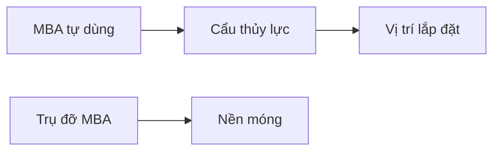

## 12. Biện pháp thi công hệ thống PCCC

Hệ thống PCCC Đơn vị thi công sẽ triển khai sau khi hoàn thiện cơ bản mặt các hạng mục xây dựng của TBA, toàn bộ vật tư thiết bị đưa vào sử dụng có đầy đủ CO, CQ và trình Chủ đầu tư, Công an PCCC chấp thuận sử dụng.

### 12.1. Đào đất chôn gối đỡ ống, gối đỡ giàn phun.

- Căn cứ vào các cọc mốc đã được định vị trong quá trình giao, nhận tuyến giữa chủ đầu tư, đơn vị tư vấn thiết kế và đơn vị thi công, đơn vị thi công dùng băng mầu phân định ranh giới của phạm vi cần đào.

- Do địa bàn thi công nằm trong phạm vi của trạm biến áp, có nhiều thiết bị và cần đảm bảo khoảng cách an toàn về điện nên sử dụng biện pháp thủ công. Công nhân dùng cuốc, xẻng đào hố móng gối đỡ ống, gối đỡ giàn phun, đỡ trụ đến đủ độ sâu trong thiết kế. Trong quá trình đào cần phải để ý đến các công trình ngầm dưới đất.

Gói thầu SPC-T3-PC-08: Cung cấp, xây dựng và lắp đặt vật tư, thiết bị trạm biến áp, đường dây


---


Gói thầu SPC-T3-PC-08: Cung cấp, xây dựng và lắp đặt vật tư, thiết bị trạm biến áp, đường dây

- Sau khi chôn xong phần gối đỡ sẽ tiến hành lấp đất và phải được đầm chặt đúng theo yêu cầu của thiết kế.

- Phần đất thừa sẽ được vận chuyển thủ công tập kết vào một chỗ để vận chuyển khỏi trạm.

**12.2. Đổ gối đỡ ống, gối đỡ trụ giàn phun.**

- Sau khi chủ đầu tư ban hành bản vẽ thi công, cán bộ kỹ thuật của đơn vị thi công kết hợp với giám sát của chủ đầu tư, lấy kích thước, số lượng và cho tiến hành đổ bê tông gối đỡ, đúc từ bên ngoài hoặc đúc trực tiếp tại vị trí theo thiết kế tùy thuộc vào địa hình thi công.

- Gối đỡ của đường ống đo theo đường thẳng từ các giao điểm của đường ống công việc đo này được tích hợp và tính ra dung sai giữa các vị trí của gối đỡ là ±10mm. Ngoại trừ các gối đỡ gần các van hay các thiết bị khác nằm trên đường ống cần có chính xác ±10mm, độ lệch tối thiểu giữa các gối đỡ là ±3mm giữa các điểm giao của đường ống.

**12.3. Lắp đặt đường ống cứu hoả.**

Các loại ống mua từ kho của các đơn vị cung ứng, sau khi được xử lý bề mặt bằng phương pháp làm sạch bề mặt ống sau đó sơn lót, được vận chuyển và tập kết tại kho trên công trình sau đó được vận chuyển thủ công vào vị trí lắp đặt. Trong quá trình vận chuyển, tránh để ống ma sát trực tiếp với đất hoặc va chạm với các thiết bị làm bong, tróc lớp sơn lót.

- Trước khi lắp đặt, cần tiến hành kiểm tra kích thước ống trên bản vẽ thi công. Dùng máy cắt, cắt ống cho phù hợp với kích thước lắp đặt.

- Sơn ống theo quy định (mỗi đầu chừa lại một khoảng 10 cm) ống đi nổi sơn 01 lớp chống rỉ (đối với ống đen) tất cả các đường ống được 2 lớp sơn màu đỏ.

- Các ống qua mương cáp thì phải đi cao hơn mương cáp bằng cách hàn đường ống theo chữ U.

- Trong quá trình kết nối, chú ý làm vệ sinh các ống, tránh để các dị vật (giẻ, cát, đá, sỏi …) trong ống.

- Dùng các bộ gá, kẹp định vị các mối hàn đảm bảo độ ổn định trong suốt quá trình hàn.

- Sau khi hàn xong, mối hàn được sơn, bọc theo đúng quy định.

- Dùng thiết bị chuyên dụng: (palăng, tời …) lắp dựng các kết cấu đã gia công sẵn. Nếu trong quá trình lắp đặt đường ống, các gối đỡ chưa có sẵn, thì phải sử dụng các gối đỡ tạm để tránh ống bị cong, biến dạng dễ dẫn tới sự sai lệch khi định vị đường ống. Gối đỡ tạm không được phép sử dụng thay thế gối đỡ chính thức.

- Trong quá trình lắp đặt đường ống, tất cả các nơi đường ống mở hay cuối đường ống phải được bịt kín tránh sự xâm nhập của dị vật. Nắp che bịt có thể làm bằng ván ép, nhựa tấm hay kim loại.

- Đối với các mối nối bằng ren, phải được quấn băng cao su non trước khi kết nối để đảm bảo độ kín.

- Các mối nối mặt bích đến các thiết bị và bồn chứa phải được định vị sao cho mặt bích không bị xê dịch gây khó cho quá trình lắp đặt.

---


Dự án: TBA 110kV T3 và đường dây 110kV T3 – Trạm 220kV Tân Định, tỉnh Bình Dương

- Đối với đường ống đi nổi: Sau khi định vị các gối đỡ được phép tư vấn giám sát chi tiến hành chuyển bước thi công, đơn vị thi công tiến hành cho đặt ống lên các vị trí gối đỡ sau khi đã xử lý các công đoạn đưa ống lên gối, cho tiến hành căng dây hai đầu để lấy tuyến thẳng và cao độ thăng bằng của ống, kết thúc các thao tác trên cho tiến hành kết nối bằng phương pháp hàn ống, hoặc kết nối mặt bích.

**12.4. Lắp đặt Cụm van xả tràn, van chặn, đồng hồ áp lực.**

- Tất cả các van, cụm van tràn, đồng hồ áp lực trước khi lắp đặt phải được kiểm tra xem có dị tật, hoặc không đảm bảo cho quá trình lắp đặt và phải có đầy đủ chứng chỉ, nguồn gốc. Chủ đầu tư cùng đơn vị thi công phải tổ chức nghiệm thu vật tư trước khi lắp đặt.

- Các van, vòi, đồng hồ áp lực phải được lắp đặt đúng vị trí theo bản vẽ thiết kế và theo hướng dẫn, quy trình của nhà sản xuất.

- Kiểm tra chủng loại, lắp đúng chiều lưu lượng được đánh dấu theo đúng quy định.

- Tất cả các cần điều khiển của van phải được bôi trơn trước khi lắp đặt, tránh rỉ sét, bị kẹt trong quá trình vận hành sau này.

- Lắp đặt van, vòi, đồng hồ áp lực bằng phương pháp hàn phải tuỳ thuộc chức năng, vị trí đã được quy định bởi nhà sản xuất và phải có biện pháp bảo vệ (giãn nhiệt, tản nhiệt …) tránh làm hư hỏng thiết bị trong quá trình hàn.

**12.5. Lắp đặt thiết bị chữa cháy.**

- Hệ thống phun sương được lắp trên các trụ đỡ bằng thép mạ kẽm nhúng nóng được gắn chặt vào nền thông qua các bu lông neo tại các trụ bê tông.

- Khi lắp đặt sử dụng hệ thống giàn giáo đảm bảo tạo khoảng cách an toàn và vững chắc cho công nhân trong quá trình thi công.

- Tiến hành lắp hệ thống giá đỡ ống, đường ống và các phụ kiện có liên quan trước sau đó mới tiến hành lắp các thiết bị chính: Van, đầu phun, đầu dò nhiệt ...

- Các mối nối ống phải được quấn cao su non và toàn bộ hệ thống ống phải được làm sạch, vệ sinh trước khi lắp đặt.

- Các van Deluge (kích hoạt kiểu ướt) phải được lắp thẳng đứng trong hệ thống đường ống theo sơ đồ thiết kế và quy định của nhà sản xuất.

- Các đầu phun sương được lắp đặt theo thiết kế và điều chỉnh sao cho góc bảo vệ của các đầu phun đảm bảo bao trùm toàn bộ khu vực cần bảo vệ.

- Toàn bộ hệ thống được làm sạch bằng nước theo quy định.

- Tiến hành kiểm tra áp lực từng phần và toàn bộ hệ thống theo đúng quy trình và tiến hành sửa chữa, khắc phục nếu xẩy ra hư hỏng.

**12.6. Lắp đặt dây dẫn, dây tín hiệu.**

- Các loại dây dẫn điện, dây tín hiệu được lắp đặt theo đúng chủng loại đã quy định trong thiết kế. Bất cứ sự thay đổi về chủng loại, tiết diện, công dụng đều phải được sự đồng ý của chủ đầu tư và đơn vị tư vấn thiết kế.

- Lắp đặt theo đúng thiết kế và bản vẽ thi công.

- Các dây tín hiệu được đi trong các ống luồn bảo vệ với các ống đi nổi, với các ống đi trong mương cáp sẽ được kéo rải trực tiếp trong mương cáp hiện có và được kết nối chặt chẽ.

Gói thầu SPC-T3-PC-08: Cung cấp, xây dựng và lắp đặt vật tư, thiết bị trạm biến áp, đường dây


---


Dự án: TBA 110kV T3 và đường dây 110kV T3 – Trạm 220kV Tân Định, tỉnh Bình Dương

- Tất cả các đầu dây dẫn, dây tín hiệu đều phải đánh dấu, đánh số tránh nhầm lẫn trong quá trình đấu nối và thuận tiện cho quá trình kiểm tra, sửa chữa và vận hành sau này.

- Đầu cuối của dây dẫn, cáp tín hiệu được ép các đầu cốt phù hợp với tiết diện dây dẫn để đảm bảo tiếp xúc trong quá trình đấu nối. Dây không được nối giữa chừng (trừ các vị trí lắp tủ đấu trung gian).

## 12.7. Quy trình sơn ống.

- Tẩy sạch, chà nhám các vẩy hàn và làm liền mí các gờ hàn, cạnh sắc. Tẩy sạch dầu mỡ và tiến hành sơn trước khi có hiện tượng đổi màu. Nếu trước khi sơn, bề mặt bị nhiễm bẩn hoặc oxy hóa, cần phải làm sạch lại.

## 12.8. Quy trình thử áp lực.

Nhà thầu thử áp lực 12kg/cm2 với các ống từ sau van chờ hiện có của HT chữa cháy tới cụm van tràn.

**Nạp nước và xả khí:**

- Trong quá trình thử đường ống, nước sạch sẽ được bơm vào từ thời điểm thấp nhất tới thời điểm cao nhất. Trong quá trình thử, van xả khí (nếu có) ở điểm cao nhất sẽ được mở nhằm giảm thiểu những khí còn dư lại trong quá trình thử. Những vị trí xả nước xả khí sẽ biểu thị trên đồng hồ thử áp.

- Quá trình hoàn thành khi nước được xả ra bởi van xả ở thời điểm cao nhất.

**Nạp áp lực:**

- Việc nạp áp lực vào đường ống phải có mặt của Giám sát của chủ đầu tư định kỳ hoặc thường xuyên. áp lực sẽ được chỉ thị trên đồng hồ áp lực.

- Xả áp lực tự do đầy ống, kiểm tra, đạt ngưỡng áp lực lớn đến mức bằng 1/2 áp lực thử và giữ nguyên trong 30 phút, đồng thời tiến hành kiểm tra rò rỉ. Sau đó tiến hành nâng áp lực đến mức áp 12 at và giữ nguyên trong 02 giờ. Sau khi kiểm tra không có rò rỉ thì tiến hành cho xả áp từ từ đến khi trong ống không còn áp lực. Công việc thử áp kết thúc.

## 12.9. Quy trình kiểm tra áp lực.

### a. Kiểm tra bên ngoài.

Thực hiện việc kiểm tra bằng mắt và sử dụng dụng cụ thông thường như: Kính lúp, búa kiểm tra, dũa, thước đo (thước cứng, thước dây, thước cặp, đống hồ so, thước lá, panme, dưỡng), đèn chiếu sáng chuyên dụng. Kiểm tra bên ngoài gồm các bước sau: Kiểm tra về kết cấu, tình trạng bề mặt kim loại, mối hàn, sự biến dạng các chi tiết, bộ phận.

### b. Kiểm tra bên trong.

Kiểm tra bằng mắt và sử dụng dụng cụ thông thường như kiểm tra bên ngoài theo các bước sau:

- Kiểm tra về kết cấu, bề mặt kim loại chế tạo, các mối hàn. Phát hiện các khuyết tật, sai sót, các hiện tượng bất thường.

- Kiểm tra về kích thước các chi tiết, các bộ phận bị ảnh hưởng trực tiếp do nhiệt, ứng suất nhằm phát hiện các biến dạng.

- Kiểm tra mức độ, bề dày cáu cặn. Xác định nguyên nhân và biện pháp khắc phục.

## 12.10. Phần xây dựng.

Gói thầu SPC-T3-PC-08: Cung cấp, xây dựng và lắp đặt vật tư, thiết bị trạm biến áp, đường dây


---


Dự án: TBA 110kV T3 và đường dây 110kV T3 – Trạm 220kV Tân Định, tỉnh Bình Dương

- Kiểm tra kích thước các kết cấu xây dựng trên các bản vẽ. Định vị tim mốc, chỉ giới phần xây dựng.

## 12.11. Công tác hoàn thiện.

- Công tác hoàn thiện công tác xây lắp công trình được tiến hành ở bước cuối cùng trước khi báo cáo hội đồng nghiệm thu kỹ thuật tổ chức nghiệm thu công trình. Các công việc của khâu này:

- Kiểm tra trên toàn công trình, kiểm tra, xem xét các hạng mục công việc đã thi công; nếu còn các khiếm khuyết gì thì sửa chữa, hoàn thiện.

- Các chi tiết thép nổi, đường ống nổi trên mặt đất phải được sơn chống rỉ và sơn màu theo yêu cầu thiết kế.

- Kiểm tra các thiết bị báo cháy, chữa cháy: các thiết bị phải được lắp đúng thiết kế. Có phương án thử phù hợp để hệ thống không tác động tới các thiết bị điện đang vận hành.

- Kiểm tra các chức năng của từng thiết bị và toàn bộ hệ thống.

- Kiểm tra áp lực hệ thống đường ống cứu hoả: Dùng các thiết bị chuyên dụng kiểm tra độ kín của hệ thống đường ống cứu hoả và tác động của hệ thống van bảo vệ, đồng hồ áp lực.

Hệ thống PCCC Đơn vị thi công sẽ triển khai sau khi hoàn thiện cơ bản mặt các hạng mục xây dựng của TBA, toàn bộ vật tư thiết bị đưa vào sử dụng có đầy đủ CO, CQ và trình Chủ đầu tư, Công an PCCC chấp thuận sử dụng.

## 13. Lắp đặt hệ thống camera giám sát:

### 13.1. Yêu cầu chung

- Đệ trình hồ sơ kỹ thuật của các thiết bị trong hệ thống, cụ thể như các loại camera, hộp bảo vệ, đầu ghi hình kỹ thuật số, …

- Thực hiện bản vẽ thiết kế kỹ thuật thi công cho toàn bộ các các thiết bị để đệ trình cho tư vấn thiết kế.

- Vận chuyển tới chân công trình.

- Cung cấp các lý lịch của các loại thiết bị và các phụ kiện đi kèm.

- Phối hợp lắp đặt tại hiện trường

- Kiểm tra, Vận hành thử thiết bị, lập tài liệu hướng dẫn

- Đào tạo, huấn luyện nhân viên cho Chủ đầu tư.

- Bàn giao vận hành

### 13.2. Quy trình lắp đặt camera:

- Đệ trình hồ sơ thiết kế kỹ thuật thi công.

- Đệ trình và phê duyệt biện pháp thi công lắp đặt thiết bị.

- Kiểm tra thử nghiệm thiết bị sau khi được tập kết đến công trường.

- Hoàn thiện thủ tục đưa vật tư thiết bị vào công trường.

- Lắp đặt các vật tư sẽ kết nối với thiết bị (cáp tín hiệu, cáp cấp nguồn, giá đỡ, hộp bảo vệ).

- Lắp đặt đấu nối camera.

Gói thầu SPC-T3-PC-08: Cung cấp, xây dựng và lắp đặt vật tư, thiết bị trạm biến áp, đường dây


---


Dự án: TBA 110kV T3 và đường dây 110kV T3 – Trạm 220kV Tân Định, tỉnh Bình Dương

- Lắp đặt đầu ghi hình.
- Bảo quản camera sau khi lắp đặt.
- Chạy thử, hiệu chỉnh và góc nhìn cho camera.

## 14. Lắp đặt máy biến áp:

Sau khi móng máy biến áp đã được nghiệm thu chuẩn bị tiếp nhận để lắp máy biến áp chúng tôi sẽ đánh dấu cao độ, tim móng.

Khi máy được vận chuyển đến vị trí chúng tôi phối hợp với đơn vị vận chuyển để lắp đặt thân máy. Tiến hành kiểm tra toàn bộ các phụ kiện của máy biến áp. Xác nhận tình trạng bên ngoài máy.

Khi máy biến áp đã được đặt trên bệ móng, chúng tôi sẽ kiểm tra lại cao độ của móng máy biến áp một vài lần nữa.

Kiểm tra áp suất khí Nitơ dư trong máy phải luôn lớn hơn 0 (áp suất dương). Nếu áp suất nitơ chỉ "-" thì máy đã bị hở. Nếu có hiện tượng máy bị hở chúng tôi báo cáo chủ đầu tư để có phương án xử lý.

Kiểm tra số lượng dầu MBA không ít hơn số lượng ghi trong tài liệu của máy. Lấy mẫu dầu thí nghiệm cách điện và hàm lượng nước.

Kiểm tra bên trong ruột máy: Nếu có yêu cầu của chủ đầu tư và được nhà chế tạo chấp thuận, chúng tôi cũng tiến hành mở nắp kiểm tra bên trong ruột máy biến áp. Mọi hạng mục kiểm tra trên đều được lập biên bản ghi nhận tình trạng máy trước lúc lắp đặt.

### BIỆN PHÁP THỬ ĐỘ KÍN CÁNH DẦU MBA

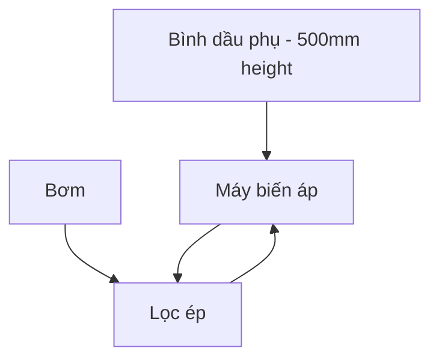

**\* Trình tự lắp máy biến áp như sau:**

- Lắp đặt thùng dầu phụ, đồng hồ chỉ mức dầu, rơ le ga, rơ le dòng dầu: bình dầu phụ của máy biến áp được lắp trước tiên để tránh va đập vào các sứ đầu vào. Trước khi lắp bình dầu phụ chúng tôi kiểm tra túi cao su trong bình dầu phụ bằng cách nạp khí nitơ hoặc không khí khô sạch bằng máy nén khí vào túi, theo dõi áp lực trong túi nếu áp lực không giảm là túi tốt. Sau khi nạp dầu vào máy, mở nắp bình dầu phụ để kiểm tra xem túi có dán sát lên

Gói thầu SPC-T3-PC-08: Cung cấp, xây dựng và lắp đặt vật tư, thiết bị trạm biến áp, đường dây


---


Dự án: TBA 110kV T3 và đường dây 110kV T3 – Trạm 220kV Tân Định, tỉnh Bình Dương

thành bình không, nếu không thì cho xả bớt dầu, dán lại túi. Sau khi lắp bình dầu phụ lên thân máy xong lắp các ống, rơle gas, rơle dòng dầu, đồng hồ chỉ mức dầu...Trước khi lắp rơle gas và rơle dòng dầu sẽ gửi đi thí nghiệm.

- Lắp hệ thống làm mát (các cánh dầu, quạt mát): Trước lúc lắp hệ thống làm mát kiểm tra số thứ tự của các cánh tản nhiệt để lắp cho đúng. Kiểm tra các van cánh bướm xem có hoạt động không, các gioăng mặt bích nối có tốt không, làm vệ sinh các cánh tản nhiệt, kiểm tra số thứ tự, chiều quay và cách điện của động cơ quạt gió trước khi lắp.

- Lắp đặt hệ thống ống dẫn từ bình dầu phụ tới thân máy, tới bộ OLTC, các biến dòng điện.

- Lắp sứ: Trước khi lắp các sứ đầu vào sẽ tiến hành kiểm tra các đồng hồ hoặc thước chỉ mức dầu cách điện trên các sứ đầu vào. Nếu phát hiện sứ nào mà thước hoặc đồng hồ chỉ mức dầu cách điện ở mức thấp hơn số liệu của nhà chế tạo, chúng tôi sẽ báo nhà chế tạo để có biện pháp nạp bổ sung dầu cách điện vào sứ rồi mới tiến hành lắp sứ đầu vào lên thân máy. Dùng vải trắng tẩm axetôn hay cồn công nghiệp 96⁰ lau bên trong và bên ngoài sứ đầu vào để khô rồi mới lắp sứ. Dùng cần trục có sức với (15 ÷ 20)m để lắp sứ đầu vào, sứ được buộc bằng dây cẩu mềm theo phương phù hợp với vị trí lắp ráp của sứ. Nếu sứ lắp thẳng đứng thì chúng tôi sẽ buộc sứ thẳng đứng, nếu sứ lắp nghiêng thì sẽ buộc sứ nghiêng. Mở mặt bích bắt sứ, tháo đầu dây khỏi thùng máy, dùng dây vải sạch hoặc dây nylon buộc đầu dây nói trên rút qua sứ đầu vào. Sau khi lắp xong sứ vào thân máy thì bắt vào chân đầu cốt.

## CÁCH LẮP SỨ CÓ TƯ THẾ NGHIÊNG

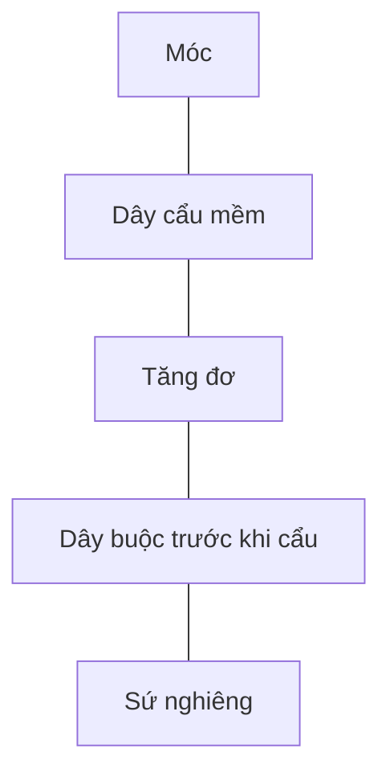

- Lắp mạch nhị thứ: Đấu dây cho các biến dòng điện, các rơle trên thân máy và các quạt gió làm mát...

- Hút chân không thân máy biến áp.

- Lọc dầu, kiểm tra độ cách điện của dầu trước khi lọc.

- Tiến hành bơm dầu từ các phi dầu vào 2 téc sạch chứa dầu: Dùng bơm của máy lọc dầu hút dầu từ téc vào máy lọc và bơm đẩy vào thân máy và từ thân máy dầu lại được đẩy vào téc, tạo thành một vòng tuần hoàn khép kín, vừa lọc vừa sấy dầu.

- Nạp đầy dầu vào máy: Sau khi lọc tuần hoàn dầu, tuỳ theo độ cách điện của dầu máy biến áp trước khi lọc để định thời gian thử nghiệm cách điện và độ ẩm của dầu biến áp, khi dầu đã đạt cách điện của dầu ≥ 70kV và độ ẩm ≤ 20ppm sẽ nạp dầu vào máy. Cách nạp như sau: Vừa hút chân không vừa nạp dầu đầy vào máy biến áp, mở các lỗ thăm phía trên các cánh dầu, các sứ đầu vào, bình dầu phụ, nạp đến khi có dầu tràn ra các lỗ và không có bọt khí, lúc này dầu đã đầy, đậy các lỗ thăm và mở lỗ trên túi cao su trong bình dầu phụ, rút bớt dầu đến mức kim của đồng hồ trên bình dầu phụ chỉ mức tương đương với nhiệt độ của dầu, duy trì chân không trong máy, kiểm tra trong túi cao su nếu không có dầu ướt có nghĩa là túi

Gói thầu SPC-T3-PC-08: Cung cấp, xây dựng và lắp đặt vật tư, thiết bị trạm biến áp, đường dây


---


Dự án: TBA 110kV T3 và đường dây 110kV T3 – Trạm 220kV Tân Định, tỉnh Bình Dương

cao su kín. Lắp các bình sillicagel cho máy, đáy bình sillicagel có đổ dầu biến áp đến vạch quy định.

- Thử độ kín của máy: Phương pháp thử đơn giản nhất bằng cách gắn một ống bằng thuỷ tinh hình phễu cao khoảng 0,6m trên điểm cao nhất của máy (bình dầu phụ). Nạp dầu vào máy biến đến khi dầu tới vạch dấu trên ống thuỷ tinh (0,5m tính từ đỉnh bình dầu phụ), theo dõi mức dầu trong 3 giờ nếu không tụt trên thân máy không có các vết rỉ dầu là máy kín, rút dầu tới mức quy định, lắp bình thở sillicagel. Phương pháp thử bằng áp lực khí nitơ: Tháo bình thở của MBA, nạp khí Nitơ vào bình dầu phụ cho tới khi áp lực khí đạt 0,3kg/cm2 khoá van nạp và ngừng nạp khí. Theo dõi áp lực trong 3 giờ, kiểm tra phát hiện dầu rò rỉ trên các mối ghép nối bằng nước xà phòng và tìm nguyên nhân để xử lý. Trong suốt quá trình thử nếu không có điểm rò rỉ dầu và áp lực khí không giảm thì kết luận là máy kín.

- Lắp các đồng hồ nhiệt ngẫu

- Lắp các bình thở sillicagel cho 2 ngăn của bình dầu phụ: Dùng sillicagel khô (có màu trắng) đổ đầy vào bình thở, đổ dầu sạch vào cốc thuỷ tinh phía dưới bình thở đến mức quy định. Vệ sinh, sơn vỏ máy 1 lớp sơn (Sơn do nhà cấp hàng cung cấp).

- Lắp các đầu cực thiết bị trên sứ đầu vào.

* **Biện pháp an toàn khi lắp máy biến áp:**

- Máy thi công: cẩu, máy lọc dầu, máy tạo chân không được kiểm tra vận hành an toàn trước lúc lắp MBA.

- Công nhân lắp máy là các công nhân đã từng lắp nhiều máy biến áp tương tự.

- Công nhân tham gia quá trình lắp máy được trang bị bảo hộ lao động gọn gàng.

- Các dụng cụ người công nhân mang lên mặt máy đều được để trong túi đồ nghề để tránh va đập vào sứ hoặc rơi vào trong máy.

- Xung quanh khu vực lắp MBA không để các chất dễ cháy nổ, không bố trí các cầu dao, ổ cắm hở cạnh khu vực có dầu.

- Có biện pháp an toàn và thiết bị chống cháy nổ (bình CO2), bạt chống cháy bằng sợi amian quanh khu vực lắp máy.

**15. Lắp đặt tủ điều khiển bảo vệ**

* Chuẩn bị trước khi lắp đặt:

Trước khi lắp đặt các tủ chúng tôi tiến hành kiểm tra các điều kiện sau:

- Mặt bằng đặt tủ, vị trí ống luồn cáp của tủ có trùng với rãnh cáp không, kích thước tủ.

- Chuẩn bị xe nâng, các con lăn để đưa tủ vào vị trí, tôn lót nền, kích, xà beng, gỗ kê.

- Chuẩn bị quả dọi và thước ni vô để kiểm tra độ thẳng đứng của tủ.

* Lắp đặt và định vị tủ vào vị trí lắp:

+ Đặt tủ vào vị trí lắp:

- Tủ được đưa vào vị trí bằng xe nâng, con lăn và kích.

- Lấy dấu để xếp tủ thẳng hàng, sau đó kê đệm để các tủ thẳng đứng.

- Việc kiểm tra được thực hiện bằng Nivô và thước. Nếu sai lệch thì đệm bằng các lá căn 0,5mm.

+ Định vị các tủ vào sàn:

Sau khi lắp đặt tủ vào vị trí chúng tôi sẽ định vị chặt các tủ xuống sàn.

Gói thầu SPC-T3-PC-08: Cung cấp, xây dựng và lắp đặt vật tư, thiết bị trạm biến áp, đường dây


---


Dự án: TBA 110kV T3 và đường dây 110kV T3 – Trạm 220kV Tân Định, tỉnh Bình Dương

![Image showing completed installation of control cabinets - green colored electrical control panels with various switches, buttons, and displays arranged in a row in a control room with white tiled floor]

*Hình ảnh hoàn thiện lắp đặt tủ điều khiển*

**\* Bắt tiếp địa:**

- Sau khi lắp đặt và căn chỉnh tủ xong nối các thanh tiếp địa của tủ với hệ thống tiếp địa của trạm bằng vật liệu theo thiết kế.

**16. Thi công kéo rải và đấu nối cáp nhị thứ**

*(Thi công bằng thủ công)*

**16.1. Lắp đặt cáp hạ áp và cáp kiểm tra**

- Trước lúc thi công, toàn bộ mương cáp được thu dọn sạch sẽ các thiết bị lắp xong.

- Các cuộn cáp được đặt trên giá ra cáp.

- Cáp được kéo ra khỏi cuộn theo chiều mũi tên.

- Cáp được rải trong hào cáp trên các con lăn, chỗ góc hào cáp có đặt các con lăn đỡ cáp, không để cáp trượt trực tiếp lên mặt thành hào cáp.

- Không để cáp bị xước, gập hay vặn xoắn, cáp đi trong mương cáp xếp thành từng lớp và buộc bằng dây vào thanh cáp. Kéo sợi nào xong thì gắn biển cáp tại 2 đầu cáp cho sợi đó ngay.

- Tất cả các loại cáp khi đi trong đất đều phải luồn trong ống PVC có đường kính bằng 120% đường kính cáp. Ống dẫn phải được đặt sâu tối thiểu là 300mm dưới mặt nền trạm.

- Phải đính nhãn cáp tại hai đầu và cứ khoảng 30m theo chiều dài. Các nhãn này sẽ được liệt kê thành một bảng.

- Cáp đi trên giá được đỡ liên tục và tại các điểm đi vào hay đi ra giá đỡ cáp được kẹp chặt vào giá. Cáp được xếp theo lớp, thẳng hàng trên giá cáp và không bị xoắn.

- Cáp đi từ thiết bị hay từ hộp đấu nối xuống đất được kẹp chặt vào trụ đỡ bằng vòng ôm.

- Cáp điện cao áp được rải trên giá hoặc trong rãnh riêng. Trên một giá đỡ cáp, cáp lực hạ thế được đặt ở hàng phía dưới, cáp kiểm tra đặt ở hàng phía trên.

Gói thầu SPC-T3-PC-08: Cung cấp, xây dựng và lắp đặt vật tư, thiết bị trạm biến áp, đường dây


---


Dự án: TBA 110kV T3 và đường dây 110kV T3 – Trạm 220kV Tân Định, tỉnh Bình Dương

![Two construction site images showing cable installation work]

*Hình ảnh rải và lắp đặt cáp*

## 16.2. Bóc đầu cáp và đấu nối

- Lớp vỏ ngoài cùng của cáp và cách điện PVC sẽ được bỏ đi ở bên trên của thanh kẹp hoặc vòng bịt đầu cáp 100mm. Các ruột cáp được vuốt thẳng và được buộc gọn gàng bằng dây thít. Các lõi cáp đấu vào hàng kẹp bằng đầu cốt, dùng kìm bấm có đánh số quy cách tiết diện để bấm cốt. Đầu của các lõi cáp được lồng bóc ghi chữ, số theo bản vẽ thiết kế.

![Four images showing cable termination and connection work in electrical cabinets]

*Hình ảnh đấu nối cáp nhị thứ, cáp điều khiển*

## 17. Lắp đặt các kẹp đấu nối, kẹp cực thiết bị:

### *a. Một số công việc trước khi lắp đặt:*

Nếu dây dẫn bằng đồng sẽ được làm sạch bụi bặm, các vết oxy hoá,được bôi mỡ ở bề mặt tiếp xúc.

### *b. Yêu cầu về mô men vặn chặt:*

Gói thầu SPC-T3-PC-08: Cung cấp, xây dựng và lắp đặt vật tư, thiết bị trạm biến áp, đường dây


---


Dự án: TBA 110kV T3 và đường dây 110kV T3 – Trạm 220kV Tân Định, tỉnh Bình Dương

Các bu lông khi lắp được vặn chặt tới giá trị mô men thiết kế, nhà cấp hàng quy định.

**18. Thu dọn và làm sạch công trường sau khi thi công**

- Công việc thu dọn và làm sạch hiện trường được thực hiện ngay sau khi hoàn tất các công việc.

- Toàn bộ cây cối, nhà cửa, thiết bị thi công, vật liệu phế thải, ván khuôn bê tông và các vật liệu khác ở xung quanh. Các vật liệu không sử dụng được phải đốt cháy hoặc loại bỏ tại chỗ không gây ảnh hưởng cho nhân dân địa phương.

## XIII. BIỆN PHÁP THI CÔNG KÉO DÂY DẪN, DÂY CHỐNG SÉT VÀ DÂY CÁP QUANG

**1. Biện pháp thi công kéo dây dẫn, dây chống sét**

*1.1. Các công tác chuẩn bị*

- Giải phóng mặt bằng hành lang tuyến: Chúng tôi phối hợp với chính quyền địa phương và các hộ gia đình bị thiệt hại để đền bù hoa màu trên diện tích đất mượn thi công để kéo dây theo đúng quy định. Tiến hành phát quang hành lang tuyến.

- Đối với những đoạn tuyến cắt qua những vườn trồng cây ăn quả có giá trị cao chúng tôi sẽ tiến hành làm giàn giáo để kéo dây vượt qua đảm bảo gây tổn thất hoa màu là ít nhất.

- Làm việc với cơ quan chức năng để đang ký cắt điện, kéo vượt đường liên xã, liên thôn, đường thông tin...

- Đăng ký với Giám sát A thời gian kéo dây của từng khoảng néo.

- Thông báo với UBND xã thời gian kéo dây để địa phương thông báo cho tất cả nhân dân không tới khu vực thi công và chính quyền địa phương giúp đỡ đơn vị trong quá trình kéo dây lấy độ võng.

Sau khi mặt bằng được giải phóng, các cơ quan chức năng cho phép chúng tôi tiến hành thi công rải căng dây.

* **Để đảm bảo tiến độ và chất lượng thi công rải căng dây dẫn, dây cáp quang công trình chúng tôi huy động 02 đơn vị thi công đồng thời, trang bị dụng cụ cho mỗi một đơn vị thi công rải căng dây (cho một cho 1 khoảng néo) gồm có:**

| Stt                | Tên, quy cách dụng cụ, máy thi công | Đơn vị | SL | Ghi chú |
| ------------------ | ----------------------------------- | ------ | -- | ------- |
| *Dụng cụ rải dây:* |                                     |        |    |         |
| 1                  | Máy hãm 3 tấn                       | Cái    | 2  |         |
| 2                  | Tời máy thuỷ lực                    | Cái    | 2  |         |
| 2.1                | Tời máy                             | Bộ     | 2  |         |
| 3                  | Giá đỡ lô dây có phanh hãm 3T       | Bộ     | 10 |         |
| 4                  | Mễ thu dây mồi                      | Cái    | 06 |         |
| 5                  | Dây thừng Φ16 x80m                  | Sợi    | 10 |         |


Gói thầu SPC-T3-PC-08: Cung cấp, xây dựng và lắp đặt vật tư, thiết bị trạm biến áp, đường dây


---


Dự án: TBA 110kV T3 và đường dây 110kV T3 – Trạm 220kV Tân Định, tỉnh Bình Dương

| 6 | Cáp thép Φ11,5 | m | 3000 | |
| 7 | Con quay 4T | Cái | 05 | |
| 8 | Rọ cáp dây dẫn | Cái | 02 | |
| 9 | Puly M1P-7 (Tính cả cho cáp quang) | Cái | 25 | K/néo dài nhất |
| 10 | Đối trọng cáp quang | Bộ | 01 | |
| 11 | Rọ cáp dây cáp quang | Cái | 01 | |
| 12 | Bộ đàm | Bộ | 10 | |
| | **Dụng cụ néo tạm cột** | | | |
| 13 | Cáp Φ11,5 x 60m | Sợi | 06 | |
| 14 | Hố thế 5 tấn | Hố | 06 | |
| | **Dụng cụ căng dây** | | | |
| 17 | Khoá MK | Cái | 04 | |
| 18 | Cáp treo múp Φ13,5x6m | Sợi | 04 | Tết 2 đầu |
| 19 | Cáp hố thế Φ18-10m | Sợi | 05 | Cả HT néo tạm |
| 20 | Múp 1 tầng 3 T | Bộ | 01 | |
| 21 | Múp 2 tầng 10T | Bộ | 02 | |
| 22 | Múp 1 tầng 10 T | Bộ | 01 | |
| 23 | Cáp trung gian Φ20x60m | Sợi | 01 | |
| 24 | Cáp luồn múp Φ13,5x250m | Sợi | 01 | |
| 25 | Chống xoắn múp 100 kg | Bộ | 01 | Tết 2 đầu |
| 26 | Hố thế 10T | Cái | 01 | |
| 28 | Lực kế 5 tấn | Cái | 01 | |
| 29 | Cáp giữ đầu dây để ép nối Φ15,5x 25m | Sợi | 02 | |
| 30 | Nhiệt kế dài 60cm | Cái | 02 | |
| 31 | Thước ngắm | Cái | 06 | |
| 32 | Khoá néo cáp quang | Bộ | 01 | |
| 33 | **Dụng cụ lắp dây vào chuỗi đỡ** | | | |
| 34 | Pa lăng 2 T | Cái | 04 | |
| 35 | Cáp Φ 8,5x 60 - 70m | Sợi | 02 | |
| 36 | Thang 6,5m + lồng thao tác | Cái | 02 | |

Gói thầu SPC-T3-PC-08: Cung cấp, xây dựng và lắp đặt vật tư, thiết bị trạm biến áp, đường dây


---


Dự án: TBA 110kV T3 và đường dây 110kV T3 – Trạm 220kV Tân Định, tỉnh Bình Dương

|    | **Dụng cụ ép nối**        |     |    |            |
| -- | ------------------------- | --- | -- | ---------- |
| 37 | Máy ép thuỷ lực 100T      | Máy | 02 | Ép nối dây |
| 38 | Các loại hàm ép           | Bộ  | 04 |            |
|    | **Các loại dụng cụ khác** |     |    |            |
| 39 | Cẩu tự hành 5T            | Cái | 01 |            |
| 40 | Dụng cụ cầm tay           | Bộ  | 04 |            |
| 41 | Tiếp địa di động          | Bộ  | 04 |            |


## 1.2. Phương án rải căng dây dẫn, dây chống sét cho một khoảng néo

### Các yêu cầu:

- Toàn bộ các cột đã được nghiệm thu chuyển bước thi công. Tiếp địa cột được bắt chặt và đảm bảo trị số điện trở nối đất cho phép.

- Hành lang tuyến đã được giải phóng trước lúc thi công kéo dây dẫn, dây cáp quang.

- Toàn bộ công nhân đã được sát hạch an toàn và phổ biến phương án thi công.

- Các đường dây điện lực giao chéo đã được cắt điện (hoặc bọc holine) và làm giàn giáo thi công.

- Đối với các khoảng vượt đường giao thông: Đã được sự đồng ý của cơ quan quản lý và có phương án cụ thể cho phương tiện lưu thông trong thời gian thi công.

- Thi công kéo rải dây dẫn bằng thủ công kết hợp với cơ giới.

- Do đặc thù của gói thầu này sử dụng dây dẫn ACSR 240/32 cho nên việc thi công kéo rải căng dây cần được chuẩn bị và thực hiện hết sức cẩn thận từ việc chuẩn bị dụng cụ, néo tạm thi công đều có phương án cụ thể phù hợp.

### 1.2.1. Công tác chuẩn bị

- Xác định điểm đặt lô dây: Điểm đặt lô dây nên đặt ở những điểm có nền đất chắc chắn, thuận tiện cho xe vận chuyển vào ra và cẩu hạ, nâng dây. Đồng thời điểm đặt lô phải phù hợp với chiều dài khoảng néo, chiều dài lô dây để số dây sử dụng có số mối nối dây là ít nhất và tiết kiệm dây nhất.

- Điểm đặt máy kéo dây: Thông thường là sau cột néo cuối, đặt nơi có nền đất chắc. Nếu khu vực đất yếu thì có thể dùng hệ thống hố thế để chuyển hướng kéo dây.

- Làm giàn giáo đỡ dây các khoảng giao chéo đường dây thông tin, điện lực, đường giao thông, các công trình xây dựng, các chướng ngại vật có thể gây tổn hại cho dây.

- Làm thủ tục với các cơ quan quản lý điện lực, giao thông, thông tin để thống nhất kế hoạch kéo dây.

### 1.2.2. Làm giàn giáo thi công

- Đối với các khoảng vượt đường dây trung thế, đường thông tin làm giàn giáo bằng tre, gỗ hoặc thép nhưng phải đảm bảo khoảng cách nhỏ nhất từ giàn giáo đến đường dây là > 1,5m. Đồng thời chúng tôi sử dụng bọc cách điện (MVLC) để cách điện đường dây, đảm

Gói thầu SPC-T3-PC-08: Cung cấp, xây dựng và lắp đặt vật tư, thiết bị trạm biến áp, đường dây


---


Dự án: TBA 110kV T3 và đường dây 110kV T3 – Trạm 220kV Tân Định, tỉnh Bình Dương

bảo đủ điều kiện thi công khi đường dây đang mang điện, giúp giảm thời gian cắt điện để lắp đặt.

- Đối với các khoảng vượt đường giao thông, đường thông tin, bố trí giàn giáo tre, gỗ hoặc thép đảm bảo khoảng cách nhỏ nhất từ giàn giáo đến mặt đường là > 6m.

- Làm giàn giáo chắc chắn, đảm bảo an toàn, không gây sự cố trong quá trình rải căng dây và đảm bảo an toàn khi đóng điện.

**1.3. Bố trí nhân lực cho 01 đội thi công (30 người = 02 tổ)**

- Vận hành lô dây, máy hãm dây: 4 người
- Vận hành tời, lô quấn cáp mồi: 6 người
- Thông tin, tín hiệu bằng bộ đàm, cờ: 5 người
- Gác puly tại các cột đỡ: 5 người

- Kéo rải cáp mồi + gác dàn giáo 10 người (Tuỳ thuộc từng khoảng néo để bố trí người cụ thể; trường hợp đặc biệt có thể thuê thêm nhân công địa phương).

**1.4. Tiến hành thi công**

*1.4.1. Trình tự thi công*

- Chuẩn bị bố trí dụng cụ, máy thi công theo phương án.
- Treo puly làm giàn giáo đỡ dây vượt đường giao thông, đường điện lực...
- Tăng néo tạm cột néo hai đầu.
- Rải cáp mồi.
- Tời thu cáp mồi, kéo dẫn dây dẫn.
- Ép khoá néo treo trái.
- Ép nối dây dẫn bằng máy ép thuỷ lực 100 tấn.
- Căng dây lấy độ võng theo thiết kế.
- Ép khoá néo treo phải.
- Xuống dây vào khoá đỡ các vị trí cột đỡ.
- Thi công lèo và hoàn thiện.

*1.4.2. Sơ đồ bố trí rải dây*

- Lô dây được đặt trên mễ ra dây có phanh hãm đặt ở đầu khoảng néo.
- Tời máy, lô thu cáp mồi được đặt ở cuối khoảng néo.
- Cáp mồi nối với dây dẫn bằng rọ cáp đơn, nối dây với dây khi kéo bằng rọ cáp đôi.

Khoảng cách 250m cáp mồi được nối với nhau bằng con quay chống xoắn.

- Lô dây, máy hãm được hãm bằng hố thế.
- Đưa lô dây lên mễ: Các vị trí xe cẩu có thế vào được sử dụng xe cẩu.

+ Lực căng khi rải và căng dây:

- Lực căng khi rải dây nên điều chỉnh ở lực kéo từ 1,5 tấn đến 2 tấn (tương đương độ võng 25 ÷ 30m).
- Lực căng khi lấy độ võng: Từ 3,4 tấn ÷ 4,8tấn.
- Lực căng khi mắc dây cố định: Từ 6 tấn ÷ 8 tấn

*1.4.3. Công tác treo puly - rải cáp mồi*

Gói thầu SPC-T3-PC-08: Cung cấp, xây dựng và lắp đặt vật tư, thiết bị trạm biến áp, đường dây


---


Gói thầu SPC-T3-PC-08: Cung cấp, xây dựng và lắp đặt vật tư, thiết bị trạm biến áp, đường dây

Dự án: TBA 110kV T3 và đường dây 110kV T3 – Trạm 220kV Tân Định, tỉnh Bình Dương

- Sử dụng loại Puly7, Puly được treo trên cột bằng sợi cáp φ =11,5 tết 2 đầu, dài 1m. (Vì loại Puly7 to và nặng nên khi treo cần dùng dây thừng nilông và puly5 để kéo lên).

Lưu ý: Khoảng cách từ mặt dưới cánh xà đến điểm trên mặt rãnh Puly phải bằng nhau cho tất cả các cột đỡ trong khoảng néo.

- Tiến hành rải cáp mồi cho cả khoảng néo, nếu tiến hành rải 3 pha thì phải lưu ý khi rải pha dưới trước, pha trên sau; khi lấy độ võng thì lấy pha trên trước, pha dưới sau để tránh bị rối dây.

- Dùng dây nilông kéo đầu cáp mồi qua Puly từng cột.

1.4.4. Công tác kéo căng dây dẫn

- Sau khi rải xong cáp mồi, tiến hành nối đầu dây cáp mồi với đầu dây dẫn bằng rọ cáp. Đầu rọ cáp với cáp mồi bằng con quay chống xoắn.

- Đúc rọ vào đầu dây dẫn, nối rọ với cáp mồi thông qua con quay. Kiểm tra hệ thống tín hiệu để chuẩn bị kéo dây. Khi tín hiệu thông suốt không có gì vướng mắc thì phát lệnh kéo dây. Kéo từ từ để điều chỉnh hệ thống phanh lô dây, phanh máy hãm. Sau khi dây ra khỏi pu ly cột thứ nhất thì duy trì tốc độ kéo dây 20 ÷ 30 m/phút. Điều chỉnh phanh để đảm bảo bụng dây khi thấp nhất cách mặt đất tự nhiên 25 ÷ 30 cm để tránh tổn thương dây dẫn trong khi kéo.

- Trong khi kéo dây thấy dây trôi khác thường cần thông tin kiểm tra xem có kẹt dây, mắc vật gì không. Khi có sự cố thì phải dừng tời xử lý xong mới được kéo dây. Kéo dây bằng phương pháp này đòi hỏi thông tin phải kịp thời chính xác.

- Nối dây bằng ống nối dây dẫn, thực hiện nối dây bằng máy ép thuỷ lực 100 tấn. Mối nối dây phải được thi công theo tiêu chuẩn TCN11-84 và theo quy phạm hiện hành.

- Kéo dây dẫn vượt qua cột néo khoảng 15 ÷ 20 m, tiến hành ép đầu cốt khoá néo sau đó lắp vào chuỗi sứ và thực hiện treo trái.

- Tại cột néo phải: Luồn cáp thép d=19 để lấy độ võng qua 2 múp thép. Dùng 2 khoá MK bắt vào dây dẫn cách nhau 1 m có treo đối trọng và con quay chống xoắn. Điểm bắt khoá MK sao cho khi căng đạt độ võng, con quay cách múp 0,5 - 1m.

+ Tiến hành rút dây - Ngắm độ võng:

- Buộc thước ngắm: Tại 2 cột của khoảng cột ngắm độ võng, buộc thước ngắm (Thước 50x5x2500, bào nhẵn, sơn trắng, đỏ).

+ Khoảng cách từ điểm buộc thước ngắm đến mặt dưới bụng dây dẫn:

b= Độ võng (f) +a. (theo hình vẽ)

Trong đó a: Khoảng cách dây treo Puly tính từ mặt dưới của xà đến mặt trên của rãnh puly.

- Đặt thước ngắm và ngắm độ võng tại các khoảng cột theo quy định của thiết kế. Trị số độ võng được xác định theo nhiệt độ môi trường, khi nhiệt độ môi trường không trùng trong bảng căng dây phải dùng phương pháp nội suy. Khi dây dẫn đã căng đến thời điểm đạt độ võng theo thiết kế thì dừng lại. Hãm tời, giữ dây ở trạng thái căng trong thời gian khoảng từ 30-40 phút để dây tự điều chỉnh cân bằng các khoảng cột nếu độ võng không thay đổi thì đánh dấu điểm lấy độ võng.

---


Dự án: TBA 110kV T3 và đường dây 110kV T3 – Trạm 220kV Tân Định, tỉnh Bình Dương

+ Đánh dấu điểm cắt dây: Sau khi ngắm đạt độ võng, kéo dây ngang điểm bắt chuỗi sứ vào xà (lỗ táp treo sứ), đánh dấu vào dây dẫn bằng sơn đỏ (hay bút dạ).

Hạ dây xuống, điểm cắt dây là điểm cách điểm đánh dấu về phía khoảng lấy độ võng, bằng chiều dài chuỗi sứ néo.

```
                    Chiều dài chuỗi néo
                      (Sứ+Phụ kiện)
                    |←─────────────→|
    ═══════════════════════════════════════════════════════════
                    |               |                    ▲
                    ↑               ↑                    |
              Điểm bắt         Điểm                 Dây dẫn
              khoá néo         đánh dấu
```

Chiều dài chuỗi sứ (cả phụ kiện): Ls

Khi lắp chuỗi sứ để chiều dài chuỗi ở mức trung bình (Mắt điều chỉnh để ở lỗ giữa)

Tiến hành cắt dây và ép khoá néo treo cố định.

+ Treo dây khoá phải: Cố định đầu dây bằng 2 khoá thi công và nối vào hệ thống tời - cáp, căng dây như khi lấy độ võng, sau đó tời rút cáp để đưa đầu dây lên treo. Tời rút cáp căng dây lấy độ võng và treo dây: cho tời hoạt động rút cáp từ từ (tốc độ kéo 20÷30m/phút) để căng dây và treo dây;

Kéo rút dây sau khi đã ép khoá néo, bắt vào chuỗi sứ néo.

+ Trong quá trình kéo dây, lấy độ võng thông tin bằng bộ đàm được thông suốt liên tục trên toàn tuyến đang thi công.

Như vậy đã thực hiện việc căng dây xong.

- Tiến hành bắt toàn bộ phụ kiện dây dẫn.

## 1.4.5. Hạ dây vào chuỗi đỡ

- Dây dẫn khi lấy độ võng xong thì thời gian ít nhất phải sau 2h mới được tiến hành hạ dây vào chuỗi đỡ.

- Treo chuỗi sứ đỡ, bắt khoá đỡ dây vào dây.

- Kéo nâng dây khỏi Puly (bằng khoá máng để tránh tổn thương cho dây), mở khoá Puly, chuyển dây bắt khoá đỡ vào mắt nối kép của chuỗi sứ.

- Nâng dây bằng cách sử dụng tời, cáp, múp (hoặc Palăng 3 tấn).

+ Chúng tôi mời giám sát KTA hoặc đơn vị TVGS do chủ đầu tư thuê nghiệm thu

+ Lập bản vẽ hoàn công phần dây, sứ, phụ kiện.

## 1.4.6. Công tác khác

Thi công lắp dựng các loại biển báo như vượt đường, biển số thứ tự cột, biển báo nguy hiểm, bảng phân mạch và tiếp địa mái tôn theo thiết kế.

## 2. Thi công kéo rải cáp quang

## 2.1. Yêu cầu chung

Gói thầu SPC-T3-PC-08: Cung cấp, xây dựng và lắp đặt vật tư, thiết bị trạm biến áp, đường dây


---


Cáp quang OPGW 70 là dây chống sét kết hợp dây thông tin - cáp quang, có lớp ngoài là thép bọc nhôm làm nhiệm vụ như dây chống sét, bên trong là ống nhôm bọc các sợi quang làm nhiệm vụ truyền tải thông tin. Việc nối các sợi dây cáp quang với nhau bằng các hộp đấu nối theo chỉ định trước của thiết kế.

Chiều dài các cuộn cáp quang được chế tạo chính xác theo chiều dài khoảng néo cáp quang, theo thiết kế điểm đặt hộp nối trên tuyến đường dây mặt khác các sợi quang bằng thuỷ tinh rất mảnh, rất dễ gãy, hỏng nên khi thi công yêu cầu phải thật nhẹ nhàng, tuyệt đối không được làm hư hỏng.

Cáp quang sẽ chỉ được kéo khi đã hoàn tất việc rải căng dây dẫn.

Việc kéo rải dây cáp quang thực hiện theo từng cuộn một, kéo rải xong cuộn nào thì tiến hành căng dây lấy độ võng ngay cuộn đó. Việc lấy độ võng và khoá dây cáp quang vào các cột đỡ, cột néo cần tiến hành ngay trong một ngày. Nếu không thực hiện được cần dùng thừng nilon cố định dây cáp quang vào các puly và xà để dây khỏi bị tuột khỏi puly hoặc chạy đi chạy lại nhiều lần qua puly có thể làm tổn thương các sợi cáp quang.

Lực lượng thi công kéo rải dây cáp quang cần được lựa chọn và huấn luyện kỹ, thi công theo đúng quy trình, quy phạm.

## 2.2. Bố trí nhân lực thi công cho một khoảng néo

Biên chế tối thiểu cho thi công kéo rải cáp quang cho một khoảng néo như sau:

| STT | Hạng mục công việc                                    | Nhân lực<br/>(người) | Ghi chú                                                                                                     |
| --- | ----------------------------------------------------- | -------------------- | ----------------------------------------------------------------------------------------------------------- |
| 1   | Vận hành máy hãm dây,<br/>giá đỡ lô dây               | 5                    |                                                                                                             |
| 2   | Gác tại các cột đỡ và tại<br/>các khoá dây vào cột đỡ | 3/1 cột              | Trong đó có 2 người trèo cao, thực<br/>hiện luôn công việc ngắm độ võng<br/>tại vị trí có điểm ngắm độ võng |
| 3   | Khoá dây cột néo và phục<br/>vụ việc lấy độ võng      | 5/1 cột              | Trong đó có 3 người trèo cao                                                                                |
| 4   | Vận hành tời máy, lô<br/>cuốn cáp mồi                 | 7                    |                                                                                                             |
| 5   | Gác tại các giàn giáo vượt                            | 1 ÷ 2/1 điểm         |                                                                                                             |


## 2.3. Biện pháp rải căng dây cáp quang

### a. Công tác chuẩn bị

Kiểm tra lại mặt bằng thi công đã có từ khi rải căng dây dẫn.

Làm thủ tục xin cắt điện, xin phép kéo vượt tại các khoảng giao chéo, làm giàn giáo thi công như trong phần rải căng dây dẫn.

Chuẩn bị đầy đủ nhân lực, vật tư, thiết bị, dụng cụ thi công, nghiên cứu kỹ các tài liệu kỹ thuật, bản vẽ thiết kế.

Dự án: TBA 110kV T3 và đường dây 110kV T3 – Trạm 220kV Tân Định, tỉnh Bình Dương

Gói thầu SPC-T3-PC-08: Cung cấp, xây dựng và lắp đặt vật tư, thiết bị trạm biến áp, đường dây


---


Dự án: TBA 110kV T3 và đường dây 110kV T3 – Trạm 220kV Tân Định, tỉnh Bình Dương

## b. Rải dây

Việc rải cáp quang phải thực hiện có máy hãm dây. Không kéo rải bằng thủ công (sơ đồ bố trí thiết bị, dụng cụ thi công rải căng dây cáp quang xem phần phụ lục). Gồm các thiết bị chủ yếu sau:

+ Máy hãm dây;

+ Tời máy 5 tấn;

+ Cáp mồi Φ11,5 (cùng loại cáp mồi kéo dải dây dẫn);

+ Puly: trên tất cả các cột đỡ cáp quang đều treo 2 puly Mip5 khoảng cách giữa hai puly là 2.100mm.

+ Dây vấn néo cáp quang (sử dụng chính loại khoá néo cáp quang dùng cho công trình).

+ Đối trọng chống xoắn cáp quang (sử dụng loại phù hợp với đường kính cáp quang);

- Các lô dây phải được kê trên các giá kê chắc chắn có bộ phận phanh hãm để tránh xổ dây. Khi ra dây rulô phải quay theo chỉ dẫn ghi trên lô dây chiều mũi tên. Giá đỡ lô dây, máy hãm dây phải được neo giữ bằng hố thế 5 tấn.

- Khi cẩu đặt lô dây lên giá kê phải thận trọng không làm ảnh hưởng đến các sợi cáp quang bên trong.

- Khi đặt lô dây và máy hãm dây phải đảm bảo góc treo dây tại cột đầu tiên l > 600 (l là góc hợp bởi phương thẳng đứng và dây cáp quang từ máy hãm đến puly cột đầu tiên).

- Trong suốt quá trình rải dây phải giữ tốc độ từ 10-20m/phút. Tốc độ ra dây không nên quá lớn sẽ dễ gây rung động làm ảnh hưởng đến các sợi quang.

- Không được kéo quá hai cuộn cáp quang nối tiếp nhau theo một sợi cáp mồi.

- Lực căng khi ra dây phải nhỏ hơn lực căng khi lấy độ võng, nhưng phải đảm bảo dây cáp quang luôn luôn cao hơn mặt đất và không cọ sát vào các chướng ngại vật trên tuyến. Khi thấy sợi cáp quang bị căng phải dừng tời kiểm tra lại tất cả các puly xem có bị kẹt, mắc không hoặc trên tuyến có vật cản nào vướng vào dây không. Việc điều chỉnh lực căng khi ra dây thực hiện bằng việc điều chỉnh các phanh hãm của máy hãm dây và giá đỡ lô dây.

- Trong suốt quá trình rải dây không được để cáp quang xoắn, thắt nút. Các vị trí gác dây trên tuyến phải có thông tin, tín hiệu với nhau và có người chỉ huy bằng cờ và máy bộ đàm.

- Khi kéo rải dây qua các đường ô tô, đường dây điện, đường thông tin… phải làm giàn giáo đỡ vượt. Nếu trường hợp vượt qua các mỏm đá, bãi đá phải làm giàn giáo phụ hoặc kê, đệm chắc chắn đảm bảo dây không bị tổn thương.

## c. Căng dây lấy độ võng

- Trước khi căng dây lấy độ võng phải dùng cáp thép Φ11,5 và tăng đơ 5T để tăng tạm cánh xà chống sét các cột đỡ có néo cáp quang.

Gói thầu SPC-T3-PC-08: Cung cấp, xây dựng và lắp đặt vật tư, thiết bị trạm biến áp, đường dây


---


Dự án: TBA 110kV T3 và đường dây 110kV T3 – Trạm 220kV Tân Định, tỉnh Bình Dương

- Căn cứ vào địa hình cụ thể của từng khoảng néo để bố trí việc tiến hành căng dây lấy độ võng ở phía nào cho phù hợp. Các điểm treo puly, vị trí đặt tời máy phải đảm bảo theo yêu cầu.

- Biện pháp căng dây lấy độ võng được viết cho các trường hợp:

+ Trường hợp 1: Căng dây lấy độ võng cho một cuộn cáp quang.

+ Trường hợp 2: Căng dây lấy độ võng cho một cuộn cáp hai hộp nối 2 đầu và một cột néo không có hộp nối.

**Trường hợp 1: Căng dây lấy độ võng cho một cuộn cáp quang**

- Gọi điểm đầu của cuộn cáp quang là A, điểm cuối là B.

- Gọi khoảng cột néo cáp quang là X và Y.

- Trước khi kéo rải phải dùng sơn đánh dấu điểm C sao cho đoạn AC bằng chiều cao cột)

- Khi kéo đầu A qua cột Y, điểm C đến cột Y, lúc này dây ở trong trạng thái chưa đạt được độ võng thì dừng tời, phanh chặt hệ thống tời và tiến hành bắt khoá néo ở phía đầu B vào cột X, việc vấn khoá néo tại cột Y được đặt ngay trên cột bằng giá thao tác.

- Nhả tời từ từ cho sợi cáp quang chùng xuống tới khi có thể vấn được khoá néo cáp quang làm khoá thi công lấy độ võng. Lưu ý điểm vấn khoá thi công tuỳ thuộc vào độ căng các dây khi rải.

- Lấy độ võng khoá néo theo thiết kế; thả chùng; vấn khoá néo mắc cố định (treo phải); tháo khoá néo thi công, mắc cố định cáp quang vào cột Y.

- Luồn các đoạn cáp quang 2 đầu A, B vào trong lòng cột X, Y rồi cuộn tròn với đường kính ≥ 2m đặt trong lòng cột.

*Ghi chú:*

- Khi cuốn khoá néo ở cột X và cuốn khoá néo thi công ở cột Y cần để dây ở trạng thái căng để giảm chiều dài cần điều chỉnh căng dây.

- Khoá néo chỉ dùng tạm để thi công 1 lần, dùng khoá vừa bắt tạm để bắt chính thức cho vị trí sau luôn.

- Khi luồn cáp quang vào trong lòng cột phải bố trí ít nhất 5 công nhân luân chuyển. Những chỗ uốn cong bán kính R ≥1m.

**- Trường hợp 2: Căng dây lấy độ võng cho một cuộn cáp hai hộp nối 2 đầu và một cột néo không có hộp nối (X + Y + Z)**

- Đặt tời tại cột X, phía đối diện với cột Y.

- Đặt máy hãm + lô dây ở cột Z, phía đối diện với cột Y.

- Việc rải dây được tiến hành như một khoảng néo.

*Việc căng dây được tiến hành trình tự công việc hợp sau:*

- Treo trái cáp quang tại cột Z.

Gói thầu SPC-T3-PC-08: Cung cấp, xây dựng và lắp đặt vật tư, thiết bị trạm biến áp, đường dây


---


Dự án: TBA 110kV T3 và đường dây 110kV T3 – Trạm 220kV Tân Định, tỉnh Bình Dương

- Lấy độ võng khoảng néo X + Z bằng tời (lưu ý ngắm đặt độ võng các khoảng ngắm theo thiết kế).

- Đánh dấu các điểm bắt dây vấn cáp quang (Phải cộng thêm chiều dài của lèo cáp quang tại cột Y)

- Bắt khoá néo cố định vào cột X bằng tời máy.

- Bắt 2 khoá néo về 2 phía tại cột néo Y. Vấn khoá néo trên cột bằng giàn thao tác, mắc cố định vào cột bằng palăng lắc tay.

* Những điều cần chú ý khi căng dây lấy độ võng:

- Bố trí đủ người và dụng cụ, ống ngắm, thước ngắm để ngắm lấy độ võng tại các khoảng cột mà thiết kế đã quy định trong bảng căng dây.

- Dùng nhiệt kế xác định nhiệt độ không khí tại thời điểm lấy độ võng. Trị số độ võng được lấy phù hợp với nhiệt độ không khí lúc ngắm độ võng bằng cách nội suy từ bảng căng dây mà bản thiết kế đã cấp.

- Thông tin giữa các khoảng ngắm và tời kéo bằng máy bộ đàm,

- Chỉ dùng khoá néo để căng dây 1 lần, sau đó lắp chính thức cho các vị trí tiếp theo.

- Phải dùng sơn để đánh dấu điểm bắt khoá néo.

- Khi quấn khoá néo phải chú ý cuốn ngược chiều cuốn của lớp lót và lớp lót khi cuốn vào dây dẫn cũng phải cuốn ngược chiều cuốn của dây dẫn.

- Khi lấy độ võng cũng như khi kéo rải không được để dây cáp quang cuốn vào tời kéo.

d. Lắp khoá đỡ

- Tại các cột đỡ khi rải dây đã treo puly trên giá treo cách nhau: 2.100mm nhằm đảm bảo góc treo dây cáp quang tại mọi vị trí cột đều ≥ 600. Đồng thời để khi thi công lắp khoá đỡ được thuận tiện.

- Trước khi cuốn các lớp lót phải dùng sơn đánh dấu chính xác điểm bắt khoá đỡ để khi treo khoá đỡ không bị vếch.

- Tuy theo địa hình của từng vị trí mà xác định dây treo puly dài hay ngắn, để khi lắp khoá đỡ lên xà có thể tháo các puly dễ dàng.

Cụ thể như sau:

+ Cuốn lớp lót trong, chiều cuốn ngược với chiều quấn dây dẫn. Chú ý dấu sơn để bắt miếng ốp đúng điểm bắt khoá đỡ.

+ Lắp miếng ốp vào điểm bắt khoá đỡ.

+ Cuốn lớp lót phía ngoài chú ý cuốn từng sợi như trong bản vẽ thiết kế.

+ Lắp khoá đỡ.

+ Dùng pa lăng lắc tay 2T kéo khoá đỡ lắp vào xà.

+ Tháo các puly và giá treo.

e. Lắp chống rung

Gói thầu SPC-T3-PC-08: Cung cấp, xây dựng và lắp đặt vật tư, thiết bị trạm biến áp, đường dây


---


Dự án: TBA 110kV T3 và đường dây 110kV T3 – Trạm 220kV Tân Định, tỉnh Bình Dương

- Lắp theo thiết kế quy định trong bản vẽ. Lớp lót phải cuốn ngược chiều xoắn của dây cáp quang.

- Khi bắt chống rung vào dây cáp quang phải dùng Clêlực để xiết đảm bảo lực xiết bulông (M16: 6kg.m; M12: 4,5kg.m).

f. Bắt khoá định vị và kẹp

- Tại các cột néo để giữ dây cáp quang trên đỉnh cột đều có khoá định vị giữ dây.

- Sau khi lấy độ võng và khoá dây đã hoàn thành thì đoạn còn lại của các đầu cáp quang sẽ được đưa xuống bằng tay phía trong lòng cột theo thang chính và được khoá vào thanh bằng chính những khoá kẹp. Chú ý không để cáp quang bị xoắn vào cột. Các khoá kẹp được bắt dọc theo thang chính từ đỉnh cột đến xuống tới hộp nối.

- Khi đưa dây từ đỉnh cột xuống, những chỗ uốn cong phải có R≥1m đối với những khoá kẹp chỉ kẹp một sợi cáp quang thì phải lắp thêm một đoạn cáp quang phụ dài 150mm vào phía còn lại của kẹp.

- Việc xiết tất cả các loại phụ kiện lắp đặt cáp quang đều phải dùng Clêlực và đặt lực xiết theo quy định của nhà chế tạo.

- Cả hai đầu cáp quang đều phải được quấn trên cột gần vị trí đặt hộp nối với đường kính vòng quấn ≥ 1m.

**2.4. Công tác tiếp nhận, vận chuyển và kiểm tra cáp quang**

a. Tiếp nhận

- Các cuộn cáp quang được sản xuất với chiều dài khác nhau, phù hợp với các khoảng néo trên tuyến theo quy định của thiết kế. Trên lô cáp đều ghi rõ ký hiệu, chiều dài của từng cuộn, sử dụng cho khoảng néo nào trên tuyến, vì vậy khi tiếp nhận phải xác định đúng để khi vận chuyển không bị nhầm lẫn.

- Các cuộn cáp quang được đóng gói rất cẩn thận, các đầu dây đều được niêm phong bằng mũ nhựa và băng dính để chống nước, bụi. Khi nhận hàng nếu thấy bao bì bị gẫy, vỡ, lõm, các mũ nhựa bị bong thì phải lập biên bản yêu cầu bên giao hàng và các bên có liên quan kiểm tra xác định lại xem cáp quang có bị tổn thương hay không.

b. Vận chuyển bốc xếp cáp quang

- Các sợi quang rất dễ bị tổn thương khi bị tác động mạnh từ bên ngoài vì vậy khi cẩu, đặt, vận chuyển phải nhẹ nhàng, cẩn thận không được rung động mạnh.

- Khi xếp lên xe phải được chằng buộc cẩn thận để khi xe chạy không bị lăn, khi xe xóc không bị nẩy lên khỏi sàn.

- Đặt cuộn cáp quang ở chỗ khô ráo và đặt trục rulô nằm ngang.

- Khi tập kết tại kho, bãi các cuộn cáp quang phải được xếp cách xa nhau mỗi chiều > 1m để khi đo kiểm tra không bị vướng.

c. Kiểm tra cáp quang

- Các cuộn cáp quang trong suốt quá trình từ bãi tập kết đến khi lắp đặt xong được kiểm tra 3 lần:

Gói thầu SPC-T3-PC-08: Cung cấp, xây dựng và lắp đặt vật tư, thiết bị trạm biến áp, đường dây


---


Dự án: TBA 110kV T3 và đường dây 110kV T3 – Trạm 220kV Tân Định, tỉnh Bình Dương

- Kiểm tra tại bãi trước khi kéo rải dây.

- Kiểm tra tại hiện trường sau khi rải căng dây, lắp đặt phụ kiện, đưa đầu cáp xuống chỗ hộp nối xong.

- Kiểm tra sau khi hàn nối.

Tiến hành hàn nối hộp cáp quang theo đúng thiết kế.

## 2.5. Hộp đấu nối cáp quang

Các hộp đấu nối được bắt vào các giá đỡ và được bắt chặt vào thanh chính của cột, Các vòng dây trước khi đến hộp nối được quấn vòng với bán kính >=1,5 m và được để trên tầng chống xoắn thứ hai trong lòng cột. Công tác thí nghiệm và hàn nối cáp quang do đơn vị có năng lực kinh nghiệm trực thuộc Công ty chúng tôi thực hiện.

Gói thầu SPC-T3-PC-08: Cung cấp, xây dựng và lắp đặt vật tư, thiết bị trạm biến áp, đường dây


---


Dự án: TBA 110kV T3 và đường dây 110kV T3 – Trạm 220kV Tân Định, tỉnh Bình Dương

## XIV. BỐ TRÍ MÁY MÓC PHÙ HỢP VỚI BIỆN PHÁP THI CÔNG.

### 1. Bố trí móc móc phù hợp với Biện pháp thi công các hạng mục.

| STT | Trang thiết bị của Nhà thầu sử dụng thi công gói thầu | Số lượng | Hạng mục thi công sử dụng các máy móc trang thiết bị của Nhà thầu                                                                                                               | Ghi chú                                                                     |
| --- | ----------------------------------------------------- | -------- | ------------------------------------------------------------------------------------------------------------------------------------------------------------------------------- | --------------------------------------------------------------------------- |
| 1   | Ô tô tải trọng 7-15T                                  | 1        | Thi công vận chuyển xi măng, cốt thép thi công móng, vận chuyển cột thép, VTTB điện                                                                                             | Chi tiết Chương III                                                         |
| 2   | Xe ben 7-15 tấn                                       | 2        | Vận chuyển đất thi công san nền, vận chuyển cát đá, gạch, đá … thi công xây dựng nhà điều khiển, nhà bảo vệ, nhà bơm, hàng rào trạm                                             | Chi tiết Biện pháp thi công mục II, III, IV chương VI                       |
| 3   | Cần cẩu 20T vươn 25m                                  | 2        | Phục vụ thi công lắp đặt giàn cột cổng thanh cái, lắp đặt VTTB điện nhất thứ TBA (máy cắt, dao cách ly, Biến dòng điện, CSV, kéo dây giàn thanh cái …)                          | Chi tiết Biện pháp thi công mục 2, mục XII, chương VI                       |
| 4   | Máy đào một gàu bánh hơi (dung tích 0,5m3)            | 2        | Đào đất hố móng các cấu kiện xây dựng: San nền trạm, móng trụ đấu nối, móng MBA, móng cột cổng thanh cái, móng trụ đỡ thiết bị …                                                | Chi tiết Biện pháp thi công mục II, III, IV,.. chương VI                    |
| 5   | Ô tô 4 chỗ chở giám sát                               | 2        | Phục vụ chở giám sát thực hiện công tác nghiệm thu chuyển bước thi công các hạng mục công trình                                                                                 |                                                                             |
| 6   | Xe chở nước và tưới nước                              | 1        | Chở và tưới nước hạng mục san nền, tưới nước đường vận chuyển thi công giảm bụi, tránh gây ảnh hưởng đến môi trường địa phương                                                  | Chi tiết Biện pháp thi công mục II chương VI                                |
| 7   | Máy đầm đất bánh sắt 10 tấn                           | 2        | Thi công đầm nén nền trạm, nền đường sau khi san gạt đảm bảo độ chặt theo thiết kế                                                                                              | Chi tiết Biện pháp thi công mục II, VII chương VI                           |
| 8   | Máy đầm đất bánh hơi 10 tấn                           | 4        | Thi công đầm nén nền trạm, nền đường sau khi san gạt đảm bảo độ chặt theo thiết kế                                                                                              |                                                                             |
| 9   | Máy ủi tự hành 180CV                                  | 2        | Thi công san gạt mặt bằng trạm                                                                                                                                                  |                                                                             |
| 10  | Máy ủi 110CV (hoặc có công suất tương đương)          | 2        | Thi công san gạt mặt bằng trạm                                                                                                                                                  |                                                                             |
| 11  | Máy trộn bê tông dung tích 250L                       | 2        | Thực hiện thi công đúc bê tông các cấu kiện có sử dụng bê tông: Móng móng trụ đấu nối, móng MBA, móng cột cổng thanh cái, móng trụ đỡ thiết bị, bể sầu sự cố, bể nước cứu hỏa … | Chi tiết Biện pháp thi công mục A - mục III, IV, VII, VIII, IX .. chương VI |
| 12  | Máy trộn vữa 80L                                      | 2        | Thực hiện công tác trộn vữa phục vụ thi công trát các Nhà chức                                                                                                                  | Chi tiết Biện pháp thi công                                                 |


Gói thầu SPC-T3-PC-08: Cung cấp, xây dựng và lắp đặt vật tư, thiết bị trạm biến áp, đường dây


---


Dự án: TBA 110kV T3 và đường dây 110kV T3 – Trạm 220kV Tân Định, tỉnh Bình Dương

| STT | Trang thiết bị của Nhà thầu sử dụng thi công gói thầu | Số lượng | Hạng mục thi công sử dụng các máy móc trang thiết bị của Nhà thầu                                                                                                                          | Ghi chú                                                             |
| --- | ----------------------------------------------------- | -------- | ------------------------------------------------------------------------------------------------------------------------------------------------------------------------------------------ | ------------------------------------------------------------------- |
|     |                                                       |          | năng (Nhà Điều khiển, nhà bảo vệ, nhà bơm) hàng rào trạm ....                                                                                                                              | mục III, VII, VIII, IX .. chương VI                                 |
| 13  | Máy bơm nước 13CV                                     | 2        | Bơm thoát nước khi san nền trạm vào mùa mưa.                                                                                                                                               | Chi tiết Biện pháp thi công mục II, III, IV .. chương VI            |
|     |                                                       |          | Bơm cấp nước phục vụ thi công san nền, đúc bê tông móng, xây dựng các cấu kiện công trình                                                                                                  |                                                                     |
| 14  | Máy đầm bê tông                                       | 2        | Thực hiện thi công đầm bê tông các cấu kiện có sử dụng bê tông: Móng móng cột ĐZ 110kV đấu nối, móng MBA, móng cột cổng thanh cái, móng trụ đỡ thiết bị, bể sầu sự cố, bể nước cứu hỏa …   | Chi tiết Biện pháp thi công mục II, III, IV, VII, VIII .. chương VI |
| 15  | Máy hàn                                               | 2        | Thực hiện hàn nối cốt thép các cấu kiện sử dụng bê tông cốt thép: Móng móng cột ĐZ 110kV đấu nối, móng MBA, móng cột cổng thanh cái, móng trụ đỡ thiết bị, bể sầu sự cố, bể nước cứu hỏa … |                                                                     |
|     |                                                       |          | Sử dụng hàn nối chông hàng rào trạm, hệ thống tiếp địa …                                                                                                                                   |                                                                     |
| 16  | Máy ép đầu cốt dây dẫn loại 100T                      | 2        | Thực hiện ép khóa néo dây dẫn giàn trụ đấu nối, giàn trụ cổng công trình, phần DZ 110kV                                                                                                    |                                                                     |
| 17  | Máy căng cáp                                          | 4        | Thực hiện công tác căng dây, lấy độ võng dây dẫn giàn đấu nối công trình, căng dây, lấy độ võng giàn thanh cái TBA                                                                         | Chi tiết Biện pháp thi công mục XII, mục 3 chương VI                |
| 18  | Máy kéo dây                                           | 2        | Thực hiện công tác kéo dây dẫn giàn trụ đấu nối công trình, kéo dây giàn thanh cái TBA, DZ 110kV                                                                                           |                                                                     |
| 19  | Máy hãm dây lực hãm 10 tấn                            | 2        | Thực hiện công tác kéo dây dẫn giàn trụ đấu nối, kéo dây giàn thanh cái TBA, ĐZ 110kV                                                                                                      |                                                                     |
| 20  | Máy bộ đàm cầm tay                                    | 2        | Sử dụng liên lạc trong thi công các hạng mục công trình                                                                                                                                    |                                                                     |
| 21  | Máy phát điện 15 - 50kW                               | 1        | Phát điện phục vụ sinh hoạt và thi công các hạng mục công trình như: Phát điện lấy nguồn hàn khi                                                                                           |                                                                     |


Gói thầu SPC-T3-PC-08: Cung cấp, xây dựng và lắp đặt vật tư, thiết bị trạm biến áp, đường dây


---


Dự án: TBA 110kV T3 và đường dây 110kV T3 – Trạm 220kV Tân Định, tỉnh Bình Dương

| STT | Trang thiết bị của Nhà thầu sử dụng thi công gói thầu | Số lượng | Hạng mục thi công sử dụng các máy móc trang thiết bị của Nhà thầu                | Ghi chú                                               |
| --- | ----------------------------------------------------- | -------- | -------------------------------------------------------------------------------- | ----------------------------------------------------- |
|     |                                                       |          | công có điện lưới                                                                |                                                       |
| 22  | Tời máy dựng cột 5 tấn                                | 2        | Phục vụ lắp trụ đấu nối.                                                         | Chi tiết Biện pháp thi công, XII, mục 2, chương VI    |
| 23  | Giá đỡ bành cáp                                       | 2        | Đỡ dây dẫn phục vụ thi công kéo dây ĐZ 110kV đấu nối, kéo dây giàn thanh cái TBA | Chi tiết Biện pháp thi công mục XII, mục 3, chương VI |


**2. Bố trí máy móc phù hợp với tiến độ thi công:** *Chi tiết theo Biểu 2.2: Biểu huy động xe máy thi công chủ yếu kèm theo*

## XV. THU DỌN VÀ LÀM SẠCH CÔNG TRƯỜNG SAU KHI THI CÔNG.

- Công việc thu dọn và làm sạch hiện trường được thực hiện ngay sau khi hoàn tất các công việc.

- Toàn bộ cây cối, nhà cửa, thiết bị thi công, vật liệu phế thải, ván khuôn bê tông và các vật liệu khác ở xung quanh. Các vật liệu không sử dụng được phải đốt cháy hoặc loại bỏ tại chỗ không gây ảnh hưởng cho nhân dân địa phương.

Gói thầu SPC-T3-PC-08: Cung cấp, xây dựng và lắp đặt vật tư, thiết bị trạm biến áp, đường dây


---


Dự án: TBA 110kV T3 và đường dây 110kV T3 – Trạm 220kV Tân Định, tỉnh Bình Dương

## CHƯƠNG VII
## BIỆN PHÁP GIA CÔNG CỘT THÉP MẠ KẼM

Toàn bộ số kết cấu thép của gói thầu sẽ được gia công chế tạo trên "2 dây chuyền chế tạo kết cấu thép và mạ kẽm 50.000 tấn/năm", bao gồm dây chuyền chế tạo cột thép hiện đại, do EU sản xuất năm 2003, dây chuyền chế tạo kết cấu thép do hãng Fin - Trung Quốc sản xuất năm 2009 và dây truyền mạ kẽm nhúng nóng của Đức.

### 1. Giải pháp công nghệ

- Gia công chế tạo kết cấu thép và mạ kẽm dựa trên dây chuyền thiết bị đồng bộ với mục tiêu làm tăng chất lượng sản phẩm, tăng năng suất, giảm giá thành và giảm thiểu tác động đến môi trường. Đáp ứng yêu cầu của công trình.

- Hai giải pháp công nghệ chính được đưa vào đó là:

**Giải pháp 1:** Gia công thép:

Đối với thép hình đến L150x150x10mm được gia công trên dây chuyền cắt - đột - đóng dấu thép góc điều khiển kỹ thuật số CNC do EU sản xuất.

Đối với thép hình từ L150x150x12mm trở lên được gia công trên dây chuyền khoan - đóng dấu thép góc điều khiển kỹ thuật số CNC do Trung Quốc sản xuất.

Đối với thép tấm sản phẩm được gia công trên dây truyền khoan- đột- đóng dấu tự động điều khiển kỹ thuật số CNC do Trung Quốc sản xuất.

Tất cả các dây chuyền đều có độ chính xác, mức độ tự động hóa và năng suất cao.

**Giải pháp 2:** Mạ kẽm:

Cung cấp nhiệt lò mạ bằng đầu đốt sử dụng dầu DO tự động (nhiệt độ luôn được tự động duy trì ở 430-450⁰C). Là phương pháp tiên tiến làm tăng tuổi thọ của lớp mạ lên 2 lần. Toàn bộ hệ thống mạ đã được nâng cấp toàn diện từ năm 2011 nhằm nâng cao năng suất và chất lượng sản phẩm.

Công nghệ xử lý thép trước khi mạ và xử lý bề mặt lớp mạ sau khi mạ cũng là các giải pháp tiên tiến (sấy khô bằng hệ thống hầm sấy, xử lý chống ôxy hoá bề mặt trước khi mạ thông qua hệ thống trợ dung bằng bể Sodium Dichromate, sau mạ được tạo màng crômmate giữ cho lớp mạ kẽm bền hơn so với không xử lý khoảng 10 lần).

### 2. Sơ đồ tổ chức sản xuất:

Gói thầu SPC-T3-PC-08: Cung cấp, xây dựng và lắp đặt vật tư, thiết bị trạm biến áp, đường dây


---


Dự án: TBA 110kV T3 và đường dây 110kV T3 – Trạm 220kV Tân Định, tỉnh Bình Dương

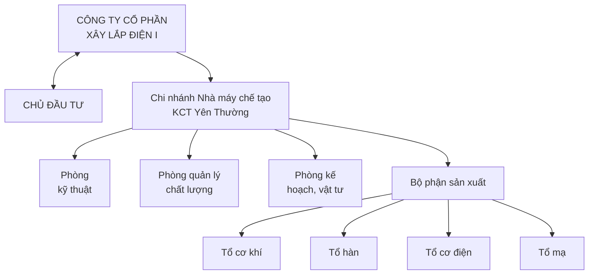

## 3. Thuyết minh sơ đồ tổ chức:

Khi trúng thầu Công ty chúng tôi sẽ triển khai chế tạo với các mục tiêu sau:

- Đảm bảo chất lượng dự án.
- Đảm bảo an toàn cho người, vật tư thiết bị phục vụ cho dự án.
- Đảm bảo tiến độ thi công yêu cầu.
- Nâng cao năng suất lao động và hiệu suất thiết bị.

Tổ chức sản xuất của "Dây chuyền chế tạo kết cấu thép và mạ kẽm 50.000 tấn/năm" bao gồm:

- Bộ máy quản lý: Điều hành sản xuất gia công chế tạo toàn bộ dự án
  + Giám đốc: 01 người (Kỹ sư cơ khí).
  + Phó Giám đốc: 01 người (Kỹ sư điện).
- Bộ phận kỹ thuật (Kỹ sư, cao đẳng cơ khí, hoá công nghiệp):
  + Nhân viên kỹ thuật: 04 người.
  + Nhân viên KCS: 06 người.
- Bộ phận phục vụ:
  + Kế hoạch, vật tư, kế toán: 06 người.
  + Bảo vệ, cấp dưỡng, y tế, lái xe: 06 người.

Gói thầu SPC-T3-PC-08: Cung cấp, xây dựng và lắp đặt vật tư, thiết bị trạm biến áp, đường dây


---


Dự án: TBA 110kV T3 và đường dây 110kV T3 – Trạm 220kV Tân Định, tỉnh Bình Dương

- Tổ cơ khí 03 tổ: 24 người/tổ.
- Tổ hàn, nguội 02 tổ: 16 người/tổ.
- Tổ mạ kẽm 03 tổ: 14 người/tổ.
- Tổ cơ điện 01 tổ 04 người/tổ.

**Phương pháp điều hành**

Sau khi nhận nhiệm vụ sản xuất: Giám đốc và cán bộ kỹ thuật trực tiếp triển khai công tác chuẩn bị sản xuất theo quy trình công nghệ đã có gồm:

- Kiểm tra hồ sơ thiết kế.
- Thực hiện phối thanh để đặt mua cho hiệu quả.
- Kiểm tra chất lượng vật liệu mua về.
- Lên kế hoạch, tiến độ thực hiện.
- Giao nhiệm vụ sản xuất.
- Kiểm tra, chỉ đạo thực hiện.

Nhà máy chế tạo kết cấu thép chúng tôi với hệ thống dây chuyền thiết bị tiên tiến, đội ngũ cán bộ, công nhân lành nghề (12 kỹ sư cơ; 10 cao đẳng, trung cấp cơ khí; 40 thợ cơ khí bậc từ 5/7; 30 thợ cơ khí bậc 4/7) hoàn toàn đáp ứng được về chất lượng sản phẩm cũng như tiến độ thi công.

**Bố trí nhân lực cho 1 tổ cơ khí**

| TT | Đối tượng                                                             | Trình độ chuyên môn                                                                                                                                                                |
| -- | --------------------------------------------------------------------- | ---------------------------------------------------------------------------------------------------------------------------------------------------------------------------------- |
| 1  | Tổ trưởng                                                             | Công nhân bậc 6/7                                                                                                                                                                  |
| 2  | 01 Kỹ thuật                                                           | Kỹ sư cơ khí                                                                                                                                                                       |
| 3  | Cán bộ KCS                                                            | Kỹ sư cơ khí                                                                                                                                                                       |
| 4  | Vật tư + kế hoạch                                                     | Cử nhân kinh tế                                                                                                                                                                    |
| +  | **Công nhân cơ khí**<br/><br/>*Mỗi tổ thi công gồm:<br/>24 công nhân* | **3 tổ**<br/><br/>- Công nhân bậc 6/7: 3 người<br/>- Công nhân bậc 5/7: 8 người<br/>- Công nhân bậc 4/7: 6 người<br/>- Công nhân bậc 3/7: 4 người<br/>- Công nhân bậc 2/7: 3 người |


**Bố trí nhân lực cho 1 tổ hàn nguội**

| TT | Đối tượng         | Trình độ chuyên môn |
| -- | ----------------- | ------------------- |
| 1  | Tổ trưởng         | Công nhân bậc 6/7   |
| 2  | 01 Kỹ thuật       | Kỹ sư cơ khí        |
| 3  | Cán bộ KCS        | Kỹ sư cơ khí        |
| 4  | Vật tư + kế hoạch | Cử nhân kinh tế     |


Gói thầu SPC-T3-PC-08: Cung cấp, xây dựng và lắp đặt vật tư, thiết bị trạm biến áp, đường dây


---


Dự án: TBA 110kV T3 và đường dây 110kV T3 – Trạm 220kV Tân Định, tỉnh Bình Dương

| TT | Đối tượng                               | Trình độ chuyên môn                                                                                                                                              |
| -- | --------------------------------------- | ---------------------------------------------------------------------------------------------------------------------------------------------------------------- |
|    | Công nhân hàn                           | 2 tổ                                                                                                                                                             |
| +  | *Mỗi tổ thi công gồm:<br/>16 công nhân* | - Công nhân bậc 6/7: 3 người<br/>- Công nhân bậc 5/7: 4 người<br/>- Công nhân bậc 4/7: 5 người<br/>- Công nhân bậc 3/7: 2 người<br/>- Công nhân bậc 2/7: 2 người |


**Bố trí nhân lực cho 1 tổ mạ kẽm**

| TT | Đối tượng                               | Trình độ chuyên môn                                                                                                                                              |
| -- | --------------------------------------- | ---------------------------------------------------------------------------------------------------------------------------------------------------------------- |
| 1  | Tổ trưởng                               | Công nhân bậc 6/7                                                                                                                                                |
| 2  | 01 Kỹ thuật                             | Kỹ sư cơ khí                                                                                                                                                     |
| 3  | Cán bộ KCS                              | Kỹ sư cơ khí                                                                                                                                                     |
| 4  | Vật tư + kế hoạch                       | Cử nhân kinh tế                                                                                                                                                  |
|    | Công nhân mạ                            | 3 tổ                                                                                                                                                             |
| +  | *Mỗi tổ thi công gồm:<br/>14 công nhân* | - Công nhân bậc 6/7: 3 người<br/>- Công nhân bậc 5/7: 4 người<br/>- Công nhân bậc 4/7: 3 người<br/>- Công nhân bậc 3/7: 2 người<br/>- Công nhân bậc 2/7: 2 người |


**Bố trí nhân lực cho 1 tổ cơ điện**

| TT | Đối tượng                              | Trình độ chuyên môn                                                                                                             |
| -- | -------------------------------------- | ------------------------------------------------------------------------------------------------------------------------------- |
| 1  | Tổ trưởng                              | Công nhân bậc 6/7                                                                                                               |
| 2  | 01 Kỹ thuật                            | Kỹ sư cơ khí                                                                                                                    |
| 3  | Cán bộ KCS                             | Kỹ sư cơ khí                                                                                                                    |
| 4  | Vật tư + kế hoạch                      | Cử nhân kinh tế                                                                                                                 |
|    | Công nhân cơ khí                       | 1 tổ                                                                                                                            |
| +  | *Mỗi tổ thi công gồm:<br/>4 công nhân* | - Công nhân bậc 6/7: 1 người<br/>- Công nhân bậc 5/7: 1 người<br/>- Công nhân bậc 4/7: 1 người<br/>- Công nhân bậc 3/7: 1 người |


Gói thầu SPC-T3-PC-08: Cung cấp, xây dựng và lắp đặt vật tư, thiết bị trạm biến áp, đường dây


---


Dự án: TBA 110kV T3 và đường dây 110kV T3 – Trạm 220kV Tân Định, tỉnh Bình Dương

## 4. Tiêu chuẩn gia công chế tạo:

- Qui định về Thiết kế, chế tạo và nghiệm thu chế tạo cột điện bằng thép liên kết bulông cấp điện áp đến 500kV do Tổng Công Ty Điện lực Việt Nam ban hành kèm theo Quyết định số: **82/QĐ-EVN-QLXD-TĐ, ngày 07/01/2003** và **20 TCXD 170:1989**.

- Tiêu chuẩn Việt Nam
  + 20 TCXD 170-1989              Chế tạo, lắp dựng và nghiệm thu cột thép.
  + 18-TCN 04-92                          Tiêu chuẩn về mạ kẽm nhúng nóng.
  + TCVN 1876-76 và 1896-76       Tiêu chuẩn bulông, đai ốc.
  + TCVN 1896-76 và 1897-76       Tiêu chuẩn ren, đai ốc.
  + TCVN 2061-77                          Tiêu chuẩn vòng đệm phẳng.
  + TCVN 130-77                           Tiêu chuẩn vòng đệm vênh.
  + TCVN 1691-75                          Tiêu chuẩn mối hàn điện bằng tay.
  + 20 TCXD 170-1989              Hàn và kiểm tra mối hàn.
  + 20 TCVN 338-2005              Tiêu chuẩn thiết kế của kết cấu thép.

- Tiêu chuẩn JIS
  + JIS, JIS G3101,                       Tiêu chuẩn về kết cấu thép.

- Văn bản số 4651/CV-EVN-VT & XNK-QLXD ngày 08/10/2003.

- Các tiêu chuẩn và yêu cầu khác trong hồ sơ mời thầu của công trình.

## 5. Quản lý số lượng, chất lượng nguyên vật liệu đầu vào:

Nguyên vật liệu dùng cho gia công chế tạo theo đúng bản vẽ thiết kế chế tạo cột.

Chúng tôi kiểm tra khối lượng của gói thầu đồng thời kiểm tra bản vẽ thiết kế (nếu sai khác với khối lượng mời thầu chúng tôi trình cơ quan Tư vấn Thiết kế và chủ đầu tư xem xét). Ngoài ra, việc thử nghiệm các thông số cơ lý cũng được áp dụng cho từng chủng loại của các lô thép đưa vào sử dụng, do các phòng thí nghiệm có đủ các tư cách pháp nhân thực hiện. Sau đó cán bộ chuyên trách sẽ thực hiện công tác phối thanh trên máy tính để tính toán khối lượng thép hình, thép tấm, nguyên vật liệu khác cần mua (có thể phối hợp nhiều công trình để thực hiện mua nhằm làm giảm hao hụt).

Khối lượng thép và bu lông đúng số lượng, quy cách, kích thước, cường độ thép, đúng tiêu chuẩn nhà thấu yêu cầu

**Chất lượng nguồn nguyên vật liệu được quản lý như sau:**

Việc chọn đối tác đặt mua nguyên vật liệu được thực hiện kỹ lưỡng, từ việc kiểm tra năng lực tài chính, mức độ uy tín của nhà cung cấp cũng như khả năng cung cấp hàng về số lượng, chất lượng, khả năng cung cấp nhanh đảm bảo tiến độ gia công chế tạo cột của Xưởng.

**Thép tấm, thép hình:** Thép mua mới sản xuất đảm bảo đúng kích thước, đúng nơi sản xuất (có chứng chỉ xuất xưởng hợp pháp (theo lô) của nhà chế tạo) và được lấy theo tiêu chuẩn:

Gói thầu SPC-T3-PC-08: Cung cấp, xây dựng và lắp đặt vật tư, thiết bị trạm biến áp, đường dây


---


Dự án: TBA 110kV T3 và đường dây 110kV T3 – Trạm 220kV Tân Định, tỉnh Bình Dương

Đối với thép L<120mm, tôn tấm:

- JIS, G3101, loại SS400 hoặc tương đương ký hiệu L hoặc δ có

+ Giới hạn chảy nhỏ nhất: $$\sigma_c = 2450 \div 2500 \text{ daN/cm}^2$$.

+ Giới hạn bền kéo: $$\sigma_b = 4000 \text{ daN/cm}^2$$.

Đối với thép L>120mm:

- JIS, G3101, loại SS540 ký hiệu HL có:

+ Giới hạn chảy nhỏ nhất: $$\sigma_c = 4000 \text{ daN/cm}^2$$.

+ Giới hạn bền kéo: $$\sigma_b = 5400 \text{ daN/cm}^2$$.

Kiểm tra chất lượng bề mặt: Thép chúng tôi sử dụng là thép mới xuất xưởng, bề mặt phẳng, thẳng, không rỉ, không cong vênh. Thép đảm bảo không thay đổi các đặc tính vật lý trong quá trình gia công.

**Bulông và đai ốc cột:** Chúng tôi mua của nhà máy Quy chế Từ Sơn và nhà máy Qui Chế 2 và được thử nghiệm đối với tất cả các chủng loại bulông, đai ốc đảm bảo TCVN.

Phôi bulong đai ốc chế tạo bằng phương pháp rèn hoặc dập. Ren bu lông gia công bằng phương pháp cán hoặc tiện có kích thước giảm nhỏ bảo đảm sau khi mạ kẽm với chiều dày lớp mạ 55μm đạt kích thước tiêu chuẩn. Ren đai ốc thường gia công bằng phương pháp ta rô tiêu chuẩn.

Trên sản phẩm có ghi ký hiệu nhà sản xuất và đảm bảo:

Giới hạn chảy: Không nhỏ hơn 300N/mm²

Giới hạn bền: Không nhỏ hơn 500N/mm²

+ Bu lông chế tạo theo TCVN 1876-76 ; TCVN1889-76.

+ Đai ốc chế tạo theo TCVN 1896-76 ; TCVN 1897-76

+ Ren tiêu chuẩn TCVN 2248-77.

+ Dung sai tiêu chuẩn : TCVN 1917-76

+ Yêu cầu kỹ thuật theo tiêu chuẩn : 1916-76

+ Vòng đệm phẳng theo TCVN2061-77, vòng đệm vênh chế tạo bằng thép 65T theo TCVN130-77.

+ Nghiệm thu, bao gói và ghi nhãn theo tiêu chuẩn : TCVN 128-63.

Bu lông lắp cột gồm: 1 bu lông, 1 đai ốc, 1 vòng đệm phẳng và 1 vòng đệm vênh.

Các bu lông C*gồm: 1 bu lông, 2 đai ốc, 1 vòng đệm phẳng và 1 vòng đệm vênh. Quy cách và kích thước chế tạo bu lông theo bảng thể hiện trong tập các bản vẽ chế tạo cột.

- Các nguyên vật liệu: Được kiểm tra kỹ lưỡng và có nguồn gốc xuất sứ rõ ràng và đúng theo yêu cầu của hồ sơ mời thầu.

Tất cả các chủng loại nguyên vật liệu dùng cho gia công chế tạo, chúng tôi thực hiện đúng theo các quy định ghi trong hồ sơ thiết kế và hồ sơ mời thầu.

**6. Quy trình công nghệ gia công cột thép:**

**6.1 Nguyên vật liệu đầu vào**

**+ Nhập vật liệu:**

Gói thầu SPC-T3-PC-08: Cung cấp, xây dựng và lắp đặt vật tư, thiết bị trạm biến áp, đường dây


---


Dự án: TBA 110kV T3 và đường dây 110kV T3 – Trạm 220kV Tân Định, tỉnh Bình Dương

Nguyên vật liệu đầu vào được cung cấp từ nhà cung cấp có uy tín tại Việt Nam và trên thế giới. Đã cung cấp vật liệu cho các công trình chế tạo cột thép cho các Đường dây và Trạm biến áp từ 110kV đến 500kV đạt chất lượng tốt.

Vật liệu được kiểm tra chứng chỉ, phiếu xuất vật liệu, các kích thước, độ thẳng, độ phẳng, đo trọng lượng của vật liệu trước khi làm thủ tục nhận vật liệu.

+ **Thủ tục nhập kho:**

Vật liệu sau khi kiểm tra đạt mọi tiêu chuẩn được tiến hành nhập kho và lập thẻ kho cho từng loại.

Vật liệu được xếp gọn gàng theo từng chủng loại, riêng biệt cho từng loại kích thước và tiện lợi cho việc lấy vật liệu để gia công chế tạo được đặt trên giá, kệ cách nền nhà 30cm.

+ **Thủ tục xuất kho:**

Dựa theo tiến độ sản xuất, tiên lượng công trình và lệnh xuất kho của thủ trưởng đơn vị. Vật liệu được cấp đúng chủng loại, đúng kích thước, đúng khối lượng.

**6.2 Trình tự gia công cơ khí**

**a- Chuẩn bị sản xuất:**

- Kiểm tra bóc tách bản vẽ.
- Lập kế hoạch sản xuất.

**b- Gia công cắt, đột, đóng dấu:**

*/ Máy cắt đột kim loại bao gồm:

- Dây chuyền thiết bị cắt - đột - đóng dấu thép góc điều khiển CNC
- Dây chuyền thiết bị khoan - đóng dấu thép góc điều khiển CNC
- Dây chuyền thiết bị khoan - đột - đóng dấu thép tấm điều khiển CNC
- Máy đột dập truyền động trục khuỷu 100 tấn
- Máy cắt đột liên hợp thuỷ lực
- Máy cắt hơi
- Máy cắt cóc
- Máy cắt thép tấm.

*/ Quy trình chế tạo chi tiết trên máy CNC:

+ Tiếp nhận kế hoạch sản xuất:

Tổ trưởng tổ sản xuất lên nhận phiếu giao nhiệm vụ của Giám đốc

+ Chuẩn bị sản xuất:

- Kiểm tra bản vẽ: Cán bộ Kỹ thuật sẽ tiến hành kiểm tra bản vẽ trước khi cho gia công để đảm bảo chắc chắn không có sai sót.

- Nhập số liệu của bản vẽ vào máy tính.

- Kiểm tra vật tư đưa vào sản xuất.

- Kiểm tra tình trạng làm việc của máy CNC: chày, cối đột, bộ số, bộ chữ..

+ Sản xuất:

Gói thầu SPC-T3-PC-08: Cung cấp, xây dựng và lắp đặt vật tư, thiết bị trạm biến áp, đường dây


---


Dự án: TBA 110kV T3 và đường dây 110kV T3 – Trạm 220kV Tân Định, tỉnh Bình Dương

- Sản xuất thử một chi tiết của một loại, kiểm tra các thông số kỹ thuật giữa bản vẽ và sản phẩm đó để kịp thời xác định sự không phù hợp giữa bản vẽ và sản phẩm để hiệu chỉnh trước khi chế tạo hàng loạt.

- Tiến hành sản xuất hàng loạt

- Kiểm tra xác xuất: 10 sản phẩm kiểm tra xác xuất một sản phẩm để nếu có sai số trong quá trình chế tạo để kịp thời khắc phục.

+ Chuyển và tập kết sản phẩm: Những sản phẩm nào đã hoàn chỉnh về công đoạn cơ khí được chuyển sang dây chuyền mạ còn những sản phẩm có cắt vát, uốn, hàn thì chuyển sang các nguyên công vát, uốn, hàn để hoàn chỉnh sau đó chuyển sang dây chuyền mạ.

*/ Nguyên công cắt:

Đối với vật liệu là thép tấm có chiều dày ≤ 14mm được thực hiện trên máy cắt thuỷ lực, thép tấm có chiều dày >14 mm dùng làm tấm mã, bản đế và những bản mã có góc lượn lớn không thể cắt bằng máy được, thực hiện bằng máy hàn hơi bán tự động sau đó gia công lại bằng phương pháp cắt gọt.

*/ Nguyên công đóng dấu:

Dấu được đóng chìm ở vị trí khi lắp ráp không bị che khuất theo 169NL/BQL. Dấu tuân thủ theo các qui định sau:

- Thể hiện chính xác kí hiệu loại cột, mã số chi tiết trong bản vẽ chế tạo cột.

- Chiều cao dấu ≥ 10mm, độ sâu ≥ 1mm và phù hợp với hồ sơ thiết kế.

- Để thuận tiện cho việc lắp dựng, dấu được đánh dấu ở đầu trên với các thanh đứng, thanh xiên, đánh dấu về bên phải hoặc bên phải đối với thanh ngang, đánh dấu ở phần trên đối với bản mã.

**c- Gia công lỗ và tạo lỗ lớn trên bản đế:**

Máy khoan kim loại bao gồm:

- Máy khoan cần.

- Máy khoan đứng.

- Máy đột lỗ và khoan thủy lực điều khiển kỹ thuật số CNC khoan lỗ từ Φ12-60

Tất cả các lỗ (trừ các lỗ đột trên dây chuyền thiết bị cắt - đột - đóng dấu thép góc điều khiển CNC và hệ thống khoan – đóng dấu thép góc điều khiển CNC) đều được gia công bằng phương pháp khoan, đảm bảo yêu cầu kỹ thuật.

**d- Uốn**

Nguyên công uốn được thực hiện trên máy ép thuỷ lực 80 tấn.

Các chi tiết có bề dày trên 8 mm và góc uốn trên 10⁰ được gia nhiệt trước khi uốn, sau đó làm mát tự nhiên bằng không khí sao cho chi tiết không bị cong vênh hoặc rạn nứt.

- Các thép góc có bề dày dưới 8 mm và góc uốn dưới 10⁰ chúng tôi dùng phương pháp uốn nguội.

- Phương pháp kiểm tra: Dùng hạt từ tính để kiểm tra độ rạn nứt trên sản phẩm.

**e- Hàn**

Thiết bị sử dụng trong nguyên công hàn:

- Máy hàn điện hồ quang (tự động, bán tự động).

Gói thầu SPC-T3-PC-08: Cung cấp, xây dựng và lắp đặt vật tư, thiết bị trạm biến áp, đường dây


---


Dự án: TBA 110kV T3 và đường dây 110kV T3 – Trạm 220kV Tân Định, tỉnh Bình Dương

- Máy hàn MIG/MAG.

Dùng máy hàn để hàn tấm bản đế cột và một số chi tiết theo bản vẽ thiết kế.

Hàn điện bằng tay theo **TCVN1691-75** đường hàn kiểu T6 và T9 dùng que hàn Э42 hoặc loại tương đương. Hàn và kiểm tra mối hàn theo **20 TCXD179-89**

Các chi tiết phức tạp như bản đế trước khi hàn chính thức được ráp tổ hợp theo dưỡng hàn rồi hàn đính. Hàn đính và hàn chính thức dùng phương pháp hàn điện hồ quang, áp dụng công nghệ hàn gián đoạn để tránh biến dạng nhiệt.

Các tấm hoặc thanh sau khi hàn đảm bảo độ bằng phẳng và thẳng không cong vênh hay bị biến dạng.

Các đường hàn phải đều, đủ chiều cao và nhẵn, không có sét, cáu bẩn, dầu mỡ, sơn hoặc gỉ sâu. Đường hàn không được rỗ và không đầy khít.

Sau khi chảy vật liệu hàn phải gạt hết vẩy hoặc dùng búa gõ nhẹ và bàn chải sắt đánh hết vẩy.

Toàn bộ các đường hàn sau khi hàn xong phải kiểm tra bằng siêu âm và có chứng chỉ xác nhận kết quả đường hàn.

## f- Nối thanh cột

- Toàn bộ các thanh thép chúng tôi dùng để chế tạo cột thép dùng thanh nguyên chế tạo. Trong trường hợp cần phải nối thanh thép không được nối thanh bằng phương pháp hàn đối đầu hoặc hàn ốp.

- Các thanh thép của một kết cấu cần nối để đảm bảo chiều dài được nối bằng phương pháp liên kết bu lông, và chỉ được thực hiện khi có sự chấp thuận của Giám sát của Chủ đầu tư về vị trí mối nối và quy cách mối nối.

- Chỉ được nối thanh thép của một kết cấu dùng thép hình L100x100 trở lên và các thanh thép trong thiết kế có chiều dài từ 6m trở lên. Toàn bộ thanh thép dùng loại L90x90 trở xuống và các thanh có chiều dài thiết kế nhỏ hơn 6m chúng tôi không nối.

- Thanh ốp phải có diện tích mặt cắt bằng diện tích mặt cắt của thanh cần nối, tùy điều kiện làm việc cụ thể mà có thể nối ốp đơn vào trong lòng thanh cần nối hoặc ốp ngoài. Có thể nối kép bằng thép hình và 2 bản mã.

- Trong toàn bộ các loại liên kết bằng nối ốp, bu lông liên kết có thể bố trí một hàng, hoặc hai hàng nhưng số lượng và tổng tiết diện mặt cắt của bu lông phải đảm bảo đủ chịu lực (lực kéo, lực cắt, ép mặt) của thanh cần nối. Chi tiết và khoảng cách các bu lông liên kết trong mối nối phải đảm bảo đúng theo tiêu chuẩn của kết cấu thép **TCXDVN 338-2005**. Số lượng bu lông tối tiểu của một mối nối phải có đủ 02 cái cho một cánh thép của mỗi thanh được nối.

- Khi liên kết mối nối bằng bu lông thường hoặc bu lông có cường độ cao nhất thiết số lượng và chủng loại bu lông trên các cánh thép của mỗi thanh trong cùng mối nối phải như nhau. Trong 1 đoạn cột chỉ được nối tối đa là 02 thanh chính và các mối nối này không được cùng nằm trên một mặt cắt ngang của cột. Trong bất cứ trường hợp nào chúng tôi cũng không nối các thanh chính của đoạn chân cột.

Gói thầu SPC-T3-PC-08: Cung cấp, xây dựng và lắp đặt vật tư, thiết bị trạm biến áp, đường dây


---


Gói thầu SPC-T3-PC-08: Cung cấp, xây dựng và lắp đặt vật tư, thiết bị trạm biến áp, đường dây

*Dự án: TBA 110kV T3 và đường dây 110kV T3 – Trạm 220kV Tân Định, tỉnh Bình Dương*

- Chúng tôi nghiên cứu kỹ việc bố trí nối ốp thanh để không ảnh hưởng tới phần chịu lực chính của thanh, không gây cản trở tới việc lắp ráp các thanh hoặc các kết cấu có liên quan và phải được cơ quan Tư vấn thiết kế chỉ định điểm nối.

- Số lượng mối nối tối đa các thanh cột của một cột thép:

+ Thanh chính: được nối 25%

+ Thanh chéo chính: được nối 20%

+ Thanh chéo khác: được nối 10%

- Các thanh được nối với nhau và thanh ốp phải là thép cùng mã hiệu, cùng quy cách. Trường hợp nối kép thì thanh thép ốp nên dùng thép có quy cách nhỏ hơn nhưng tổng thể diện tích của cả thanh ốp và bản mã phải lớn hơn thanh cần nối là 10 - 15%.

Có thể nối thanh cùng mã hiệu thép nhưng quy cách khác nhau thì thanh nhỏ phải đảm bảo đủ chịu lực. Thanh lớn chỉ được phép lớn hơn 01 cấp thép nhưng chiều dày phải bằng chiều dày thanh nhỏ.

- Để thuận tiện cho việc lắp ráp kết cấu, tại mối nối chúng tôi để hai đầu thanh cần nối cách nhau từ 5 - 10mm. Thanh ốp nối phải bắt chặt khít vào thanh cần nối, vì vậy thanh nào nằm trong lòng thanh kia phải vát sống thanh theo kích thước vát là tam giác vuông cân mà cạnh góc vuông ít nhất bằng bán kính cong của lòng thanh. Chiều dài đoạn vát bằng chiều dài thanh ốp nối.

- Chúng tôi tiến hành bắt chặt đầy đủ các bu lông của mối nối để có một thanh liền như thiết kế rồi mới chuyển giao cho các đơn vị xây lắp.

## 6.3. Quy trình nghiệm thu chế tạo và lắp thử tại xưởng

Toàn bộ cột trước khi đem mạ kẽm phải lắp thử theo tư thế nằm để kiểm tra và sửa chữa các sai sót nếu có. Phần mặt bằng lắp ráp mẫu phải xác định theo mặt phẳng chuẩn. Bu lông sử dụng lắp thử cột được lấy theo bu lông lắp chính thức và xiết chặt. Trước khi nghiệm thu cột, chúng tôi sẽ xuất trình các số liệu kiểm tra nghiệm thu chi tiết (sai số về hình học, sai số góc, phiếu kiểm tra chất lượng mối hàn, độ không trùng khớp các lỗ khi lắp ráp và các phiếu liên quan về chất lượng thép, bu lông, mối hàn…) cho từng lô cột.

Việc kiểm tra các sai số gia công thực hiện theo quyết định số **82/QĐ-EVN-QLXD-TĐ** ngày 07/01/2003.

## 6.4. Quy trình mạ kẽm

Toàn bộ cột sau khi nghiệm thu tại nhà máy được mạ kẽm bằng phương pháp mạ kẽm nhúng nóng theo **18TCN 04-92** hoặc **ASTM A123**, với chiều dày lớp mạ trung bình qui định:

+ Đối với chi tiết dày < 6mm dầy 100 μm

+ Đối với chi tiết dày ≥ 6mm dầy 110 μm

+ Bu lông đai ốc vòng đệm dầy 55 μm

Chiều dày lớp mạ không nhỏ hơn 90% chiều dày trung bình. Chiều dày lớp mạ tối đa không quá 200μm. Tất cả các chi tiết không đạt yêu cầu theo tiêu chuẩn và hồ sơ thiết kế đều bị loại bỏ.

---


Dự án: TBA 110kV T3 và đường dây 110kV T3 – Trạm 220kV Tân Định, tỉnh Bình Dương

Bề mặt lớp mạ đều, nhẵn, không rỗ khí, rỗ xỉ, vón cục… Nếu có cong vênh biến dạng sau khi mạ, chúng tôi tiến hành xử lý sửa chữa hoặc loại bỏ trước khi giao hàng.

Tính đồng nhất của lớp mạ kẽm phải được kiểm tra bằng máy. Lớp mạ phủ phải dính chặt, nhẵn đều, không rộp, có cục sạn sót, có vết đen hoặc xỉ hay các khuyết tật khác.

Mỗi đợt mạ chúng tôi đều tiến hành lưu mẫu thử và ghi số liệu rõ ràng, mẫu thử là 2 hoặc nhiều mảnh riêng lẻ mỗi mảnh có diện tích phủ tối thiểu là 2600mm² được cắt ra từ vật liệu dùng để chế tạo cột.

*Dây chuyền mạ*

Dây chuyền mạ được đưa vào vận hành vào năm 2004 đã được đầu tư nâng cấp hoàn thiện vào năm 2011.

* Các hệ thống của dây chuyền bao gồm:

- Bể mạ:

Xuất sứ: SCHMITZ & APLET LOI Industrieofenanlagen - Đức.

Năm sản xuất: 2003, đã được cải tạo toàn bộ vào năm 2009

Kích thước mạ hữu dụng: 12000x1000x1500mm (dài x rộng x sâu).

(Kích thước ngoài của thân lò: 13900 x 2900 x 1800mm)

Chiều dày bể mạ: 50mm.

Trọng lượng: 22,4 tấn (có thể chứa khoảng 150 tấn kẽm lỏng).

Công suất tối đa: 4 tấn/giờ.

Nhiên liệu đốt: Dầu DO.

- Hệ thống xử lý trước khi mạ:

+ Bể rửa kiềm với giàn trao đổi nhiệt (55⁰ - 60⁰C): 2000x1000x1300mm.

+ Bể rửa nước sau bể rửa kiềm: 12000x1000x1300mm.

+ Bể tẩy gỉ (dung dịch axit HCl): 12000x1000x1300mm.

+ Bể nước đặt sau bể tẩy gỉ: 12000x1000x1300mm.s

+ Bể phụ gia với giàn trao đổi nhiệt (55⁰ - 60⁰C): 12000x1000x1300mm.

+ Thiết bị tự khống chế nhiệt độ bể phụ gia.

+ Trạm tuần hoàn và lọc cặn dung dịch phụ gia.

+ Các thiết bị lắp cho khu vực trung hoà nước thải.

+ Bồn chứa axit bằng nhựa: 2bồn x 4m³ và đường ống dẫn axit vào bể tẩy gỉ.

+ Bơm chuyển axit.

+ Hệ thống cấp nước sạch vào bể.

- Hệ thống sấy:

+ Nắp đậy hầm sấy có cách nhiệt, di chuyển bằng điện.

+ Hệ thống gia nhiệt cho hầm sấy.

- Hệ thống mạ:

+ Hệ thống thoát khí thải lò mạ.

+ Nắp đậy bể mạ có lớp cách nhiệt.

Gói thầu SPC-T3-PC-08: Cung cấp, xây dựng và lắp đặt vật tư, thiết bị trạm biến áp, đường dây


---


Dự án: TBA 110kV T3 và đường dây 110kV T3 – Trạm 220kV Tân Định, tỉnh Bình Dương

+ Bồn chứa và đường ống dẫn nhiên liệu kèm đầu phun.

+ Hệ thống tự động duy trì nhiệt độ bể mạ.

- Hoàn thiện sản phẩm:

+ Bể làm nguội: 12000x1000x1300mm.

+ Tháp làm mát và bơm tuần hoàn.

+ Bể tạo màng chrommate: 12000x1000x1300mm.

- Hệ thống hút hơi độc:

+ Hệ thống hút hơi bể axit.

+ Hệ thống hút hơi bể phụ gia.

+ Hệ thống hút hơi bốc lên từ bể kẽm.

- Máy mài cầm tay.

- Các dụng cụ kiểm tra: Máy đo chiều dầy lớp mạ, máy đo nhiệt độ cầm tay.

## 6.5. Quy trình đóng gói sản phẩm

Để thuận tiện cho việc vận chuyển và lắp dựng cột, các chủng loại cột được đóng kiện theo nguyên tắc đóng rời từng cột. Mỗi cột được cung cấp trong các kiện đã được đánh số, có nhãn rõ ràng. Việc đóng kiện đảm bảo chắc chắn an toàn cho việc vận chuyển nâng và cẩu. Mỗi kiện sẽ có một bảng kê các phần tử cột và mục vật tư trong kiện và số lượng kiện để lắp hoàn thiện một cột.

Các chi tiết có kích thước nhỏ, tấm mã, bulông của cùng một cột được đóng thành một kiện trong các thùng gỗ. Chủng loại bulông, đai ốc, vòng đệm khác nhau được đựng trong các túi vải khác nhau để dễ lựa chọn.

Dự phòng mất mát tại công trường, các loại bu lông, đai ốc, vòng đệm được cung cấp thêm 03% số lượng. Và được đóng vào 1 kiện riêng và ghi rõ là Bu lông dự phòng.

Các kiện bu lông, đai ốc, vòng đệm được làm bằng gỗ, có đai sắt chắc chắn, chịu được va đập khi vận chuyển.

## 7. Bộ hồ sơ xuất xưởng:

Bộ hồ sơ xuất xưởng bao gồm:

- Hồ sơ cột thép mạ kẽm (do Công ty Cổ phần Xây lắp Điện I lập):

+ Chứng chỉ xuất xưởng cho từng chủng loại cột thép mạ kẽm nhúng nóng.

+ Biên bản nghiệm thu lắp ráp cột mẫu (biên bản A-B).

+ Biên bản nghiệm thu kỹ thuật cột thép trước khi mạ.

+ Bảng hoàn công khối lượng chi tiết cho từng chủng loại cột.

- Kết quả thử nghiệm siêu âm mối hàn.

- Kết quả thử nghiệm cột thép mạ kẽm nhúng nóng.

- Chứng chỉ thép dùng cho gói thầu của nhà chế tạo.

- Kết quả thí nghiệm kéo nén vật liệu thép dùng cho chế tạo cột.

- Kết quả thử nghiệm bulông - đai ốc cho tất cả các loại bulông đai ốc sử dụng.

- Các giấy tờ liên quan khác do khách hàng yêu cầu.

Gói thầu SPC-T3-PC-08: Cung cấp, xây dựng và lắp đặt vật tư, thiết bị trạm biến áp, đường dây


---


Dự án: TBA 110kV T3 và đường dây 110kV T3 – Trạm 220kV Tân Định, tỉnh Bình Dương

## 8. Vận chuyển, bàn giao:

Cột, kết cấu thép được sản xuất tại Nhà máy chế tạo kết cấu thép Yên Thường - Công ty Cổ phần Xây lắp Điện I.

Hồ sơ chế tạo được cung cấp đầy đủ và có Biên bản kiểm tra chất lượng xác nhận hàng hoá đạt chất lượng được đưa vào sử dụng.

Tất cả các kiện sẽ được đánh số thứ tự rõ ràng và lập bảng vận đơn. Có các biện pháp kê, chèn chắc chắn trước khi vận chuyển đảm bảo an toàn.

Vận chuyển cột, kết cấu thép đến kho của khách hàng bằng phương tiện thích hợp để đảm bảo trong quá trình vận chuyển không làm ảnh hưởng xấu đến cột. Đảm bảo không trầy xước làm hỏng lớp mạ cột và không gây biến dạng các chi tiết cột.

Dùng cẩu 10 tấn (hoặc 20 tấn) để bốc dỡ cột lên xuống.

## 9. Biện pháp bảo vệ môi trường:

Hệ thống mạ kẽm hiện tại của công ty có công suất 14.000 tấn/ năm. Đi kèm với hệ thống này là hệ thống xử lý nước thải, khí thải công nghiệp đạt tiêu chuẩn về bảo vệ môi trường và an toàn hoá chất, được cơ quan có thẩm quyền cấp chứng chỉ.

Hệ thống phân lập, thu gom và xử lý nước thải đạt tiêu chuẩn loại B (dùng cho tưới tiêu).

Hệ thống thu gom và xử lý khí acid, áp dụng kỹ thuật mới cải thiện môi trường không khí khu vực phân xưởng nhằm bảo vệ sức khoẻ công nhân và tăng tuổi thọ công trình trên cơ sở giảm bề mặt thoát khí tự do của hệ thống xử lý acid.

Giới thiệu về hệ thống xử lý:

Có ba hệ thống thu gom nước thải:

+ Nước thải acid.

+ Nước thải chứa crom từ bể thụ động.

+ Nước thải chứa dầu.

Trong khu vực xử lý nước thải sẽ có 03 Modul chính:

+ Modul xử lý crom.

+ Modul xử lý acid kiềm.

+ Modul xử lý bùn.

- Bùn từ xử lý nước thải (chủ yếu là kim loại và vôi) sẽ được quản lý trong nhà máy và hợp đồng thuê chôn lấp với công ty quản lý môi trường địa phương.

- Khí thải được xử lý ở tháp xử lý khí thải acid bằng dung dịch kiềm, kiềm sẽ được tuần hoàn sử dụng cho đến khi bão hoà, nước thải và dung dịch bão hoà từ tháp xử lý sẽ được nhập về modul xử lý acid-kiềm của bể xử lý nước thải.

Khí thải và nước thải sau khi xử lý đều đạt tiêu chuẩn an toàn, vệ sinh công nghiệp và được cơ quan có thẩm quyền xác nhận và phê duyệt.

Gói thầu SPC-T3-PC-08: Cung cấp, xây dựng và lắp đặt vật tư, thiết bị trạm biến áp, đường dây


---


Dự án: TBA 110kV T3 và đường dây 110kV T3 – Trạm 220kV Tân Định, tỉnh Bình Dương

## BẢNG THÔNG SỐ CHẾ TẠO THÉP HÌNH VÀ THÉP TẤM CÁC LOẠI

| Stt | Đặc tính và thôngsố kỹ thuật                | Yêu cầu                                                                                                                                                                                                                                                                                                                                                                                                                                                                                                                 | Chào thầu                                                                                                                                                                                                                                                                                                                                                                                                                                                                                                                   |
| --- | ------------------------------------------- | ----------------------------------------------------------------------------------------------------------------------------------------------------------------------------------------------------------------------------------------------------------------------------------------------------------------------------------------------------------------------------------------------------------------------------------------------------------------------------------------------------------------------- | --------------------------------------------------------------------------------------------------------------------------------------------------------------------------------------------------------------------------------------------------------------------------------------------------------------------------------------------------------------------------------------------------------------------------------------------------------------------------------------------------------------------------- |
| 1   | Nhà sản xuất/Nước<br/>sản xuất              | Nhà thầu tự khai báo                                                                                                                                                                                                                                                                                                                                                                                                                                                                                                    | Nhà máy chế tạo Kết cấu<br/>thép Yên Thường – Công<br/>ty Cổ phần Xây lắp Điện I                                                                                                                                                                                                                                                                                                                                                                                                                                            |
| 2   | Tiêu chuẩn áp dụng                          | TCVN 5575-2012, JIS G<br/>G3101, G3106 hoặc tương<br/>đương                                                                                                                                                                                                                                                                                                                                                                                                                                                             | TCVN 5575-2012, JIS G<br/>G3101, G3106 hoặc<br/>tương đương                                                                                                                                                                                                                                                                                                                                                                                                                                                                 |
| 3   | Tiêu chuẩn quản lý<br/>chất lượng sản phẩm  | ISO 9001                                                                                                                                                                                                                                                                                                                                                                                                                                                                                                                | ISO 9001                                                                                                                                                                                                                                                                                                                                                                                                                                                                                                                    |
| 4   | Chủng loại thép                             | Nhà thầu tự khai báo                                                                                                                                                                                                                                                                                                                                                                                                                                                                                                    | Loại SS400, ký hiệu L,<br/>- Loại SS540 ký hiệu HL                                                                                                                                                                                                                                                                                                                                                                                                                                                                          |
| 5   | Đáp ứng các yêu cầu<br/>của đơn vị thiết kế | 1. Loại SS400, ký hiệu L<br/>+ Giới hạn bền >4000<br/>daN/cm²<br/>+ Giới hạn chảy>2450<br/>daN/cm²<br/>2. Loại SS540, ký hiệu L, δ<br/>+ Giới hạn bền >5400<br/>daN/cm²<br/>+ Giới hạn chảy>3900<br/>daN/cm²<br/>với t>16mm<br/>+ Giới hạn chảy>4000<br/>daN/cm²<br/>với t<16mm<br/>3. Loại SM490A (JIS<br/>G3106), thép tấm có chiều<br/>dày >20mm<br/>+ Giới hạn bền >4900<br/>daN/cm²<br/>+ Giới hạn chảy>3150<br/>daN/cm²<br/>4. Bu lông liên kết: Cấp<br/>bền/Đường kính<br/>+ 4.6 với d< Ø16<br/>+ 5.6 với d> Ø16 | 1. Loại SS400, ký hiệu L<br/>+ Giới hạn bền >4000<br/>daN/cm²<br/>+ Giới hạn chảy>2450<br/>daN/cm²<br/>2. Loại SS540, ký hiệu L,<br/>δ<br/>+ Giới hạn bền >5400<br/>daN/cm²<br/>+ Giới hạn chảy>3900<br/>daN/cm²<br/>với t>16mm<br/>+ Giới hạn chảy>4000<br/>daN/cm²<br/>với t<16mm<br/>3. Loại SM490A (JIS<br/>G3106), thép tấm có<br/>chiều dày >20mm<br/>+ Giới hạn bền >4900<br/>daN/cm²<br/>+ Giới hạn chảy>3150<br/>daN/cm²<br/>4. Bu lông liên kết: Cấp<br/>bền/Đường kính<br/>+ 4.6 với d< Ø16<br/>+ 5.6 với d> Ø16 |
| 6   | Tiêu chuẩn mạ kẽm<br/>nhúng nóng            | 18TCN 04-92 hoặc<br/>tương đương                                                                                                                                                                                                                                                                                                                                                                                                                                                                                        | 18TCN 04-92 hoặc<br/>tương đương                                                                                                                                                                                                                                                                                                                                                                                                                                                                                            |
| 7   | Kiểm tra và thử<br/>nghiệm                  | TCXD 170:1989 Tiêu chuẩn<br/>chế tạo, lắp dựng, nghiệm<br/>thu kết cấu thép và quy định                                                                                                                                                                                                                                                                                                                                                                                                                                 | TCXD 170:1989 Tiêu<br/>chuẩn chế tạo, lắp dựng,<br/>nghiệm thu kết cấu thép                                                                                                                                                                                                                                                                                                                                                                                                                                                 |


Gói thầu SPC-T3-PC-08: Cung cấp, xây dựng và lắp đặt vật tư, thiết bị trạm biến áp, đường dây


---


Dự án: TBA 110kV T3 và đường dây 110kV T3 – Trạm 220kV Tân Định, tỉnh Bình Dương

|   |   | về Thiết kế, chế tạo và nghiệm thu chế tạo cột điện bằng thép liên kết bu lông cấp điện áp đến 500kV do Tổng Công ty Điện lực Việt Nam ban hành kèm theo Quyết định số 82/QĐ-EVN-QLXD-TĐ, ngày 07/01/2003 | và quy định về Thiết kế, chế tạo và nghiệm thu chế tạo cột điện bằng thép liên kết bu lông cấp điện áp đến 500kV do Tổng Công ty Điện lực Việt Nam ban hành kèm theo Quyết định số 82/QĐ-EVN-QLXD-TĐ, ngày 07/01/2003 |
| - | - | --------------------------------------------------------------------------------------------------------------------------------------------------------------------------------------------------------- | --------------------------------------------------------------------------------------------------------------------------------------------------------------------------------------------------------------------- |


Gói thầu SPC-T3-PC-08: Cung cấp, xây dựng và lắp đặt vật tư, thiết bị trạm biến áp, đường dây


---


Dự án: TBA 110kV T3 và đường dây 110kV T3 – Trạm 220kV Tân Định, tỉnh Bình Dương

# CHƯƠNG VIII
# TIẾN ĐỘ THI CÔNG

## I. TIẾN ĐỘ THI CÔNG:

**1. Thời gian hoàn thành công trình:** Gói thầu SPC-T3-PC-08: Cung cấp xây dựng và lắp đặt thiết bị trạm biến áp, đường dây thuộc Công trình: TBA 110kV T3 và đường dây 110kV T3 – Trạm 220kV Tân Định, tỉnh Bình Dương - Dự án: TBA 110kV T3 và đường dây 110kV T3 – Trạm 220kV Tân Định, tỉnh Bình Dương thi công trong **210 ngày.**

**2. Sự phối hợp giữa các công tác thi công và nhân lực thi công, chi tiết phù hợp giữa các giai đoạn thi công:** *Biểu số 2.1: Bảng tiến độ thi công chi tiết* kèm theo.

**3. Biểu đồ huy động nhân lực, vật liệu, thiết bị thi công:** *Biểu số 2.1: Bảng tiến độ thi công chi tiết; Biểu số 2.2: Biểu đồ huy động xe máy thi công chủ yếu* kèm theo.

## II. THUYẾT MINH TIẾN ĐỘ THI CÔNG (Sự phù hợp giữa tiến độ của từng hạng mục với tiến độ chung và các chỉ dẫn kỹ thuật, quy phạm kỹ thuật thi công):

### 1. Cơ sở lập tiến độ dự án:

Tiến độ này được thiết lập trên cơ sở đã nghiên cứu các biện pháp kỹ thuật thi công, quy trình thiết kế, công tác mua sắm vật tư thiết bị, xác định trình tự tiến hành, quan hệ ràng buộc giữa các công tác với nhau, thời gian hoàn thành công trình. Đồng thời nó còn được xác định trên cơ sở nhu cầu về vật tư, nhân lực, máy móc thi công ở từng thời gian trong suốt quá trình thi công.

### 2. Trình tự lập tiến độ dự án:

Theo trình tự sau đây:

- Ước tính khối lượng của các công tác chính, công tác phục vụ như: Công tác thiết kế, mua sắm vật tư, công tác chuẩn bị, công tác thi công.

- Đề xuất các phương án cho các nội dung công việc chính.

- Ấn định và sắp xếp thời gian thực hiện cho các công tác chính.

- Sắp xếp lại thời gian hoàn thành các công tác chuẩn bị, công tác mặt bằng.

- Ước tính nhu cầu về công nhân kỹ thuật chủ yếu.

- Lập biểu đồ yêu cầu cung cấp các loại cấu kiện và bán thành phẩm chủ yếu. Đồng thời lập cả nhu cầu về máy móc, thiết bị và các phương tiện vận chuyển.

### 3. Phương pháp xây dựng tiến độ:

- Tính toán được khối lượng các công tác chính.

- Xác định khối lượng trên cơ sở định mức dự toán.

- Từ khối lượng được tính toán, tiến hành lập tiến độ thi công của công trình.

### 4. Phương pháp tối ưu hoá biểu đồ nhân lực:

#### *a. Lấy qui trình kỹ thuật làm cơ sở:*

Để có biểu đồ nhân lực hợp lý, điều chỉnh tiến độ bằng cách sắp xếp thời gian hoàn thành các công tác sao cho chúng có thể tiến hành nối tiếp song song hay kết hợp nhưng vẫn đảm bảo trình tự kỹ thuật thi công hợp lý. Các phương hướng giải quyết như sau:

- Kết thúc của quá trình này sẽ được nối tiếp ngay bằng bắt đầu của quá trình khác.

Gói thầu SPC-T3-PC-08: Cung cấp, xây dựng và lắp đặt vật tư, thiết bị trạm biến áp, đường dây


---


Dự án: TBA 110kV T3 và đường dây 110kV T3 – Trạm 220kV Tân Định, tỉnh Bình Dương

- Các quá trình có liên quan chặt chẽ với nhau được bố trí thành những cụm riêng biệt trong tiến độ theo riêng từng tầng hoặc thành một cụm chung cho cả công trình.

## b. Lấy tổ đội chuyên nghiệp làm cơ sở:

Trước hết xác định số lượng người trong mỗi tổ thợ chuyên nghiệp, thường là mỗi tổ đội có từ 25 ÷ 30 người.

Cách thức thực hiện như sau:

- Tổ hoặc nhóm thợ nào sẽ làm công việc chuyên môn ấy, làm hết chỗ này sang chỗ khác với nguyên tắc là số người không đổi và công việc không chồng chéo hay đứt đoạn.

- Có thể chuyển một số người từ công đoạn này sang công đoạn khác để từ đó có thể làm đúng số công yêu cầu mà quá trình đã qui định.

## 5. Thời gian hoàn thành công trình:

- Thời gian hoàn thành toàn bộ công trình là: **360 ngày.**

- Thời gian thi công công trình đảm bảo phù hợp thực tế, hợp lý giữa các hạng mục liên quan, thoả mãn và hoàn thành trước thời hạn của Chủ đầu tư.

- Áp dụng mọi biện pháp cần thiết, khai thác hết năng lực của Công ty về con người, thiết bị, tiền vốn đảm bảo thực hiện đúng tiến độ.

## 6. Biện pháp đảm bảo tiến độ thi công, duy trì thi công khi mất điện, đảm bảo thiết bị trên công trường hoạt động liên tục:

+ Báo cáo ngày:

Nhà thầu giám sát ở mặt bằng cơ bản theo ngày có những báo cáo về:

- Điều động nhân lực.

- Điều động thiết bị xây dựng.

- Công việc thực hiện.

+Báo cáo tiến độ theo tuần:

Nhà thầu sẽ có báo cáo tổng hợp theo tuần:

- Lịch trình công việc theo tuần.

- Ghi chép lại các khối lượng công việc trong tuần đã hoàn thành, so sánh với công việc trong tuần đã dự kiến.

- Ngoài nguồn điện địa phương, Nhà thầu bố trí mỗi tổ đội 02 máy phát di động cầm tay để phòng trường hợp mất điện khi thi công.

- Thiết bị thi công trên công trường thường xuyên được sửa chữa, bảo dưỡng định kỳ đảm bảo vận hành liên tục trong thời gian thi công.

- Xác định những thay đổi thực tế khối lượng hoàn thành công việc ở cuối tháng, từ đó rút kinh nghiệm cho các công việc tiếp theo.

- Nhà thầu xây dựng các biểu đồ biểu thị các công việc thực hiện theo tháng.

- Nhà thầu sẽ có các bản báo cáo cho Chủ đầu tư các hoạt động ở những nơi gặp vướng mắc, các tác động nhỏ trì hoãn, khi có sự thiết lập. Bao gồm:

+ Công tác nào được nêu trước sẽ thực hiện trước.

+ Mọi công tác có hiệu lực.

+ Nhà thầu có dự báo để cải thiện tình hình các hoạt động có hiệu quả.

Gói thầu SPC-T3-PC-08: Cung cấp, xây dựng và lắp đặt vật tư, thiết bị trạm biến áp, đường dây


---


Dự án: TBA 110kV T3 và đường dây 110kV T3 – Trạm 220kV Tân Định, tỉnh Bình Dương

## CHƯƠNG IX
## BIỆN PHÁP ĐẢM BẢO CHẤT LƯỢNG

### I. QUẢN LÝ CHẤT LƯỢNG:

### 1. Sơ đồ quản lý chất lượng Công trình:

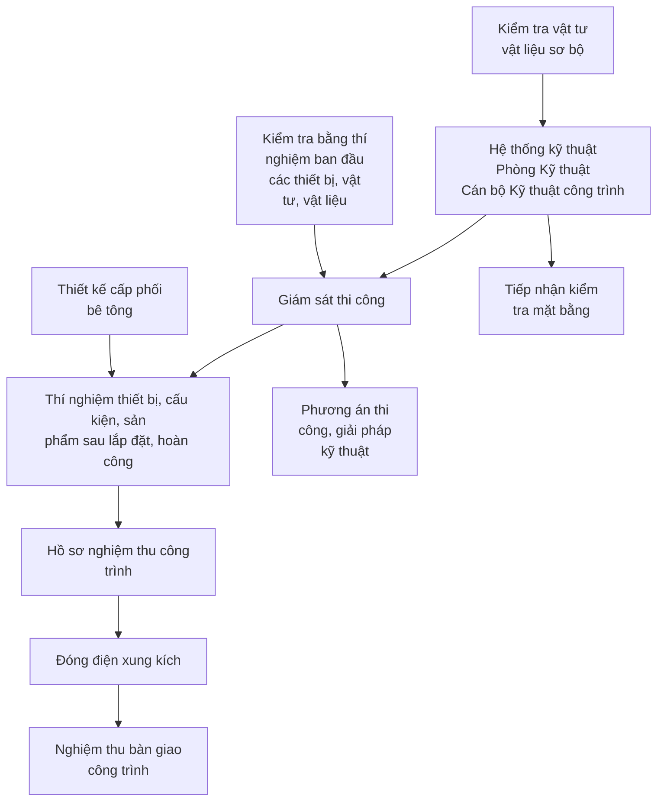

### 2. Hệ thống và chính sách quản lý chất lượng:

Để công trình thi công được đảm bảo chất lượng, công tác giám sát kỹ thuật phải được chỉ đạo ngay từ khi giao nhận tuyến, tiếp nhận vật tư, thiết bị trước khi thi công.

Dựa vào tiến độ thi công, các cán bộ giám sát kỹ thuật của đơn vị thi công phải có sự liên hệ, phối hợp chặt chẽ với phòng kỹ thuật an toàn, phòng kế hoạch đầu tư của Ban A và các cán bộ giám sát kỹ thuật tuyến.

Sau khi thi công từng hạng mục công trình cần tổ chức nghiệm thu, hồ sơ nghiệm thu theo quy định để phục vụ việc tập hợp hồ sơ, thanh quyết toán kịp thời, chính xác.

### II. QUẢN LÝ CHẤT LƯỢNG VẬT TƯ:

### 1. Lập danh mục toàn bộ vật tư, vật liệu, thiết bị sẽ đưa vào gói thầu.

- Sau khi khởi công công trình, nhà thầu sẽ ban hành công văn đăng ký cấp phối, vật tư đưa vào sử dụng trong công trình theo đúng cam kết trong hồ sơ chào thầu. Đối với những vật tư bổ sung, thay đổi nguồn gốc do một số lý do khách quan, không có trong hồ sơ chào thầu nhà thầu sẽ trình và đặt hàng, cung cấp khi được Chủ đầu tư phê duyệt

- Toàn bộ vật tư, vật liệu, thiết bị đưa vào gói thầu sẽ được lập thành danh mục và sẽ chịu sự quản lý, kiểm soát của Ban chỉ huy công trường.

- Tất cả vật liệu được sử dụng cho công trình sẽ được Nhà thầu đảm bảo đúng chất lượng yêu cầu, tuân thủ theo các quy định về kỹ thuật trong hồ sơ mời thầu do Chủ đầu tư

Gói thầu SPC-T3-PC-08: Cung cấp, xây dựng và lắp đặt vật tư, thiết bị trạm biến áp, đường dây


---


Dự án: TBA 110kV T3 và đường dây 110kV T3 – Trạm 220kV Tân Định, tỉnh Bình Dương

quy định. Tất cả các vật tư đều có kết quả chứng nhận đảm bảo yêu cầu, hoá đơn xuất xưởng, đăng ký chất lượng của nhà sản xuất, kết quả thí nghiệm (với một số vật tư cần thiết) và thoả mãn các TCVN sẽ được trình cho Chủ đầu tư, cơ quan Tư vấn giám sát trước khi đưa vào sử dụng. Vật tư sử dụng cho công trình được Nhà thầu đảm bảo mới 100% đúng theo yêu cầu của Hồ sơ mời thầu.

- Các vật liệu đưa vào thi công công trình như xi măng, cốt thép, cát, đá, gạch xây, bê tông có đầy đủ kết quả mẫu thử.

- Các vật liệu khác phải có nguồn gốc xuất xứ.

- Tất cả các vật liệu đưa vào sử dụng cho công trình phải được sự đồng ý của Chủ đầu tư và Tư vấn giám sát.

**2. Quy trình và các biện pháp quản lý chất lượng vật tư, vật liệu, thiết bị**

**a. Phương án tập kết vật tư, vật liệu:**

- Vật tư, vật liệu được vận chuyển từ địa điểm cấp hàng về chân công trình bằng ôtô hoặc các phương tiện cơ giới khác. Khi về đến công trình sẽ được tập kết đúng vị trí quy định, kiểm tra chất lượng và cất bảo quản trong kho.

**b. Quy chế bảo quản vật tư:**

**b.1. Xi măng :**

- Xi măng không bị rách vỏ, không để lưu kho quá 25 ngày, đồng thời ngày tháng, năm sản xuất phải được ghi đầy đủ trên bao bì hay có chứng nhận của nhà sản xuất.

- Kho xi măng thoáng mát, đặt trên sạp gỗ cách mặt đất 45 cm để chống ẩm ướt.

**b.2. Cát vàng, cát xây :**

- Nơi tập kết cát được dọn sạch, khô ráo để thoát nước, có phương án bảo quản che chắn trong thời gian mưa dầm, không làm ảnh hưởng đến tỷ lệ N/XM của vữa.

**b.3. Đá dăm :**

- Đá được tập kết tại bãi sạch sẽ, khô ráo, có biện pháp che chắn những ngày mưa dầm, che nắng giảm nhiệt độ những ngày nắng nóng kéo dài, không làm ảnh hưởng đến tỷ lệ N/XM của vữa.

**b.4. Thép :**

- Vật liệu thép đáp ứng các yêu cầu của Chủ đầu tư và Hồ sơ mời thầu

- Thép được tập kết tại kho có mái che và xếp thành từng đống, phân biệt theo số hiệu, đường kính và mã hiệu thép được kê lên giá gỗ cao 25 cm so với mặt đất.

**b.5. Bê tông:**

- Bê tông được cung cấp đầy đủ đúng theo tiến độ thi công, đảm bảo đúng theo mác thiết kế.

**b.6. Thiết bị thi công:**

- Dựa vào khối lượng công việc, qua khảo sát khu vực xây dựng và tiến độ thi công của công trình Nhà thầu sẽ có kế hoạch cung cấp xe máy, thiết bị thi công cụ thể cho từng giai đoạn nhằm đem lại hiệu quả kinh tế cao nhất và đáp ứng đúng tiến độ thi công của công trình.

- Thiết bị, máy móc trước khi đưa vào sử dụng thi công được kiểm định định kỳ theo quy định và có các chứng chỉ kiểm định đảm bảo sử dụng. Những máy móc thiết bị nào không đảm bảo đúng quy định ngay lập tức được sửa chữa và có biên bản nghiệm thu sau sửa chữa, đồng thời vận chuyển ngay ra khỏi công trường những máy móc không đáp ứng được yêu cầu kỹ thuật.

Gói thầu SPC-T3-PC-08: Cung cấp, xây dựng và lắp đặt vật tư, thiết bị trạm biến áp, đường dây


---


Dự án: TBA 110kV T3 và đường dây 110kV T3 – Trạm 220kV Tân Định, tỉnh Bình Dương

- Trong trường hợp cần thiết Nhà thầu sẽ bổ sung thêm số lượng xe máy tăng lên nếu tiến độ thi công và công việc yêu cầu.

- Nhà thầu sẽ tự liên hệ và xin giấy phép cần thiết để vận chuyển các loại vật tư, thiết bị, máy móc đến công trường.

**3. Giải pháp xử lý vật tư, vật liệu và thiết bị phát hiện không phù hợp với yêu cầu của gói thầu.**

Đối với những vật tư, vật liệu và thiết bị phát hiện không phù hợp với yêu cầu của gói thầu sẽ được kỹ sư kiểm tra chất lượng (QA/QC) yêu cầu đưa ra khỏi công trường ngay lập tức.

**Sơ đồ kiểm tra chất lượng vật tư, vật liệu và thiết bị:**

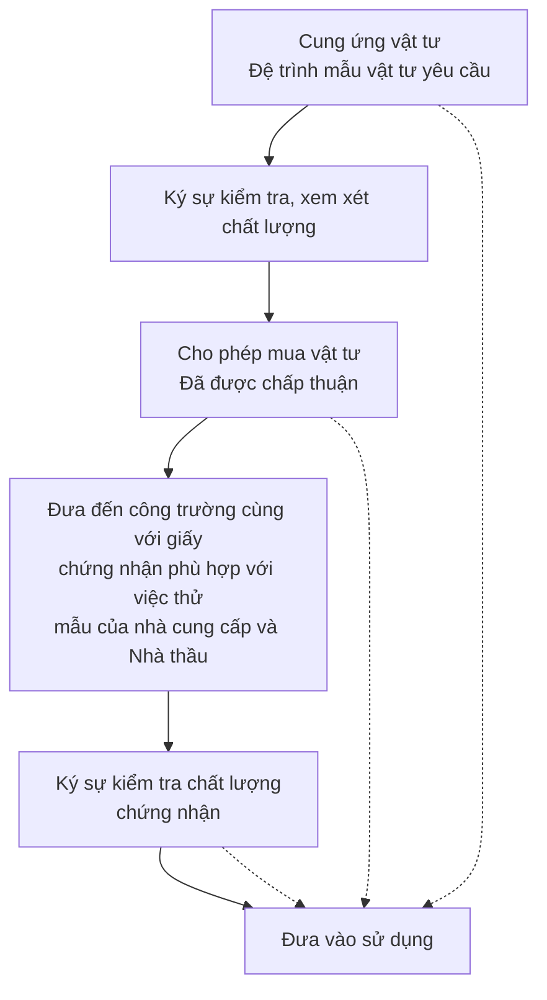

## III. BIỆN PHÁP ĐẢM BẢO CHẤT LƯỢNG CHO TỪNG CÔNG TÁC THI CÔNG.

**1. Công tác ván khuôn :**

*Chế tạo, gia công và lắp dựng:*

- Công tác cốp pha ván khuôn được thực hiện theo tiêu chuẩn TCVN 4453-1995, đảm bảo độ cứng, ổn định để tháo lắp, không gây khó khăn khi đặt cốt thép và đổ bê tông.. Ván

Gói thầu SPC-T3-PC-08: Cung cấp, xây dựng và lắp đặt vật tư, thiết bị trạm biến áp, đường dây


---


Dự án: TBA 110kV T3 và đường dây 110kV T3 – Trạm 220kV Tân Định, tỉnh Bình Dương

khuôn được làm để đạt được bê tông chính xác theo các bản vẽ thiết kế. Cốp pha được ghép kín, khít không làm mất nước xi măng khi đổ và đầm bê tông đồng thời bảo vệ bê tông mới đổ dưới tác động của thời tiết. Mặt trong của ván khuôn trước khi đặt thép được quét dầu chống dính.

- Hệ thống giáo đỡ chủ yếu dùng giáo chống kim loại kết hợp với cột chống thép và thanh kê gỗ, ván cốp pha thép kết hợp dùng cốp pha gỗ dày 3 cm trong một vài vị trí chèn cần thiết. Cốp pha và đà giáo được chế tạo trong xưởng và một phần tại hiện trường, gia công và lắp dựng đảm bảo đúng hình dáng và kích thước của kết cấu theo qui định của thiết kế.

- Sau khi lắp dựng kỹ sư thi công kiểm tra các yếu tố: Độ chính xác của ván khuôn so với thiết kế (cột, dầm, sàn, tường…), độ bền vững của nền, đà giáo chống đỡ và bản thân ván khuôn, độ khít của ván khuôn để không mất nước xi măng gây rỗ bê tông. Việc kiểm tra phải được tiến hành trong suốt quá trình thi công.

- Khi chế tạo ván khuôn cần tuân thủ chặt chẽ quy định sau:

+ Chế tạo đúng theo kích thước của các bộ phận kết cấu công trình

+ Bền, cứng, ổn định, không cong, vênh

+ Gọn, nhẹ, tiện dụng và dễ tháo lắp

+ Luân chuyển theo đúng số lần cho phép của quy phạm xây dựng, do đó khi dùng xong phải được cạo tẩy sạch sẽ

- Ván khuôn sau khi gia công đều được phân loại và bảo quản. Lắp dựng và tháo dỡ ván khuôn tuân theo kỹ thuật chỉ dẫn tháo lắp, đảm bảo an toàn. Ván khuôn sau khi tháo phải được nhổ đinh, vệ sinh và xếp vào nơi quy định. Ván khuôn phải được kiểm tra và nghiệm thu trước khi đổ bê tông để tránh sai sót có thể xảy ra sau này. Nội dung kiểm tra nghiệm thu gồm:

+ Kiểm tra tim, cốt, cao độ, vị trí của ván khuôn có sai lệch với thiết kế hay không.

+ Kiểm tra hình dáng, kích thước của ván khuôn

+ Kiểm tra độ bằng phẳng, các khe nối, khe hở giữa các tấm

+ Kiểm tra độ ổn định của ván khuôn, đà giáo và sàn công tác

+ Kiểm tra các giải pháp an toàn lao động, phòng chống cháy.

+ Trong khi đổ bê tông, luôn kiểm tra ván khuôn nếu ván khuôn bị chuyển dịch khi đổ bê tông thì toàn bộ bê tông sẽ bị loại bỏ và làm lại từ đầu.

* Tháo dỡ cốp pha, đà giáo :

- Ván khuôn được tháo dỡ tuần tự, không chấn động mạnh, không rung chuyển. Thời gian tháo dỡ ván khuôn theo tiêu chuẩn TCVN 4453 - 95. Tháo dỡ cốp pha, đà giáo khi bê tông đạt cường độ cần thiết theo qui phạm, không gây ứng suất đột ngột và va chạm mạnh làm hư hại đến kết cấu bê tông cốt thép.

- Riêng các kết cấu ô văng, công sơn, sê nô chỉ được tháo cột chống và cốp pha đáy khi cường độ bê tông đạt đủ mác thiết kế và đã có đối trọng chống lật.

## 2. Công tác cốt thép:

Gói thầu SPC-T3-PC-08: Cung cấp, xây dựng và lắp đặt vật tư, thiết bị trạm biến áp, đường dây


---


Dự án: TBA 110kV T3 và đường dây 110kV T3 – Trạm 220kV Tân Định, tỉnh Bình Dương

- Công tác cốt thép là một trong ba dây chuyền quan trọng của việc thi công bê tông cốt thép tại chỗ. Tất cả các loại thép khi đưa về công trình sẽ được phân loại và bảo quản tại kho có mái che để tránh han rỉ.

- Toàn bộ cốt thép dùng cho công trình được cung cấp bởi các Công ty theo đúng chỉ định của thiết kế, phù hợp với TCVN 1650-1985, TCVN 1651-2008.

- Trước khi đưa thép vào gia công, cán bộ kỹ thuật phải kiểm tra các loại thép đưa vào sử dụng, thép phải đảm bảo các yêu cầu về số chất lượng chủng loại, hình dáng kích thước theo thiết kế. Đối với thép nhập khẩu còn kèm theo mẫu thí nghiệm để kiểm tra. Trong quá trình thi công, nếu Chủ đầu tư yêu cầu sẽ thí nghiệm bổ sung các thử nghiệm cần thiết.

- Cốt thép trước khi gia công và trước khi đổ bê tông cần đảm bảo :

- Bề mặt sạch, không dính bùn đất, dầu mỡ, không có vảy sắt và các lớp rỉ

- Các thanh thép bị hẹp, bị giảm tiết diện không vượt quá giới hạn cho phép là 2% đường kính

- Cốt thép được kéo uốn và nắn thẳng trước khi gia công chi tiết

- Cốt thép được cắt, uốn phù hợp với hình dáng, kích thước hình học của thiết kế.

- Toàn bộ thép tròn được phân loại thành từng lô riêng biệt trong kho theo kích thước và chủng loại để dễ nhận biết và sử dụng, được đặt trên giá, cách mặt đất 45cm.

- Các mối hàn trong kết cấu liên kết phải đáp ứng các yêu cầu sau : Bề mặt nhẵn, không cháy, không đứt quãng, không thu hẹp cục bộ và không có bọt, đảm bảo chiều dài và chiều cao đường hàn theo yêu cầu của thiết kế.

- Việc nối buộc (nối chồng lên nhau) đối với các loại cốt thép được thực hiện theo quy định không nối ở các vị trí chịu lực lớn và chỗ uốn cong.

- Chiều dài nối buộc theo yêu cầu thiết kế.

- Khi nối buộc cốt thép ở vùng chịu kéo phải uốn móc đối với thép tròn trơn, cốt thép có gờ không uốn móc.

- Dây nối buộc dùng loại dây thép mềm có đường kính 1mm

- Trong mọi trường hợp, việc thay đổi chủng loại thép phải được sự đồng ý của thiết kế và Chủ đầu tư.

- Khi lắp dựng cốt thép phải tuân thủ các yêu cầu sau:

+ Các bộ phận lắp trước, không gây trở ngại cho các bộ phận lắp dựng sau

+ Ổn định vị trí cốt thép không để biến dạng trong quá trình đổ bê tông

+ Các con kê cần đặt tại các vị trí thích hợp tùy theo mật độ cốt thép nhưng không lớn hơn 1m một điểm kê. Con kê có chiều dày bằng lớp bê tông bảo vệ cốt thép và được làm bằng các loại vật liệu không ăn mòn cốt thép, không phá hủy bê tông.

- Khi nghiệm thu cốt thép phải có hồ sơ gồm:

+ Các bản vẽ thiết kế và kèm theo biên bản quyết định thay đổi cốt thép trong quá trình thi công.

+ Các kết quả kiểm tra mẫu thử về chất lượng thép, mối hàn và chất lượng gia công cốt thép.

## 3. Công tác bê tông:

Gói thầu SPC-T3-PC-08: Cung cấp, xây dựng và lắp đặt vật tư, thiết bị trạm biến áp, đường dây


---


Dự án: TBA 110kV T3 và đường dây 110kV T3 – Trạm 220kV Tân Định, tỉnh Bình Dương

**Vật liệu:**

- Vật liệu để sản xuất bê tông (xi măng, cát, đá dăm và nước) đảm bảo yêu cầu kỹ thuật theo các tiêu chuẩn hiện hành, đồng thời đáp ứng yêu cầu thiết kế.

- Cốt liệu không chứa thành phần bất lợi như rác, đất, các chất thải hữu cơ và đạt các yêu cầu về độ bền và chống cháy. Không sử dụng cát nghiền và xỉ lò nung trong bê tông. Cốt liệu thô cát, đá phải tuân thủ theo TCVN 7570 - 2006, TCVN 7572 - 2006, cát vàng, đá địa phương đảm bảo yêu cầu kĩ thuật.

**Chế tạo bê tông:**

- Trước khi thi công, bê tông được thiết kế và thí nghiệm cấp phối thành phần vật liệu cho 1m3 bê tông, sử dụng đúng vật liệu, kích cỡ cốt liệu, nguồn vật liệu, độ sụt của bê tông tương ứng với loại kết cấu có kể tới tổn thất độ sụt trong thời gian lưu giữ và vận chuyển bê tông.

- Xi măng, cát, đá dăm hoặc sỏi để chế tạo hỗn hợp bê tông được đong theo thể tích. Xi măng trộn theo bao có trọng lượng đóng gói của nhà sản xuất, phải định kỳ kiểm tra trọng lượng tĩnh của xi măng trong bao. Tỷ lệ nước tối ưu sẽ được xác định theo nguyên tắc ở trên. Do độ ẩm của cốt liệu thường xuyên thay đổi, lượng nước sẽ được điều chỉnh có tính đến độ ẩm này cũng như sự hút nước của cốt liệu.

**Vận chuyển và đầm bê tông:**

- Vận chuyển bê tông đến nơi đổ bằng phương tiện hợp lý, không để xảy ra phân tầng, chảy nước xi măng hoặc mất nước do nắng.

- Để đảm bảo không làm sai lệch vị trí cốt thép, vị trí cốp pha và chiều dầy lớp bảo vệ bê tông và để tránh phân tầng, chiều cao rơi tự do của hỗn hợp bê tông không vượt quá 1,5 m, nếu lớn hơn chiều cao đó phải dùng mái nghiêng hoặc vòi voi có thiết bị chấn động. Bê tông được đầm kỹ tới khi vữa xi măng nổi lên bề mặt và không còn bọt khí nữa. Bê tông sau khi đầm phải đảm bảo không rỗ.

**Bảo dưỡng bê tông:**

- Sau khi bê tông đổ xong, tiến hành bảo dưỡng bê tông theo quy phạm. Thời gian bảo dưỡng phụ thuộc vào thời tiết. Trong thời gian bảo dưỡng bê tông cần chống các tác động cơ học như rung động, lực xung kích, tải trọng và tác động khác có khả năng gây hư hại tới việc phát triển cường độ của bê tông. Biện pháp thường dùng là phủ và giữ ẩm bằng bao đay, liên tục trong 7 ngày và được tưới nước liên tục trong thời gian đó. Nếu các lỗ rỗng và lỗ hổng tổ ong thấm được trong bê tông sau khi tháo ván khuôn thì phải đục lỗ các phần rỗng sau đó chèn bằng hỗn hợp bê tông chất lượng dính bám cao hơn.

**Giám sát chất lượng bê tông:**

- Cốp pha, đà giáo phải đảm bảo bền vững, bê tông được tiến hành đổ theo từng lớp, bảo đảm đúng qui trình. Tại những vị trí dày đặc cốt thép mới được đầm bằng tay.

- Không để nước mưa rơi vào bê tông, không làm mất nước xi măng. Ngưng bê tông theo đúng điểm dừng và đúng thời gian qui định (mùa hè 60 phút, mùa đông 90 phút ). Quá thời gian trên, bề mặt bê tông được đánh nhám, tưới nước xi măng rồi mới tiến hành đổ bê tông mới để đảm bảo liên kết giữa bê tông cũ và bê tông mới.

**4. Công tác đào, đắp, lu nèn:**

Gói thầu SPC-T3-PC-08: Cung cấp, xây dựng và lắp đặt vật tư, thiết bị trạm biến áp, đường dây


---


Dự án: TBA 110kV T3 và đường dây 110kV T3 – Trạm 220kV Tân Định, tỉnh Bình Dương

- Sau khi hoàn thiện bề mặt của nền đào phải kiểm tra cao độ, tiến hành đo đạc theo lưới của bản vẽ thiết kế. Sai số phải nằm trong phạm vi cho phép, nền đào phải đạt được yêu cầu về kích thước hình học, cao độ và mặt cắt ngang đã chỉ ra trong bản vẽ thiết kế.

- Trong quá trình đào phải đảm bảo các mái đào tạm thời phải đảm bảo khả năng chống đỡ các máy móc, công trình gần đó.

- Trong khi thi công nếu gặp mạch nước ngầm hoặc trời mưa thì phải dùng máy bơm nước để đảm bảo bề mặt móng đào luôn được khô ráo, tránh hiện tượng nước bị ứ đọng làm ảnh hưởng đến chất lượng của nền móng và các công việc thi công tiếp theo.

- Trước khi đắp cát phải đảm bảo hố móng khô ráo, tuyệt đối không được đổ ào cát xuống vũng nước.

- Cứ mỗi lớp đắp phải kiểm tra cao độ một lần bằng máy thủy bình, độ chặt được kiểm tra với mật độ 20÷30 m³/1 điểm (lấy làm 2 lần rồi lấy trung bình).

- Việc đầm nén, lu nền chỉ được tiến hành khi độ ẩm của vật liệu nằm trong phạm vi cho phép so với độ ẩm tối ưu. Nếu vật liệu khô quá thì phải tưới nước còn ướt quá thì phải đem phơi nắng, ngoài ra gốc cây, cây cối, cỏ và các vật liệu không thích hợp khác không được để lại trong nền đất đắp.

- Công tác lu nèn phải đảm bảo được các công đoạn sau:

+ Lu, nèn sơ bộ ổn định lớp cát đắp sau khi đã được tưới nước đầy đủ, giai đoạn này chiếm khoảng 30% công lu yêu cầu. Dùng lu nhẹ 6÷8 tấn.

+ Lèn ép chặt nền đường giai đoạn này chiếm khoảng 70% công lu yêu cầu. Dùng lu rung ( tải trọng khi rung lên tới 25 tấn) cho đến khi đạt độ chặt thiết kế của nền .

+ Sau đó dùng lu sắt nhẵn 10÷12 tấn lèn ép mặt đường phẳng nhẵn, lu đi qua không hằn vết trên mặt đường và đạt độ cao yêu cầu.

**5. Công tác xây tường:**

*a. Chỉ tiêu về vật liệu:*

- Gạch xây phải đảm bảo có cường độ, kích thước, theo thiết kế.
- Các viên gạch sạch sẽ, có độ ẩm cần thiết.
- Vữa xây phải đảm bảo đúng mác (cấp phối).
- Ximăng đúng mác, ký hiệu.
- Cát xây đúng chủng loại, sạch, không lẫn mùn, đất, nước trộn vữa phải sạch.

*b. Chỉ tiêu chất lượng khối xây:*

- Khối xây phải đúng vị trí, hình dáng, kích thước theo thiết kế.
- Khối xây đặc chắc, mạch vữa đầy được miết gọn.
- Các lớp gạch thẳng hàng, ngang bằng.
- Khối xây thẳng đứng, phẳng mặt, không dính vữa bẩn.
- Góc cạnh khối xây đúng thiết kế.
- Trong khi xây, sau khi xây phải tưới nước giữ ẩm tường.
- Trong khối xây :

+ Với tường 100 phải có lưới thép liên kết.

+ Với tường 200 phải có các hàng gạch ngang liên kết.

Gói thầu SPC-T3-PC-08: Cung cấp, xây dựng và lắp đặt vật tư, thiết bị trạm biến áp, đường dây


---


Dự án: TBA 110kV T3 và đường dây 110kV T3 – Trạm 220kV Tân Định, tỉnh Bình Dương

+ Với vách bê tông phải có thép neo liên kết với tường gạch.

## 6. Công tác lắp dựng kết cấu thép, VTTB điện nhất thứ trong TBA.

- Vật tư phải được bảo quản tốt trong quá trình vận chuyển, bốc dỡ đảm bảo không bị vỡ do và đập và lau sạch sơn, xi măng cũng như bụi bẩn.

- Trước khi lắp dựng kết cấu thép phải soạn toàn bộ thanh cho từng đoạn, đảm bảo đủ số lượng, chủng loại theo bản vẽ lắp đặt, không cong vênh, hư hỏng trong quá trình vận chuyển.

- Sau khi lắp đặt xong phải bắt tiếp địa vào cột, trụ thép ngay để đảm bảo an toàn trong quá trình thi công.

- Lựa chọn, phân loại kẹp cực, phụ kiện đấu nối dây phải tiến hành từ kho trước khi chuyển ra công trường. Trước khi kẹp cực và phụ kiện phải kiểm tra, xem xét cẩn thận để lựa chọn chính xác. Kẹp cực phải kiểm tra đầy đủ phụ kiện và đồng độ với thiết bị đâu nối theo bản vẽ nhà cấp hàng trước khi lắp đặt.

- Đối với thiết bị điện nhất thứ trước khi lắp đặt cần kiểm tra và đồng bộ giữa bản vẽ thiết kế và bản vẽ của nhà cấp hàng. Cán bộ kỹ thuật B nghiên cứu bản vẽ hướng dẫn lắp đặt của Nhà cấp hàng sau đó hướng dẫn các đội thi công lắp đặt. Các thiết bị phức tạp sẽ được tiến hành lắp đặt trước, dụng cụ thi công phải được chấp thuận của chuyên gia nhà cấp hàng hoặc thiết bị do nhà cấp hàng cấp.

- Toàn bộ nhân lực tham gia thi công được đào tạo, hướng dẫn an toàn, đối với những công nhân trèo cao thì phải có chứng nhận trèo cao và không mắc những bệnh liên quan đến độ cao.

- Toàn bộ thiết bị kéo, căng dây, cẩu phải được nối đất có hiệu quả và thiết bị nối đất di động được lắp trên dây dẫn trần trước thiết bị căng dây.

## 8. Quy trình lập biện pháp thi công, thi công, kiểm tra nghiệm thu

### a. Yêu cầu chung:

- Tuân thủ theo quy định hiện hành.

- Khi nghiệm thu tại hiện trường phải có đầy đủ các hồ sơ sau:

+ Bản vẽ hoàn công của từng loại kết cấu và kích thước, hình dáng, vị trí của kết cấu, các chi tiết đặt sẵn, khe co giãn so với thiết kế, ghi rõ những thay đổi so với thiết kế.

+ Các bản vẽ thi công có đầy đủ các thay đổi trong quá trình xây lắp.

+ Các văn bản của Chủ đầu tư, tư vấn thiết kế, tư vấn giám sát cho phép thay đổi các chi tiết và các bộ phận trong thiết kế.

+ Các kết quả kiểm tra cường độ bê tông trên các mẫu thử và các kết quả kiểm tra chất lượng các loại vật liệu khác nếu có.

+ Các biên bản nghiệm thu cốt thép, cốp pha trước khi đổ bê tông.

+ Các biên bản nghiệm thu phần đã thi công trước đó.

+ Các biên bản nghiệm thu trung gian của các bộ phận kết cấu.

+ Sổ nhật ký thi công.

+ Kích thước và cao độ các kết cấu thực tế phải nhỏ hơn dung sai cho phép đã được quy định trong TCVN.

### b. Nghiệm thu công việc xây dựng:

Gói thầu SPC-T3-PC-08: Cung cấp, xây dựng và lắp đặt vật tư, thiết bị trạm biến áp, đường dây


---


Dự án: TBA 110kV T3 và đường dây 110kV T3 – Trạm 220kV Tân Định, tỉnh Bình Dương

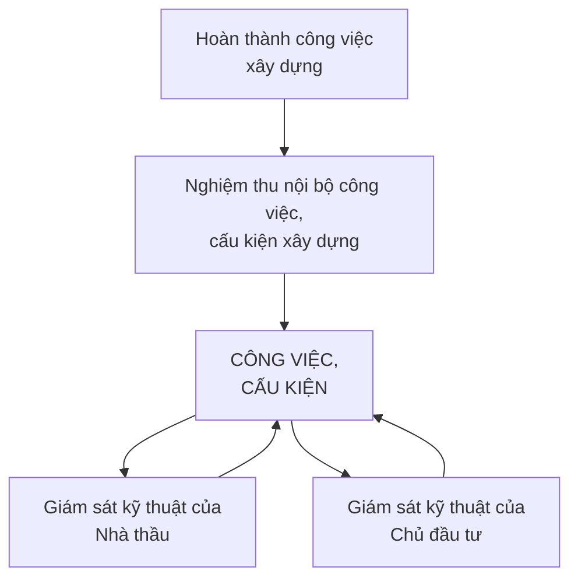

- Sau khi thi công hoàn thành công việc, cấu kiện xây dựng, Nhà thầu tiến hành nghiệm thu nội bộ trước khi đề nghị Chủ đầu tư nghiệm thu công việc xây dựng.

**b.1. Nghiệm thu nội bộ:**

- *Đối tượng nghiệm thu:*

- Các công việc xây dựng cần nghiệm thu như: cốp pha, cốt thép.

- *Thành phần tham gia nghiệm thu:*

- Kỹ sư trưởng hoặc đội trưởng (chủ trì nghiệm thu).

- Cán bộ kỹ thuật trực tiếp phụ trách thi công.

- Tổ trưởng tổ công nhân chịu trách nhiệm trực tiếp thi công.

- Đại diện của phòng kỹ thuật.

- *Nội dung nghiệm thu nội bộ:*

+ Kiểm tra các công việc cần nghiệm thu có đạt yêu cầu về chất lượng theo thiết kế kỹ thuật thi công và các tiêu chuẩn, quy phạm của Việt Nam, các tiêu chuẩn chuyên ngành; kiểm tra chứng chỉ, xuất xứ vật tư, các biên bản lấy mẫu vật tư, kết quả thí nghiệm mẫu vật tư, nhật ký thi công, ...

+ Trường hợp công việc, cấu kiện xây dựng không đạt yêu cầu, kỹ sư trưởng yêu cầu cán bộ kỹ thuật và tổ trưởng công nhân trực tiếp phụ trách sửa chữa phần công việc đó cho đến khi đạt các yêu cầu về chất lượng như thiết kế đề ra.

+ Trường hợp đạt yêu cầu thì tiến hành lập biên bản nghiệm thu nội bộ theo phụ lục - và lập phiếu đề nghị Chủ đầu tư tiến hành nghiệm thu chính thức.

Gói thầu SPC-T3-PC-08: Cung cấp, xây dựng và lắp đặt vật tư, thiết bị trạm biến áp, đường dây


---


Dự án: TBA 110kV T3 và đường dây 110kV T3 – Trạm 220kV Tân Định, tỉnh Bình Dương

**b.2. Nghiệm thu hoàn thành hạng mục công trình xây dựng, giai đoạn thi công xây dựng:**

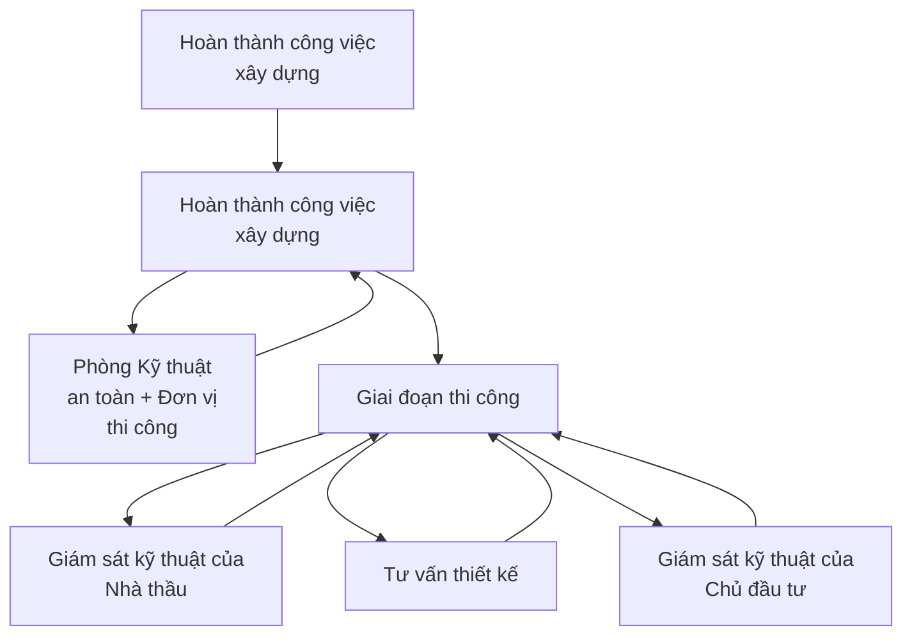

Sau khi thi công hoàn thành bộ phận công trình xây dựng, giai đoạn thi công xây dựng, cần phải tiến hành nghiệm thu nội bộ trước khi đề nghị Chủ đầu tư nghiệm thu hoàn thành bộ phận công trình xây dựng, giai đoạn thi công xây dựng.

**b.2.1. Nghiệm thu nội bộ:**

*- Đối tượng nghiệm thu:*

- Bộ phận công trình xây dựng, giai đoạn thi công xây dựng cần nghiệm thu như: hoàn thành phần móng, phần thô công trình,

*- Thành phần tham gia nghiệm thu:*

- Kỹ sư trưởng hoặc đội trưởng (chủ trì nghiệm thu).

- Cán bộ kỹ thuật trực tiếp phụ trách thi công.

- Tổ trưởng tổ công nhân chịu trách nhiệm trực tiếp thi công.

- Đại diện của phòng kỹ thuật.

*- Nội dung nghiệm thu nội bộ:*

+ Kiểm tra tổng thể bộ phận công trình, giai đoạn thi công cần nghiệm thu có đạt yêu cầu về chất lượng theo thiết kế kỹ thuật thi công và các tiêu chuẩn, quy phạm của Việt Nam,

Gói thầu SPC-T3-PC-08: Cung cấp, xây dựng và lắp đặt vật tư, thiết bị trạm biến áp, đường dây


---


Dự án: TBA 110kV T3 và đường dây 110kV T3 – Trạm 220kV Tân Định, tỉnh Bình Dương

các tiêu chuẩn chuyên ngành; kiểm tra về hồ sơ pháp lý như: các biên bản nghiệm thu công việc, cấu kiện; các chứng chỉ, xuất xứ vật tư, biên bản lấy mẫu, kết quả thí nghiệm vật tư, nhật ký thi công... và các hồ sơ liên quan khác thuộc bộ phận công trình, giai đoạn thi công cần nghiệm thu.

+ Trường hợp bộ phận công trình, giai đoạn xây dựng không đạt yêu cầu, chỉ huy trưởng yêu cầu cán bộ kỹ thuật và tổ trưởng công nhân trực tiếp phụ trách sửa chữa phần công việc đó cho đến khi đạt các yêu cầu về chất lượng như thiết kế đề ra.

+ Trường hợp đạt yêu cầu thì tiến hành lập biên bản nghiệm thu nội bộ theo phụ lục - và lập phiếu đề nghị Chủ đầu tư tiến hành nghiệm thu chính thức.

**b.2.2. Nghiệm thu hoàn thành hạng mục công trình hoặc công trình đưa vào sử dụng.**

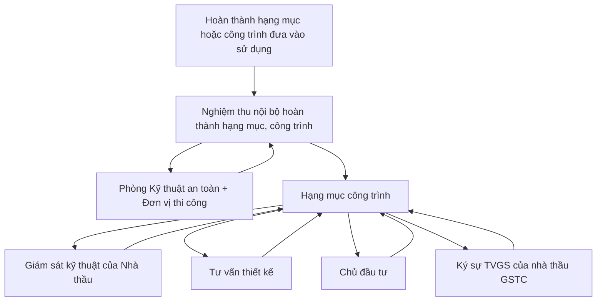

- Sau khi thi công hoàn thành hạng mục công trình hoặc công trình, cần phải tiến hành nghiệm thu nội bộ trước khi đề nghị Chủ đầu tư nghiệm thu hoàn thành hạng mục công trình hoặc công trình.

**b.2.3. Nghiệm thu nội bộ:**

- *Đối tượng nghiệm thu:* Toàn bộ hạng mục công trình hoặc công trình cần nghiệm thu.

- *Thành phần tham gia nghiệm thu:*

Gói thầu SPC-T3-PC-08: Cung cấp, xây dựng và lắp đặt vật tư, thiết bị trạm biến áp, đường dây


---


Dự án: TBA 110kV T3 và đường dây 110kV T3 – Trạm 220kV Tân Định, tỉnh Bình Dương

- Kỹ sư trưởng hoặc đội trưởng (chủ trì nghiệm thu).
- Cán bộ kỹ thuật trực tiếp phụ trách thi công.
- Tổ trưởng tổ công nhân chịu trách nhiệm trực tiếp thi công.
- Đại diện của phòng kỹ thuật.
- *Nội dung nghiệm thu nội bộ:*

+ Kiểm tra tổng thể toàn bộ hạng mục công trình hoặc công trình cần nghiệm thu có đạt yêu cầu về chất lượng theo thiết kế kỹ thuật thi công và các tiêu chuẩn, quy phạm của Việt Nam, các tiêu chuẩn chuyên ngành; kiểm tra về hồ sơ pháp lý như: các biên bản nghiệm thu công việc, cấu kiện; các chứng chỉ, xuất xứ vật tư, biên bản lấy mẫu, kết quả thí nghiệm vật tư, nhật ký thi công, … và các hồ sơ liên quan khác thuộc hạng mục công trình hoặc công trình cần nghiệm thu.

+ Trường hợp bộ phận công trình, giai đoạn xây dựng không đạt yêu cầu, chỉ huy trưởng yêu cầu cán bộ kỹ thuật và tổ trưởng công nhân trực tiếp phụ trách sửa chữa phần công việc đó cho đến khi đạt các yêu cầu về chất lượng như thiết kế đề ra.

+ Trường hợp đạt yêu cầu thì tiến hành lập biên bản nghiệm thu nội bộ theo phụ lục và lập phiếu đề nghị Chủ đầu tư tiến hành nghiệm thu chính thức.

## IV. BIỆN PHÁP BẢO QUẢN VẬT LIỆU, CÔNG TRÌNH KHI DỪNG THI CÔNG, KHI MƯA BÃO:

### 1. Giải pháp tổng thể:

- Nhà thầu thành lập ban phòng chống lụt bão của công trường, thường xuyên theo dõi, cập nhật tình hình thời tiết tại khu vực thi công. Luôn giữ liên lạc với bộ phận theo dõi thời tiết của địa phương để có những thông tin mới nhất cũng như theo sát sự chỉ đạo chung về công tác phòng chống lụt bão của khu vực thi công.

- Nhà thầu tiến hành các phương án hút nước cho toàn bộ mặt bằng công trường, để đảm bảo vẫn thi công được bình thường.

- Khi có bão xảy ra tổ chức phân công người trực ứng cứu 24h/24h và liên lạc báo cáo thường xuyên với ban phòng chống lụt bão tại công trường, khi gặp gió bão lớn hơn cấp 6 thì sẽ ngừng thi công.

- Khi có dự báo bão lớn xuất hiện, Nhà thầu khẩn trương tập kết các thiết bị thi công đến khu vực tập kết an toàn. Kê cao tránh ngập nước, neo chằng cố định và che chắn an toàn. Nhà cửa, lán trại, thiết bị thi công khác được neo chằng chắc chắn đảm bảo không hư hại hoặc bị lật đổ khi có bão lớn xảy ra.

- Phối hợp với chính quyền và nhân dân địa phương, bàn bạc thống nhất phương án, biện pháp chống bão lũ khi sảy ra.

- Luôn chuẩn bị các phương tiện như xe ô tô trực để vận chuyển khi cần thiết. Luôn chuẩn bị sẵn các vật liệu phòng chống lũ để dùng khi cần thiết như đá hộc, cọc tre, rong tre, phên nứa, lốp cao su v.v...

- Chủ động dự trữ lương thực, thực phẩm, chăn màn, quần áo, thuốc men và đồ dùng cá nhân v.v...

- Toàn bộ nước ngập úng sẽ được bơm vào hệ thống thoát nước chung của khu vực.

- Nhà thầu chuẩn bị các dụng cụ che chắn để phòng đang thi công bê tông gặp mưa.

### 2. Giải pháp bảo quản chi tiết đối với từng loại VTTB.

Gói thầu SPC-T3-PC-08: Cung cấp, xây dựng và lắp đặt vật tư, thiết bị trạm biến áp, đường dây


---


Dự án: TBA 110kV T3 và đường dây 110kV T3 – Trạm 220kV Tân Định, tỉnh Bình Dương

* Các VTTB điện:

- Ngay sau khi vận chuyển VTTB về công trình được bố trí đặt khu vực riêng có địa hình bằng phẳng và cao ráo, đồng thời xung quanh được tạo mương thoát nước nối vào hệ thống thoát nước chung của khu vực.

- Bố trí các tấm bạt lớn che phủ các kiện VTTB khi trời nắng gắt và mưa. Khi thời tiết không mưa ít nắng, các tấm bạt mới được mở ra tại chỗ để thoát ẩm cho các kiện VTTB. Tất cả bạt che là loại bạt có khuy kèm dây và cọc cố định đảm bảo chống gió lốc.

* Các vật tư, vật liệu xây dựng.

- Đối với xi măng, sắt thép được nhà thầu chứa trong kho kín có kết cấu bằng khung thép có mái và tường bằng tôn đảm bảo chịu gió và mưa lớn. Xung quanh kho có kết cấu rãnh thoát nước vào hệ thống thoát nước chung. Tất cả các vật tư này được cung ứng theo kế hoạch thi công, đảm bảo đáp ứng tiến độ và không tồn kho quá nhiều trong thời gian dài.

- Đối với các kết cấu thép mạ kẽm, hạng mục này do Nhà thầu cung cấp, vì vậy căn cứ vào tiến độ Nhà thầu chuyển vào công trường trước thời điểm thi công 15 ngày để hạn chế lưu kho lâu ngày. Khi các kết cấu thép tập kết tại công trường được tập kết theo từng kiện thanh có khung giá đỡ bằng gỗ có chân kê cách mặt đất, đặt tại vị trí cao ráo và bằng phẳng, xung quanh có rãnh thu và thoát nước. Được bố trí phủ bạt thường xuyên khi thời tiết nắng nhiệt độ cao và khi có mưa đảm bảo thoát nước (Tất cả bạt che là loại bạt có khuy kèm dây và cọc cố định đảm bảo chống gió lốc).

- Đối với các vật tư xây dựng nội thất (gạch lát nền, vật liệu điện nước dân dụng), điện chiếu sáng, PCCC … căn cứ vào tiến độ Nhà thầu chuyển vào công trường khi thực hiện xây dựng xong phần thô các nhà chức năng (nhà điều khiển, nhà bơm …) và tận dụng các nhà chức năng làm kho tạm đặt các VTTB này đảm bảo an toàn khi có điều kiện thời tiết bất lợi. Các VTTB được luân chuyển giữa các khu vực trong nhà không gây ảnh hưởng đến quá trình hoàn thiện nhà.

* Toàn bộ hệ thống rãnh mương thoát nước khu để VTTB được bố trí từ 4-5 hố thu + máy bơm xăng thường xuyên túc trực sẵn sàng bơm nước khi thời tiết mưa lớn thoát không nước kịp hoặc ngập úng cục bộ.

**V. BIỆN PHÁP SỬA CHỮA HƯ HỎNG.** (Thực hiện tương tự theo trình bày tại Chương XI)

**VI. QUẢN LÝ TÀI LIỆU, HỒ SƠ, BẢN VẼ HOÀN CÔNG, HỒ SƠ NGHIỆM THU THANH QUYẾT TOÁN.**

- Nhà thầu bố trí 01 người làm công tác tổ chức hành chính, chịu trách nhiệm lưu giữ đầy đủ tại công trường các tài liệu sau:

+ Công văn A-B.

+ Hồ sơ bản vẽ thiết kế công trình được duyệt.

+ Các quy chuẩn xây dựng, tiêu chuẩn kỹ thuật xây dựng của nhà nước và ngành xây dựng.

+ Các quy định và chỉ dẫn kỹ thuật của nhà sản xuất về cách bảo quản sử dụng vật liệu.

+ Các kết quản kiểm tra, thí nghiệm khối lượng và chất lượng vật liệu, thiết bị được thực hiện trong suốt quá trình xây dựng.

+ Biên bản nghiệm thu công việc , hạng mục, giai đoạn thi công xây dựng v.v. Các đợt nghiệm thu thanh quyết toán công trình.

Gói thầu SPC-T3-PC-08: Cung cấp, xây dựng và lắp đặt vật tư, thiết bị trạm biến áp, đường dây


---


Dự án: TBA 110kV T3 và đường dây 110kV T3 – Trạm 220kV Tân Định, tỉnh Bình Dương

- Trong quá trình thi công, Nhà thầu sẽ thực hiện hồ sơ hoàn công công trình của các hạng mục công trình đã thi công.

- Hồ sơ hoàn công toàn bộ công trình được lập và trình cho hội đồng nghiệm thu công trình xem xét.

- Hồ sơ hoàn công được lập theo nội dụng và số lượng quy định của nhà nước gồm :

+ Mặt bằng định vị của hạng mục công trình đã thi công thực tế.

+ Chỉ số lún công trình theo từng giai đoạn.

+ Các số liệu, biên bản nghiệm thu bê tông, cốt thép, gạch...

+ Biên bản nghiệm thu các công việc trong quá trình thi công.

+ Sổ nhật ký thi công.

- Toàn bộ hồ sơ tài liệu được đóng cặp ngăn file chi tiết đảm bảo đầy đủ các thủ tục cần thiết phục vụ cho công tác thi công.

Gói thầu SPC-T3-PC-08: Cung cấp, xây dựng và lắp đặt vật tư, thiết bị trạm biến áp, đường dây


---


Dự án: TBA 110kV T3 và đường dây 110kV T3 – Trạm 220kV Tân Định, tỉnh Bình Dương

# CHƯƠNG X

# VỆ SINH MÔI TRƯỜNG, AN TOÀN LAO ĐỘNG, PHÒNG CHÁY CHỮA CHÁY.

## I. BIỆN PHÁP GIẢM THIỂU, BẢO VỆ MÔI TRƯỜNG.

### 1. Biện pháp giảm thiểu tiếng ồn và độ rung

- Làm giảm tiếng ồn phát ra từ máy móc, động cơ bằng cách điều chỉnh lực cân bằng của máy để giảm lực quán tính gây ra tiếng ồn; ở các máy rung động bề mặt có thể bao phủ máy bằng các loại vật liệu làm giảm rung động như tấm dạ tẩm bi tum, cao su, chất dẻo.

- Chỉ sử dụng những máy móc thiết bị xây dựng có độ ồn nằm trong tiêu chuẩn cho phép. Nhắc nhở, khuyến khích tài xế không lạm dụng còi xe ô tô.

- Dùng dụng cụ bảo hộ lao động cá nhân để bảo vệ người lao động khi có tiếng ồn và rung động như: dùng bông băng, các nút bằng chất dẻo bịt kín lỗ tai để giảm tiếng ồn; dùng các loại giầy chống rung có đế bằng cao su hoặc ủng cao su; dùng găng tay đặc biệt có lớp lót ở lòng bàn tay bằng cao su xốp và dầy khi cầm các máy đầm hoặc máy khoan.

- Hạn chế thực hiện thi công về ban đêm. Trong trường hợp đặc biệt phải tiến hành thi một số hoạt động về đêm khi được cộng đồng cho phép, đồng thời phải thông báo cho cộng đồng trước khi tiến hành thi công vào ban đêm.

- Không cho phép tiến hành làm ca đêm ở những vùng nhạy cảm như bệnh viện, khu đông dân cư, lán trại trẻ em, người già.

### 2. Biện pháp giảm thiểu ô nhiễm không khí (bụi, khói)

- Bố trí những bãi vật liệu rời như cát, đá, máy trộn vữa... ở xa những chỗ làm việc khác và ở cuối hướng gió chủ đạo. Có những tấm chắn nguyên vật liệu tại hiện trường trong các trường hợp có gió mạnh.

- Thường xuyên phun nước tưới ẩm các vật liệu trong quá trình thi công sẽ phát sinh nhiều bụi như: tưới cát khi vận chuyển, phun nước khi dỡ lán trại...

- Ở những đoạn đường gần khu vực công trường, có thể phun nước vào những ngày khô nắng hoặc định kỳ làm vệ sinh đường nếu do quá trình sản xuất của công trường gây ra bẩn.

- Các xe máy, phương tiện chuyên chở nguyên vật liệu ra vào công trường phải che bạt cẩn thận, không làm bụi bẩn đường, phố hoặc khu vực ngoài công trường. Xe chở rác thải, lớp bóc thực vật phải chở bằng xe ben, hoặc các thùng chứa được che kín bằng vải bạt.

- Công nhân tham gia làm việc trên công trường phải dùng các dụng cụ bảo hộ lao động như quần áo, mũ, ở những nơi đặc biệt nhiều bụi cần dùng khẩu trang, kính, mặt nạ... để chống bụi.

- Hạn chế tối đa việc sử dụng máy phát điện diesel.

### 3. Kiểm soát nước thải

- Thiết kế hệ thống ống, rãnh thu nước mặt một cách hợp lý trong khu vực thi công, bãi tập kết vật tư, vật liệu, bãi trộn bê tông để tránh xói mòn đất.

- Xây dựng hệ thống xử lý nước thải hợp lý tại các khu lán trại của công nhân

- Việc san lấp mặt bằng, đào đất cần được thi công trong thời gian ngắn nhất, tránh không thực hiện vào mùa mưa.

- Đất dư thừa sau khi đào bới phải được vận chuyển đến địa điểm thích hợp và được cho phép của các cơ quan chức năng.

Gói thầu SPC-T3-PC-08: Cung cấp, xây dựng và lắp đặt vật tư, thiết bị trạm biến áp, đường dây


---


Gói thầu SPC-T3-PC-08: Cung cấp, xây dựng và lắp đặt vật tư, thiết bị trạm biến áp, đường dây

- Vật liệu xây dựng cần được lưu trữ tại các kho có mái che, che chắn hoặc cô lập các đống vật liệu rời tạo đường thoát nước xung quanh các đống vật liệu này sao cho vật liệu rời không thể đi vào dòng chảy tới nguồn nước.

## 4. Kiểm soát rò rỉ dầu, mỡ hóa chất.

- Xe máy thi công được kiểm tra bảo dưỡng định kỳ tại các trung tâm bảo dưỡng.

- Các xe máy hư hỏng trong thi công được tập kết về nơi sửa chữa, tránh sửa chữa tại chỗ.

- Dầu, mỡ máy rò rỉ trong quá trình máy móc vận hành được vệ sinh sạch sẽ, chất thải được tập kết đưa về nơi xử lý.

- Các phụ gia bê tông, sơn, dung môi, dầu mỡ cách điện, dầu máy MBA thừa hoặc rơi vãi được khoanh vùng và thu dọn theo từng loại và tập kết phân loại xử lý.

## 5. Kiểm soát rác thải sinh hoạt, vệ sinh:

- Các chất thải rắn phải được đổ đến các bãi vệ sinh quy định. Có thể hợp đồng với các cơ quan vệ sinh môi trường của địa phương để thu dọn các chất thải rắn hoặc đào hố chôn rác sinh hoạt trong trường hợp chưa có dịnh vụ thu gom rác.

- Sử dụng nhà vệ sinh lưu động hoặc đào hố vệ sinh cho các khu lán trại của công nhân xây dựng tại công trường.

- Phải luôn giữ vệ sinh sạch sẽ trong và xung quanh khu vực lán trại. Đảm bảo rằng rác thải từ lán trại công nhân không gây mất vệ sinh tại khu vực.

- Các vật dư thừa sau thi công như đất, cát, đá phải dọn và chuyển đi. Bảo đảm hoàn trả lại công trình sạch sẽ trước khi nghiệm thu.

- Nhà thầu cam kết sẽ dọn dẹp công trường và vận chuyển chất thải rắn đến đúng nơi quy định.

## 6. Biện pháp giảm thiểu ảnh hưởng đến giao thông địa phương

- Khi làm việc trong công trường ở những vị trí gần đường giao thông hay gần nơi vận chuyển đi lại của xe máy thi công của những hạng mục công trình khác phải có biển báo công trường.

- Không cho xe máy và thiết bị đỗ trên đường, khi hết ca làm việc phải tập kết vào bãi đỗ quy định. Bố trí công nhân hướng dẫn giao thông mỗi khi có xe tạm dừng trên đường để xếp, dỡ vật tư, thiết bị.

- Tại các khu vực kéo dây vượt đường giao thông phải dựng giàn giáo để không gây cản trở trên đường. Phối hợp với chính quyền địa phương để sắp xếp giao thông trong trường hợp cần thiết.

- Bố trí xe chở nguyên vật liệu hợp lý với sức chịu đựng của hệ thống đường giao thông địa phương, tránh gây sạt lở, hư hỏng và ảnh hưởng đến giao thông tại địa phương.

## 7. Kế hoạch quản lý môi trường

### 7.1. Kế hoạch giảm thiểu tác động tiêu cực đến môi trường

- Nhà thầu thực hiện các biện pháp bảo vệ môi trường cho người lao động trên công trường và bảo vệ môi trường xung quanh, bao gồm các biện pháp chống bụi, chống ồn, xử lý phế thải và thu dọn hiện trường.

- Trong quá trình vận chuyển vật liệu xây dựng, phế thải phải có biện pháp che chắn bảo đảm an toàn, vệ sinh môi trường.

---


Dự án: TBA 110kV T3 và đường dây 110kV T3 – Trạm 220kV Tân Định, tỉnh Bình Dương

Nhằm tuân thủ các quy định về đảm bảo đạt tiêu chuẩn môi trường cho công trình xây dựng. Nhà thầu sẽ thực hiện các công tác sau đây:

| Vấn đề                                                                                           | Biện pháp giảm nhẹ                                                                                                                                                                                                                                                                                                                                                                                                                                                                       |
| ------------------------------------------------------------------------------------------------ | ---------------------------------------------------------------------------------------------------------------------------------------------------------------------------------------------------------------------------------------------------------------------------------------------------------------------------------------------------------------------------------------------------------------------------------------------------------------------------------------- |
| Hạn chế ảnh hưởng sinh cảnh và thảm thực vật do giải phóng mặt bằng                              | - Dùng phương pháp thủ công để phát quang cây cỏ.<br/>- Hạn chế chặt bỏ cây không cần thiết ngoài khu vực xây dựng dự án.<br/>- Tập trung rác do phát quang vào nơi quy định                                                                                                                                                                                                                                                                                                             |
| Hạn chế ảnh hưởng đến dân cư do GPMB                                                             | - Chọn thời điểm thi công thích hợp để hạn chế ảnh hưởng đến thu hoạch của người dân.<br/>- Có các khoản hỗ trợ giúp ổn định cuộc sống sản xuaatss cho người dân.                                                                                                                                                                                                                                                                                                                        |
| Ảnh hưởng đến chất lượng không khí từ khí thải của xe cộ và máy móc trong các hoạt động xây dựng | - Bảo đảm rằng tất cả các máy móc có sử dụng máy móc tốt, có giấy phép hoạt động hợp lệ trong suốt thời gian thực hiện dự án.<br/>- Bảo đảm che phủ tất cả các xe tải chuyên chở các vật liệu gây bụi tới/từ khu vực dự án.<br/>- Tưới nước tại khu vực có nhiều bụi (khu xây dựng, đường xá v.v...) trong điều kiện thời tiết nóng, khô, gió.<br/>- Tránh việc đốt các cây cỏ được phát quang.                                                                                          |
| Tiếng ồn do xe cộ và máy móc gây ra                                                              | - Tất cả các hoạt động xây dựng được tiến hành vào ban ngày. Nếu cần xây dựng vào buổi tối thì phải thông báo trước và có sự đồng ý của người dân địa phương.<br/>- Sử dụng các phương pháp và thiết bị phát ra tiếng ồn nhỏ, độ rung thấp.<br/>- Xe cộ vận chuyển phải đảm bảo độ ồn.                                                                                                                                                                                                   |
| Ô nhiễm đất, không khí và nước do sử dụng dầu mỡ, hóa chất từ các máy móc, thiết bị thi công     | - Thường xuyên kiểm tra các phương tiện vận tải, máy móc thi công để kịp thời phát hiện các hiện tượng rò rỉ dầu nếu có.<br/>- Trong trường hợp xảy ra rò rỉ dầu thì nhanh chóng cô lập và xử lý nơi xảy ra rò rỏ, tránh để dầu rò rỉ lan truyền làm ô nhiễm đến các khu vực xung quanh.<br/>- Không cho phép vệ sinh phương tiện vận chuyển, máy móc bằng nước ở khu vực thi công.<br/>- Các vật dụng dụng cụ, giẻ lau bị nhiễm dầu mỡ phải để riêng và tập trung tại khu vực quy định. |
| Ảnh hưởng từ lán trại xây dựng                                                                   | - Xung quanh khu vực lán trại phải có hàng rào bảo vệ giới hạn với khu vực bên ngoài và hạn chế thâm nhập của                                                                                                                                                                                                                                                                                                                                                                            |


Gói thầu SPC-T3-PC-08: Cung cấp, xây dựng và lắp đặt vật tư, thiết bị trạm biến áp, đường dây


---


Dự án: TBA 110kV T3 và đường dây 110kV T3 – Trạm 220kV Tân Định, tỉnh Bình Dương

| | người và gia súc để giảm thiểu tai nạn.<br>- Cất giữ vật liệu cẩn thận, đặc biệt là vật liệu dễ cháy. Thu gom các vật liệu thừa sau khi đã thực hiện xong dự án.<br>- Tránh chiếm dụng đất để làm lán trại.<br>- Thường xuyên kiểm tra vệ sinh khu vực trại để tránh bệnh tật cho công nhân.<br>- Đảm bảo phương tiện ứng cứu sự cố, cấp cứu kịp thời. |
| Nguy cơ cháy nổ | - Nghiêm cấm công nhân hút thuốc nấu nướng tại các khu vực có nguy cơ cháy nổ.<br>- Tuân thủ nghiêm túc quy định PCCC.<br>- Trang bị đầy đủ thiết bị PCCC.<br>- Thường xuyên kiểm tra nhắc nhở việc PCCC. |
| Thay đổi mục đích sử dụng đất ảnh hưởng đến người dân do thi công dự án | - Tuân thủ các quy định chính sách đền bù tái định cư.<br>- Khi thi công cần hạn chế thiệt hại mùa màng, tài sản, hoa màu, nhà cửa của dân khi dự án đi qua khu dân cư.<br>- Chọn thời điểm thi công hợp lý. |
| Chất thải | - Đối với chất thải xây dựng cần phải bố trí khu vực riêng biệt để làm nơi thải bỏ rác xây dựng và phải được thu gom sau khi kết thúc xây dựng.<br>- Nước thải, chất thải sinh hoạt của công nhân xây dựng phải được xử lý bằng bể tự hoại trước khi thải ra môi trường.<br>- Các loại chất thải rắn sinh hoạt khác phải được thu gom và tập trung thải bỏ tại nơi quy định. |
| Bùn cát do nạo vét | - Sử dụng để san lấp mặt bằng trại hoặc sử lý theo đúng quy định |

## 7.2. Kế hoạch quan trắc

| Vấn đề môi trường | Biến số nào được quan trắc | Biến số được quan trắc ở đâu | Biến số được quan trắc như thế nào/loại thiết bị quan trắc | Biến số được quan trắc khi nào - mức độ thường xuyên của biến số được quan trắc hoặc quan trắc liên tục |
| ----------------- | -------------------------- | ---------------------------- | ---------------------------------------------------------- | ------------------------------------------------------------------------------------------------------- |
| Giải phóng        | Khối lượng cây cối chặt bỏ | Trên đường đi                | Quan sát                                                   | Một lần/tháng trong suốt thời                                                                           |


Gói thầu SPC-T3-PC-08: Cung cấp, xây dựng và lắp đặt vật tư, thiết bị trạm biến áp, đường dây


---


Dự án: TBA 110kV T3 và đường dây 110kV T3 – Trạm 220kV Tân Định, tỉnh Bình Dương

| mặt bàng                                           | Kỹ thuật phát quang<br/>Xử lý cây cỏ sau khi phát quang                                                                                                                        | Vị trí trạm<br/>Tại điểm xử lý                                          |          | gian thi công                                                                        |
| -------------------------------------------------- | ------------------------------------------------------------------------------------------------------------------------------------------------------------------------------ | ----------------------------------------------------------------------- | -------- | ------------------------------------------------------------------------------------ |
| Rửa trôi, bồi lắng và xói mòn đất                  | Tình trạng xói mòn đất bề mặt<br/>Mức độ gia tăng đô đục của nước                                                                                                              | Tại địa điểm thi công                                                   | Quan sát | Hai lần/tháng trong mùa mưa                                                          |
| Ô nhiễm không khí                                  | Kiểm tra biện pháp che phủ phù hợp cho phương tiện vận tải<br/>Phun nước giảm bụi vào mùa khô trên các đường đất.                                                              | Khu vực thi công và dọc theo các tuyến đường vận chuyển có đông dân cư. | Quan sát | Trước khi cho phép thiết bị được sử dụng trên thực địa<br/>Trong mùa khô và gió mạnh |
| Tiếng ồn                                           | Mức độ tiếng ồn                                                                                                                                                                | Cách thiết bị gây ồn 15m. Tại vị trí xảy ra khiếu nại                   | Cảm quan | Định kỳ 6 tháng và khi có khiếu nại                                                  |
| Đường tạm thời                                     | Mức độ sử dụng đường hiện tại<br/>Tác động từ việc sử dụng đất đai                                                                                                             | Dọc đường đi                                                            | Quan sát | 1 lần/tháng trong suốt giai đoạn xây dựng                                            |
| Cháy nổ                                            | Tình trạng tuân thủ các qui định PCCC                                                                                                                                          | Tại công trường và khu vực trại xây dựng                                | Quan sát | trong suốt giai đoạn xây dựng                                                        |
| Anh hưởng an toàn và sức khoẻ từ các trại xây dựng | Tình trạng vệ sinh, an toàn tại khu vực trại xây dựng<br/>Trang thiết bị ứng phó các sự cố khẩn cấp<br/>Mức độ xảy ra xung đột giữa công nhân xây dựng và người dân địa phương | Tại công trường, lán trại tạm                                           | Quan sát | 1 lần/tháng trong suốt giai đoạn xây dựng                                            |
| Các loại chất thải phát sinh                       | Biện pháp và hệ thống thu gom và xử lý chất thải.                                                                                                                              | Tại công trường, lán trại tạm                                           | Quan sát | Định kỳ 1 lần/tháng trong suốt thời gian thi công                                    |


Gói thầu SPC-T3-PC-08: Cung cấp, xây dựng và lắp đặt vật tư, thiết bị trạm biến áp, đường dây


---


Dự án: TBA 110kV T3 và đường dây 110kV T3 – Trạm 220kV Tân Định, tỉnh Bình Dương

## II. PHÒNG CHÁY, CHỮA CHÁY:

### 1. Quy định, quy phạm tiêu chuẩn:

- Luật phòng cháy và chữa cháy số 27/2001/QH10 được Quốc hội thông qua năm 2001;

- Luật sửa đổi, bổ sung một số điều của Luật phòng cháy và chữa cháy số: 40/2013/QH13 được Quốc hội thông qua năm 2013;

- Nghị định số 79/2014/NĐ-CP ngày 31/07/2014 của Chính phủ quy định chi tiết thi hành một số Điều của luật Phòng cháy và chữa cháy và Luật sửa đổi, bổ sung một số Điều của Luật Phòng cháy và chữa cháy;

- Quy định về việc ban hành quy chế phòng cháy chữa cháy trong Tập đoàn Điện lực Việt Nam ban hành kèm theo QĐ số 708/QĐ-EVN ngày 22/10/2014 của Tập đoàn điện lực Việt Nam;

- Thiết bị chữa cháy- Trụ nước chữa cháy - Yêu cầu kỹ thuật TCVN 6397-1988;

- Phòng cháy và chữa cháy chất chữa cháy - Cacbon dioxit TCVN 6100: 1996 ISO 5923:1984;

- Thiết bị chữa cháy - Hệ thống chữa cháy Cacbon dioxit " Thiết kế và lắp đặt TCVN 6101:1996 ISO 6183: 1990;

- Phòng cháy, chữa cháy - Chất chữa cháy - Bột TCVN 6102: 1996 ISO 7202: 1987;

- Các tiêu chuẩn Quốc tế: IEC, ISO và các tiêu chuẩn tương đương khác;

- TCVN 5760:1993: Yêu cầu chung về thiết kế lắp đặt và sử dụng hệ thống phòng cháy chữa cháy;

- TCVN 2622:1995: PCCC cho nhà và công trình - Yêu cầu thiết kế;

- TCVN 5040:1990: Thiết bị PCCC;

- TCVN 5738: 2001: Hệ thống báo cháy tự động;

- TCVN 7336:2003: Hệ thống chữa cháy Sprinkler tự động;

- TCVN 7435-1:2004: PCCC Bình chữa cháy xách tay và xe đẩy chữa cháy - Lựa chọn và bố trí;

- TCVN 6160:1996: Tiêu chuẩn phòng chống cháy cho nhà và công trình;

- TCVN 3890:2009 quy định về trang bị và những yêu cầu căn bản đối với việc bố trí, kiểm tra, bảo dưỡng phương tiện phòng cháy và chữa cháy cho nhà và công trình.

### 2. Các giải pháp, biện pháp, trang bị phương tiện phòng chống cháy nổ

- Các cán bộ công nhân làm việc tại công trình bắt buộc được huấn luyện kiến thức phòng ngừa cứu hoả, phòng chống cháy nổ. Có hành động thống nhất và thuần thục khi xảy ra hoả hoạn. Nhân viên chuyên trách an toàn lao động kiêm luôn chuyên trách phòng, cứu hoả.

- Thành lập một đội xung kích phòng cháy, chữa cháy tại hiện trường đã qua huấn luyện, có đủ dụng cụ phòng chống cháy sẵn sàng cứu nạn khi hoả hoạn xảy ra.

- Có biển hướng dẫn và biển cấm về phòng hoả, phòng chống cháy nổ. Tại hiện trường ngoài các bể chứa nước còn có các dụng cụ chữa cháy, nổ bao gồm : Máy bơm nước, ống cao su ∩50, thang cứu hoả và các dụng cụ khác. Ngoài ra còn bố trí bình bọt CO2, thùng cát, phuy nước ở các vị trí dễ xảy ra cháy nổ để xử lý kịp thời khi hoả hoạn.

Gói thầu SPC-T3-PC-08: Cung cấp, xây dựng và lắp đặt vật tư, thiết bị trạm biến áp, đường dây


---


Dự án: TBA 110kV T3 và đường dây 110kV T3 – Trạm 220kV Tân Định, tỉnh Bình Dương

- Dây tải điện đủ công suất và đúng yêu cầu kỹ thuật, không sử dụng phụ tải cao quá công suất dây.

- Kiểm tra định kỳ, xử lý thưởng phạt kịp thời về công tác phòng chống cháy nổ.

- Tổ chức thành lập và huấn luyện đội xung kích trong cán bộ công nhân về phòng chống cháy, nổ. Đăng ký địa chỉ, địa danh với cơ quan chữa cháy gần nhất. Xây dựng nội qui công trường trong đó qui định nghiêm cấm việc mang chất dễ nổ, dễ cháy vào trong công trường.

- Các dụng cụ chữa cháy như: Câu liêm, thang tre, thùng xô, máy bơm chạy xăng, phuy cát... được kiểm tra, sửa chữa và bổ xung mới thường xuyên sao cho tất cả luôn đảm bảo sử dụng tốt khi có cháy nổ xảy ra và bố trí ở một vài vị trí thuận lợi, dễ nhìn, dễ thao tác.

- Công trình thi công lên cao dần trong khi chưa lắp đặt hệ thống chống sét chính thức thì Nhà thầu sẽ tiến hành lắp đặt hệ thống chống sét tạm thời tại từng thời điểm thi công công trình.

- Kiểm tra định kỳ, xử lý thưởng phạt kịp thời về phòng chống hoả hoạn.

- Tổ chức, huấn luyện đội xung kích trong cán bộ công nhân về phòng chống cháy.

- Giao thông: Đảm bảo thuận tiện cho xe chữa cháy và xe cứu thương ra vào khi có sự cố cháy nổ xảy ra.

- Nguồn nước cứu hoả: được cung cấp bởi nguồn nước giếng khoan, các bể chứa và xe chở nước. Các nguồn cấp nước khác được cung cấp từ các xe chở nước của lực lượng chữa cháy chuyên nghiệp.

- Để chủ động cho công tác PCCC Ban chỉ huy công trường đề ra một số phương án chữa cháy và nguyên tắc chữa cháy cơ bản như sau:

+ Đánh kẻng báo động cho toàn đơn vị, gọi điện thoại cho lực lượng chữa cháy chuyên nghiệp của công an huyện, xã, thành Phố.

+ Cắt điện khu vực xảy ra cháy, tổ chức trinh sát nắm tình hình diễn biến của đám cháy, cứu người bị nạn, triển khai bảo vệ các khu vực trọng điểm, không cho kẻ gian lợi dụng sơ hở để trộm cắp tài sản.

+ Tổ chức cứu và bảo vệ tài sản, tạo khoảng cách ngăn cháy không cho lây lan sang các khu vực xung quanh.

**3. Tổ chức bộ máy quản lý hệ thống phòng chống cháy nổ**

* Đội chữa cháy của Ban chỉ huy công trường triển khai chữa cháy cụ thể như sau:

- Tổ thông tin do một đồng chí phụ trách:

+ Nhận được tin chữa cháy, đánh kẻng báo động toàn công trình, gọi điện báo đến các nơi sau:

+ Lực lượng chữa cháy chuyên nghiệp của huyện, xã, Thành Phố.

+ Ban chỉ huy công trường.

+ Ban quản lý dự án và lực lượng bảo vệ của công trường.

- Tổ bảo vệ:

+ Nghe tiếng kẻng báo động, tổ bảo vệ cắt điện khu vực xảy ra cháy, triển khai chốt các trọng điểm bảo vệ tài sản, phát hiện đám cháy báo cho đội chữa cháy.

+ Mở cổng cho xe chữa cháy, xe cứu thương, công an vào làm nhiệm vụ, những người không có nhiệm vụ không cho vào khu vực cháy. Nắm tình hình diễn biến của đám cháy, cung cấp cho cơ quan điều tra những thông tin cần thiết, phục vụ cho công tác khám nghiệm, kết luận nguyên nhân vụ cháy.

Gói thầu SPC-T3-PC-08: Cung cấp, xây dựng và lắp đặt vật tư, thiết bị trạm biến áp, đường dây


---


Dự án: TBA 110kV T3 và đường dây 110kV T3 – Trạm 220kV Tân Định, tỉnh Bình Dương

- Đội xung kích PCCC:

+ Nghe tiếng kẻng báo động, tổ chữa cháy khẩn trương tập trung và lấy dụng cụ chữa cháy nhanh chóng tiến tới nơi cháy. Dùng bình khí CO₂, bình bột và các dụng cụ khác để dập tắt đám cháy, không để đám cháy lan sang các khu vực xung quanh.

+ Khi lực lượng chuyên nghiệp đến, đội ngũ chữa cháy nghiệp vụ của công trường báo cáo tình hình diễn biến của đám cháy, đường giao thông, nguồn nước trong khu vực cháy, trao quyền chỉ huy chữa cháy cho lực lượng chữa cháy chuyên nghiệp, tiếp tục tổ chức lực lượng cùng lực lượng chữa cháy chuyên nghiệp tham gia cứu chữa cháy.

- Tổ vận chuyển cứu thương:

+ Nghe tiếng kẻng báo động, tổ vận chuyển cứu thương mang các dụng cụ cứu thương, cứu sập... tập trung tại khu vực xảy ra cháy, tổ chức cứu người bị nạn.

+ Trong đám cháy có khói, khí độc phải thông báo cho mọi người biết và có biện pháp phòng độc.

+ Ban chỉ huy PCCC công trường sau khi dập tắt đám cháy tổ chức khắc phục hậu quả do cháy gây ra, rút kinh nghiệm trong công tác phòng ngừa và tổ chức cứu chữa, bổ sung những mặt còn yếu trong phương án chữa cháy tại chỗ. Báo cáo lãnh đạo Công ty khen thưởng những người có thành tích, kỷ luật những người thiếu tinh thần trách nhiệm gây ra cháy nổ.

## III. AN TOÀN LAO ĐỘNG.

### III.1 CÔNG TÁC TỔ CHỨC VÀ THỰC HIỆN AN TOÀN LAO ĐỘNG.

**1. Tổ chức đào tạo thực hiện và kiểm tra an toàn lao động.**

- Trước khi thi công tổ chức cho cán bộ công nhân học tập lớp huấn luyện an toàn - vệ sinh lao động trong các công việc (đào móng, dựng cột, kéo dây, vận chuyển cấp, phụ kiện).

- Hướng dẫn, phổ biến quy định về an toàn theo quyết định số 959/QĐ-EVN ngày 09/8/2018 của Tập đoàn Điện lực Việt Nam.

- Kết hợp với chủ Đầu tư làm thủ tục mua bảo hiểm công trình trong thời gian thi công. Đăng ký mua bảo hiểm cho Công nhân, thiết bị, vật tư của Nhà thầu và Bảo hiểm liên quan đến người thứ ba trong quá trình thi công.

- Khi thi công gần các bộ phận mang điện phải tuân theo "Quy phạm kỹ thuật an toàn khai thác thiết trí điện các nhà máy điện và lưới điện" (11TCN-165-84). Ngoài ra còn phải áp dụng các biện pháp sau:

- Bố trí cán bộ chuyên trách an toàn để giám sát công việc và hướng dẫn thực hiện các biện pháp an toàn khi thi công. Cán bộ an toàn phải kiên quyết sử lý những vi phạm của người lao động trên công trường, nếu thấy cần thiết lập biên bản báo cáo Ban chỉ huy công trường. Tất cả mọi người tham gia thi công trên công trường đều phải có đầy đủ trang thiết bị bảo hộ lao động.

- Xung quanh khu vực thi công phải có rào chắn, biển báo đang thi công, đèn tín hiệu màu đỏ v.v…

- Bố trí cán bộ y tế trực thường xuyên để sơ cứu khi có tai nạn xảy ra.

- Trước khi thi công từng hạng mục phải lập các biện pháp an toàn cụ thể cho hạng mục đó. Biện pháp an toàn phải được phổ biến cho công nhân trước khi thi công.

- Mỗi ngày, trước khi làm việc, đội trưởng, cán bộ kỹ thuật, tổ trưởng, kiểm tra lại tình trạng của tất cả các bộ phận thi công, kiểm tra xong mới cho công nhân làm việc. Trong khi

Gói thầu SPC-T3-PC-08: Cung cấp, xây dựng và lắp đặt vật tư, thiết bị trạm biến áp, đường dây


---


Dự án: TBA 110kV T3 và đường dây 110kV T3 – Trạm 220kV Tân Định, tỉnh Bình Dương

làm việc, bất kỳ công nhân nào phát hiện thấy mất an toàn phải ngừng làm việc và báo cáo ngay cho cán bộ kỹ thuật hoặc đội trưởng để xử lý.

- Các thiết bị thi công trước khi vận hành phải được kiểm tra đảm bảo an toàn mới cho sử dụng. Việc sử dụng thiết bị thi công phải đúng mục đích. Không cho phép mang thiết bị thi công ra sử dụng ngoài phạm vi thi công.

- Khi làm việc trên cao cấm tung ném dụng cụ mà phải buộc vào dây để chuyển lên hay mang xuống đất. Tuyệt đối không được đứng dưới tải trọng của cần cầu, không được đứng dưới mặt bằng trong phạm vi làm việc của người làm việc trên cao. Phải chú ý đề phòng các vật tư rơi từ trên cao xuống.

- Các công nhân tham gia thi công phải được khám sức khoẻ trước khi thi công và khám sức khoẻ định kỳ trong suốt thời gian thi công. Đối với công nhân trèo cao phải được cấp thẻ an toàn mới được tham gia trèo cao.

## 2. Biện pháp đảm bảo an toàn lao động cho từng công đoạn thi công:

### 2.1. An toàn lao động trong công tác thi công điện và sử dụng điện:

- Chỉ những người có chuyên môn và có trách nhiệm mới được sử dụng điện trên công trường. Hệ thống điện trên công trường được lắp theo sơ đồ mạng điện đã được kiểm tra và thống nhất. Trong hệ thống điện có cầu dao chung và cầu dao phân đoạn để có thể cắt điện toàn bộ hay từng khu vực công trình khi cần thiết.

- Nghiêm cấm những người không có trách nhiệm, không có chuyên môn tham gia sửa chữa, sử dụng, điều chỉnh hệ thống điện.

- Các dây dẫn, cáp hở được cách điện bọc kín hoặc treo cao, các dây dẫn phục vụ thi công phải mắc trên cột hay giá đỡ chắc chắn và ở độ cao ít nhất là 2,5 m đối với mặt bằng thi công và 5 m đối với nơi có xe cộ qua lại.

- Các thiết bị đóng, cắt điện trên công trường được quản lí chặt chẽ, người không được phân công không được đóng, cắt điện.

- Khi sử dụng điện chú ý công tác phòng chống giật, chống cháy cho người và các vật liệu, máy móc xung quanh.

- Cấm sử dụng nguồn điện trên công trường để làm hàng rào bảo vệ công trường, đun, nấu, ăn.

- Công nhân điện làm việc ở trên công trường có các phương tiện bảo vệ cách điện và trang bị đầy đủ dụng cụ phòng hộ theo qui định hiện hành.

- Tổ bảo vệ công trường và an toàn lao động thường xuyên đi kiểm tra định kỳ cùng với tổ điện để đảm bảo sự an toàn của hệ thống cột, dây dẫn và các thiết bị sử dụng điện.

### 2.2. Biện pháp an toàn khi làm việc trên cao:

- Những người làm việc trên cao từ 3 m trở lên phải có đầy đủ sứckhoẻ, không bị các bệnh yếu tim, đau thần kinh, động kinh... có giấy chứng nhận sức khoẻ của cơ quan y tế, đã được học tập, kiểm tra quy trình đạt yêu cầu.

- Nhóm trưởng, tổ trưởng, đội trưởng, chi nhánh trưởng chịu trách nhiệm kiểm tra đầy đủ biện pháp an toàn trước khi cho công nhân làm việc, đồng thời nhắc nhở các biện pháp phòng ngừa tai nạn và những sự nguy hiểm khác có thể xẩy ra xung quanh nơi làm việc.

- Nghiêm cấm những người uống rượu, bia, ốm, đau, không đạt tiêu chuẩn sức khoẻ làm việc trên cao.

Gói thầu SPC-T3-PC-08: Cung cấp, xây dựng và lắp đặt vật tư, thiết bị trạm biến áp, đường dây


---


Dự án: TBA 110kV T3 và đường dây 110kV T3 – Trạm 220kV Tân Định, tỉnh Bình Dương

- Khi làm việc trên cao, quần áo phải gọn gàng, tay áo phải buông và cài cúc, đội mũ, đi giày an toàn, đeo dây an toàn. Không được phép đi dép không có quai hậu, giầy đinh, guốc... Mùa rét phải mặc đủ ấm.

- Làm việc trên cao từ 3 m trở lên bắt buộc phải đeo dây an toàn, dù thời gian làm việc rất ngắn (trừ trường hợp làm việc trên sàn thao tác có lan can bảo vệ chắc chắn). Dây đeo an toàn không được mắc vào những bộ phận di động như thang di động hoặc những vật không chắc chắn, dễ gẫy, dễ tuột, phải mắc vào những vật cố định chắc chắn.

- Khi có gió tới cấp 6 (60 á 70 km/giờ) hay trời mưa to nặng hạt hoặc có giông sét thì cấm làm việc trên cao.

- Những cột đang dựng dở hoặc dựng xong chưa đạt 24 giờ thì không được trèo lên bắt xà, sứ. Chỉ được trèo lên tháo dây chằng khi đã đổ móng được 24 giờ và phải có dây đeo an toàn. Khi trèo lên cột, lên thang phải từ từ, chắc chắn, tập trung tư tưởng, cấm vừa trèo vừa nói chuyện, nhìn đi chỗ khác Khi làm việc trên cao cấm nói chuyện, đùa nghịch.

- Không được mang vác dụng cụ, vật liệu nặng lên cao cùng với người. Chỉ được phép mang theo người những dụng cụ nhẹ như kìm, tuốc-nơvít, cờ-lê, mỏ-lết, búa con... nhưng phải đựng trong bao đựng chuyên dùng. Cấm đút các dụng cụ đó vào túi quần, áo đề phòng rơi xuống đầu người khác.

- Dụng cụ làm việc trên cao phải để vào những chỗ chắc chắn hoặc làm móc để treo vào cột sao cho khi va đập mạnh không rơi xuống đất.

- Cấm đưa dụng cụ, vật liệu lên cao hoặc từ trên cao xuống bằng cách tung, ném mà phải dùng dây buộc để kéo lên hoặc hạ xuống từ từ qua puly, người ở dưới phải đứng xa chân cột và giữ một đầu dây dưới.

- Cấm hút thuốc khi làm việc trên cao.

- Làm việc trên những mái nhà trơn, dốc cần có những biện pháp an toàn cụ thể ở những vị trí đó. Người phụ trách, cán bộ kỹ thuật phải hết sức chú ý theo dõi, nhắc nhở.

- Trèo lên cột ly tâm không có bậc trèo nhất thiết phải dùng thang một dóng, hai dóng hoặc guốc trèo chuyên dùng. Cấm tuyệt đối trèo cột bằng đường "dây néo cột". Khi dùng thang một dóng hoặc guốc trèo chuyên dùng cần có quy trình sử dụng riêng cho loại thang, guốc này.

## 2.3. Biện pháp an toàn khi đào đất hố móng:

- Khi đào đất đến độ sâu (khu vực có người qua lại) mà chưa đúc được móng phải làm rào chắn bảo vệ.

- Thường xuyên dọn sạch đất đá và vật liệu trên miệng hố móng đề phòng các vật đó rơi xuống bất ngờ.

- Cấm công nhân không được ngồi nghỉ cạnh hố đào hoặc thành đất đắp.

- Không bố trí người làm việc trên miệng hố đào khi đang có người làm việc dưới hố mà đất đá có thể rơi, lở xuống người ở dưới.

- Khi đào móng đất phải dùng cuốc, mai, xẻng đã được chêm cán chắc chắn. Phải kiểm tra các dụng cụ kỹ lưỡng trước khi sử dụng.

- Tuỳ theo chất đất ở từng vùng mà quyết định đào vát nhiều hay ít. Nếu là đất sét hay đất pha cát thì độ dốc 200, nếu là đất xốp hay đất lẫn cát, sỏi thì độ dốc 300. Cấm đào theo kiểu hàm ếch.

- Đất đào ở dưới hố đưa lên phải đổ cách miệng hố ít nhất là: 0.5 m và không trở ngại đến việc đi lại ở trên. Đáy móng phải bằng phẳng, chỗ cao, chỗ thấp không được quá: 10

Gói thầu SPC-T3-PC-08: Cung cấp, xây dựng và lắp đặt vật tư, thiết bị trạm biến áp, đường dây


---


Dự án: TBA 110kV T3 và đường dây 110kV T3 – Trạm 220kV Tân Định, tỉnh Bình Dương

cm, nếu chỗ nào sâu quá 10 cm thì phải cho đá hoặc cát xuống đầm chặt để bảo đảm cho đáy móng được bằng phẳng.

- Móng đào sâu hơn 1 m gặp phải mạch nước ngầm thì phải có biện pháp xử lý, cụ thể là dùng ván để đóng cọc hoặc dùng gỗ vuông hay tre để nẹp. Sau đó mới tiến hành đào để tránh thành móng bị sụt.

- Chiều dày của ván làm cọc không được nhỏ hơn 30 mm, gỗ vuông nẹp không được nhỏ hơn (100x100) mm. Nếu là tre thì phải dùng tre thẳng và già. Đóng cọc phải đạt những yêu cầu sau đây:

+ Cọc đóng xuống phải thật thẳng đứng.

+ Chiều sâu phải đóng sâu hơn đáy móng từ (30 á 60) cm.

- Trường hợp nước mạch nhiều, lượng nước chảy vào móng cao thì phải dùng gầu tát, máy bơm để bơm nước ra ngoài.

- Khi đào đất nếu gặp ống dẫn nước, cống ngầm, cáp bưu điện hoặc cáp điện lực, không được cuốc vỡ mà phải dừng lại để báo cáo với cơ quan có trách nhiệm giải quyết và nghiêm chỉnh chấp hành những điều kiện công tác mà cơ quan quản lý đã chỉ dẫn.

- Hố đã đào, nơi có người và xe qua lại phải có người giám sát hoặc rào chắn và ban đêm phải treo đèn đỏ lên rào chắn.

## 2.4. An toàn lao động trong công tác sử dụng dụng cụ và máy:

- Chỉ những người có trách nhiệm và có chuyên môn mới được phép sử dụng các dụng cụ và máy móc trên công trường. Trên các máy và thiết bị có nội quy sử dụng kèm theo.

- Công nhân đục phá kim loại hoặc bê tông bằng các dụng cụ cầm tay phải đeo kính phòng hộ và có biện pháp bảo vệ cho mọi người xung quanh.

- Công nhân sử dụng dụng cụ cầm tay chạy điện hay khí nén là công nhân chuyên nghiệp. Khi sử dụng dụng cụ cầm tay chạy máy phát điện hay khí nén. Không được đứng thao tác trên các thang tựa mà phải đứng trên sàn hoặc giá đỡ đảm bảo an toàn.

- Khi ngừng việc, mất điện, mất hơi phải nhấc cầu dao hay đóng van phòng khi có điện bất ngờ. Cấm để các dụng cụ cầm tay còn đang được cấp điện hay khí nén mà không có người trông coi.

- Khi sử dụng các máy thi công tại xưởng đảm bảo có sự đồng ý của người có thẩm quyền. Vệ sinh, lau chùi máy hàng ngày sau khi thi công xong.

- Tổ bảo vệ môi trường và an toàn lao động thường xuyên đi kiểm tra công tác sử dụng máy.

## 2.5. An toàn lao động trong công tác ván khuôn:

### 2.5.1. Gia công và lắp dựng ván khuôn:

- Ván khuôn dùng để đỡ các kết cấu bê tông được chế tạo và lắp dựng đúng các yêu cầu trong thiết kế thi công đã được duyệt.

- Khi lắp tránh va chạm vào các bộ phận kết cấu đã lắp trước.

- Khi lắp dựng ván khuôn các cấu kiện lớn và trên cao bố trí sàn thao tác hợp lý.

- Khi lắp dựng ván khuôn tính toán độ ổn định chống lật của ván khuôn xét đến tác động đồng thời của tải trọng gió và khối lượng bản thân.

- Không được đặt các thiết bị, vật liệu lên trên ván khuôn và không cho những người không có trách nhiệm đứng trên ván khuôn.

- Trước khi đổ bê tông, cán bộ kỹ thuật thi công tiến hành kiểm tra ván khuôn và kỹ thuật lắp đặt.

Gói thầu SPC-T3-PC-08: Cung cấp, xây dựng và lắp đặt vật tư, thiết bị trạm biến áp, đường dây


---


Dự án: TBA 110kV T3 và đường dây 110kV T3 – Trạm 220kV Tân Định, tỉnh Bình Dương

- Nếu ván khuôn là gỗ thì chú ý bảo vệ ván khuôn khi tiến hành thao tác hàn điện.

## 2.5.2. Tháo dỡ ván khuôn:

- Ván khuôn chỉ được tháo dỡ sau khi bê tông đã đạt đến cường độ quy định.

- Khi tháo ván khuôn cần tháo theo trình tự hợp lý để tránh gây ứng suất cục bộ, nơi tháo ván khuôn phải có rào ngăn, biển báo.

- Ván khuôn khi tháo dỡ không gây và chạm mạnh để tránh tác động kên các bộ phận bê tông đã đông cứng.

- Tháo dỡ ván khuôn theo trình tự lắp trước tháo sau, cái nào lắp sau tháo trước. Ván khuôn không chịu lực tháo trước, ván khuôn chịu lực tháo sau. Khi dỡ ván, đà giáo không để chúng tự rơi mà phải hạ từng bộ phận một, bộ phận còn lại phải ổn định.

## 2.6. An toàn lao động trong công tác lắp dựng - tháo dỡ dàn giáo:

- Không được sử dụng dàn giáo, giá đỡ lắp kết hợp từ các loại, dạng khác nhau hoặc sử dụng nhiều loại mà không có thiết kế riêng.

- Không sử dụng dàn giáo có biến dạng, rạn nứt mòn gỉ hoặc thiếu các bộ phận thanh giằng.

- Không được chất bất kỳ một loại tải trọng nào trên cầu thang của dàn giáo, sàn công tác.

- Khi dàn giáo cao hơn 6m phải làm ít nhất 2 sàn, sàn bên trên làm việc, sàn bên dưới bảo vệ.

- Không chống tựa dàn giáo vào công trình đang xây, đang đổ bê tông, phải cách ra một khoảng ít nhất là 15cm.

- Làm sàn công tác theo quy định, có lan can bảo vệ, có lưới che chắn phía sau lưng công nhân làm việc.

- Thiết kế hệ thống cầu thang cho công nhân lên xuống dàn giáo.

- Các chân dàn giáo được lồng vào chân đế và kê ổn định, chắc chắn. móng chân dàn giáo phải được xem xét và thiết kế để không lún sụt và có độ ổn định lâu dài.

- Khi dựng dàn giáo cao đến đâu phải neo chắc vào công trình đến đó. Vị trí móc neo đảm bảo theo đúng quy định của thiết kế.

- Hàng ngày trước khi làm việc, cán bộ kỹ thuật phụ trách thi công hoặc đội kiểm tra lại tình trạng của các bộ phận kết cấu của dàn giáo mới cho công nhân làm việc.

- Khi tháo dỡ dàn giáo cần tiến hành theo trình tự hợp lý và theo chỉ dẫn của kỹ thuật. Khu vực đang tháo dỡ phải có rào ngăn, biển cấm người và phương tiện qua lại, cấm tháo dỡ bằng cách giật đổ.

## 2.7. An toàn lao động trong gia công lắp dựng cốt thép:

- Cắt, uốn cốt thép bằng các thiết bị chuyên dùng (máy cắt thép, máy uốn thép...)

- Bàn gia công cốt thép được cố định chắc chắn, nhất là khi gia công các loại thép có đường kính >Φ20.

- Khi cắt bỏ các phần sắt thừa ở trên cao công nhân phải đeo dây an toàn và bên dưới phải có biển báo.

- Không được hàn, cắt thép bằng điện khi ngoài trời có mưa, bão.

- Khi gia công cốt thép và làm sạch gỉ, công nhân được trang bị đầy đủ phương tiện bảo vệ cá nhân cho công nhân (găng tay, khẩu trang, kính bảo vệ, mũ bảo hộ...)

- Không chất cốt thép trên sàn công tác.

Gói thầu SPC-T3-PC-08: Cung cấp, xây dựng và lắp đặt vật tư, thiết bị trạm biến áp, đường dây


---


Gói thầu SPC-T3-PC-08: Cung cấp, xây dựng và lắp đặt vật tư, thiết bị trạm biến áp, đường dây

Dự án: TBA 110kV T3 và đường dây 110kV T3 – Trạm 220kV Tân Định, tỉnh Bình Dương

- Trong khu vực gia công cốt thép không cho người không có trách nhiệm ở gần, xung quanh phải có rào và biển báo.

## 2.8. An toàn lao động trong Công tác bê tông:

### 2.8.1. Đổ bê tông:

- Trước khi đổ bê tông, cán bộ kỹ thuật thi công kiểm tra ván khuôn cốt thép, dàn giáo, sàn công tác, đường vận chuyển và chỉ tiến hành đổ bê tông sau khi đã có biên bản nghiệm thu thép và ván khuôn của bên A.

- Thi công bê tông ở những bộ phận kết cấu trên cao, công nhân bắt buộc phải đeo dây an toàn.

- Thi công bê tông ở hố sâu, công nhân phải đứng trên sàn thao tác.

- Thi công bê tông ở độ sâu hơn 1,5m dùng máng dẫn hoặc ống vòi voi cố định chắc vào các bộ phận ván khuôn.

- Dùng đầm rung điện để đổ bê tông cần có biện pháp an toàn điện; công nhân vận hành máy phải được trang bị ủng và các phương tiện bảo vệ cá nhận khác.

Lối qua lại phía dưới khu vực đổ bê tông có rào ngăn biển cấm.

### 2.8.2. Đầm bê tông:

- Khi đầm bê tông ngoài công tác bảo vệ an toàn cho người và thiết bị sử dụng điện cần có thắt lưng an toàn bảo vệ cho người sử dụng máy.

- Việc di chuyển máy phải theo trình tự tránh để máy gây chấn động cục bộ, di chuyển sang vị trí khác phải nhẹ nhàng cẩn thận.

### 2.8.3. Bảo dưỡng bê tông:

- Khi bảo dưỡng bê tông phải dùng dàn giáo, giá đỡ.

- Không được đứng lên cột chống hoặc mặt dầm, không được dùng thang tựa vào các bộ phận kết cấu của bê tông.

- Khi phun nước bảo dưỡng bê tông luôn có người cảnh giới tránh để nước tràn hoặc rơi xuống người, thiết bị sử dụng điện và mạng điện phía dưới.

- Không tháo dỡ, lắp dựng hoặc làm việc trên giàn khi trời mưa, giông bão.

## 2.9. An toàn lao động trong công tác xây:

- Trước khi xây tường, cán bộ kỹ thuật thi công hoặc đội trưởng cần xem xét tình trạng của phần đã xây trước cũng như tình trạng của dàn giáo, giá đỡ đồng thời kiểm tra lại việc sắp xếp, bố trí vật liệu và vị trí công nhân sẽ đứng làm việc trên sàn công tác.

- Khi xây tường tới độ cao 1,5 m phải bắc dàn giáo.

- Không được chuyển gạch bằng cách tung cao quá 2m.

- Khi xây tường gạch phải làm theo yêu cầu vủa thiết kế về kiểu cách xây, các hàng giằng trong khối xây. Cấm dùng gạch vỡ, gạch vụn, ngói vụn để chèn vào giữa các khối xây chịu lực.

- Khi ngừng khối xây chỉ được phép để mỏ giật.

- Không được phép đứng trên tường để xây, đị lại trên tường, đứng trên mái hắt để xây, tựa thang vào tường mới xây, để dụng cụ hoặc vật liệu xây dựng trên bờ tường đang xây.

- Khi xây nếu có mưa to giông bão phải che đậy, chống đỡ khối xây cẩn thận để tránh xói lở hoặc dập đổ, đồng thời mọi người phải đến nơi ẩn nấp an toàn.

- Khi làm sàn công tác bên trong nhà để xây thì bên ngoài phải có rào chắn hoặc đặt biển cấm cách chân tường >1,5m.

---


Dự án: TBA 110kV T3 và đường dây 110kV T3 – Trạm 220kV Tân Định, tỉnh Bình Dương

## 2.10. An toàn lao động trong công tác hoàn thiện:

- Công tác hoàn thiện ở trên cao phải theo sự hướng dẫn của cán bộ phụ trách thi công, đội trưởng.

- Trát bên trong cũng như bên ngoài phải dùng dàn giáo.

- Không với tay khi đưa vữa lên sàn công tác cao quá 2 m.

- Thùng xô, các dụng cụ đồ nghề để ở các vị trí chắc chắn tránh rơi, trượt đổ. Khi tạm ngừng làm việc phải thu dọn vật liệu, dụng cụ vào một chỗ.

- Cấm vứt dụng cụ, vật liệu từ trên cao xuống.

- Người sơ trên cao phải đeo dây an toàn, nếu dùng thang trong nhà không được cao quá 4m, phải cố định đầu thang vào kết cấu ổn định của công trình, không được tì thang vào khung cửa sổ.

- Khi ốp đá vào bề mặt công trình phải bảo đảm chắc chắn. Khi ốp các viên đá phải có biện pháp chống đỡ, ốp từ dưới lên.

## 2.11. An toàn lao động trong công tác thi công mái:

- Chỉ cho phép công nhân làm việc trên mái sau khi cán bộ kỹ thuật thi công hoặc đội trưởng đã kiểm tra kỹ tình trạng các kết cấu chịu lực của mái và các phương tiện bảo đảm an toàn khác.

- Chỉ đặt các vật liệu trên mái những vị trí đã quy định trong thiết kế và cần có biện pháp chống lao, trượt theo mái dốc.

## 2.12. An toàn lao động trong Công tác lắp dựng cột thép:

Chỉ cho phép thiết bị máy móc đã qua kiểm định, thợ điều khiển có tay nghề mới được điều khiển máy móc.

Cảnh báo và khoanh vùng không cho người lao động di chuyển dưới gầm và xung quanh vị trí lắp dựng cột.

Nhất định phải có sự kiểm tra thật kỹ dây cáp và dây treo buộc. Những sợi cáp và dây treo hỏng phải được cắt bỏ và tiêu hủy ngay lập tức.

Tránh dùng dây cáp một cách tùy tiện. Cần bảo vệ dây cáp bằng cách lót những chỗ góc nhọn . Tuyệt đối không được giật đột ngột khi nâng nhấc và di chuyển thanh cột, vì giật đột ngột sẽ làm tải tăng gấp 3 lần bình thường gây nguy hiểm cho dây cáp

Khi thực hiện lắp dựng cột đến từng đoạn, tiến hành lắp dây cứu sinh dọc theo chiều cao cột hoàn thành.

Tất cả dụng cụ cầm tay như cờ lê, đuôi chuột... phải có dây buộc giữ chống rơi. Phải sử dụng thiết bị đúng mục đích. Không bao giờ dùng thiết bị cầm tay cho những công việc ngoài mục đích dự tính. Không bao giờ dùng những thiết bị thay thế tạm thời.

Nhất định không bao giờ dùng những công cụ đã bị hỏng, máy móc thiết bị dây quấn bị sờn hoặc có sai sót hay không có chụp bảo vệ.

## 2.10. An toàn lao động trong Công tác lắp sứ, phụ kiện, kéo rải dây dẫn.

Thông báo lịch cụ thể khi thi công, lịch này căn cứ vào tiến độ thi công các hạng mục phía dưới.

Bố trí máy hãm, tời kéo ở vị trí sao cho góc tạo bởi phương thẳng đứngvà cáp quang ≥ 60⁰.

Gói thầu SPC-T3-PC-08: Cung cấp, xây dựng và lắp đặt vật tư, thiết bị trạm biến áp, đường dây


---


Gói thầu SPC-T3-PC-08: Cung cấp, xây dựng và lắp đặt vật tư, thiết bị trạm biến áp, đường dây

Dự án: TBA 110kV T3 và đường dây 110kV T3 – Trạm 220kV Tân Định, tỉnh Bình Dương

Thi công nhịp nhàng, máy móc vận hành đúng tốc độ quy định, đảm bảo an toàn, không gây sự cố trong quá trình rải căng dây.

Thường xuyên bố trí nhân lực theo dõi ở các cột để phát hiện kịp thời khi dây bị kẹt và đặc biệt lưu ý khi chi tiết chống xoắn đi qua puly.

## 3. Đảm bảo an toàn giao thông ra vào công trường

- Ngăn cách hẳn khu vực công trường thi công với khu vực xung quanh bằng băng cảnh báo. Tuyệt đối không để những người không có phận sự đi vào công trường.

- Có biển báo trên tuyến đường giao thông nội bộ hướng dẫn người và phương tiện ra vào khu vực thi công.

- Có bảng nội quy ghi rõ giờ giấc làm việc, ra vào công trường của công nhân cũng như những người liên quan.

- Thành lập mạng lưới an toàn viên từ Công ty đến các đội thi công và đến tận tổ xây dựng.

- Khi làm việc trong công trường ở những vị trí gần đường giao thông hay gần nơi vận chuyển đi lại của xe máy thi công của những hạng mục công trình khác phải có biển báo công trường.

- Không cho xe máy và thiết bị đỗ trên đường, khi hết ca làm việc phải tập kết vào bãi đỗ quy định. Bố trí công nhân hướng dẫn giao thông mỗi khi có xe tạm dừng trên đường để xếp, dỡ vật tư, thiết bị.

## 4. Biện pháp bảo vệ an ninh công trường, quản lý nhân lực, thiết bị.

- Trước khi vào thi công, Nhà thầu phối hợp với các tổ chức liên quan: Chủ đầu tư, công an khu vực để thống nhất và lên kế hoạch phối hợp trong công tác đảm bảo ANTT trên công trường. Tại công trường thành lập tổ bảo vệ, kết hợp Công an khu vực để quản lý việc ra vào của CBCNV tại công trường, có bảng nội quy làm việc tại công trường. Kết hợp chặt chẽ với Chủ đầu tư để duy trì và đảm bảo an ninh trong suốt quá trình thi công.

- Thường xuyên có đội bảo vệ trên công trường 24/24 buổi tối có điện sáng bảo vệ công trình. Hết giờ làm việc công nhân không có nhiệm vụ đều phải ra khỏi công trường.

- Lập danh sách đăng ký tạm trú với công an phường cho CBCNV thi công tại hiện trường. Tất cả cán bộ công nhân tham gia thi công tại công trình đều có lý lịch rõ ràng, có thái độ nghiêm túc, tuân thủ tốt nội quy công trường. Phối hợp với công an phường sở tại tổ chức tuần tra, kiểm tra tại khu vực thi công định kỳ theo quy định của địa phương.

## 5. Quản lý an toàn cho công trình và cư dân xung quanh công trường.

### 5.1. Biện pháp đảm bảo an toàn cho các công trình liền kề.

- Trước khi thi công Nhà thầu một lần nữa sẽ tiến hành thăm dò khu đất xây dựng để tránh các công trình ngầm hoặc vật ngầm sót lại. Trong trường hợp nếu có Nhà thầu sẽ liên hệ với Chủ đầu tư và các cơ quan chức năng để giải quyết.

- Khi thi công phải có biện pháp chống sạt lở đất, lún, nghiêng, nứt, chấn động cho công trình liền kề; đặc biệt đối với công trình có móng bè, móng sâu hoặc có tầng hầm, cần kết hợp với đơn vị thiết kế lập bản vẽ thiết kế thi công và phương án thi công đảm bảo hạn chế tối đa việc ảnh hưởng đến kết cấu của công trình kế cận.

---


Dự án: TBA 110kV T3 và đường dây 110kV T3 – Trạm 220kV Tân Định, tỉnh Bình Dương

- Trong quá trình thi công xây dựng, nếu có sự cố công trình xảy ra, phải ngừng thi công, thực hiện các biện pháp kịp thời để bảo đảm an toàn cho người và tài sản của công trình đang thi công và những công trình kế cận; tiến hành ngay các biện pháp cần thiết để hạn chế và ngăn ngừa các nguy hiểm có thể tiếp tục xảy ra và khắc phục ngay hậu quả đối với công trình đang thi công và công trình liền kề. Đồng thời phải thực hiện việc báo cáo sự cố công trình cho cơ quan quản lý Nhà nước.

- Trong trường hợp công trình có nguy cơ đe doạ sự an toàn bất động sản liền kề và xung quanh thì chủ công trình phải thực hiện ngay các biện pháp khắc phục; nếu gây thiệt hại cho chủ sở hữu bất động sản liền kề và xung quanh thì phải bồi thường.

**5.2. Biện pháp bảo vệ các công trình hạ tầng, cây xanh trong khu vực xung quanh.**

- Trước khi khởi công xây dựng công trình, nhà thầu thi công phải kiểm tra hồ sơ thiết kế và liên hệ cơ quan chức năng (ủy ban nhân dân quận, huyện) để làm thủ tục xin phép sử dụng lề đường (nếu có sử dụng) và không được để vật liệu xây dựng, thiết bị thi công che lấp hệ thống thoát nước chung và các hệ thống hạ tầng kỹ thuật khác, đồng thời không cản trở lưu thông khu vực.

- Trong quá trình thi công xây dựng công trình, nhà thầu thi công phải thực hiện thi công đúng giấy phép xây dựng đã được cơ quan có thẩm quyền cấp và thiết kế được phê duyệt; thực hiện các biện pháp an toàn cho người, tài sản, các công trình liền kề; thực hiện các biện pháp cần thiết nhằm hạn chế thiệt hại về người và tài sản khi xảy ra mất an toàn trong thi công xây dựng. Việc thi công công trình xây dựng phải bảo đảm các yêu cầu bảo vệ môi trường theo quy định tại Điều 40 của Luật Bảo vệ môi trường.

- Các trường hợp công trường thi công làm ảnh hưởng tới giao thông, phải lập hồ sơ biện pháp bảo đảm an toàn giao thông trình Sở Giao thông - Công chính phê duyệt trước khi khởi công công trình.

**5.3. Biện pháp an toàn cho các cư dân xung quanh công trường.**

- Ngăn cách hẳn khu vực công trường thi công với khu vực xung quanh bằng hàng rào, băng cảnh báo. Tuyệt đối không để những người không có phận sự đi vào công trường.

- Có biển báo trên tuyến đường giao thông nội bộ hướng dẫn người và phương tiện ra vào khu vực thi công.

- Có bảng nội quy ghi rõ giờ giấc làm việc, ra vào công trường của công nhân cũng như những người liên quan.

- Phải che chắn toàn bộ chu vi công trình đang thi công, vật liệu che chắn không được chắp vá và làm mất mỹ quan, phải được thay thế ngay khi bị rách. Phải có biện pháp bảo đảm vệ sinh môi trường trong quá trình thi công xây dựng, bao gồm môi trường không khí, môi trường nước, chất thải rắn, tiếng ồn và các yêu cầu khác về vệ sinh môi trường, không để ảnh hưởng tới các nhà lân cận và khu vực.

- Phải có biện pháp thu gom phế liệu xây dựng (đất bùn, xà bần, rác xây dựng…), đảm bảo điều kiện vệ sinh môi trường và đảm bảo không ảnh hưởng tới giao thông khu vực. Chỉ được để phế liệu trong khu vực công trường. Nước thải từ hố móng hoặc nước thải của thiết bị thi công, nước rửa vật liệu xây dựng không được thải vào cống thoát nước của thành phố nếu chưa được cơ quan quản lý thoát nước đô thị kiểm tra và cho phép.

Gói thầu SPC-T3-PC-08: Cung cấp, xây dựng và lắp đặt vật tư, thiết bị trạm biến áp, đường dây


---


Dự án: TBA 110kV T3 và đường dây 110kV T3 – Trạm 220kV Tân Định, tỉnh Bình Dương

- Các biện pháp bao che cần thiết cho các hạng mục công trình nhằm tránh những ảnh hưởng bất lợi về các mặt: Thi công, an toàn lao động, công tác quản lý, vệ sinh môi trường, an ninh trật tự, an toàn về tài sản, vật tư, ngăn cách khu vực thi công với khu vực xung quanh. Kết cấu rào tạm được làm kín, đủ chiều cao và đảm bảo độ vững chắc trong suốt quá trình thi công. Sử dụng loại hàng rào bao che bằng tôn sóng với hệ khung bằng thép góc cao 2,4m có cấu tạo đảm bảo sự chắc chắn trong mọi điều kiện thi công và thời tiết, đáp ứng được các yêu cầu chức năng như đã trình bày ở trên.

Gói thầu SPC-T3-PC-08: Cung cấp, xây dựng và lắp đặt vật tư, thiết bị trạm biến áp, đường dây


---


Dự án: TBA 110kV T3 và đường dây 110kV T3 – Trạm 220kV Tân Định, tỉnh Bình Dương

## III.2. QUY TRÌNH ĐÀO TẠO KIỂM TRA AN TOÀN LAO ĐỘNG RIÊNG BIỆT CỦA PCC1.

### 1. Định nghĩa và từ viết tắt

- Công ty: Công ty Cổ phần Xây lắp Điện 1.
- TGĐ: Tổng Giám đốc.
- P. TGĐ: Phó Tổng Giám đốc phụ trách.
- Ban CHCĐ: Ban chấp hành công đoàn.
- TP: Trưởng phòng Kỹ thuật Công nghệ.
- Lãnh đạo phòng: gồm Trưởng phòng và các Phó phòng.
- Phòng: Phòng Kỹ thuật Công nghệ.
- Phòng TCLĐ: Phòng Tổ chức Lao động.
- Phòng KTKH: Phòng Kinh tế Kế hoạch.
- CBPT: Cán bộ phụ trách công tác bảo hộ lao động.
- CBCT: Cán bộ chuyên trách về công tác an toàn vệ sinh lao động.
- Ban CHCT: Ban chỉ huy công trình.
- CNCT: Chủ nhiệm công trình.
- CBKT: Cán bộ kỹ thuật.
- Đơn vị: Các đơn vị trực thuộc Công ty, gồm các tổng đội và nhà máy.
- Đơn vị thành viên: Các Công ty TNHH Một thành viên.
- BHLĐ: bảo hộ lao động.
- NCC: Nhà cung cấp sản phẩm.
- HĐ: Hợp đồng.
- ATVSLĐ: An toàn vệ sinh lao động.
- ATVSV: An toàn vệ sinh viên.
- ATLĐ: An toàn lao động.

Gói thầu SPC-T3-PC-08: Cung cấp, xây dựng và lắp đặt vật tư, thiết bị trạm biến áp, đường dây


---


Dự án: TBA 110kV T3 và đường dây 110kV T3 – Trạm 220kV Tân Định, tỉnh Bình Dương

## 2.1 Quy trình thực hiện công tác Bảo hộ lao động

| Bướcthựchiện | Hành động, quá trình thực hiện                                      | Người thựchiện | Người phối hợp |
| ------------ | ------------------------------------------------------------------- | -------------- | -------------- |
| B1           | Phát hành công văn đăng<br/>ký kế hoạch BHLĐ năm                    | CBPT           |                |
| B2           | Các đơn vị đăng ký<br/>BHLĐ năm                                     | CBPT           |                |
| B3           | Thống kê số lượng cần<br/>mua sắm, lựa chọn NCC<br/>NOK             | CBPT           |                |
| B4           | Xét duyệt                                                           | TGĐ            | TP             |
| B5           | Thương thảo ký kết Hợp<br/>đồng                                     | TGĐ/TP         | CBPT           |
| B6           | Theo dõi hợp đồng, Cấp<br/>phát cho các đơn vị                      | CBPT           |                |
| B7           | Kiểm tra định kỳ việc sử<br/>dụng và bảo quản BHLĐ ở<br/>các đơn vị | CBCT           |                |
| B8           | Lưu hồ sơ                                                           | CBPT           |                |


Gói thầu SPC-T3-PC-08: Cung cấp, xây dựng và lắp đặt vật tư, thiết bị trạm biến áp, đường dây


---


Dự án: TBA 110kV T3 và đường dây 110kV T3 – Trạm 220kV Tân Định, tỉnh Bình Dương

## 2.2. Mô tả lưu đồ quy trình thực hiện công tác BHLĐ.

### Bước 1. Phát hành công văn đăng ký kế hoạch bảo hộ lao động năm

- Căn cứ Quyết định số 40/QĐ-CPXLĐ1-TCLĐ ngày 28/05/2008 của Tổng Giám đốc Công ty về việc Thành lập Hội đồng bảo hộ lao động Công ty.

- Định kỳ vào ngày 15/12 hàng năm, CBPT làm văn bản thông báo đến các đơn vị đăng ký kế hoạch trang bị BHLĐ năm tới. Đơn vị đăng ký nhu cầu cần trang bị gửi cho CBPT công ty cập nhật và tổng hợp số liệu xong trước 31/12.

### Bước 2. Đơn vị đăng ký bảo hộ lao động năm

- Căn cứ nội dung Văn bản Công ty gửi các đơn vị, đánh giá rà soát nhu cầu BHLĐ cần trang bị cho người lao động năm sau; lập bảng đăng ký theo mẫu gửi về Phòng để CBPT tổng hợp.

- Đối với Tổng đội, Nhà máy Yên Thường và các Ban CHCT thuộc Phòng KTCN được Công ty trang bị đầy đủ BHLĐ.

- Đối với các Công ty thành viên, các đơn vị tự trang bị BHLĐ cho người lao động vì vậy các Công ty thành viên chỉ gửi bản báo cáo dự kiến trang bị BHLĐ năm sau lên Phòng KTCN để cập nhật và kiểm tra.

### Bước 3. Thống kê số lượng cần mua sắm, lựa chọn Nhà cung cấp

- CBPT kiểm tra, tổng hợp và lên kế hoạch cần trang bị BHLĐ năm cho toàn Công ty theo biểu mẫu, CBPT phối hợp với P.TCLĐ để kiểm tra danh sách những người lao động của đơn vị đã ký Hợp đồng lao động với Công ty.

- Tìm kiếm NCC: CBPT tìm kiếm NCC, tối thiểu 03 NCC. Tổng hợp lựa chọn để lựa chọn NCC đảm bảo ngoài tiêu chuẩn về yêu cầu kỹ thuật, chất lượng sản phẩm còn thỏa mãn các tiêu chuẩn khác như về giá thành sản phẩm, tiến độ cấp hàng và năng lực của NCC.

- Lựa chọn NCC: sau khi lựa chọn được 01 NCC tối ưu, CBPT báo cáo lãnh đạo Phòng và mời NCC đến để thương thảo, thống nhất các vấn đề như tiến độ cung cấp, giá cả, mẫu mã…..

### Bước 4. Xét duyệt

- Sau khi lựa chọn được 01 NCC, CBPT làm Tờ trình trình ký TGĐ để lựa chọn NCC.

- Trong quá trình xét duyệt lựa chọn NCC ký HĐ, Lãnh đạo Công ty có yêu cầu giải trình cụ thể hoặc làm rõ một số vấn đề thì Lãnh đạo Phòng có trách nhiệm báo cáo cụ thể với Lãnh đạo Công ty; CBPT có trách nhiệm tập hợp tài liệu để Phòng có cơ sở giải trình.

### Bước 5. Thương thảo ký kết Hợp đồng

- Căn cứ Tờ trình lựa chọn NCC đã được TGĐ duyệt, CBPT phối hợp với NCC để làm HĐ sơ bộ. Sau đó, CBPT báo cáo TP xem xét, kiểm tra các nội dung điều khoản của HĐ để thương thảo HĐ.

- Sau khi các điều khoản trong HĐ được hai bên thống nhất, CBPT đề nghị NCC ký đóng dấu trước và chuyển sang bàn giao cho CBPT có trách nhiệm trình ký Lãnh đạo Phòng, Lãnh đạo Công ty ký HĐ.

### Bước 6. Theo dõi thực hiện Hợp đồng, cấp phát cho các đơn vị

Gói thầu SPC-T3-PC-08: Cung cấp, xây dựng và lắp đặt vật tư, thiết bị trạm biến áp, đường dây


---


Dự án: TBA 110kV T3 và đường dây 110kV T3 – Trạm 220kV Tân Định, tỉnh Bình Dương

CBPT chịu trách nhiệm theo dõi NCC thực hiện các nội dung của HĐ đảm bảo tiến độ và chất lượng sản phẩm. Nội dung gồm có:

- Tiến độ, thời gian nghiệm thu sản phẩm mẫu (nếu có).
- Tiến độ, thời gian nghiệm thu sản phẩm xuất xưởng.
- Thông báo đến các đơn vị thời gian nhận sản phẩm.
- Biên bản giao nhận hàng hóa với NCC.
- Biên bản giao nhận hàng hóa với các đơn vị.
- Theo dõi thực hiện hợp đồng.
- Theo dõi cấp phát cho các đơn vị.

**Bước 7. Kiểm tra định kỳ việc sử dụng, bảo quản bảo hộ lao động ở các đơn vị**

Định kỳ, CBCT phối hợp với các Ban CHCT và theo dõi việc thực hiện BHLĐ của các đơn vị tại công trường thi công. Hàng tháng có tối thiểu 02 biên bản kiểm tra hiện trường, CBCT tập hợp các báo cáo việc thực hiện công tác ATVSLĐ các đơn vị từ các Ban CHCT để có số liệu tổng hợp đánh giá xếp loại hàng tháng, quý, năm theo các quy định của Công tác ATVSLĐ.

**Bước 8. Lưu hồ sơ**

CBPT chịu trách nhiệm lưu hồ sơ, thời hạn lưu hồ sơ là 05 năm, lưu thành 01 file biên chế danh mục hồ sơ cụ thể theo từng năm và được lập thành 02 bản; 01 bản gửi cho Trưởng phòng và 01 bản CBPT lưu.

Gói thầu SPC-T3-PC-08: Cung cấp, xây dựng và lắp đặt vật tư, thiết bị trạm biến áp, đường dây


---


Dự án: TBA 110kV T3 và đường dây 110kV T3 – Trạm 220kV Tân Định, tỉnh Bình Dương

## 3.1. Lưu đồ theo dõi công tác bồi dưỡng cán bộ huấn luyện an toàn lao động

| Bước thực hiện | Hành động, quá trình thực hiện                                           | Người thực hiện   | Người phối hợp |
| -------------- | ------------------------------------------------------------------------ | ----------------- | -------------- |
| B1             | Phát hành Công văn thông báo đăng ký danh sách huấn luyện ATLĐ           | CBCT              |                |
| B2             | Đơn vị đăng ký danh sách huấn luyện ATVSLĐ                               | Các đơn vị        | CBCT           |
| B3             | Tổng hợp danh sách huấn luyện, Lựa chọn đơn vị huấn luyện ATLĐ<br/>← NOK | CBCT              | TP             |
| B4             | Xét duyệt                                                                | TGĐ               | TP             |
| B5             | Thương thảo ký HĐ                                                        | TGĐ/TP            | CBCT           |
| B6             | Theo dõi HĐ, nhận tài liệu huấn luyện, photo tài liệu                    | CBCT              |                |
| B7             | Huấn luyện và nhận giấy chứng nhận                                       | Đơn vị huấn luyện | CBCT           |
| B8             | Cấp phát giấy chứng nhận cho đơn vị, lưu hồ sơ                           | CBCT              |                |


Gói thầu SPC-T3-PC-08: Cung cấp, xây dựng và lắp đặt vật tư, thiết bị trạm biến áp, đường dây


---


Dự án: TBA 110kV T3 và đường dây 110kV T3 – Trạm 220kV Tân Định, tỉnh Bình Dương

## 3.2. Mô tả Lưu đồ theo dõi công tác Huấn luyện an toàn lao động

**Bước 1. Phát hành công văn thông báo đơn vị đăng ký danh sách huấn luyện an toàn lao động năm**

Định kỳ vào ngày 15/12 hàng năm, CBCT làm văn bản thông báo đến các đơn vị đăng ký danh sách huấn luyện ATLĐ năm tới. Đơn vị đăng ký danh sách huấn luyện gửi cho CBCT công ty cập nhật và tổng hợp số liệu xong trước 31/12.

**Bước 2. Đơn vị đăng ký danh sách huấn luyện an toàn lao động năm**

Căn cứ nội dung Văn bản Công ty gửi các đơn vị, lập bảng đăng ký gửi về Phòng để CBCT tổng hợp, thời gian gửi trước ngày 25/12.

**Bước 3. Tổng hợp danh sách tham gia huấn luyện, lựa chọn đơn vị huấn luyện**

- CBCT tổng hợp danh sách huấn luyện từ các đơn vị đăng ký gửi lên Phòng KTCN.

- Lựa chọn đơn vị huấn luyện: sau khi lựa chọn được 01 đơn vị huấn luyện tối ưu, CBCT báo cáo lãnh đạo Phòng để lựa chọn.

**Bước 4. Xét duyệt**

- Sau khi lựa chọn được 01 đơn vị huấn luyện, CBCT làm Tờ trình trình ký TGĐ để lựa chọn đơn vị huấn luyện.

- Trong quá trình xét duyệt lựa chọn đơn vị huấn luyện để ký HĐ, Lãnh đạo Công ty có yêu cầu giải trình cụ thể hoặc làm rõ một số vấn đề thì Lãnh đạo Phòng có trách nhiệm báo cáo cụ thể với Lãnh đạo Công ty; CBCT có trách nhiệm tập hợp tài liệu để Phòng có cơ sở giải trình.

**Bước 5. Thương thảo ký kết Hợp đồng**

- Căn cứ Tờ trình lựa chọn đơn vị huấn luyện đã được TGĐ duyệt, CBCT phối hợp với đơn vị huấn luyện để làm HĐ sơ bộ. Sau đó, CBCT báo cáo TP xem xét, kiểm tra các nội dung điều khoản của HĐ để thương thảo HĐ.

- Sau khi các điều khoản trong HĐ được hai bên thống nhất, CBCT đề nghị đơn vị huấn luyện ký đóng dấu trước và chuyển sang bàn giao cho CBCT có trách nhiệm trình ký Lãnh đạo Phòng, Lãnh đạo Công ty ký HĐ.

**Bước 6. Theo dõi thực hiện Hợp đồng, nhận tài liệu và cấp phát cho các đơn vị**

CBCT chịu trách nhiệm phối hợp với đơn vị huấn luyện, thực hiện các nội dung của HĐ đảm bảo tiến độ. Nội dung gồm có:

- Nhận tài liệu từ đơn vị huấn luyện.

- Căn cứ danh sách số lượng người huấn luyện, CBCT photo tài liệu.

- Liên lạc với Giảng viên để thông báo địa điểm, thời gian huấn luyện.

**Bước 7. Huấn luyện an toàn lao động, kiểm tra sát hạch và nhận Giấy chứng nhận**

- Trước ngày huấn luyện, CBCT phối hợp với P.TLĐ để chuẩn bị đầy đủ địa điểm, bàn ghế, micro, đèn chiếu, bảng viết…. để phục vụ huấn luyện cũng như kế hoạch ăn trưa cho các học viên.

- CBCT phối hợp với Giảng viên huấn luyện trong suốt quá trình huấn luyện cũng như việc kiểm tra sát hoạch cho các học viên.

Gói thầu SPC-T3-PC-08: Cung cấp, xây dựng và lắp đặt vật tư, thiết bị trạm biến áp, đường dây


---


Dự án: TBA 110kV T3 và đường dây 110kV T3 – Trạm 220kV Tân Định, tỉnh Bình Dương

- CBCT chuẩn bị nội dung báo cáo Lãnh đạo Công ty phụ trách an toàn phổ biến hoạt động của mạng lưới an toàn vệ sinh viên năm cho các đơn vị.

- CBCT tổng hợp bài kiểm tra sát hạch để nộp cho đơn vị huấn luyện, chờ nhận Giấy chứng nhận.

**Bước 8. Cấp phát Giấy chứng nhận và lưu hồ sơ**

- CBCT nhận Giấy chứng nhận huấn luyện từ đơn vị huấn luyện và cấp phát cho các đơn vị.

- CBCT chịu trách nhiệm lưu hồ sơ, thời hạn lưu hồ sơ là 05 năm, lưu thành 01 file biên chế danh mục hồ sơ cụ thể theo từng năm và được lập thành 02 bản; 01 bản gửi cho Trưởng phòng và 01 bản CBCT lưu.

Gói thầu SPC-T3-PC-08: Cung cấp, xây dựng và lắp đặt vật tư, thiết bị trạm biến áp, đường dây


---


Dự án: TBA 110kV T3 và đường dây 110kV T3 – Trạm 220kV Tân Định, tỉnh Bình Dương

4.1. Lưu đồ theo dõi và thực hiện công tác an toàn vệ sinh lao động định kỳ hàng năm

| Bướcthựchiện | Hành động, quá trình thực hiện                                                                   | Người thựchiện | Người phối hợp |
| ------------ | ------------------------------------------------------------------------------------------------ | -------------- | -------------- |
| B1           | Phát hành Công văn đăng ký thời gian, địa điểm huấn luyện ATLĐ, khám sức khỏe cho người lao động | CBCT           |                |
| B2           | Đơn vị đăng ký thời gian, địa điểm huấn luyện và khám sức khỏe                                   | Các đơn vị     | CBCT           |
| B3           | Tổng hợp và lập kế hoạch huấn luyện, khám sức khỏe từ đơn vị                                     | CBCT           |                |
| B4           | Theo dõi phối hợp huấn luyện với các đơn vị trực thuộc Công ty                                   | CBCT           | Lãnh đạo Phòng |
| B5           | Định kỳ kiểm tra công trường và tổng hợp BB kiểm tra ATLĐ, xếp loại ATLĐ hàng tháng              | CBCT           |                |
| B6           | Định kỳ phát hành CV báo cáo công tác ATVSV hàng Quý, tổng hợp báo cáo                           | CBCT           |                |
| B7           | Định kỳ phát hành CV nhắc nhở công tác ATLĐ 6 tháng, cả năm và PCLB                              | CBCT           |                |
| B8           | Định kỳ gửi báo cáo công tác ATLĐ gửi Sở LĐ TBXH                                                 | CBCT           |                |
| B9           | Lưu Hồ sơ                                                                                        | CBCT           |                |


Gói thầu SPC-T3-PC-08: Cung cấp, xây dựng và lắp đặt vật tư, thiết bị trạm biến áp, đường dây


---


Dự án: TBA 110kV T3 và đường dây 110kV T3 – Trạm 220kV Tân Định, tỉnh Bình Dương

## 4.2. Mô tả Lưu đồ theo dõi và thực hiện công tác an toàn vệ sinh lao động

**Bước 1. Phát hành công văn thông báo đơn vị đăng ký thời gian, địa điểm huấn luyện và khám sức khỏe cho người lao động**

Định kỳ vào tháng 01 hàng năm, CBCT làm văn bản thông báo đến các đơn vị đăng ký thời gian huấn luyện ATLĐ, khám sức khỏe cho người lao động năm. Đơn vị đăng ký danh sách gửi cho CBCT công ty cập nhật và tổng hợp số liệu xong trước 31/01.

**Bước 2. Đơn vị đăng ký thời gian huấn luyện và khám sức khỏe cho người lao động**

Căn cứ nội dung Văn bản Công ty gửi các đơn vị, đơn vị lập bảng đăng ký gửi về Phòng KTCN để CBCT tổng hợp. Thời gian gửi trước ngày 28/01.

**Bước 3. Tổng hợp thời gian huấn luyện và khám sức khỏe từ đơn vị**

CBPT tổng hợp danh sách huấn luyện từ các đơn vị. Thời gian hoàn thành trước ngày 31/01 hàng năm.

**Bước 4. Theo dõi, phối hợp huấn luyện với các đơn vị trực thuộc**

- Sau khi nhận Giấy chứng nhận từ đơn vị huấn luyện, CBCT cấp phát cho các đơn vị trực thuộc, để đơn vị tự huấn luyện cho người lao động (có ký tá biên bản bàn giao).

- Căn cứ nội dung bảng tổng, CBCT báo cáo Lãnh đạo Phòng về thời gian huấn luyện của các đơn vị trực thuộc để Lãnh đạo Phòng bố trí sắp xếp và chỉ đạo CBCT phối hợp huấn luyện cho người lao động cùng với đơn vị trực thuộc.

**Bước 5. Phát hành văn bản nhắc nhở công tác an toàn lao động trước khi thi công một công trình, định kỳ kiểm tra công trường việc thực hiện công tác an toàn vệ sinh lao động cũng như tổng hợp biên bản kiểm tra ATLĐ hàng tháng**

- Trước khi thi công bất kỳ một công trường nào, CBCT làm Văn bản nhắc nhở công tác ATLĐ về công trình đó.

- CBCT định kỳ kiểm tra các công trường có yêu cầu về tiến độ thi công phần móng, cột và kéo rải căng dây; cũng như việc thi công đấu nối và các giao chéo đặc biệt như vượt sông, đường Quốc lộ, đường sắt….

- Sau khi kiểm tra công tác ATVSLĐ tại các công trường, CBCT báo cáo TP, P.TGĐ tình hình thực hiện công tác ATVSLĐ tại các công trường, làm văn bản nhắc nhở các đơn vị vi phạm cũng như nêu lên các nguyên nhân phòng tránh, ngăn ngừa.

- Hàng tháng, CBCT phối hợp với các Ban CHCT và các đơn vị tổng hợp Biên bản kiểm tra ATLĐ hàng tháng cũng như việc kiểm tra nhân lực thi công tại các công trường.

+ Đối với các Ban CHCT: đánh giá việc thực hiện công tác ATVSLĐ hàng tháng của các đơn vị và gửi cho CBCT;

+ Đối với các công trình tự tìm kiếm của các đơn vị thành viên: đánh giá việc thực hiện công tác ATVSLĐ hàng tháng của đơn vị mình và gửi cho CBCT;

+ Đối với Nhà máy Yên Thường: đánh giá việc thực hiện công tác ATVSLĐ hàng tháng của đơn vị mình và gửi cho CBCT;

- CBCT căn cứ biên bản từ các Ban CHCT và từ các đơn vị gửi về, tập hợp và chuyển số liệu sang P.KTKH để báo cáo hàng tháng theo quy định.

Gói thầu SPC-T3-PC-08: Cung cấp, xây dựng và lắp đặt vật tư, thiết bị trạm biến áp, đường dây


---


Dự án: TBA 110kV T3 và đường dây 110kV T3 – Trạm 220kV Tân Định, tỉnh Bình Dương

**Bước 6. Định kỳ phát hành công văn báo cáo sự hoạt động của mạng lưới an toàn vệ sinh viên hàng Quý**

- Căn cứ Quyết định số 146/QĐ-CPXLĐ1-KTCN-ATVSV ngày 29/09/2011 của Tổng Giám đốc Công ty về việc ban hành Quy định hoạt động mạng lưới an toàn vệ sinh viên trong toàn Công ty.

- Định kỳ vào ngày đầu tiên (mùng một) của hàng Quý, CBCT phát hành Công văn gửi các đơn vị báo cáo hoạt động của mạng lưới an toàn vệ sinh viên hàng Quý trước.

- CBCT tổng hợp sự hoạt động mạng lưới ATVSV hàng Quý từ các đơn vị gửi về Phòng. Báo cáo tổng hợp gửi Lãnh đạo Công ty và Ban Chấp hành Công đoàn.

- CBCT làm giấy đề nghị chi trả tiền phụ cấp cho các ATV hoàn thành nhiệm vụ theo quy định.

**Bước 7. Định kỳ phát hành Văn bản nhắc nhở công tác ATLĐ 6 tháng đầu năm, hoặc cuối năm; công tác Phòng chống lụt bão hàng năm**

- Định kỳ vào trước dịp mưa bão hàng năm, CBCT phát hành Văn bản nhắc nhở công tác Phòng chống lụt bão.

- CBCT chịu trách nhiệm tổng hợp phương án phòng chống lụt bão từ các Ban CHCT.

- Định kỳ CBCT phát hành Văn bản nhắc nhở công tác an toàn lao động trên các công trường 6 tháng đầu năm hoặc cuối năm.

**Bước 8. Định kỳ báo cáo công tác an toàn vệ sinh lao động gửi Sở Lao động Thương binh Xã hội Hà Nội**

- Căn cứ Thông tư liên tịch số 07/2016/TT-BLĐTBXH ngày 15/05/2016 về việc Hướng dẫn tổ chức thực hiện công tác an toàn vệ sinh lao động trong cơ sở lao động.

- Định kỳ, CBCT phối hợp với P.TCLĐ làm Báo cáo công tác an toàn vệ sinh lao động gửi Sở Lao động Thương binh Xã hội Hà Nội. Báo cáo 6 tháng đầu năm gửi trước ngày 05/07 và báo cáo cả năm gửi trước ngày 10/01 của năm sau.

Gói thầu SPC-T3-PC-08: Cung cấp, xây dựng và lắp đặt vật tư, thiết bị trạm biến áp, đường dây


---


Dự án: TBA 110kV T3 và đường dây 110kV T3 – Trạm 220kV Tân Định, tỉnh Bình Dương

## CHƯƠNG XI
## BẢO HÀNH, BẢO TRÌ

Chủ đầu tư, tư vấn giám sát kiểm tra đánh giá chất lượng các công việc của Nhà thầu. Khi phát hiện sai sót, Nhà thầu tiến hành kiểm tra nguyên nhân và đề ra biện pháp cụ thể để khắc phục công việc cần sửa chữa.

### 1. Bảo hành công trình.

- Thời gian bảo hành: 12 tháng tính từ thời điểm nghiệm thu bàn giao đưa hạng mục công trình vào sử dụng.

- Trong thời gian bảo hành có các sai sót và các khuyết tật do lỗi của Nhà thầu gây ra thì Nhà thầu đảm bảo sửa chữa khắc phục và chịu mọi phí tổn. Trong trường hợp này thời gian bảo hành sẽ tự động gia hạn thêm một khoảng thời gian tương ứng với thời gian cần bảo hành của sai sót và khuyết tật nêu trên.

### 2 Quy trình bảo hành:

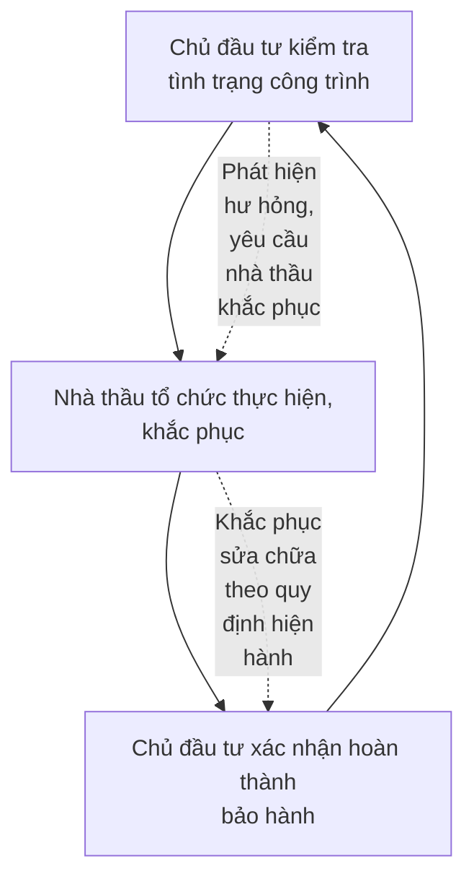

**\* Chủ đầu tư:**

- Kiểm tra tình trạng công trình xây dựng, phát hiện hư hỏng để yêu cầu nhà thầu thi công xây dựng công trình sửa chữa, thay thế.

- Giám sát và nghiệm thu công việc khắc phục, sửa chữa của nhà thầu thi công.

- Xác nhận hoàn thành bảo hành công trình xây dựng cho nhà thầu thi công xây dựng công trình.

**\* Nhà thầu thi công xây dựng công trình:**

Gói thầu SPC-T3-PC-08: Cung cấp, xây dựng và lắp đặt vật tư, thiết bị trạm biến áp, đường dây


---


Dự án: TBA 110kV T3 và đường dây 110kV T3 – Trạm 220kV Tân Định, tỉnh Bình Dương

- Tổ chức khắc phục ngay khi có yêu cầu của Chủ đầu và chịu mọi phí tổn khắc phục.

- Từ chối bảo hành công trình xây dựng và thiết bị công trình trong các trường hợp sau:

+ Công trình xây dựng và thiết bị công trình hư hỏng không phải do lỗi của nhà thầu gây ra;

+ Chủ đầu tư vi phạm pháp luật về xây dựng bị cơ quan nhà nước có thẩm quyền buộc tháo dỡ;

+ Sử dụng thiết bị, công trình xây dựng sai quy trình vận hành.

Gói thầu SPC-T3-PC-08: Cung cấp, xây dựng và lắp đặt vật tư, thiết bị trạm biến áp, đường dây


---


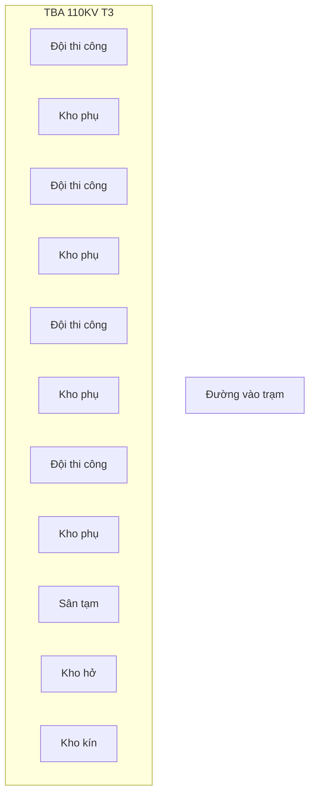

**Ghi chú:**

| Sân tạm      | Kho hở                 |
| ------------ | ---------------------- |
| Kho kín      | Khu điều hành thi công |
| Đội thi công | Kho phụ                |


| **CÔNG TY CỔ PHẦN XÂY LẮP ĐIỆN I**                                                                                                                                                         |                               | **DỰ ÁN: TBA 110KV T3 VÀ ĐZ 110KV T3 - TRẠM 220KV VÂN QUAN** |
| ------------------------------------------------------------------------------------------------------------------------------------------------------------------------------------------ | ----------------------------- | ------------------------------------------------------------ |
| **PHÒNG KỸ THUẬT CÔNG NGHỆ**                                                                                                                                                               |                               |                                                              |
| **GÓI THẦU SPC-T3-PC-02: CUNG CẤP, XÂY DỰNG<br/>VÀ LẮP ĐẶT THIẾT BỊ TBA, ĐƯỜNG DÂY TRUYỀN<br/>CÔNG TRÌNH: TBA 110KV T3 VÀ ĐƯỜNG DÂY<br/>110KV T3 - TRẠM 220KV VÂN QUAN, TỈNH THÁI NGUYÊN** | **MẶT BẰNG TỔ CHỨC THI CÔNG** |                                                              |
|                                                                                                                                                                                            |                               |                                                              |
| **BPTCTC**                                                                                                                                                                                 | **02/2020**                   | **BẢN VẼ SỐ: 01**                                            |
| **TL:**                                                                                                                                                                                    |                               |                                                              |


---


```
                                Bu lông neo
                                    \
                                     \  Bê tông chèn
                                      \ |                    Cốt nền trạm
                                       \|    Bê tông M200         |
                    ┌─────────────────┐||┌─────────────────┐     |
                    |                 ≠||≠                 |     
                    |                ≠ || ≠                |
                    |               ≠  ||  ≠               |
                    |              ≠   ||   ≠              |
                H   |             ≠    ||    ≠             |
                    |            ≠     ||     ≠            |
                    |           ≠      ||      ≠           |
                    |          ≠       ||       ≠          |
                    |         ≠        ||        ≠         |
                    └────────┐≠ ≠ ≠ ≠ ≠||≠ ≠ ≠ ≠ ≠┌─────────┘
                             └─────────┘└─────────┘
                             300    B    300

                    |────────────────────────────────────|
                              2H+B+600
```

| **CÔNG TY CỔ PHẦN XÂY LẮP ĐIỆN I**                                                                                                                                                          | **DỰ ÁN: TBA 110KV TÂ XÀ KZ 110KV TÂ - TRẠM 220KV VÂN QUAN** |                   |
| ------------------------------------------------------------------------------------------------------------------------------------------------------------------------------------------- | ------------------------------------------------------------ | ----------------- |
| **PHÒNG KỸ THUẬT CÔNG NGHỆ**                                                                                                                                                                | **KẾT CẤU MÓNG THIẾT BỊ**                                    |                   |
| **GÓI THẦU: GTC-TX-PC-02: CUNG CẤP, XÂY DỰNG<br/>VÀ LẮP ĐẶT THIẾT BỊ TBA, ĐƯỜNG DÂY TRUYỀN<br/>CÔNG TRÌNH: TBA 110KV TÂ XÀ ĐƯỜNG DÂY<br/>110KV TÂ - TRẠM 220KV VÂN QUAN, TỈNH THÁI NGUYÊN** |                                                              |                   |
| **BPTCTC**                                                                                                                                                                                  | **02/2020**                                                  | **BẢN VẼ SỐ: 02** |


---


Máy đầm rùi

Thanh chống côp pha

Ván khuôn móng móng

Máy trộn bê tông

Khu vực vật liệu thi công

Bu lông

Chi tiết : Kẹp U

Gabari:
1. Thép góc I50
2. Thanh giữ
3. Tấm đệm
4. Đai ốc
5. Bu lông chờ
6. Kẹp U

MÔ TẢ:
- Đổ bê tông trụ thiết bị thấp hơn thiết kế 5cm
- Sử dụng Gabari để căn chỉnh bu lông
- Trát vữa mác cao cho bê tông trụ

| **CÔNG TY CỔ PHẦN XÂY LẮP MIỀN I** | **ĐỊA CHỈ: TRÀ 1 THÔN 13 XÃ KỆ 1 THÔN 13 - THÀNH 22001 VĂN MIỀN** |                                                                                                                                                                                            |                   |
| ---------------------------------- | ----------------------------------------------------------------- | ------------------------------------------------------------------------------------------------------------------------------------------------------------------------------------------ | ----------------- |
|                                    | **PHÒNG KỸ THUẬT CÔNG NGHỆ**                                      |                                                                                                                                                                                            |                   |
|                                    | **THIẾT BỊ THI CÔNG MÓNG TRỤ**                                    |                                                                                                                                                                                            |                   |
|                                    |                                                                   | **GIÁ TRÊN GỒM 13-PC-02: CÔNG CỤ, XÁT DỤNG<br/>VÀ LẮP ĐẶT THIẾT BỊ TRÀ, ĐƯỜNG DÂY TRUYỀN<br/>CÔNG TRÌNH TRÀ 1 THÔN 13 XÃ ĐƯỜNG DÂY<br/>1 THÔN 13 - THÀNH 22001 VĂN MIỀN, TỈNH BÌNH DƯƠNG** |                   |
|                                    | **BPTCTC**                                                        | **02/2020**                                                                                                                                                                                | **BẢN VẼ SỐ: 03** |
|                                    | **TL:**                                                           |                                                                                                                                                                                            |                   |


---


Cây chống ván khuôn

Đầm bê tông (loại dây rung)

Framework for pole's hole (Sheet metal skirt)

Ván khuôn móng

Máy trộn bê tông

Vật liệu thi công

Thanh đỡ

Ván khuôn móng

| CÔNG TY CỔ PHẦN XÂY LẮP MIỀN I                                                                                                                                                            | DỰ ÁN: TBA 110KV TÂ XÀ XZ 110KV TÂ - TRẠM 220KV VÂN QUAN |               |
| ----------------------------------------------------------------------------------------------------------------------------------------------------------------------------------------- | -------------------------------------------------------- | ------------- |
| PHÒNG KỸ THUẬT CÔNG NGHỆ                                                                                                                                                                  | LẮP DỰNG VÁN KHUÔN<br/>BÊ TÔNG TRỤ MÓNG                  |               |
| GIA THẦU SỐC-12-PC-02: CÔNG TÁC, XÂY DỰNG<br/>VÀ LẮP ĐẶT THIẾT BỊ TBA, ĐƯỜNG DÂY TRUYỀN<br/>CÔNG TRÌNH: TBA 110KV TÂ XÀ VÀ ĐƯỜNG DÂY<br/>110KV TÂ - TRẠM 220KV VÂN QUAN, TỈNH THÁI NGUYÊN |                                                          |               |
| BPTCTC                                                                                                                                                                                    | 02/2020                                                  | BẢN VẼ SỐ: 04 |
| TL:                                                                                                                                                                                       |                                                          |               |


---


# MẶT CẮT NGANG ĐÀO BỐC ĐẤT NỀN

## THÔNG SỐ KỸ THUẬT LU

| STN W 800-2 (TẤN) | Khối lượng (N/cM) | Lực đầm (N/cM) | Chiều rộng đầm (M) | Tốc độ máy đi (KM/H) | Tốc độ làm việc (KM/H) |
| ----------------- | ----------------- | -------------- | ------------------ | -------------------- | ---------------------- |
| 10,8              | 277               | 1,5            | 12                 | 6                    |                        |


## MẶT CẮT ĐẦM NỀN

## KHU VỰC SAN

## ĐẶC ĐIỂM KỸ THUẬT MÁY XÚC

| H-D04 KH-D04 | P (m³) | Rmax (m) | Rmin (m) | H1 (m) | H2 (m) | H (m) |
| ------------ | ------ | -------- | -------- | ------ | ------ | ----- |
|              | 0,5    | 6,8      | 3,5      | 6,8    | 2,5    | 5,5   |


## THÔNG SỐ KỸ THUẬT MÁY ỦI(MM)

| EX 200-2 | dài gầu | Rộng gầu | Công suất | dài  | rộng | cao  |
| -------- | ------- | -------- | --------- | ---- | ---- | ---- |
|          | 3260    | 1029     | 505       | 4069 | 2640 | 3029 |


### LƯU Ý:
- TRƯỚC KHI SAN NỀN CẦN LOẠI BỎ LỚP THỰC VẬT NỀN
- NÉU ĐẤT QUÁ NHÃO CẦN ĐỔ THÊM CÁT TRƯỚC KHI LOẠI BỎ
- CHIỀU DÀY LỚP THỰC VẬT LOẠI BỎ TỪ 20 CM
- CHIỀU DÀY LỚP SAN NỀN THEO THIẾT KẾ VÀ LU LÈN CẨN THẬN ĐẢM BẢO YÊU CẦU KỸ THUẬT

----

**CÔNG TY CỔ PHẦN XÂY LẮP ĐIỆN I**

**PHÒNG KỸ THUẬT CÔNG NGHỆ**

**ĐỊA ĐIỂM: SỐ 12-PC-02: CÔNG CỤ, XÁT ĐỘNG VÀ LẮP ĐẶT THIẾT BỊ TBA, ĐƯỜNG DÂY TRUYỀN CÔNG TRÌNH: TBA 110KV 13 VÀ ĐƯỜNG DÂY 110KV 13 - TRẠM 220KV VÂN QUAN, TỈNH BÌNH DƯƠNG**

**Dự ÁN: TBA 110KV 13 VÀ KZ 110KV 13 - TRẠM 220KV VÂN QUAN**

**THI CÔNG SAN NỀN**

| BPTCTC | 02/2020 | **BẢN VẼ SỐ: 05** |
| ------ | ------- | ----------------- |
| TL:    |         |                   |


---


# THI CÔNG ĐƯỜNG TRONG TRẠM

**Bước 1: Dải vật liệu thi công đường**

![Diagram showing a truck spreading material on the road surface]

**Bước 2. Phần san**

![Diagram showing a bulldozer spreading material]

**Kỹ thuật thi công**

**Bước 3: Đầm nén cẩn thận**

![Diagram showing a compaction roller]

- Bê tông Asphalts
- Lớp cấp phối đá dăm đầm chặt
- Nền trạm

![Cross-section diagram showing layers of road surface]

**MẶT CẮT ĐƯỜNG BÊ TÔNG**

## LƯU Ý:

- TRƯỚC KHI SAN NỀN ĐƯỜNG CẦN LU LÈN LẠI ĐẢM BẢO ĐỘ CHẶT K>=0,90

- CHIỀU DÀY LỚP CẤP PHỐI ĐÁ DĂM SAN NỀN ĐƯỜNG THEO THIẾT KẾ VÀ LU LÈN CẨN THẬN ĐẢM BẢO ĐỘ CHẶT K>=0,95 KỸ THUẬT

- RẢI BÊ TÔNG ASPHALTS BẰNG MÁY CHUYÊN DỤNG VÀ ĐẦM BÊ TÔNG ĐẢM BẢO YÊU CẦU KỸ THUẬT

## THÔNG SỐ KỸ THUẬT XE LU

| ST. V7 500-B | KL<br/>(TON) | Lực đầm<br/>(N/CM) | Kích thước đầm<br/>(N) | Tốc độ khi đi<br/>(KM/H) | Tốc độ làm việc<br/>(KM/H) |
| ------------ | ------------ | ------------------ | ---------------------- | ------------------------ | -------------------------- |
|              | 10,8         | 277                | 1,5                    | 12                       | 6                          |


## THÔNG SỐ KỸ THUẬT MÁY ÚI

| EX 200-2 | dài gầu | Rộng gầu | Công suất | dài  | rộng | cao  |
| -------- | ------- | -------- | --------- | ---- | ---- | ---- |
|          | 3260    | 1029     | 505       | 4069 | 2640 | 3029 |


## THÔNG SỐ KỸ THUẬT MÁY XÚC

| HITACHI<br/>EX 120 | α<br/>(m³) | Rmax<br/>(m) | Rmin<br/>(m) | H1<br/>(m) | H2<br/>(m) | H<br/>(m) |
| ------------------ | ---------- | ------------ | ------------ | ---------- | ---------- | --------- |
|                    | 0,5        | 6,8          | 3,5          | 6,8        | 2,5        | 5,5       |


| CÔNG TY CỔ PHẦN XÂY LẮP ĐIỆN I                                                                                                                                                          | Dự Án: TBA 110KV TÂ XÃ XÂ 110KV THẠCH TRÀ - THẠCH 220KV VÂN QUAN |               |
| --------------------------------------------------------------------------------------------------------------------------------------------------------------------------------------- | ---------------------------------------------------------------- | ------------- |
| PHÒNG KỸ THUẬT CÔNG NGHỆ                                                                                                                                                                | SAN NỀN ĐƯỜNG, LÀM ĐƯỜNG                                         |               |
| GIA THẦU SỐ: 12-PC-02: CÔNG GIA, XÂY DỰNG<br/>VÀ LẮP ĐẶT THIẾT BỊ TBA, ĐƯỜNG DÂY TRUYỀN<br/>CÔNG TRÌNH: TBA 110KV TÂ XÃ ĐƯỜNG DÂY<br/>110KV TÂ - THẠCH 220KV VÂN QUAN, TỈNH THÁI NGUYÊN |                                                                  |               |
| BPTCTC<br/>TL:                                                                                                                                                                          | 02/2020                                                          | BẢN VẼ SỐ: 06 |


---


# BỐ TRÍ ĐÀO MÓNG NHÀ ĐIỀU KHIỂN PHÂN PHỐI

## ĐÀO ĐẤT MÓNG NHÀ

[Floor plan diagram showing a building layout with grid lines labeled A, B, C vertically and 1-8 horizontally. The plan shows several rooms with hatched walls. Text "CONTRUCTION DIRECT" appears in one of the rooms. An excavator illustration is shown on the right side with text "KHU VỰC NGƯỜI ĐIỀU HÀNH THI CÔNG"]

## THÔNG SỐ KỸ THUẬT ĐÀO

| Khối lượng đất đào (m³) | Rmax (m) | Rmin (m) | H1 (m) | H2 (m) | H (m) |
| ----------------------- | -------- | -------- | ------ | ------ | ----- |
| 0.5                     | 6.8      | 3.5      | 6.8    | 2.5    | 5.5   |


**Chú ý:**

Đào móng nhà bằng máy theo cao độ thiết kế, sau đó sửa bằng thủ công
Đất đào được đổ vào lòng nền nhà và đầm chặt theo thiết kế

CÔNG TY CỔ PHẦN XÂY LẮP MIỀN I

Địa chỉ: Thôn 1 thôn 13 và xã 1 thôn 13 - Thành 22001 Văn Quan

PHÒNG KỸ THUẬT CÔNG NGHỆ

Giá trị: SPC-13-PC-02: Công đất, xây dựng
và lắp đặt thiết bị nhà, đường xây dựng
Công trình: Thôn 1 thôn 13 và đường xây
1 thôn 13 - Thành 22001 Văn Quan, Tỉnh Lạng Sơn

CÔNG TÁC ĐÀO MÓNG NHÀ ĐIỀU KHIỂN

BPTCTC | 02/2020
TL: | | BẢN VẼ SỐ: 07


---


# CÔNG TÁC BỐ TRÍ CỤ THỂ CỦA THI CÔNG MÓNG NHÀ

## MẶT CẮT A-A

[Technical drawing showing a cross-section view with numbered components (1-10) and measurements including:
- ±0.00 at top
- +1.20 measurement
- 100, 100, 1500, 100, 150 dimensions at bottom
- "Miếng kê cốt thép" (Steel support pad) label
- Height measurements: 1300, 500, 100]

## BỐ TRÍ KHUNG MÓNG NHÀ

[Technical drawing showing foundation frame layout with section markers A-A and numbered components (1-6)]

### CHÚ Ý:

1. Khung côp pha thép      9.Khung tăng cường côp pha trụ  
2. Thanh đỡ dọc côp pha 10.Bê tông lót móng  
3. Thanh chống  
4. Miếng đỡ thanh chống  
8. Côp pha trụ

| CÔNG TY CỔ PHẦN XÂY LẮP MIỀN I                                                                                                                                                           | Dự án: THA 1 THỬY TÔ VÀ XÃ 1 THỬY TÔ - THỬM 220KV VÂN QUAN |               |
| ---------------------------------------------------------------------------------------------------------------------------------------------------------------------------------------- | ---------------------------------------------------------- | ------------- |
|                                                                                                                                                                                          | PHÒNG KỸ THUẬT CÔNG NGHỆ                                   |               |
|                                                                                                                                                                                          | BÊ TÔNG MÓNG NHÀ                                           |               |
| ĐỊA THỂU SỐ: 12-PC-02: CÔNG CỤC, XÂY DỰNG<br/>VÀ LẮP ĐẶT THIẾT BỊ NHÀ, ĐƯỜNG DÂY TRUYỀN<br/>CÔNG TRÌNH: THA 1 THỬY TÔ VÀ ĐƯỜNG DÂY<br/>1 THỬY TÔ - THỬM 220KV VÂN QUAN, TỈNH THÁI NGUYÊN |                                                            |               |
| BPTCTC                                                                                                                                                                                   | 02/2020                                                    | BẢN VẼ SỐ: 09 |
| TL:                                                                                                                                                                                      |                                                            |               |


---


KHUNG, DẦM CÔP PHA

# PHƯƠNG ÁN CÔP PHA KHUNG NHÀ BÊ TÔNG

## MẶT CẮT 1-1

[Technical drawing showing cross-section view with numbered components 1-9]

[Technical drawing showing front elevation view with numbered components 11-15]

## TG

[Technical drawing showing plan view with dimension 250 and numbered components 16-20]

[Technical drawing showing detail view with numbered component 4 and dimensions 250, 350]

### CHÚ Ý:

| 1. Khung côp pha trụ<br/>2. Khung tăng cường côp pha<br/>3. Bu lông<br/>4. Thanh chống có vít<br/>5. Chân đỡ côp pha trụ<br/>6. Chống xiên<br/>7. Cọc chịu lực<br/>8. Cửa vệ sinh<br/>9. Tay thi công giàn giáo<br/>10. Côp pha sàn thi công | 11. Khung dầm<br/>12. Cữ điều chỉnh<br/>13. Chèn vữa<br/>14. Ván khuôn sàn<br/>15. Kết nối bên ngoài<br/>16. Nối bên trong<br/>17. Côn nhựa<br/>18. Đai có rãnh<br/>19. Hệ thống ống đỡ D60<br/>20. Bu lông |
| -------------------------------------------------------------------------------------------------------------------------------------------------------------------------------------------------------------------------------------------- | ----------------------------------------------------------------------------------------------------------------------------------------------------------------------------------------------------------- |


[Technical drawings showing installation sequence with concrete formwork and tools]

## CHÂN ĐỠ CỘT TRỤ CÔP PHA

[Technical drawings showing support column base details]

| CÔNG TY CỔ PHẦN XÂY LẮP MIỀN I                                                                                                                                                             | ĐỊA CHỈ: TRẢ 1 TẦNG 13 VÀ 22, 1 TẦNG 13 - THÁP 22DNY VĂN PHÒNG |               |
| ------------------------------------------------------------------------------------------------------------------------------------------------------------------------------------------ | -------------------------------------------------------------- | ------------- |
| PHÒNG KỸ THUẬT CÔNG NGHỆ                                                                                                                                                                   | BỐ TRÍ KHUNG GIÀN GIÁO                                         |               |
| ĐỊA THOẠI: 090-12-PC-02: CÔNG TÁC, XÂY DỰNG<br/>VÀ LẮP ĐẶT THIẾT BỊ NHÀ, ĐƯỜNG DÂY TRUYỀN<br/>CÔNG TRÌNH: TRẢ 1 TẦNG 13 VÀ ĐƯỜNG DÂY<br/>1 TẦNG 13 - THÁP 22DNY VĂN PHÒNG, TỈNH BÌNH DƯƠNG |                                                                |               |
| BPTCTC                                                                                                                                                                                     | 02/2020                                                        | BẢN VẼ SỐ: 10 |
| TL:                                                                                                                                                                                        |                                                                |               |


---


[Technical diagram showing construction scaffolding system with numbered components 1-18]

Ghi chú:

1. Hộc bê tông                    10. Trụ đỡ giàn giáo
2. Bê tông                        11. Trụ cố định
3. Xe cutkit                      12. Xà gồ hỗ trợ
4. Kết cấu sàn                    13. Kết cấu Giàn giáo
5. Xà gồ hỗ trợ mặt sàn          14. Ban công an toàn
6. Dầm hỗ trợ xà gồ              15. Chân đỡ sàn vật liệu
7. Dầm chính                      16. Thanh đỡ sàn vật liệu
8. Dầm phụ                        17. Sàn thao tác vật liệu
9. Trụ                            18. Hệ thống chân đỡ

[Detail diagram A showing connection components labeled: Ống thép, Kẹp U, Bu lông, Tấm đệm]

| CÔNG TY CỔ PHẦN XÂY LẮP ĐIỆN I                                                                                                                                                    | ĐỊA CHỈ: TRÀ 1 THÔN 13 XÃ KZ, THÀNH 73 - THÀNH 22007 VĂN QUAN |
| --------------------------------------------------------------------------------------------------------------------------------------------------------------------------------- | ------------------------------------------------------------- |
| PHÒNG KỸ THUẬT CÔNG NGHỆ                                                                                                                                                          | CÔNG TÁC CÔPPHA SÀN MÁI                                       |
| ĐỐI TƯỢNG ÁP DỤNG: CÔNG TÁC XÂY DỰNG<br/>VÀ LẮP ĐẶT THIẾT BỊ NHÀ, PHÒNG XÂY TRƯỚC<br/>CÔNG TRÌNH TRÀ 1 THÔN 13 XÃ HƯƠNG DÂY<br/>1 THÔN 13 - THÀNH 22007 VĂN QUAN, TỈNH TĨNH HƯƠNG |                                                               |
|                                                                                                                                                                                   | BPTCTC	02/2020	BẢN VẼ SỐ: 11&#xA;TL:	                         |


</td>
</tr>
</table>


---


# CHI TIẾT ĐIỀU CHỈNH BU LÔNG KHI THI CÔNG MÓNG TRỤ VÀ MÓNG CỘT

## CÔNG TÁC XÂY TƯỜNG GẠCH

Khung bê tông nhà

Khung gỗ

Dây dọi

Dây căng ngang xây tường

Sàn côp pha thi công

## MẶT CẮT TRÁT TƯỜNG

Hướng dẫn trát

Hướng trát

Sàn thi công

Khung giàn giáo

## KEP U

1. Thép góc
2. Thanh giữ
3. Tấm đệm
4. Đai ốc điều chỉnh
5. Bu lông chờ
6. Kẹp U
- Bê tông trụ thấp hơn thiết kế 5 cm
- 5cm
- Use leveler to mark the bolt
- Use high grade mortar for remanent space

Notes:
- Make mortal guide strip before mortar
- Watering to the surface carefully before mortar
- Mortar 2 layer, when bedding surface dry continue second layer
- When stop mortar, joint mortal must be sawtooth form
- After mortar must smoothing surface, next shift is not allow
- Base of wall must put wooden plate to utilize fall mortar

## CÔNG TÁC TRÁT TƯỜNG

Khung bê tông nhà

Thước

Hướng dẫn trát tường

Wooden plate to utilize fall mortar

| CÔNG TY CỔ PHẦN XÂY LẮP HIỆP I                                                                                                                                                          | SỞ ĐỊA CHỈ: TỔ DÂN PHỐ 1A KHU 1 THỊT TỔ - THẠCH 22001 TÂN HỢP |         |               |
| --------------------------------------------------------------------------------------------------------------------------------------------------------------------------------------- | ------------------------------------------------------------- | ------- | ------------- |
| PHÒNG KỸ THUẬT CÔNG NGHỆ                                                                                                                                                                | CÔNG TÁC XÂY, TRÁT TƯỜNG                                      |         |               |
| GIÁ TRÌNH SỐ: 72-PC-02: CÔNG CẤP, XÂY DỰNG<br/>VÀ LẮP ĐẶT THIẾT BỊ NHÀ, CÔNG TRÌNH DỤNG<br/>CÔNG TRÌNH: TRẠ 1 THỊT TỔ VÀ ĐƯỜNG DÂY<br/>1 THỊT TỔ - THẠCH 22001 TÂN HỢP, TỈNH BÌNH DƯƠNG |                                                               |         |               |
| BPTCTC<br/>TL:                                                                                                                                                                          |                                                               | 02/2020 | BẢN VẼ SỐ: 12 |


---


## CHI TIẾT MÓC CHỮ U

![Diagram showing cross-sectional views of foundation structures with labeled components including "Máy đầm dùi" (Vibrator), "Thanh chống" (Support bar), "Cốp pha" (Formwork), "Máy trộn bê tông" (Concrete mixer), "Bãi tập kết vật liệu" (Material storage area), and "Bu lông" (Bolt)]

[Technical drawings showing three views of a U-shaped hook structure with numbered components (1-6) and dimensional annotations showing 500mm measurements]

## GHI CHÚ

1. Thép góc l50
2. Thanh giằng
3. Bản đệm
4. Đai ốc định vị
5. Bu lông chờ
6. Móc chữ u

## THUYẾT MINH:

- Đổ bt móng đến chỗ thấp hơn cos thiết kế 5cm
- Dùng máy thuỷ bình ngắm lấy dấu vào bulông
- Đổ lớp vữa mác cao vào khoảng còn lại

| CÔNG TY CỔ PHẦN XÂY LẮP NGHỆ I | DỰ ÁN: TRẠ TĨNH 13 VÀ 22, TĨNH 13 - THẠCH 22001 VĂN NGHỆ                                                                                                                                  |                                       |
| ------------------------------ | ----------------------------------------------------------------------------------------------------------------------------------------------------------------------------------------- | ------------------------------------- |
|                                | **PHÒNG KỸ THUẬT CÔNG NGHỆ**                                                                                                                                                              |                                       |
|                                | GIÁ TREO GFC-13-PC-02: CUNG CẤP, LẮP DỰNG<br/>VÀ LẮP ĐẶT THIẾT BỊ TRA, NGHIỀN BÀY THUYẾT<br/>CÔNG TRÌNH: TRA 1 TĨNH 13 VÀ NGHIỀN BÀY<br/>1 TĨNH 13 - THẠCH 22001 VĂN NGHỆ, TỈNH TĨNH NGHỆ | **MÓNG TRỤ THIẾT BỊ**                 |
|                                |                                                                                                                                                                                           | BPTCTC	02/2020	BẢN VẼ SỐ: 13&#xA;TL:	 |


</td>
</tr>
</table>


---


TẦNG NỐI I ĐƯỢC LẮP THÀNH
2 MẢNG BẰNG TỜI THỦ CÔNG

![Diagram showing a bridge structure with two towers and a suspended section. The left side shows the full bridge structure with labeled components: "Múp 3 tấn" (3-ton pulley) at the top, "Cáp thép" (steel cable), "Ra tời" (winch) at the base on both sides, and "Hố thế" (foundation pit) in the center. The right side shows a detailed cross-section of a tower structure with labels: "Thanh phụ" (secondary beam), "Thanh chính" (main beam), "Móng trụ đỡ" (support pillar foundation), and "Cao độ mặt bằng trạm" (station ground level).]

| CÔNG TY CỔ PHẦN XÂY LẮP MIỀN I                                                                                                                                                             | DỰ ÁN: THA TỈNH 13 VÀ XÃ TỈNH 13 - THẠCH 220KV VÀN QUAN |         |               |
| ------------------------------------------------------------------------------------------------------------------------------------------------------------------------------------------ | ------------------------------------------------------- | ------- | ------------- |
| PHÒNG KỸ THUẬT CÔNG NGHỆ                                                                                                                                                                   | LẮP DỰNG XÀ BẰNG TRỤ LEO                                |         |               |
| GÓI THẦU: GPC-13-PC-02: CUNG CẤP, XÂY DỰNG<br/>VÀ LẮP ĐẶT THIẾT BỊ TBA, ĐƯỜNG DÂY TRUYỀN<br/>CÔNG TRÌNH: TBA 1 TỈNH 13 VÀ ĐƯỜNG DÂY<br/>1 TỈNH 13 - THẠCH 220KV VÀN QUAN, TỈNH THÁI NGUYÊN |                                                         |         |               |
|                                                                                                                                                                                            | BPTCTC<br/>TL:                                          | 02/2020 | BẢN VẼ SỐ: 14 |


---


# BỐ TRÍ MẶT BẰNG LẮP DỰNG TRỤ BẰNG CẨU

[Technical drawing showing truss structures with dimensions 3500, 2000, 2000]

Móng cột

Gỗ kê lúc lắp

VỊ TRÍ ĐỨNG
CỦA CẨU 20
TẤN

VỊ TRÍ ĐỨNG
CỦA CẨU 20
TẤN

| CÔNG TY CỔ PHẦN XÂY LẮP NGHỆ I                                                                                                                                                               | DỰ ÁN: THA 1 HƯNG YÊN VÀ KZ 1 HƯNG YÊN - THÁNG 22020 VĂN GIANG |         |               |
| -------------------------------------------------------------------------------------------------------------------------------------------------------------------------------------------- | -------------------------------------------------------------- | ------- | ------------- |
| PHÒNG KỸ THUẬT CÔNG NGHỆ                                                                                                                                                                     | LẮP DỰNG XÀ BẰNG CẨU                                           |         |               |
| GÓI THẦU: GFC-YS-PC-02: CÔNG GỐP, XÂY DỰNG<br/>VÀ LẮP ĐẶT THIẾT BỊ NHÀ, ĐƯỜNG DÂY TRUYỀN<br/>CÔNG TRÌNH: THA 1 HƯNG YÊN VÀ ĐƯỜNG DÂY<br/>1 HƯNG YÊN - THÁNG 22020 VĂN GIANG, TỈNH HƯNG DƯƠNG |                                                                |         |               |
| BPTCTC<br/>TL:                                                                                                                                                                               |                                                                | 02/2020 | BẢN VẼ SỐ: 15 |


---


| CÔNG TY CỔ PHẦN XÂY LẮP MIỀN I | SỞ XÂY DỰNG TỈNH TRÀ VINH XÉT TỈNH TRÀ - THÁNG 220017 VĂN NGỌC |                                                                                                                                                                                      |                |         |               |
| ------------------------------ | -------------------------------------------------------------- | ------------------------------------------------------------------------------------------------------------------------------------------------------------------------------------ | -------------- | ------- | ------------- |
|                                | LẮP DỰNG CỘT BĂNG CẦU                                          |                                                                                                                                                                                      |                |         |               |
|                                |                                                                | PHÒNG KỸ THUẬT CÔNG NGHỆ                                                                                                                                                             |                |         |               |
|                                |                                                                | GIA THẦU SỐ: 13-PC-02: CÔNG CẤP, XÂY DỰNG<br/>VÀ LẮP ĐẶT THIẾT BỊ TBA, ĐƯỜNG DÂY TRUYỀN<br/>CÔNG TRÌNH TBA 1 TÍNH TỪ VÀ ĐƯỜNG DÂY<br/>110KV TỪ - THÁNG 220KV VĂN NGỌC, TỈNH TRÀ VINH | BPTCTC<br/>TL: | 02/2020 | BẢN VẼ SỐ: 16 |


Cột póc tích

Vị trí buộc cáp cẩu
H=10m

Móng cột

---


Móc cẩu

Palăng

Cực trên máy cắt

Cực dưới máy cắt

Móc cẩu

Palăng

Cực dưới máy cắt

Không được kéo lê trượt

Cách giá đỡ máy cắt 20cm nhả Palăng

Giá đỡ máy cắt

Cực trên máy cắt

| CÔNG TY CỔ PHẦN XÂY LẮP ĐIỆN I                                                                                                                                                           | DỰ ÁN: TBA 1 TĨNH TỪ VÀ XZ 1 TĨNH 73 - TRẠM 220KV VÂN QUAN |         |               |
| ---------------------------------------------------------------------------------------------------------------------------------------------------------------------------------------- | ---------------------------------------------------------- | ------- | ------------- |
| PHÒNG KỸ THUẬT CÔNG NGHỆ                                                                                                                                                                 | LẮP ĐẶT MÁY CẮT                                            |         |               |
| GÓI THẦU GFC-72-PC-02: CUNG CẤP, XÂY DỰNG<br/>VÀ LẮP ĐẶT THIẾT BỊ TBA, ĐƯỜNG DÂY TRUYỀN<br/>CÔNG TRÌNH: TBA 1 TĨNH 73 VÀ ĐƯỜNG DÂY<br/>1 TĨNH 73 - TRẠM 220KV VÂN QUAN, TỈNH THÁI NGUYÊN |                                                            |         |               |
|                                                                                                                                                                                          | BPTCTC<br/>TL:                                             | 02/2020 | BẢN VẼ SỐ: 17 |


---


LẮP ĐẶT THEO TRÌNH TỰ 1-10:
- 01:Lắp trụ đỡ máy cắt
- 02:Lắp giá đỡ máy cắt
- 03:Lắp hộp truyền động
- 04:Lắp pha thứ nhất
- 05:Lắp pha thứ hai
- 06:Lắp pha thứ ba
- 07:Lắp thanh truyền động
- 08:Tháo giá thi công
- 09:Căn chỉnh và siết chặt bu lông
- 10:Đấu rải cáp nhị thứ

![Technical diagram showing installation sequence with numbered components (01-08) including:
- A truck with crane on the left side
- Installation structure on the right side showing:
  - Cáp cẩu (Crane cable)
  - Móc cẩu (Crane hook)
  - Cách 20cm nhả Pa lăng (20cm spacing for pulley release)
  - Cáp móc (Hook cable)
  - Numbered components: 01 (base support), 02, 03 (transmission box), 04, 05, 06, 08]

| CÔNG TY CỔ PHẦN XÂY LẮP ĐIỆN I                                                                                                                                                          | SỞ ĐỊA CHỈ: TỔ 1 THÔN 13 TÂN XÃ THẠCH THẤT HÀ NỘI |               |
| --------------------------------------------------------------------------------------------------------------------------------------------------------------------------------------- | ------------------------------------------------- | ------------- |
| PHÒNG KỸ THUẬT CÔNG NGHỆ                                                                                                                                                                | LẮP ĐẶT MÁY CẮT                                   |               |
| GIÁ TREO GỐC 35-PC-02: CUNG CẤP, XÂY DỰNG<br/>VÀ LẮP ĐẶT THIẾT BỊ TBA, ĐƯỜNG DÂY TRUYỀN<br/>CÔNG TRÌNH: TBA 1 THÔN 13 VÀ ĐƯỜNG DÂY<br/>1 THÔN 13 - THÔN 22BKV VĂN QUAN, TỈNH LẠNG SƠNNG |                                                   |               |
| BPTCTC<br/>TL:                                                                                                                                                                          | 02/2020                                           | BẢN VẼ SỐ: 18 |


---


| CÔNG TY CỔ PHẦN XÂY LẮP NGHỆ I | DỰ ÁN: THA 1 THỬY TỔ XÃ XÃ 1 THỬY TỔ - THẠCH 220KV VÀN QUAN |                                                                                                                                                                                         |                |         |               |
| ------------------------------ | ----------------------------------------------------------- | --------------------------------------------------------------------------------------------------------------------------------------------------------------------------------------- | -------------- | ------- | ------------- |
|                                | LẮP ĐẶT BIẾN ĐIỆN ÁP                                        |                                                                                                                                                                                         |                |         |               |
|                                |                                                             | PHÒNG KỸ THUẬT CÔNG NGHỆ                                                                                                                                                                |                |         |               |
|                                |                                                             | GIÁ TRÊN GFC-YS-PC-02: CÔNG GỐC, XÂY DỰNG<br/>VÀ LẮP ĐẶT THIẾT BỊ TBA, ĐƯỜNG DÂY TRUYỀN<br/>CÔNG TRÌNH TBA 1 THỬY TỔ XÃ ĐƯỜNG DÂY<br/>110KV TỔ - THẠCH 220KV VÀN QUAN, TỈNH THÁI NGUYÊN | BPTCTC<br/>TL: | 02/2020 | BẢN VẼ SỐ: 19 |


---


| Tên<br/>Ngày<br/>Ký<br/>Họ | Người thiết kế: Nguyễn Văn Minh | LẮP ĐẶT BIẾN ĐIỆN ÁP |
| -------------------------- | ------------------------------- | -------------------- |
|                            | Người kiểm tra: Trần Thị Lan    |                      |
|                            | Người phê duyệt: Lê Văn Hùng    |                      |
| BVTC<br/>1:\_              | 02/2020                         | BẢN VẼ SỐ: 20        |


Trụ đỡ

Cách trụ 30cm nhả bằng Palăng

Móc cẩu

Palăng

Móc cẩu

Chỉ thị

Cực máy biến điện đông

Móc trì cong

Cách trụ 30cm nhả bằng Palăng

---


| CÔNG TY CỔ PHẦN XÂY LẮP ĐIỆN I | Dự án: TBA 110KV TÂN XÃ KZ 110KV TÂ - TRẠM 220KV VÂN QUAN |                                                                                                                                                                                       |        |         |               |
| ------------------------------ | --------------------------------------------------------- | ------------------------------------------------------------------------------------------------------------------------------------------------------------------------------------- | ------ | ------- | ------------- |
|                                | LẮP ĐẶT BIỂN ĐỘNG ĐIỆN                                    |                                                                                                                                                                                       |        |         |               |
|                                |                                                           | PHÒNG KỸ THUẬT CÔNG NGHỆ                                                                                                                                                              |        |         |               |
|                                |                                                           | GÓI THẦU SPC-TĐ-PC-02: CUNG CẤP, XÂY DỰNG<br/>VÀ LẮP ĐẶT THIẾT BỊ TBA, ĐƯỜNG DÂY TRUYỀN<br/>CÔNG TRÌNH TBA 110KV TÂ VÀ ĐƯỜNG DÂY<br/>110KV TÂ - TRẠM 220KV VÂN QUAN, TỈNH THÁI NGUYÊN | BPTCTC | 02/2020 | BẢN VẼ SỐ: 21 |
|                                | TL:                                                       |                                                                                                                                                                                       |        |         |               |


---


| Chỉ thị máy cẩu<br/>Móc thi công trụ<br/>Cực máy biến<br/>Palăng Móc cẩu | Palăng Trụ đỡ | Mô tả trình tự lắp đặt biến dòng điện |
| ------------------------------------------------------------------------ | ------------- | ------------------------------------- |
| BVTC<br/>TL                                                              | 02/2020       | LẮP ĐẶT BIẾN DÒNG ĐIỆN                |
|                                                                          |               | BẢN VẼ SỐ: 22                         |


Trụ đỡ

Cách tru 30cm nhả bằng Palăng

Móc thi công

Cực máy biến

Chỉ thi

Móc cẩu

Palăng

---


CHÚ Ý: Vận chuyển, trung chuyển hay cẩu phải luôn giữ sứ đỡ ở phương thẳng đứng

CẨU 20 TẤN

Móc cẩu

Palăng

Cách trụ 30cm nhả bằng Palăng

Sứ đỡ 22kV/35kV/110kV

Trụ đỡ sứ

| CÔNG TY CỔ PHẦN XÂY LẮP ĐIỆN I                                                                                                                                                | SỐ ẤN: TRA 1 THNT 73 VÀ 22 1 THNT 73 - TRẠM 220KV VÂN QUAN |               |
| ----------------------------------------------------------------------------------------------------------------------------------------------------------------------------- | ---------------------------------------------------------- | ------------- |
| PHÒNG KỸ THUẬT CÔNG NGHỆ                                                                                                                                                      | LẮP ĐẶT SỨ ĐỠ                                              |               |
| GIA THIẾT SỨ 73-73-PC-02: CUNG CẤP, LẮP DỰNG VÀ LẮP ĐẶT THIẾT BỊ TBA, ĐƯỜNG DÂY TRUYỀN CÔNG TRÌNH: TBA 1 THNT 73 VÀ ĐƯỜNG DÂY 1 THNT 73 - TRẠM 220KV VÂN QUAN, TỈNH THÁI BÌNH |                                                            |               |
| BPTCTC<br/>TL:                                                                                                                                                                | 02/2020                                                    | BẢN VẼ SỐ: 23 |


---


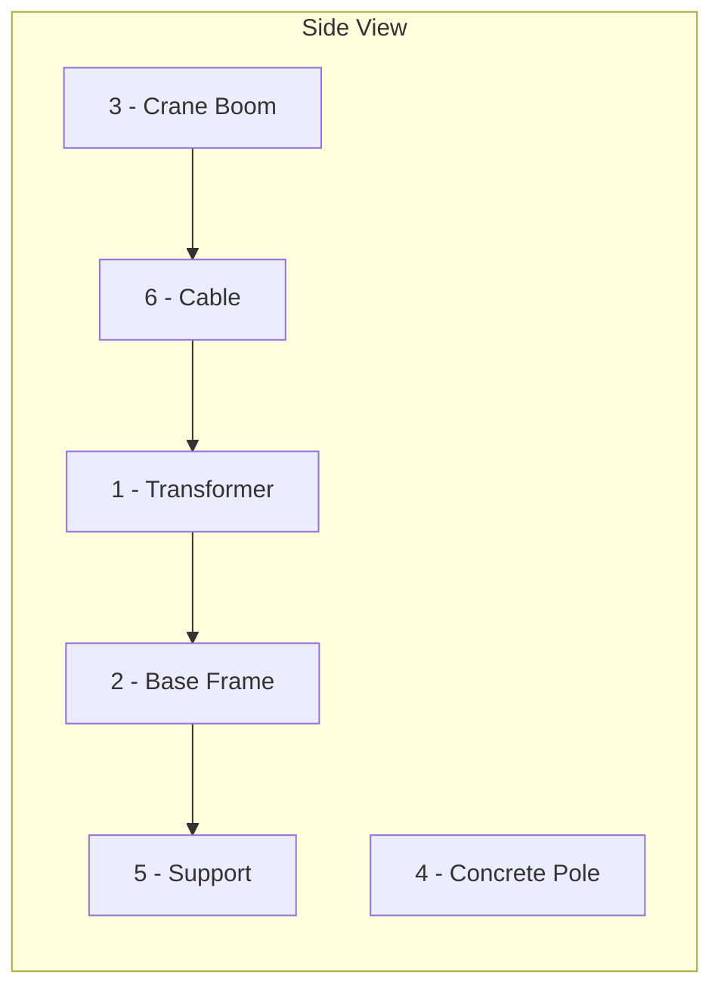

THUYẾT MINH BIỆN PHÁP THI CÔNG:

* Kiểm tra lại kích thước giá đỡ và máy biến áp, nếu đạt yêu cầu cho tiến hành lắp giá đỡ máy biến áp. Dùng nivô căn chỉnh mặt phẳng ngang theo yêu cầu thiết kế.

Chọn vị trí thích hợp cho cần cẩu thi công

* Yêu cầu thợ lái cẩu kiểm tra lại các thiết bị an toàn của cần trục trước khi móc cẩu.

* Khi công việc chuẩn bị đã xong, người chỉ huy kiểm tra lại toàn bộ các thiết bị an toàn và điều kiện làm việc. Khi đã đã đạt yêu cầu ra hiệu đưa máy vào vị trí lắp đặt.

* Do yêu cầu của việc lắp đặt cần độ chính xác cao và an toàn cho thiết bị nên khi tiến hành lắp đặt phải thực hiện chính xác hiệu lệnh của người chỉ huy.

* Khi máy đã đặt vào giá đỡ,dùng nivô kiểm tra căn chỉnh thăng bằng cho máy,khi đã đạt yêu cầu kỹ thuật, xiết chặt bu lông để máy để cố định máy biến áp.

* Tiến hành che đậy để bảo vệ an toàn cho các đầu cực của máy, sau đó tiếp tục cho lắp các cấu kiện còn lại của trạm.

GHI CHÚ:

1. Máy biến áp.
2. Giá đỡ máy biến áp
3. Cột điện bê tông ly tâm
4. Cần cẩu
5. Thang trèo
6. Cáp cần cẩu

| CÔNG TY CỔ PHẦN XÂY LẮP ĐIỆN I                                                                                                                                                       |                         | Dự ÁN: TBA 110KV TỪ BA XÃ 110KV TỪ - TRẠM 220KV VÂN QUAN |                   |
| ------------------------------------------------------------------------------------------------------------------------------------------------------------------------------------ | ----------------------- | -------------------------------------------------------- | ----------------- |
| **PHÒNG KỸ THUẬT CÔNG NGHỆ**                                                                                                                                                         |                         |                                                          |                   |
| ĐỊA ĐIỂM: SỐ 12-PC-02: CÔNG TÁC XÂY DỰNG<br/>VÀ LẮP ĐẶT THIẾT BỊ MBA, PHÒNG BẢY TRẠNG<br/>CÔNG TRÌNH: TBA 110KV TỪ VÀ ĐƯỜNG DÂY<br/>110KV TỪ - TRẠM 220KV VÂN QUAN, TỈNH THÁI NGUYÊN | **LẮP ĐẶT MBA TỰ DÙNG** |                                                          |                   |
|                                                                                                                                                                                      | **BPTCTC**              | 02/2020                                                  | **BẢN VẼ SỐ: 24** |


---


## Chú thích:
1. Máy trộn bê tông
2. Máng dẫn bê tông
3. Cốt thép trụ móng
4. Cốt thép bản móng
5. Cốp pha bản móng
6. Cốp pha bê tông lót móng

## Thuyết minh:

- Đất đào hố móng đổ ra ngoài khu vực hố móng, san phẳng tạo mặt bằng tập kết vật liệu mặt bằng đất mượn thi công móng

- Vật liệu cát đá được đổ gọn gàng kẻ lót bằng các tấm tôn, xi măng được xếp gọn trên sàn gỗ cách mặt đất 0,5m

- Sau khi bê tông lót đúc xong được nghiệm thu đúng quy trình kỹ thuật mới được đặt buộc cốt thép móng

- Kiểm tra cốp pha bản móng chắc chắn, kín khít, đảm bảo kích thước bê tông đúng yêu cầu thiết kế mới được phép đổ bê tông. Cốp pha được làm bằng tôn cuộn dày 1,2mm, được hàn chặt vào khung thép hình

- Các tấm cốp pha được ghép với nhau bởi các khóa nẹp và bu lông M 16. Mặt trụ chỗ giáp bulong móng, các tấm cốp pha được gông lại bằng thép góc

- Đổ bê tông tấm bản: Hỗn hợp bê tông được trộn bằng máy qua hệ thống máng dẫn xuống bàn trộn phụ sau đó xử dụng xẻng xúc hỗn hợp bê tông xuống bản móng.

- Đổ bê tông trụ: Hỗn hợp bê tông được trộn bằng máy, đổ ra bàn trộn phụ và vận chuyển hỗn hợp bê tông bằng thủ công vào trụ móng.

- Đầm bê tông: Đầm bê tông bằng máy đầm dùi và máy đầm bàn đối với bản móng. Chiều dày mỗi lớp đổ <= 40cm theo TCVN 4453-95.

- Lắp đặt bu lông neo: Khi đúc bê tông trụ đến khoảng cách còn lại của chiều cao bê tông phải đúc bằng chiều dài của bu lông neo thì tiến hành đặt bu lông neo. Bu lông neo được cố định bằng Gavari. Cao độ đầu trụ, cao độ bu lông leo theo đúng bản vẽ thiết kế. Chân bu lông neo phải được cố định chắc chắn tránh xê dịch trong quá trình đầm bê tông.

| CÔNG TY CỔ PHẦN XÂY LẮP MIỀN I                                                                                                                                                         | DỰ ÁN: TBA 110KV TÂ XÀ-TBA 110KV TÂ - TRẠM 220KV VÂN QUAN |         |               |
| -------------------------------------------------------------------------------------------------------------------------------------------------------------------------------------- | --------------------------------------------------------- | ------- | ------------- |
| PHÒNG KỸ THUẬT CÔNG NGHỆ                                                                                                                                                               | ĐỔ BÊ TÔNG MÓNG TRỤ ĐẦU NỐI                               |         |               |
| GIA THIẾT SỐ: 12-PC-02- CÔNG CỤ, XÂY DỰNG<br/>VÀ LẮP ĐẶT THIẾT BỊ TBA, ĐƯỜNG DÂY TRUYỀN<br/>CÔNG TRÌNH: TBA 110KV TÂ XÀ ĐƯỜNG DÂY<br/>110KV TÂ - TRẠM 220KV VÂN QUAN, TỈNH THÁI NGUYÊN |                                                           |         |               |
|                                                                                                                                                                                        | BPTCTC<br/>TL:                                            | 02/2020 | BẢN VẼ SỐ: 25 |


---


## Chú thích:
1. Cốp pha Lớp lót bằng gỗ 100x100
2. Cốp pha bản móng
3. Cốp pha trụ móng
4. Cây chống cốp pha móng bằng gỗ
5. Tấm đệm dày 10cm

## Thuyết minh:
- Kiểm tra kích thước hố đào, cao độ đáy hố móng, định vị tim móng
- Ghép cốp pha lớp lót, đúc bê tông lớp lót
- Đặt buộc cốt thép bản móng, cốt thép trụ móng.
- Ghép cốp pha móng:
  + Cốp pha móng được ghép chặt với nhau bởi khoá kẹp và phải đủ các chỉ tiêu như bảo đảm chắc chắn, thuận tiện trong quá trình lắp ghép và tháo dỡ
  + Đảm bảo độ kín khít, độ cứng chắc bền, không biến dạng, chống bám dính bê tông.
  + Cốp pha lắp ghép đúng hình dạng móng theo thiết kế
  + Khi tháo lắp không gây hư hại cho bê tông móng, ván khuôn được làm vệ sinh sạch sẽ bề mặt và các cạnh được làm nhẵn, dùng dầu chống dính trước khi đổ bê tông
- Trong khi lắp ghép cốp pha đồng thời sử dụng các cây chống định vị các tấm cốp pha. Các cây chống cốp pha được chèn chống trượt bằng các tấm đệm dày 10cm, các tấm đệm có bề mặt tiếp xúc tạo ma sát lớn với ván khuôn để tránh trượt trong khi lắp ghép cốp pha.
- Khi đúc bê tông bản móng đạt độ cao thiết kế, tiến hành ghép cốp pha tấm trụ

![Diagram showing cross-section and plan view of foundation formwork assembly with labeled components:
- Cross-section shows: Tập kết vật liệu ≥ 1m, Bulông neo, Đất đào hố móng, San phẳng, Rãnh và hố ga thu nước, Tim tuyến ĐDK
- Numbered components (1-5) indicating different formwork elements
- Plan view shows 4 rectangular foundation units with formwork details
- Side labels: "Bãi tập kết nguyên vật liệu" on both sides]

| CÔNG TY CỔ PHẦN XÂY LẮP NGHỆ I                                                                                                                                                          | SỞ ĐỊA CHỈ: TỔ 1 THÔN TỔ VÀ XÃ THÔN TỔ - THẠCH 22001 VĂN QUAN |               |
| --------------------------------------------------------------------------------------------------------------------------------------------------------------------------------------- | ------------------------------------------------------------- | ------------- |
| PHÒNG KỸ THUẬT CÔNG NGHỆ                                                                                                                                                                | LẮP GHÉP CỐP PHA MÓNG TRỤ ĐẦU NỐI                             |               |
| GIÁ TRÊN SỐ: 02-PC-02: CÔNG CỤ, XÂY DỰNG<br/>VÀ LẮP ĐẶT THIẾT BỊ THA, ĐƯỜNG DÂY TRUYỀN<br/>CÔNG TRÌNH: THA 1 THÔN TỔ VÀ ĐƯỜNG DÂY<br/>1 THÔN TỔ - THẠCH 22001 VĂN QUAN, TỈNH LẠNG ĐƯỜNG |                                                               |               |
| BPTCTC                                                                                                                                                                                  | 02/2020                                                       | BẢN VẼ SỐ: 26 |


---


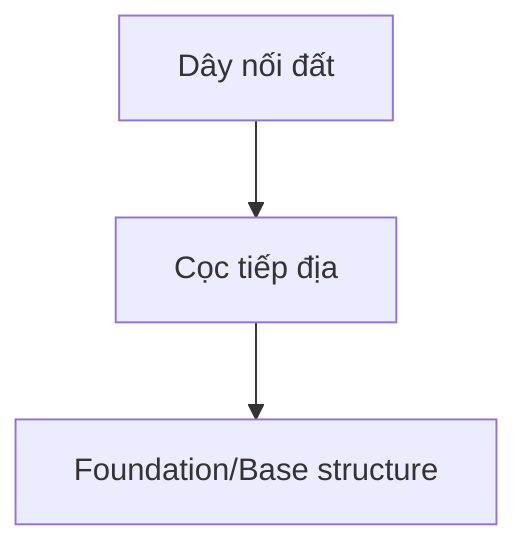

|  and 'Cọ tiếp địa' (grounding stake) connected to foundation structures\>&#xA;\</td\>&#xA;\</tr\>&#xA;\<tr\>&#xA;\<td colspan=>) Four diagrams showing different views/configurations of grounding installations in rectangular enclosures with grounding symbols |   |
| ------------------------------------------------------------------------------------------------------------------------------------------------------------------------------------------------------------------------------------------------------------------------------------------------------------------------------------------------------- | - |


Ghi chú:
1. Dây nối đất;.
2. Cọ tiếp địa.

Thuyết minh:
- Toàn bộ các chi tiết nối đều mạ kẽm;
- Dây nối đất được nối với hệ thống tiếp địa và chôn ở độ sâu 1m so với mặt đất tự nhiên.

| **CÔNG TY CỔ PHẦN XÂY LẮP MIỀN I** | **DỰ ÁN: TBA 110KV TÂ XÀ KZ 110KV TÂ - THẠCH 220KV VÂN QUAN**                                                                                                                                |                                  |                   |
| ---------------------------------- | -------------------------------------------------------------------------------------------------------------------------------------------------------------------------------------------- | -------------------------------- | ----------------- |
|                                    | **PHÒNG KỸ THUẬT CÔNG NGHỆ**                                                                                                                                                                 |                                  |                   |
|                                    | **GÓI THẦU: GTC-TX-PC-02: CUNG CẤP, LẮP DỰNG<br/>VÀ LẮP ĐẶT THIẾT BỊ TBA, ĐƯỜNG DÂY TRUYỀN<br/>CÔNG TRÌNH: TBA 110KV TÂ XÀ ĐƯỜNG DÂY<br/>110KV TÂ - THẠCH 220KV VÂN QUAN, TỈNH THÁI NGUYÊN** | **LẮP ĐẶT TIẾP ĐỊA TRỤ ĐẦU NỐI** |                   |
|                                    | **BPTCTC**                                                                                                                                                                                   | **02/2020**                      | **BẢN VẼ SỐ: 27** |
|                                    | **TL:**                                                                                                                                                                                      |                                  |                   |


---


# LÁP DỰNG CỘT BĂNG TRỤ LEO ĐOẠN THÂN

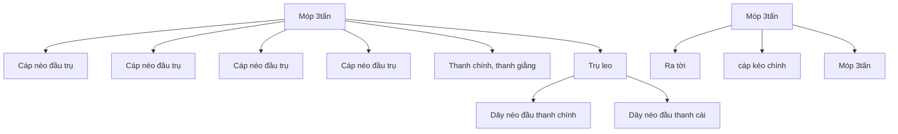

Ghi chú:
- Cáp đầu trụ được neo vào tời ống + hộ thế 3 tấn
- Dây néo đầu thanh chính được neo vào cọc hãm
- Tời được neo vào hộ thế 3 tấn

# LÁP DỰNG CỘT BĂNG TRỤ LEO ĐOẠN I

```mermaid
graph TD
    A[Móp 3tấn] --> B[Cáp néo đầu trụ]
    A --> C[Cáp néo đầu trụ]
    A --> D[Cáp néo đầu trụ]
    A --> E[Cáp néo đầu trụ]
    A --> F[Trụ thi công]
    F --> G[Dây néo đầu thanh cái]
    F --> H[Cáp néo đầu trụ]
    I[Móp 3tấn] --> J[Ra tời]
    I --> K[Móp 3tấn]
```

| CÔNG TY CỔ PHẦN XÂY LẮP ĐIỆN I                                                                                                                                                                | DỰ ÁN: TBA 110KV TÂ XÃ VÀ ĐƯỜNG DÂY 110KV TÂ XÃ - THẠCH 220KV VÂN QUAN |               |
| --------------------------------------------------------------------------------------------------------------------------------------------------------------------------------------------- | ---------------------------------------------------------------------- | ------------- |
| PHÒNG KỸ THUẬT CÔNG NGHỆ                                                                                                                                                                      | LÁP DỰNG CỘT BĂNG TRỤ LEO ĐOẠN I<br/>VÀ TRỤ LEO ĐOẠN THÂN              |               |
| ĐỊA ĐIỂM: XÃ TÂ XÃ-BC. CUNG CẤP, XÂY DỰNG<br/>VÀ LẮP ĐẶT THIẾT BỊ TBA, ĐƯỜNG DÂY TRUYỀN<br/>CÔNG TRÌNH: TBA 110KV TÂ XÃ VÀ ĐƯỜNG DÂY<br/>110KV TÂ XÃ - THẠCH 220KV VÂN QUAN, TỈNH THÁI NGUYÊN |                                                                        |               |
| BPTCTC                                                                                                                                                                                        | 02/2020                                                                | BẢN VẼ SỐ: 28 |
| TL:                                                                                                                                                                                           |                                                                        |               |


---


**Ghi chú:**
- Cáp đầu trụ được neo vào tời ống + hộ thể 3 tấn
- Dây neo đầu thanh chính được neo vào cọc hãm
- Tời được neo vào hộ thể 3 tấn

| CÔNG TY CỔ PHẦN XÂY LẮP ĐIỆN I | SỞ ĐỊA CHỈ: TỔ 1 THÔN TỔ DÂN SỐ 1 THÔN 79 - THẠCH 220KV VÂN QUAN |                          |                                     |                                                                                                                                                                                           |                |         |               |
| ------------------------------ | ---------------------------------------------------------------- | ------------------------ | ----------------------------------- | ----------------------------------------------------------------------------------------------------------------------------------------------------------------------------------------- | -------------- | ------- | ------------- |
|                                |                                                                  | PHÒNG KỸ THUẬT CÔNG NGHỆ |                                     |                                                                                                                                                                                           |                |         |               |
|                                |                                                                  |                          | LẮP DỰNG CỘT BẰNG TRỤ LEO ĐOẠN THÂN |                                                                                                                                                                                           |                |         |               |
|                                |                                                                  |                          |                                     | GIÁ TRÌNH SỞ-79-PC-02: CÔNG GIÁ, XÂY DỰNG<br/>VÀ LẮP ĐẶT THIẾT BỊ TBA, ĐƯỜNG DÂY TRUYỀN<br/>CÔNG TRÌNH: TBA 1 THÔN 79 VÀ ĐƯỜNG DÂY<br/>1 THÔN 79 - THẠCH 220KV VÂN QUAN, TỈNH THÁI NGUYÊN | BPTCTC<br/>TL: | 02/2020 | BẢN VẼ SỐ: 29 |


---


```mermaid
graph TD
    A[Múp 3tấn] --> B[Cáp neo đầu trụ]
    A --> C[Cáp neo đầu trụ]
    A --> D[Cáp neo đầu trụ]
    A --> E[Cáp neo đầu trụ]
    A --> F[Cáp neo đầu trụ]
    A --> G[Múp 3tấn]
    G --> H[Trụ leo]
    H --> I[Dây neo thanh chính]
    H --> J[Múp 3tấn]
    J --> K[Ra tời]
```

**Ghi chú:**
- Cáp đầu trụ được neo vào tời ống + hộ thể 3 tấn
- Dây neo đầu thanh chính được neo vào cọc hãm
- Tời được neo vào hộ thể 3 tấn

| CÔNG TY CỔ PHẦN XÂY LẮP ĐIỆN I                                                                                                                                                                 | DỰ ÁN: TBA 110KV TÂ XÀ VÀ ĐƯỜNG DÂY 110KV TÂ XÀ - THẠCH 220KV VÂN QUAN |         |               |
| ---------------------------------------------------------------------------------------------------------------------------------------------------------------------------------------------- | ---------------------------------------------------------------------- | ------- | ------------- |
| PHÒNG KỸ THUẬT CÔNG NGHỆ                                                                                                                                                                       | LÁP DỰNG CỘT ĐOẠN THÂN                                                 |         |               |
| GIÁ TRÌNH SỐ: 12-PC-02: CÔNG TÁC, XÂY DỰNG<br/>VÀ LẮP ĐẶT THIẾT BỊ TBA, ĐƯỜNG DÂY TRUYỀN<br/>CÔNG TRÌNH: TBA 110KV TÂ XÀ VÀ ĐƯỜNG DÂY<br/>110KV TÂ XÀ - THẠCH 220KV VÂN QUAN, TỈNH THÁI NGUYÊN |                                                                        |         |               |
|                                                                                                                                                                                                | BPTCTC<br/>TL:                                                         | 02/2020 | BẢN VẼ SỐ: 30 |


---


```mermaid
graph LR
    A[Ra tời] --> B[Móp 3tấn]
    A --> C[Trụ leo]
    A --> D[Móp 3tấn]
    B --> E[Cáp neo đầu trụ]
    C --> F[Cáp neo đầu trụ]
    D --> G[Cáp neo đầu trụ]
    
    H[Dây điều khiển] --> C
    I[Cáp neo đầu trụ] --> C
    J[Móp 3tấn] --> C
    K[Cáp neo đầu trụ] --> L[Giằng chủ trụ]
```

Ghi chú:
- Cáp đầu trụ được neo vào tời ống + hố thể 3 tấn
- Dây neo đầu thanh chính được neo vào cọc hãm
- Tời được neo vào hố thể 3 tấn

| CÔNG TY CỔ PHẦN XÂY LẮP NGHỆ I                                                                                                                                                           | DỰ ÁN: THA TĨNH TỔ XÃ XÃ TĨNH TỔ - THẠCH 220KV VÂN QUAN |                |         |               |
| ---------------------------------------------------------------------------------------------------------------------------------------------------------------------------------------- | ------------------------------------------------------- | -------------- | ------- | ------------- |
| PHÒNG KỸ THUẬT CÔNG NGHỆ                                                                                                                                                                 | LÁP DỰNG XÀ BẰNG TRỤ LEO                                |                |         |               |
| GÓI THẦU: GPC-T3-PC-02: CUNG CẤP, XÂY DỰNG<br/>VÀ LẮP ĐẶT THIẾT BỊ TBA, ĐƯỜNG DÂY TRUYỀN<br/>CÔNG TRÌNH: TBA 110KV TỔ XÃ ĐƯỜNG DÂY<br/>110KV TỔ - THẠCH 220KV VÂN QUAN, TỈNH THÁI NGUYÊN |                                                         | BPTCTC<br/>TL: | 02/2020 | BẢN VẼ SỐ: 31 |


---


```mermaid
graph LR
    A[Ra tời<br/>Móp 3tấn] --> B[Dây điều khiển]
    A --> C[Cáp neo đầu trụ]
    A --> D[Cáp neo đầu trụ]
    
    B --> E[Móp 3tấn]
    C --> E
    D --> F[Cáp neo đầu trụ]
    
    E --> G[Móp 3tấn]
    F --> G
    
    G --> H[Cáp neo đầu trụ]
```

**Ghi chú:**
- Cáp đầu trụ được neo vào tời ống + hộ thể 3 tấn
- Dây neo đầu thanh chính được neo vào cọc hãm
- Tời được neo vào hộ thể 3 tấn

| CÔNG TY CỔ PHẦN XÂY LẮP NGHỆ I                                                                                                                                                          | DỰ ÁN: THA TĨNH TỔ XÃ KỂ TĨNH 73 - THÁNG 220KV VÂN QUAN |               |
| --------------------------------------------------------------------------------------------------------------------------------------------------------------------------------------- | ------------------------------------------------------- | ------------- |
| PHÒNG KỸ THUẬT CÔNG NGHỆ                                                                                                                                                                | LẮP DỰNG XÀ BẰNG TRỤ LEO                                |               |
| GIÁ TRÌNH SỐ-73-PC-02: CÔNG GỐC, XÂY DỰNG<br/>VÀ LẮP ĐẶT THIẾT BỊ TBA, ĐƯỜNG DÂY TRUYỀN<br/>CÔNG TRÌNH TBA 1 LƯỚI 73 VÀ ĐƯỜNG DÂY<br/>1 LƯỚI 73 - THÁNG 220KV VÂN QUAN, TỈNH THÁI DƯƠNG |                                                         |               |
| BPTCTC                                                                                                                                                                                  | 02/2020                                                 | BẢN VẼ SỐ: 32 |
| TL:                                                                                                                                                                                     |                                                         |               |


---


## Ghi chú

1. Tăng đơ néo 10 tấn: 01 cái
2. Cọc thép L75x76x6 dài 2 mét: 10 cái
3. Gỗ chèn 200x300x2300: 01 đoạn
4. Gỗ chịu lực 300x300x2300: 01 đoạn
5. Cáp hở thế φ19,5 dài 10 mét: 01 sợi
6. Thép L50x5 dài 2300: 04 cái
- Góc néo hãm cáp α = 15-20°

| CÔNG TY CỔ PHẦN XÂY LẮP MIỀN I                                                                                                                                                            | SỞ ĐỊA CHỈ: TỔ 1 THÔN TỔ VÀ XÃ THÔN TỔ - THÀNH 220KV VÂN QUAN |         |               |
| ----------------------------------------------------------------------------------------------------------------------------------------------------------------------------------------- | ------------------------------------------------------------- | ------- | ------------- |
| PHÒNG KỸ THUẬT CÔNG NGHỆ                                                                                                                                                                  | HỖ TRỢ 10TẤN                                                  |         |               |
| GIA THẦU SỐ: 13-PC-02: CÔNG GIÁ, XÂY DỰNG<br/>VÀ LẮP ĐẶT THIẾT BỊ TBA, ĐƯỜNG DÂY TRUYỀN<br/>CÔNG TRÌNH: TBA 1 THÔN TỔ VÀ ĐƯỜNG DÂY<br/>1 THÔN TỔ - THÀNH 220KV VÂN QUAN, TỈNH THÁI NGUYÊN |                                                               |         |               |
|                                                                                                                                                                                           | BPTCTC                                                        | 02/2020 | BẢN VẼ SỐ: 33 |
|                                                                                                                                                                                           | TL:                                                           |         |               |


---


1,2 đến 1,5 mét

### ⊗ ⊗ ⊗ ⊗

1,2 đến 1,5 mét

### ⊗ ⊗ ⊗ ⊗

2m

0,4m

Ghi chú
1. Tăng đơ neo 5 tấn: 01 cái
2. Cọc thép L75x76x6 dài 2 mét: 06 cái
3. Gỗ chèn 200x300x1800: 01 đoạn
4. Gỗ chịu lực 300x300x1800: 01 đoạn
5. Cáp hỗ thể φ19,5 dài 10 mét: 01 sợi
6. Thép L50x5 dài 1800: 04 cái
- Góc neo hãm cáp α = 15-20°

| **CÔNG TY CỔ PHẦN XÂY LẮP MIỀN I**                                                                                                                                                                  | **Dự án: TBA 110KV TÂN XÃ VÀ ĐƯỜNG DÂY 110KV TÂN XÃ - THẠCH 220KV VÂN QUAN** |                   |
| --------------------------------------------------------------------------------------------------------------------------------------------------------------------------------------------------- | ---------------------------------------------------------------------------- | ----------------- |
| **PHÒNG KỸ THUẬT CÔNG NGHỆ**                                                                                                                                                                        | **HỖ THỂ STĂN**                                                              |                   |
| **GÓI THẦU SỐ: 12-PC-02: CUNG CẤP, LẮP DỰNG<br/>VÀ LÀM ĐẤT THIẾT BỊ TBA, ĐƯỜNG DÂY TRUYỀN<br/>CÔNG TRÌNH: TBA 110KV TÂN XÃ VÀ ĐƯỜNG DÂY<br/>110KV TÂN XÃ - THẠCH 220KV VÂN QUAN, TỈNH THÁI NGUYÊN** |                                                                              |                   |
| **BPTCTC**                                                                                                                                                                                          | **02/2020**                                                                  | **BẢN VẼ SỐ: 34** |
| **TL:**                                                                                                                                                                                             |                                                                              |                   |


---


0,8 đến 1 mét

```
         ┌─────────────────────┐
         │                     │  ①
    ###ξ ###ξ ###ξ ###ξ       │ /α
         │###                  │/
0,8 đến  │ ###  ②             ⑤  ###ξ  ##  ξ  ##  ξ
1 mét    │  ###                /
         │   ###              /③
         │    ###            /
         │     ###          /
         │      ###        /
         └───────④────────┘
```

```
    ┌───┬───┬─────────┐
    │   │   │  ╱╱╱╱╱  │───────→
    │   │   ├─────────┤
    │   │   │  ╱╱╱╱╱  │───────→
    │   │   │  ╱╱╱╱╱  │
1,5m│   │   │  ╱╱╱╱╱  │
    │   │   │  ╱╱╱╱╱  │
    │   │   │  ╱╱╱╱╱  │
    │   │   ├─────────┤
    │   │   │  ╱╱╱╱╱  │───────→
    │   │   ├─────────┤
    └───┴───┴─────────┘───────→
         0,3m
```

| **CÔNG TY CỔ PHẦN XÂY LẮP NGHỆ I**                                                                                                                                                           | ĐỊA CHỈ: TBA 1 THÔN 13 XÃ AZ 1 THÔN 13 - THẠCH 220KV VÂN QUAN |             |                   |
| -------------------------------------------------------------------------------------------------------------------------------------------------------------------------------------------- | ------------------------------------------------------------- | ----------- | ----------------- |
|                                                                                                                                                                                              | **HỖ THỂ 3TẤN**                                               |             |                   |
|                                                                                                                                                                                              |                                                               |             |                   |
|                                                                                                                                                                                              | **BPTCTC**                                                    | **02/2020** |                   |
| **PHÒNG KỸ THUẬT CÔNG NGHỆ**                                                                                                                                                                 | **TL:**                                                       |             | **BẢN VẼ SỐ: 35** |
| **GÓI THẦU GỐC 13-PC-02: CUNG CẤP, LẮP DỰNG<br/>VÀ LẮP ĐẶT THIẾT BỊ TBA, ĐƯỜNG DÂY TRUYỀN<br/>CÔNG TRÌNH TBA 1 THÔN 13 VÀ ĐƯỜNG DÂY<br/>1 THÔN 13 - THẠCH 220KV VÂN QUAN, TỈNH THÁI NGUYÊN** |                                                               |             |                   |


---


# SƠ ĐỒ KÉO DÂY CHO 1 KHOẢNG ĐẦU NỐI

[Diagram showing cable pulling setup with labeled components:]

Cột néo đầu nối

Dây dẫn

Cột cổng TBA 220kV

Rọ cáp + Con quay

Dây mồi

Lô thu cáp mới

Lò dây dẫn

Máy hãm dây

Tời máy

Hố thể 10tấn

Hố thể

Hố thể

----

[Second diagram showing:]

Lô dây mồi

Máy hãm dây

Cột néo đầu nối

Cột cổng TBA 220kV

Hố thể

Hố thể

----

[Third diagram showing:]

OPGW

Rọ cáp

Chống xoắn

Con quay

Cáp mồi

SƠ ĐỒ LÀM RỌ CÁP KÉO DÂY DẪN, DÂY CS, CÁP QUANG

| CÔNG TY CỔ PHẦN XÂY LẮP ĐIỆN I                                                                                                                                                            | DỰ ÁN: TBA 1 TRẠM 73 VÀ XZ 1 TRẠM 73 - TRẠM 220KV VÂN QUAN |         |               |
| ----------------------------------------------------------------------------------------------------------------------------------------------------------------------------------------- | ---------------------------------------------------------- | ------- | ------------- |
| PHÒNG KỸ THUẬT CÔNG NGHỆ                                                                                                                                                                  | SƠ ĐỒ KÉO DÂY DẪN, DÂY CHỐNG SÉT<br/>CHO 01 KHOẢNG ĐẦU NỐI |         |               |
| GÓI THẦU: GPC-12-PC-02: CUNG CẤP, LẮP DỰNG<br/>VÀ LẮP ĐẶT THIẾT BỊ TBA, ĐƯỜNG DÂY TRUYỀN<br/>CÔNG TRÌNH: TBA 1 TRẠM 73 VÀ ĐƯỜNG DÂY<br/>1 TRẠM 73 - TRẠM 220KV VÂN QUAN, TỈNH THÁI NGUYÊN |                                                            |         |               |
|                                                                                                                                                                                           | BPTCTC<br/>TL:                                             | 02/2020 | BẢN VẼ SỐ: 37 |


---


```mermaid
graph TD
    A[Top crossarm structure] --- B[Upper insulator string]
    A --- C[Upper insulator string]
    D[Second crossarm] --- E[Second insulator string]
    D --- F[Second insulator string]
    G[Third crossarm] --- H[Third insulator string]
    G --- I[Third insulator string]
    J[Fourth crossarm] --- K["Múp 1,5tấn"]
    J --- L["Puly5"]
    M[Tower body with X-bracing]
    N["Múp 3tấn"] --- O["Ra tời"]
    P[Ground level with foundation symbols]
```

**Ghi chú:**

-Tời được neo vào hố thể 3tấn

| CÔNG TY CỔ PHẦN XÂY LẮP ĐIỆN I                                                                                                                                             | DỰ ÁN: TBA 110KV TÂ XÀ KZ 110KV TÂ - TRẠM 220KV VÂN QUAN |               |
| -------------------------------------------------------------------------------------------------------------------------------------------------------------------------- | -------------------------------------------------------- | ------------- |
| PHÒNG KỸ THUẬT CÔNG NGHỆ                                                                                                                                                   | TREO SỨ                                                  |               |
| BẢN TRÌNH SỬC-TC-PC-02: CÔNG CỤ, XÁT DỤNG VÀ LẮP ĐẶT THIẾT BỊ TBA, ĐƯỜNG DÂY TRUYỀN CÔNG TRÌNH: TBA 110KV TÂ XÀ ĐƯỜNG DÂY 110KV TÂ - TRẠM 220KV VÂN QUAN, TỈNH THÁI NGUYÊN |                                                          |               |
| BPTCTC<br/>TL:                                                                                                                                                             | 02/2020                                                  | BẢN VẼ SỐ: 36 |


---


| CÔNG TY CỔ PHẦN XÂY LẮP NGHỆ I | Dự Án: THA 1 THNT 13 VÀ KZ 1 THNT 13 - THẠCH 220KV VÂN QUAN |                                                                                                                                                                                            |                |         |
| ------------------------------ | ----------------------------------------------------------- | ------------------------------------------------------------------------------------------------------------------------------------------------------------------------------------------ | -------------- | ------- |
|                                | LẮP DỰNG CỘT BĂNG CẦU ĐOẠN I                                |                                                                                                                                                                                            |                |         |
|                                |                                                             | PHÒNG KỸ THUẬT CÔNG NGHỆ                                                                                                                                                                   |                |         |
|                                |                                                             | GIA THẦU: GFC-13-PC-02: CUNG CẤP, XÂY DỰNG<br/>VÀ LẮP ĐẶT THIẾT BỊ THA, ĐƯỜNG DÂY TRUYỀN<br/>CÔNG TRÌNH: THA 1 THNT 13 VÀ ĐƯỜNG DÂY<br/>1 THNT 13 - THẠCH 220KV VÂN QUAN, TỈNH THÁI NGUYÊN | BPTCTC<br/>TL: | 02/2020 |


---


| CÔNG TY CỔ PHẦN XÂY LẮP NGHỆ I | Dự Án: THA TĨNH 13 VÀ 22, TĨNH 13 - TĨNH 220KV VÀN QUAN |                                                                                                                                                                                          |                |         |
| ------------------------------ | ------------------------------------------------------- | ---------------------------------------------------------------------------------------------------------------------------------------------------------------------------------------- | -------------- | ------- |
|                                | LẮP DỰNG CỘT BẰNG CẦU ĐOẠN I                            |                                                                                                                                                                                          |                |         |
|                                |                                                         | PHÒNG KỸ THUẬT CÔNG NGHỆ                                                                                                                                                                 |                |         |
|                                |                                                         | GIA THẦU: GPC-13-PC-02: CUNG CẤP, XÂY DỰNG<br/>VÀ LẮP ĐẶT THIẾT BỊ THA, ĐƯỜNG DÂY TRUYỀN<br/>CÔNG TRÌNH: THA 1 TĨNH 13 VÀ ĐƯỜNG DÂY<br/>1 TĨNH 13 - TĨNH 220KV VÀN QUAN, TỈNH LẠNG SƠNNG | BPTCTC<br/>TL: | 02/2020 |


---


| CÔNG TY CỔ PHẦN XÂY LẮP MIỀN I                                                                                                                                                          | DỰ ÁN: TBA 110KV TỔ 10 VÀ 22 110KV T3 - TRẠM 220KV VÂN QUAN |        |         |
| --------------------------------------------------------------------------------------------------------------------------------------------------------------------------------------- | ----------------------------------------------------------- | ------ | ------- |
| PHÒNG KỸ THUẬT CÔNG NGHỆ                                                                                                                                                                | LẮP DỰNG CỘT BẰNG CẦU ĐOẠN II                               |        |         |
| BẢN TRÌNH SỐC-T3-PC-02: CÔNG TÁC, XÂY DỰNG<br/>VÀ LẮP ĐẶT THIẾT BỊ TBA, ĐƯỜNG DÂY TRUYỀN<br/>CÔNG TRÌNH: TBA 110KV T3 VÀ ĐƯỜNG DÂY<br/>110KV T3 - TRẠM 220KV VÂN QUAN, TỈNH THÁI NGUYÊN |                                                             | BPTCTC | 02/2020 |
|                                                                                                                                                                                         | TL:                                                         |        |         |


---


| CÔNG TY CỔ PHẦN XÂY LẮP ĐIỆN I                                                                                                                                                            | DỰ ÁN: TBA 110KV TỔ 10 VÀ 2 110KV TỔ - TRẠM 220KV VÂN QUAN |         |
| ----------------------------------------------------------------------------------------------------------------------------------------------------------------------------------------- | ---------------------------------------------------------- | ------- |
| PHÒNG KỸ THUẬT CÔNG NGHỆ                                                                                                                                                                  | LẮP DỰNG CỘT BẰNG CẦU (PHẦN XÀ)                            |         |
| BẢN TRÌNH SỐC-TỔ-PC-02: CÔNG CỤ, XÁT DỤNG<br/>VÀ LẮP ĐẶT THIẾT BỊ TBA, ĐƯỜNG DÂY TRUYỀN<br/>CÔNG TRÌNH: TBA 110KV TỔ 10 VÀ ĐƯỜNG DÂY<br/>110KV TỔ - TRẠM 220KV VÂN QUAN, TỈNH THÁI NGUYÊN |                                                            |         |
| BPTCTC                                                                                                                                                                                    |                                                            | 02/2020 |
|                                                                                                                                                                                           | TL:                                                        |         |


---


# BIỂU SỐ 2.1: BẢNG TIẾN ĐỘ THI CÔNG CHI TIẾT

**Dự án: TBA 110kV T3 và đường dây 110kV T3 – Trạm 220kV Tân Định, tỉnh Bình Dương**

**Gói thầu SPC-T3-PC-08: Cung cấp xây dựng và lắp đặt thiết bị trạm biến áp, đường dây thuộc Công trình: TBA 110kV T3 và đường dây 110kV T3 – Trạm 220kV Tân Định, tỉnh Bình Dương**

| Stt     | Hạng mục công trình                               | Đơn vị | Khối lượng | Tổng thời gian thi công 210 ngày<br/>10 | Tổng thời gian thi công 210 ngày<br/>20 | Tổng thời gian thi công 210 ngày<br/>30 | Tổng thời gian thi công 210 ngày<br/>40 | Tổng thời gian thi công 210 ngày<br/>50 | Tổng thời gian thi công 210 ngày<br/>60 | Tổng thời gian thi công 210 ngày<br/>70 | Tổng thời gian thi công 210 ngày<br/>80 | Tổng thời gian thi công 210 ngày<br/>90 | Tổng thời gian thi công 210 ngày<br/>100 | Tổng thời gian thi công 210 ngày<br/>110 | Tổng thời gian thi công 210 ngày<br/>120 | Tổng thời gian thi công 210 ngày<br/>130 | Tổng thời gian thi công 210 ngày<br/>140 | Tổng thời gian thi công 210 ngày<br/>150 | Tổng thời gian thi công 210 ngày<br/>160 | Tổng thời gian thi công 210 ngày<br/>170 | Tổng thời gian thi công 210 ngày<br/>180 | Tổng thời gian thi công 210 ngày<br/>190 | Tổng thời gian thi công 210 ngày<br/>200 | Tổng thời gian thi công 210 ngày<br/>210 |
| ------- | ------------------------------------------------- | ------ | ---------- | --------------------------------------- | --------------------------------------- | --------------------------------------- | --------------------------------------- | --------------------------------------- | --------------------------------------- | --------------------------------------- | --------------------------------------- | --------------------------------------- | ---------------------------------------- | ---------------------------------------- | ---------------------------------------- | ---------------------------------------- | ---------------------------------------- | ---------------------------------------- | ---------------------------------------- | ---------------------------------------- | ---------------------------------------- | ---------------------------------------- | ---------------------------------------- | ---------------------------------------- |
| **A**   | **PHẦN XÂY DỰNG TRẠM**                            |        |            |                                         |                                         |                                         |                                         |                                         |                                         |                                         |                                         |                                         |                                          |                                          |                                          |                                          |                                          |                                          |                                          |                                          |                                          |                                          |                                          |                                          |
| **I**   | **Chuẩn bị công trường, kho bãi, lán trại**       |        |            |                                         |                                         |                                         |                                         |                                         |                                         |                                         |                                         |                                         |                                          |                                          |                                          |                                          |                                          |                                          |                                          |                                          |                                          |                                          |                                          |                                          |
| **II**  | **Phần san nền trạm, đường vào trạm**             |        |            |                                         |                                         |                                         |                                         |                                         |                                         |                                         |                                         |                                         |                                          |                                          |                                          |                                          |                                          |                                          |                                          |                                          |                                          |                                          |                                          |                                          |
| 1       | Bóc lớp thực                                      | t.bộ   | 1,00       |                                         |                                         |                                         |                                         |                                         |                                         |                                         |                                         |                                         |                                          |                                          |                                          |                                          |                                          |                                          |                                          |                                          |                                          |                                          |                                          |                                          |
| 2       | Làm đường ô tô vào trạm                           | t.bộ   | 1,00       |                                         |                                         |                                         |                                         |                                         |                                         |                                         |                                         |                                         |                                          |                                          |                                          |                                          |                                          |                                          |                                          |                                          |                                          |                                          |                                          |                                          |
| 3       | San nền trạm                                      | t.bộ   | 1,00       |                                         |                                         |                                         |                                         |                                         |                                         |                                         |                                         |                                         |                                          |                                          |                                          |                                          |                                          |                                          |                                          |                                          |                                          |                                          |                                          |                                          |
| **III** | **Phần xây dựng ngoài trời**                      |        |            |                                         |                                         |                                         |                                         |                                         |                                         |                                         |                                         |                                         |                                          |                                          |                                          |                                          |                                          |                                          |                                          |                                          |                                          |                                          |                                          |                                          |
| 1       | Thi công đường vào trạm                           | t.bộ   | 1,00       |                                         |                                         |                                         |                                         |                                         |                                         |                                         |                                         |                                         |                                          |                                          |                                          |                                          |                                          |                                          |                                          |                                          |                                          |                                          |                                          |                                          |
| 2       | Làm đường trong trạm                              | t.bộ   | 1,00       |                                         |                                         |                                         |                                         |                                         |                                         |                                         |                                         |                                         |                                          |                                          |                                          |                                          |                                          |                                          |                                          |                                          |                                          |                                          |                                          |                                          |
| 3       | Xây dựng cổng, hàng rào trạm                      | t.bộ   | 1,00       |                                         |                                         |                                         |                                         |                                         |                                         |                                         |                                         |                                         |                                          |                                          |                                          |                                          |                                          |                                          |                                          |                                          |                                          |                                          |                                          |                                          |
| 4       | Xây dựng nhà điều khiển                           | nhà    | 1,00       |                                         |                                         |                                         |                                         |                                         |                                         |                                         |                                         |                                         |                                          |                                          |                                          |                                          |                                          |                                          |                                          |                                          |                                          |                                          |                                          |                                          |
| 5       | Xây dựng nhà bơm                                  | nhà    | 2,00       |                                         |                                         |                                         |                                         |                                         |                                         |                                         |                                         |                                         |                                          |                                          |                                          |                                          |                                          |                                          |                                          |                                          |                                          |                                          |                                          |                                          |
| 6       | Đào đúc bể nước cứu hỏa, bể dầu sự cố             | bể     | 3,00       |                                         |                                         |                                         |                                         |                                         |                                         |                                         |                                         |                                         |                                          |                                          |                                          |                                          |                                          |                                          |                                          |                                          |                                          |                                          |                                          |                                          |
| 7       | Đào đúc móng máy biến áp 110kV                    | móng   | 2,00       |                                         |                                         |                                         |                                         |                                         |                                         |                                         |                                         |                                         |                                          |                                          |                                          |                                          |                                          |                                          |                                          |                                          |                                          |                                          |                                          |                                          |
| 8       | Đào đúc móng thiết bị, giàn cột cổng 110kV, 22kV  | t.bộ   | 1,00       |                                         |                                         |                                         |                                         |                                         |                                         |                                         |                                         |                                         |                                          |                                          |                                          |                                          |                                          |                                          |                                          |                                          |                                          |                                          |                                          |                                          |
| 9       | Hệ thống mương cáp                                | HT     | 1,00       |                                         |                                         |                                         |                                         |                                         |                                         |                                         |                                         |                                         |                                          |                                          |                                          |                                          |                                          |                                          |                                          |                                          |                                          |                                          |                                          |                                          |
| 10      | Hệ thống cấp, thoát nước trạm                     | HT     | 1,00       |                                         |                                         |                                         |                                         |                                         |                                         |                                         |                                         |                                         |                                          |                                          |                                          |                                          |                                          |                                          |                                          |                                          |                                          |                                          |                                          |                                          |
| 11      | Hệ thống tiếp địa                                 | HT     | 1,00       |                                         |                                         |                                         |                                         |                                         |                                         |                                         |                                         |                                         |                                          |                                          |                                          |                                          |                                          |                                          |                                          |                                          |                                          |                                          |                                          |                                          |
| 12      | Hệ thống PCCC                                     | HT     | 1,00       |                                         |                                         |                                         |                                         |                                         |                                         |                                         |                                         |                                         |                                          |                                          |                                          |                                          |                                          |                                          |                                          |                                          |                                          |                                          |                                          |                                          |
| 13      | Rải đá nền trạm                                   | t.bộ   | 1,00       |                                         |                                         |                                         |                                         |                                         |                                         |                                         |                                         |                                         |                                          |                                          |                                          |                                          |                                          |                                          |                                          |                                          |                                          |                                          |                                          |                                          |
| **IV**  | **Phần cung cấp, vận chuyển**                     |        |            |                                         |                                         |                                         |                                         |                                         |                                         |                                         |                                         |                                         |                                          |                                          |                                          |                                          |                                          |                                          |                                          |                                          |                                          |                                          |                                          |                                          |
| 1       | Cung cấp kết cấu cột cổng, xà thép                | t.bộ   | 1,00       |                                         |                                         |                                         |                                         |                                         |                                         |                                         |                                         |                                         |                                          |                                          |                                          |                                          |                                          |                                          |                                          |                                          |                                          |                                          |                                          |                                          |
| 2       | Cung cấp trụ đỡ thiết bị 110kV                    | t.bộ   | 1,00       |                                         |                                         |                                         |                                         |                                         |                                         |                                         |                                         |                                         |                                          |                                          |                                          |                                          |                                          |                                          |                                          |                                          |                                          |                                          |                                          |                                          |
| 3       | Cung cấp vật liệu điện tự dùng và chiếu sáng      | t.bộ   | 1,00       |                                         |                                         |                                         |                                         |                                         |                                         |                                         |                                         |                                         |                                          |                                          |                                          |                                          |                                          |                                          |                                          |                                          |                                          |                                          |                                          |                                          |
| 4       | Vận chuyển VTTB điện từ kho ban A đến công trường | t.bộ   | 1,00       |                                         |                                         |                                         |                                         |                                         |                                         |                                         |                                         |                                         |                                          |                                          |                                          |                                          |                                          |                                          |                                          |                                          |                                          |                                          |                                          |                                          |
| 5       | Cung cấp MBA và phụ kiện MBA                      | t.bộ   | 1,00       |                                         |                                         |                                         |                                         |                                         |                                         |                                         |                                         |                                         |                                          |                                          |                                          |                                          |                                          |                                          |                                          |                                          |                                          |                                          |                                          |                                          |
| **V**   | **Lắp đặt thiết bị, MBA**                         |        |            |                                         |                                         |                                         |                                         |                                         |                                         |                                         |                                         |                                         |                                          |                                          |                                          |                                          |                                          |                                          |                                          |                                          |                                          |                                          |                                          |                                          |
| 1       | Lắp đặt kết cấu cột cổng, xà thép                 | t.bộ   | 1,00       |                                         |                                         |                                         |                                         |                                         |                                         |                                         |                                         |                                         |                                          |                                          |                                          |                                          |                                          |                                          |                                          |                                          |                                          |                                          |                                          |                                          |
| 2       | Kéo dây giàn thanh cái 110kV                      | t.bộ   | 1,00       |                                         |                                         |                                         |                                         |                                         |                                         |                                         |                                         |                                         |                                          |                                          |                                          |                                          |                                          |                                          |                                          |                                          |                                          |                                          |                                          |                                          |


---


| Stt   | Hạng mục công trình                                                            | Đơn vị | Khốilượng | Tổng thời gian thi công 210 ngày<br/>10 | Tổng thời gian thi công 210 ngày<br/>20 | Tổng thời gian thi công 210 ngày<br/>30 | Tổng thời gian thi công 210 ngày<br/>40 | Tổng thời gian thi công 210 ngày<br/>50 | Tổng thời gian thi công 210 ngày<br/>60 | Tổng thời gian thi công 210 ngày<br/>70 | Tổng thời gian thi công 210 ngày<br/>80 | Tổng thời gian thi công 210 ngày<br/>90 | Tổng thời gian thi công 210 ngày<br/>100 | Tổng thời gian thi công 210 ngày<br/>110 | Tổng thời gian thi công 210 ngày<br/>120 | Tổng thời gian thi công 210 ngày<br/>130 | Tổng thời gian thi công 210 ngày<br/>140 | Tổng thời gian thi công 210 ngày<br/>150 | Tổng thời gian thi công 210 ngày<br/>160 | Tổng thời gian thi công 210 ngày<br/>170 | Tổng thời gian thi công 210 ngày<br/>180 | Tổng thời gian thi công 210 ngày<br/>190 | Tổng thời gian thi công 210 ngày<br/>200 | Tổng thời gian thi công 210 ngày<br/>210 |
| ----- | ------------------------------------------------------------------------------ | ------ | --------- | --------------------------------------- | --------------------------------------- | --------------------------------------- | --------------------------------------- | --------------------------------------- | --------------------------------------- | --------------------------------------- | --------------------------------------- | --------------------------------------- | ---------------------------------------- | ---------------------------------------- | ---------------------------------------- | ---------------------------------------- | ---------------------------------------- | ---------------------------------------- | ---------------------------------------- | ---------------------------------------- | ---------------------------------------- | ---------------------------------------- | ---------------------------------------- | ---------------------------------------- |
| 3     | Lắp đặt trụ đỡ thiết bị PP 110 kV                                              | t.bộ   | 1,00      |                                         |                                         |                                         |                                         |                                         |                                         |                                         |                                         |                                         |                                          |                                          |                                          |                                          |                                          |                                          |                                          |                                          |                                          |                                          |                                          |                                          |
| 4     | Lắp đặt thiết bị phân phối 110 kV, 22kV                                        | t.bộ   | 1,00      |                                         |                                         |                                         |                                         |                                         |                                         |                                         |                                         |                                         |                                          |                                          |                                          |                                          |                                          |                                          |                                          |                                          |                                          |                                          |                                          |                                          |
| 5     | Thi công hệ thống điện tự dùng                                                 | t.bộ   | 1,00      |                                         |                                         |                                         |                                         |                                         |                                         |                                         |                                         |                                         |                                          |                                          |                                          |                                          |                                          |                                          |                                          |                                          |                                          |                                          |                                          |                                          |
| 6     | Lắp đặt hệ thống chiếu sáng, camera                                            | t.bộ   | 1,00      |                                         |                                         |                                         |                                         |                                         |                                         |                                         |                                         |                                         |                                          |                                          |                                          |                                          |                                          |                                          |                                          |                                          |                                          |                                          |                                          |                                          |
| 7     | Lắp đặt MBA và phụ kiện                                                        | t.bộ   | 1,00      |                                         |                                         |                                         |                                         |                                         |                                         |                                         |                                         |                                         |                                          |                                          |                                          |                                          |                                          |                                          |                                          |                                          |                                          |                                          |                                          |                                          |
| 8     | Phối hợp kết nối với Đơn vị lắp đặt điện nhị thứ, hệ thống thông tin liên lạc  | t.bộ   | 1,00      |                                         |                                         |                                         |                                         |                                         |                                         |                                         |                                         |                                         |                                          |                                          |                                          |                                          |                                          |                                          |                                          |                                          |                                          |                                          |                                          |                                          |
| 9     | Phối hợp thí nghiệm, hiệu chỉnh trạm                                           | t.bộ   | 1,00      |                                         |                                         |                                         |                                         |                                         |                                         |                                         |                                         |                                         |                                          |                                          |                                          |                                          |                                          |                                          |                                          |                                          |                                          |                                          |                                          |                                          |
| **B** | **PHẦN ĐZ 110KV**                                                              |        |           |                                         |                                         |                                         |                                         |                                         |                                         |                                         |                                         |                                         |                                          |                                          |                                          |                                          |                                          |                                          |                                          |                                          |                                          |                                          |                                          |                                          |
| 1     | Cung cấp vật tư phần móng (thép móng, BLN, tiếp địa)                           | t.bộ   | 1,00      |                                         |                                         |                                         |                                         |                                         |                                         |                                         |                                         |                                         |                                          |                                          |                                          |                                          |                                          |                                          |                                          |                                          |                                          |                                          |                                          |                                          |
| 2     | Thi công phần móng, tiếp địa                                                   | t.bộ   | 1,00      |                                         |                                         |                                         |                                         |                                         |                                         |                                         |                                         |                                         |                                          |                                          |                                          |                                          |                                          |                                          |                                          |                                          |                                          |                                          |                                          |                                          |
| 3     | Cung cấp và lắp dựng cột                                                       | t.bộ   | 1,00      |                                         |                                         |                                         |                                         |                                         |                                         |                                         |                                         |                                         |                                          |                                          |                                          |                                          |                                          |                                          |                                          |                                          |                                          |                                          |                                          |                                          |
| 4     | Cung cấp và kéo rải căng dây                                                   | t.bộ   | 1,00      |                                         |                                         |                                         |                                         |                                         |                                         |                                         |                                         |                                         |                                          |                                          |                                          |                                          |                                          |                                          |                                          |                                          |                                          |                                          |                                          |                                          |
| 5     | Công tác thí nghiệm, thi công đấu nối                                          | t.bộ   | 1,00      |                                         |                                         |                                         |                                         |                                         |                                         |                                         |                                         |                                         |                                          |                                          |                                          |                                          |                                          |                                          |                                          |                                          |                                          |                                          |                                          |                                          |
| **C** | **PHẦN ĐZ 22KV**                                                               |        |           |                                         |                                         |                                         |                                         |                                         |                                         |                                         |                                         |                                         |                                          |                                          |                                          |                                          |                                          |                                          |                                          |                                          |                                          |                                          |                                          |                                          |
| 1     | Cung cấp phần cáp ngầm và phụ kiện                                             | t.bộ   | 1,00      |                                         |                                         |                                         |                                         |                                         |                                         |                                         |                                         |                                         |                                          |                                          |                                          |                                          |                                          |                                          |                                          |                                          |                                          |                                          |                                          |                                          |
| 2     | Thi công kéo rải cáp và đấu nối, thí nghiệm hiệu chỉnh và nghiệm thu đóng điện | t.bộ   | 1,00      |                                         |                                         |                                         |                                         |                                         |                                         |                                         |                                         |                                         |                                          |                                          |                                          |                                          |                                          |                                          |                                          |                                          |                                          |                                          |                                          |                                          |
| **D** | **NGHIỆM THU ĐÓNG ĐIỆN VÀ BÀN GIAO CÔNG TRÌNH**                                | t.bộ   | 1,00      |                                         |                                         |                                         |                                         |                                         |                                         |                                         |                                         |                                         |                                          |                                          |                                          |                                          |                                          |                                          |                                          |                                          |                                          |                                          |                                          |                                          |


## BIỂU ĐỒ NHÂN LỰC

| Nhân lực | Tổng thời gian thi công 210 ngày<br/>10 | Tổng thời gian thi công 210 ngày<br/>20 | Tổng thời gian thi công 210 ngày<br/>30 | Tổng thời gian thi công 210 ngày<br/>40 | Tổng thời gian thi công 210 ngày<br/>50 | Tổng thời gian thi công 210 ngày<br/>60 | Tổng thời gian thi công 210 ngày<br/>70 | Tổng thời gian thi công 210 ngày<br/>80 | Tổng thời gian thi công 210 ngày<br/>90 | Tổng thời gian thi công 210 ngày<br/>100 | Tổng thời gian thi công 210 ngày<br/>110 | Tổng thời gian thi công 210 ngày<br/>120 | Tổng thời gian thi công 210 ngày<br/>130 | Tổng thời gian thi công 210 ngày<br/>140 | Tổng thời gian thi công 210 ngày<br/>150 | Tổng thời gian thi công 210 ngày<br/>160 | Tổng thời gian thi công 210 ngày<br/>170 | Tổng thời gian thi công 210 ngày<br/>180 | Tổng thời gian thi công 210 ngày<br/>190 | Tổng thời gian thi công 210 ngày<br/>200 | Tổng thời gian thi công 210 ngày<br/>210 | Thời gian |
| -------- | --------------------------------------- | --------------------------------------- | --------------------------------------- | --------------------------------------- | --------------------------------------- | --------------------------------------- | --------------------------------------- | --------------------------------------- | --------------------------------------- | ---------------------------------------- | ---------------------------------------- | ---------------------------------------- | ---------------------------------------- | ---------------------------------------- | ---------------------------------------- | ---------------------------------------- | ---------------------------------------- | ---------------------------------------- | ---------------------------------------- | ---------------------------------------- | ---------------------------------------- | --------- |
| 150      |                                         |                                         |                                         |                                         |                                         |                                         |                                         |                                         |                                         |                                          |                                          |                                          |                                          |                                          |                                          |                                          |                                          |                                          |                                          |                                          |                                          |           |
| 110      |                                         |                                         |                                         |                                         |                                         |                                         |                                         |                                         |                                         |                                          |                                          |                                          |                                          |                                          |                                          |                                          |                                          |                                          |                                          |                                          |                                          |           |
| 70       |                                         |                                         |                                         |                                         |                                         |                                         |                                         |                                         |                                         |                                          |                                          |                                          |                                          |                                          |                                          |                                          |                                          |                                          |                                          |                                          |                                          |           |
| 30       |                                         |                                         |                                         |                                         |                                         |                                         |                                         |                                         |                                         |                                          |                                          |                                          |                                          |                                          |                                          |                                          |                                          |                                          |                                          |                                          |                                          |           |


---


# BIỂU SỐ 2.2: BIỂU ĐỒ HUY ĐỘNG XE MÁY THI CÔNG CHỦ YẾU

**Dự án: TBA 110kV T3 và đường dây 110kV T3 – Trạm 220kV Tân Định, tỉnh Bình Dương**

**Gói thầu SPC-T3-PC-08: Cung cấp xây dựng và lắp đặt thiết bị trạm biến áp, đường dây thuộc Công trình: TBA 110kV T3 và đường dây 110kV T3 – Trạm 220kV Tân Định, tỉnh Bình Dương**

| Stt | Tên máy móc, thiết bị                        | Số lượng | Tổng thời gian thi công 210 ngày<br/>10 | Tổng thời gian thi công 210 ngày<br/>20 | Tổng thời gian thi công 210 ngày<br/>30 | Tổng thời gian thi công 210 ngày<br/>40 | Tổng thời gian thi công 210 ngày<br/>50 | Tổng thời gian thi công 210 ngày<br/>60 | Tổng thời gian thi công 210 ngày<br/>70 | Tổng thời gian thi công 210 ngày<br/>80 | Tổng thời gian thi công 210 ngày<br/>90 | Tổng thời gian thi công 210 ngày<br/>100 | Tổng thời gian thi công 210 ngày<br/>110 | Tổng thời gian thi công 210 ngày<br/>120 | Tổng thời gian thi công 210 ngày<br/>130 | Tổng thời gian thi công 210 ngày<br/>140 | Tổng thời gian thi công 210 ngày<br/>150 | Tổng thời gian thi công 210 ngày<br/>160 | Tổng thời gian thi công 210 ngày<br/>170 | Tổng thời gian thi công 210 ngày<br/>180 | Tổng thời gian thi công 210 ngày<br/>190 | Tổng thời gian thi công 210 ngày<br/>200 | Tổng thời gian thi công 210 ngày<br/>210 |
| --- | -------------------------------------------- | -------- | --------------------------------------- | --------------------------------------- | --------------------------------------- | --------------------------------------- | --------------------------------------- | --------------------------------------- | --------------------------------------- | --------------------------------------- | --------------------------------------- | ---------------------------------------- | ---------------------------------------- | ---------------------------------------- | ---------------------------------------- | ---------------------------------------- | ---------------------------------------- | ---------------------------------------- | ---------------------------------------- | ---------------------------------------- | ---------------------------------------- | ---------------------------------------- | ---------------------------------------- |
| 1   | Ô tô tải trọng 7-15T                         | 2        |                                         |                                         |                                         |                                         |                                         |                                         |                                         |                                         |                                         |                                          |                                          |                                          |                                          |                                          |                                          |                                          |                                          |                                          |                                          |                                          |                                          |
| 2   | Xe ben 7-15 tấn                              | 2        |                                         |                                         |                                         |                                         |                                         |                                         |                                         |                                         |                                         |                                          |                                          |                                          |                                          |                                          |                                          |                                          |                                          |                                          |                                          |                                          |                                          |
| 3   | Cần cẩu 20T vươn 25m                         | 2        |                                         |                                         |                                         |                                         |                                         |                                         |                                         |                                         |                                         |                                          |                                          |                                          |                                          |                                          |                                          |                                          |                                          |                                          |                                          |                                          |                                          |
| 4   | Máy đào một gàu bánh hơi (dung tích 0,5m3)   | 1        |                                         |                                         |                                         |                                         |                                         |                                         |                                         |                                         |                                         |                                          |                                          |                                          |                                          |                                          |                                          |                                          |                                          |                                          |                                          |                                          |                                          |
| 5   | Ô tô 4 chỗ chở giám sát                      | 2        |                                         |                                         |                                         |                                         |                                         |                                         |                                         |                                         |                                         |                                          |                                          |                                          |                                          |                                          |                                          |                                          |                                          |                                          |                                          |                                          |                                          |
| 6   | Xe chở nước và tưới nước                     | 2        |                                         |                                         |                                         |                                         |                                         |                                         |                                         |                                         |                                         |                                          |                                          |                                          |                                          |                                          |                                          |                                          |                                          |                                          |                                          |                                          |                                          |
| 7   | Máy đầm đất bánh sắt 10 tấn                  | 2        |                                         |                                         |                                         |                                         |                                         |                                         |                                         |                                         |                                         |                                          |                                          |                                          |                                          |                                          |                                          |                                          |                                          |                                          |                                          |                                          |                                          |
| 8   | Máy đầm đất bánh hơi 10 tấn                  | 2        |                                         |                                         |                                         |                                         |                                         |                                         |                                         |                                         |                                         |                                          |                                          |                                          |                                          |                                          |                                          |                                          |                                          |                                          |                                          |                                          |                                          |
| 9   | Máy ủi tự hành 180CV                         | 1        |                                         |                                         |                                         |                                         |                                         |                                         |                                         |                                         |                                         |                                          |                                          |                                          |                                          |                                          |                                          |                                          |                                          |                                          |                                          |                                          |                                          |
| 10  | Máy ủi 110CV (hoặc có công suất tương đương) | 2        |                                         |                                         |                                         |                                         |                                         |                                         |                                         |                                         |                                         |                                          |                                          |                                          |                                          |                                          |                                          |                                          |                                          |                                          |                                          |                                          |                                          |
| 11  | Máy trộn bê tông dung tích 250L              | 4        |                                         |                                         |                                         |                                         |                                         |                                         |                                         |                                         |                                         |                                          |                                          |                                          |                                          |                                          |                                          |                                          |                                          |                                          |                                          |                                          |                                          |
| 12  | Máy trộn vữa 80L                             | 2        |                                         |                                         |                                         |                                         |                                         |                                         |                                         |                                         |                                         |                                          |                                          |                                          |                                          |                                          |                                          |                                          |                                          |                                          |                                          |                                          |                                          |
| 13  | Máy bơm nước 13CV                            | 2        |                                         |                                         |                                         |                                         |                                         |                                         |                                         |                                         |                                         |                                          |                                          |                                          |                                          |                                          |                                          |                                          |                                          |                                          |                                          |                                          |                                          |
| 14  | Máy đầm bê tông                              | 2        |                                         |                                         |                                         |                                         |                                         |                                         |                                         |                                         |                                         |                                          |                                          |                                          |                                          |                                          |                                          |                                          |                                          |                                          |                                          |                                          |                                          |
| 15  | Máy hàn                                      | 2        |                                         |                                         |                                         |                                         |                                         |                                         |                                         |                                         |                                         |                                          |                                          |                                          |                                          |                                          |                                          |                                          |                                          |                                          |                                          |                                          |                                          |
| 16  | Máy ép đầu cốt dây dẫn loại 100T             | 2        |                                         |                                         |                                         |                                         |                                         |                                         |                                         |                                         |                                         |                                          |                                          |                                          |                                          |                                          |                                          |                                          |                                          |                                          |                                          |                                          |                                          |
| 17  | Máy kéo dây                                  | 2        |                                         |                                         |                                         |                                         |                                         |                                         |                                         |                                         |                                         |                                          |                                          |                                          |                                          |                                          |                                          |                                          |                                          |                                          |                                          |                                          |                                          |
| 18  | Máy hãm dây lực hãm 10 tấn                   | 2        |                                         |                                         |                                         |                                         |                                         |                                         |                                         |                                         |                                         |                                          |                                          |                                          |                                          |                                          |                                          |                                          |                                          |                                          |                                          |                                          |                                          |
| 19  | Tời máy dựng cột 5 tấn                       | 2        |                                         |                                         |                                         |                                         |                                         |                                         |                                         |                                         |                                         |                                          |                                          |                                          |                                          |                                          |                                          |                                          |                                          |                                          |                                          |                                          |                                          |
| 20  | Máy bộ đàm cầm tay                           | 4        |                                         |                                         |                                         |                                         |                                         |                                         |                                         |                                         |                                         |                                          |                                          |                                          |                                          |                                          |                                          |                                          |                                          |                                          |                                          |                                          |                                          |
| 21  | Máy phát điện 15 – 50kW                      | 2        |                                         |                                         |                                         |                                         |                                         |                                         |                                         |                                         |                                         |                                          |                                          |                                          |                                          |                                          |                                          |                                          |                                          |                                          |                                          |                                          |                                          |
| 22  | Máy kinh vĩ, thủy bình                       | 2        |                                         |                                         |                                         |                                         |                                         |                                         |                                         |                                         |                                         |                                          |                                          |                                          |                                          |                                          |                                          |                                          |                                          |                                          |                                          |                                          |                                          |


---


| Stt | Tên máy móc, thiết bị | Số lượng | Tổng thời gian thi công 210 ngày<br/>10 | Tổng thời gian thi công 210 ngày<br/>20 | Tổng thời gian thi công 210 ngày<br/>30 | Tổng thời gian thi công 210 ngày<br/>40 | Tổng thời gian thi công 210 ngày<br/>50 | Tổng thời gian thi công 210 ngày<br/>60 | Tổng thời gian thi công 210 ngày<br/>70 | Tổng thời gian thi công 210 ngày<br/>80 | Tổng thời gian thi công 210 ngày<br/>90 | Tổng thời gian thi công 210 ngày<br/>100 | Tổng thời gian thi công 210 ngày<br/>110 | Tổng thời gian thi công 210 ngày<br/>120 | Tổng thời gian thi công 210 ngày<br/>130 | Tổng thời gian thi công 210 ngày<br/>140 | Tổng thời gian thi công 210 ngày<br/>150 | Tổng thời gian thi công 210 ngày<br/>160 | Tổng thời gian thi công 210 ngày<br/>170 | Tổng thời gian thi công 210 ngày<br/>180 | Tổng thời gian thi công 210 ngày<br/>190 | Tổng thời gian thi công 210 ngày<br/>200 | Tổng thời gian thi công 210 ngày<br/>210 |
| --- | --------------------- | -------- | --------------------------------------- | --------------------------------------- | --------------------------------------- | --------------------------------------- | --------------------------------------- | --------------------------------------- | --------------------------------------- | --------------------------------------- | --------------------------------------- | ---------------------------------------- | ---------------------------------------- | ---------------------------------------- | ---------------------------------------- | ---------------------------------------- | ---------------------------------------- | ---------------------------------------- | ---------------------------------------- | ---------------------------------------- | ---------------------------------------- | ---------------------------------------- | ---------------------------------------- |


---


# BIỂU SỐ 5: DANH SÁCH CÔNG NHÂN

**Dự án: TBA 110kV T3 và đường dây 110kV T3 – Trạm 220kV Tân Định, tỉnh Bình Dương**

**Gói thầu SPC-T3-PC-08: Cung cấp xây dựng và lắp đặt thiết bị trạm biến áp, đường dây thuộc Công trình: TBA 110kV T3 và đường dây 110kV T3 – Trạm 220kV Tân Định, tỉnh Bình Dương**

| Stt                                                                 | Họ và tên         | Chức vụ                                                      | Bậc thợ | Nghành nghề đào tạo               | Ghi chú |
| ------------------------------------------------------------------- | ----------------- | ------------------------------------------------------------ | ------- | --------------------------------- | ------- |
| **I. Công ty TNHH MTV Xây lắp Điện 1 - Miền Nam (PCC1 - Miền Nam)** |                   |                                                              |         |                                   |         |
| 1                                                                   | Nguyễn Văn Tám    | Đội trưởng CNXLVà SC lớn ĐZ cột điện cao thế từ110KV trở lên | 5/7     | Lắp đặt đường dây tải điện và TBA |         |
| 2                                                                   | Nguyễn Văn Vũ     | CNXLVà SC lớn ĐZ cột điện cao thế từ110KV trở lên            | 2/7     | Lắp đặt đường dây tải điện và TBA |         |
| 3                                                                   | Hồ Văn Tuấn       | CNXLVà SC lớn ĐZ cột điện cao thế từ110KV trở lên            | 4/7     | Lắp đặt đường dây tải điện và TBA |         |
| 4                                                                   | Nguyễn Văn Hoàn   | CNXLVà SC lớn ĐZ cột điện cao thế từ110KV trở lên            | 4/7     | Lắp đặt đường dây tải điện và TBA |         |
| 5                                                                   | Trương Lý Cường   | CNXLVà SC lớn ĐZ cột điện cao thế từ110KV trở lên            | 2/7     | Lắp đặt đường dây tải điện và TBA |         |
| 6                                                                   | Nguyễn Văn Hùng   | Đội trưởng CNXLVà SC lớn ĐZ cột điện cao thế từ110KV trở lên | 5/7     | Lắp đặt đường dây tải điện và TBA |         |
| 7                                                                   | Đinh Trọng Thuận  | CNXLVà SC lớn ĐZ cột điện cao thế từ110KV trở lên            | 2/7     | Lắp đặt đường dây tải điện và TBA |         |
| 8                                                                   | Nguyễn Văn Thường | Đội phó CNXLVà SC lớn ĐZ cột điện cao thế từ110KV trở lên    | 5/7     | Lắp đặt đường dây tải điện và TBA |         |
| 9                                                                   | Nguyễn Hữu Quang  | CNXLVà SC lớn ĐZ cột điện cao thế từ110KV trở lên            | 3/7     | Lắp đặt đường dây tải điện và TBA |         |
| 10                                                                  | Bùi Quang Nghĩa   | CNXLVà SC lớn ĐZ cột điện cao thế từ110KV trở lên            | 2/7     | Lắp đặt đường dây tải điện và TBA |         |
| 11                                                                  | Nguyễn Văn Thắng  | CNXLVà SC lớn ĐZ cột điện cao thế từ110KV trở lên            | 2/7     | Lắp đặt đường dây tải điện và TBA |         |
| 12                                                                  | Vũ Ngọc Đắc       | Đội phó CNXLVà SC lớn ĐZ cột điện cao thế từ110KV trở lên    | 6/7     | Xây lắp đường dây                 |         |
| 13                                                                  | Nguyễn Văn Tròn   | CNXLVà SC lớn ĐZ cột điện cao thế từ110KV trở lên            | 3/7     | Lắp đặt đường dây tải điện và TBA |         |
| 14                                                                  | Bùi Hữu Quang     | CNXLVà SC lớn ĐZ cột điện cao thế từ110KV trở lên            | 4/7     | Quản lý lưới điện                 |         |
| 15                                                                  | Phan Huỳnh Thiệp  | CNXLVà SC lớn ĐZ cột điện cao thế từ110KV trở lên            | 3/7     | Lắp đặt đường dây tải điện và TBA |         |
| 16                                                                  | Đỗ Văn Thắng      | CNXLVà SC lớn ĐZ cột điện cao thế từ110KV trở lên            | 3/7     | Lắp đặt đường dây tải điện và TBA |         |
| 17                                                                  | Ngô Quang Hoạt    | CNXLVà SC lớn ĐZ cột điện cao thế từ110KV trở lên            | 4/7     | Lắp đặt đường dây tải điện và TBA |         |
| 18                                                                  | Đỗ Văn Trường     | CNXLVà SC lớn ĐZ cột điện cao thế từ110KV trở lên            | 3/7     | Lắp đặt đường dây tải điện và TBA |         |
| 19                                                                  | Hà Huy Trạch      | CNXLVà SC lớn ĐZ cột điện cao thế từ110KV trở lên            | 3/7     | Lắp đặt đường dây tải điện và TBA |         |
| 20                                                                  | Vũ Ngọc Dũng      | CNXLVà SC lớn ĐZ cột điện cao thế từ110KV trở lên            | 4/7     | Lắp đặt đường dây tải điện và TBA |         |


---


| Stt | Họ và tên                                                      | Chức vụ                                                      | Bậc thợ | Nghành nghề đào tạo                               | Ghi chú |
| --- | -------------------------------------------------------------- | ------------------------------------------------------------ | ------- | ------------------------------------------------- | ------- |
| 21  | Bùi Văn Đào                                                    | CNXLVà SC lớn ĐZ cột điện cao thế từ110KV trở lên            | 3/12    | Chế tạo máy                                       |         |
| 22  | Thân Văn Thắng                                                 | CNXLVà SC lớn ĐZ cột điện cao thế từ110KV trở lên            | 2/4     | Lắp đặt đường dây tải điện và TBA                 |         |
| 23  | Lê Văn Phùng                                                   | CNXLVà SC lớn ĐZ cột điện cao thế từ110KV trở lên            | 2/7     | Lắp đặt đường dây tải điện và TBA                 |         |
| 24  | Hồ Viết Tuấn                                                   | CNXLVà SC lớn ĐZ cột điện cao thế từ110KV trở lên            | 1/7     | Lắp đặt đường dây tải điện và TBA                 |         |
| 25  | Nguyễn Văn Thành                                               | CNXLVà SC lớn ĐZ cột điện cao thế từ110KV trở lên            | 1/7     | Lắp đặt đường dây tải điện và TBA                 |         |
| 26  | Nguyễn Thanh Trọng                                             | CNXLVà SC lớn ĐZ cột điện cao thế từ110KV trở lên            | 1/7     | Công nghệ KTXD - DD\&CN                           |         |
| 27  | Nguyễn Văn Trường                                              | CNXLVà SC lớn ĐZ cột điện cao thế từ110KV trở lên            | 1/7     | Lắp đặt đường dây tải điện và TBA                 |         |
| 28  | Nguyễn Văn Quý                                                 | CNXLVà SC lớn ĐZ cột điện cao thế từ110KV trở lên            | 4/7     | Điện xí nghiệp                                    |         |
| 29  | Vũ Minh Tuấn                                                   | CNXLVà SC lớn ĐZ cột điện cao thế từ110KV trở lên            | 5/7     | Xây lắp điện                                      |         |
| 30  | Lê Hồng Hiếu                                                   | CNXLVà SC lớn ĐZ cột điện cao thế từ110KV trở lên            | 3/7     | Điện xí nghiệp                                    |         |
| 31  | Phan Văn Trọng                                                 | CNXLVà SC lớn ĐZ cột điện cao thế từ110KV trở lên            | 3/7     | Lắp đặt đường dây tải điện và TBA                 |         |
| 32  | Phạm Văn Ngọc                                                  | CNXLVà SC lớn ĐZ cột điện cao thế từ110KV trở lên            | 3/7     | Lắp đặt đường dây tải điện và TBA                 |         |
| 33  | Phan Văn Hùng                                                  | CNXLVà SC lớn ĐZ cột điện cao thế từ110KV trở lên            | 1/7     | Lắp đặt đường dây tải điện và TBA                 |         |
| 34  | Lê Đăng Đức                                                    | CNXLVà SC lớn ĐZ cột điện cao thế từ110KV trở lên            | 3/7     | Sửa chữa động l ực                                |         |
| 35  | Mai Đức Thảo                                                   | CNXLVà SC lớn ĐZ cột điện cao thế từ110KV trở lên            | 1/7     | Kỹ thuật máy lạnh và điều hòa không khí           |         |
| 36  | Phạm Công Chót                                                 | CNXLVà SC lớn ĐZ cột điện cao thế từ110KV trở lên            | 1/7     | Lắp đặt đường dây tải điện và TBA                 |         |
| 37  | Phạm Thành Nguyên                                              | CNXLVà SC lớn ĐZ cột điện cao thế từ110KV trở lên            | 1/7     | Lắp đặt đường dây tải điện và TBA                 |         |
| 38  | Hồ Văn Mạnh                                                    | Công nhân kỹ thuật                                           | 1/7     | Lắp đặt đường dây tải điện và TBA                 |         |
| II  | **Công ty TNHH MTV Xây lắp Điện 1 - Hà Đông (PCC1 - Hà Đông)** |                                                              |         |                                                   |         |
| 1   | Phạm Công Hải                                                  | Đội trưởng CNXLVà SC lớn ĐZ cột điện cao thế từ110KV trở lên | 3/7     | CNXLVà SC lớn ĐZ cột điện cao thế từ110KV trở lên |         |
| 2   | Nguyễn Đại Nhận                                                | Đội phó CNXLVà SC lớn ĐZ cột điện cao thế từ110KV trở lên    | 5/7     | Bằng tốt nghiệp nghề xây lắp ĐZ và trạm           |         |
| 3   | Nguyễn Văn Quyết                                               | CNXLVà SC lớn ĐZ cột điện cao thế từ110KV trở lên            | 4/7     | Xây lắp điện                                      |         |
| 4   | Nguyễn Thế Long                                                | Đội trưởng CNXLVà SC lớn ĐZ cột điện cao thế từ110KV trở lên | 4/7     | Điện dân dụng                                     |         |
| 5   | Trần Hữu Giáp                                                  | Đội Phó -CNXLVà SC lớn ĐZ cột điện cao thế từ110KV trở lên   | 4/7     | Điện dân dụng                                     |         |


---


| Stt     | Họ và tên                                                      | Chức vụ                                                      | Bậc thợ | Nghành nghề đào tạo    | Ghi chú |
| ------- | -------------------------------------------------------------- | ------------------------------------------------------------ | ------- | ---------------------- | ------- |
| 6       | Nguyễn Đức Nhật                                                | Đội Phó CNXLVà SC lớn ĐZ cột điện cao thế từ110KV trở lên    | 3/7     | Điện dân dụng          |         |
| 7       | Đinh Văn Quý                                                   | CNXLVà SC lớn ĐZ cột điện cao thế từ110KV trở lên            | 3/7     | Điện dân dụng          |         |
| 8       | Phan Xuân Điệp                                                 | CNXLVà SC lớn ĐZ cột điện cao thế từ110KV trở lên            | 3/7     | Điện dân dụng          |         |
| 9       | Trần Việt Dũng                                                 | CNXLVà SC lớn ĐZ cột điện cao thế từ110KV trở lên            | 3/7     | Điện dân dụng          |         |
| 10      | Nguyễn Tiến Sơn                                                | CNXLVà SC lớn ĐZ cột điện cao thế từ110KV trở lên            | 3/7     | Giấy phép lái xe       |         |
| 11      | Nguyễn Văn Chiêu                                               | Công nhân lái xe cẩu                                         | 4/4     | Giấy phép lái xe       |         |
| 12      | Lê Minh Sơn                                                    | Đội trưởng CNXLVà SC lớn ĐZ cột điện cao thế từ110KV trở lên | 6/7     | Điện dân dụng          |         |
| 13      | Cao Như Quân                                                   | Đội Phó CNXLVà SC lớn ĐZ cột điện cao thế từ110KV trở lên    | 3/7     | Sửa chữa điện dân dụng |         |
| 14      | Lường Văn Truy                                                 | CNXLVà SC lớn ĐZ cột điện cao thế từ110KV trở lên            | 3/7     | Điện dân dụng          |         |
| 15      | Đào Quang Ngư                                                  | Kỹ sư thủy lợi                                               | 4/8     |                        |         |
| 16      | Nguyễn Thành Long                                              | Đội Trưởng CNXLVà SC lớn ĐZ cột điện cao thế từ110KV trở lên | 5/7     | Điện dân dụng          |         |
| 17      | Chu Văn Diệp                                                   | CNXLVà SC lớn ĐZ cột điện cao thế từ110KV trở lên            | 5/7     | CN xây lắp điện        |         |
| 18      | Dương Văn Hải                                                  | CNXLVà SC lớn ĐZ cột điện cao thế từ110KV trở lên            | 3/7     | Điện dân dụng          |         |
| 19      | Nguyễn Công Ninh                                               | CNXLVà SC lớn ĐZ cột điện cao thế từ110KV trở lên            | 3/7     | Điện dân dụng          |         |
| 20      | Dương Hồng Phấn                                                | CNXLVà SC lớn ĐZ cột điện cao thế từ110KV trở lên            | 3/7     | Điện dân dụng          |         |
| 21      | Bùi Minh Toàn                                                  | CNXLVà SC lớn ĐZ cột điện cao thế từ110KV trở lên            | 5/7     | Xây lắp ĐZ và trạm     |         |
| 22      | Dương Viết Ngọc                                                | CNXLVà SC lớn ĐZ cột điện cao thế từ110KV trở lên            | 3/7     | Điện dân dụng          |         |
| 23      | Tống Viết Ngà                                                  | CNXLVà SC lớn ĐZ cột điện cao thế từ110KV trở lên            | 3/7     | Điện dân dụng          |         |
| 24      | Nguyễn Đình Việt                                               | CNXLVà SC lớn ĐZ cột điện cao thế từ110KV trở lên            | 2/7     | Điện dân dụng          |         |
| 25      | Trần Ngọc Vũ                                                   | CNXLVà SC lớn ĐZ cột điện cao thế từ110KV trở lên            | 2/7     | Điện dân dụng          |         |
| 26      | Nguyễn Văn Phúc                                                | CNXLVà SC lớn ĐZ cột điện cao thế từ110KV trở lên            | 5/7     | Điện dân dụng          |         |
| **III** | **Công ty TNHH MTV Xây lắp Điện 1 - Mỹ Đình (PCC1 - Mỹ Đình)** |                                                              |         |                        |         |
| 1       | Nguyễn Văn Thành                                               | Đội trưởng                                                   | 5/7     | TC nghề Xây lắp điện   |         |
| 2       | Nguyễn Xuân Đại                                                | Đội phó                                                      | 3/7     | TC Điện - Điện Tử      |         |
| 3       | Hoàng Quốc Việt                                                | Công nhân Kỹ thuật                                           | 2/7     | TC Hệ thống Điện       |         |
| 4       | Nguyễn Văn Lương                                               | Công nhân Kỹ thuật                                           | 2/7     | CĐ điện công nghiệp    |         |
| 5       | Vũ Văn Công                                                    | Công nhân                                                    | 3/7     | CNĐZ                   |         |
| 6       | Phạm Dũng                                                      | Công nhân Kỹ thuật                                           | 2/7     | CĐ nghề Điện CN        |         |
| 7       | Trần Thanh Sơn                                                 | Công nhân Kỹ thuật                                           | 2/7     | CĐ nghề Điện CN        |         |


---


| Stt    | Họ và tên                                                      | Chức vụ            | Bậc thợ | Nghành nghề đào tạo                    | Ghi chú |
| ------ | -------------------------------------------------------------- | ------------------ | ------- | -------------------------------------- | ------- |
| 8      | Nguyễn Đình Hiệp                                               | Công nhân Kỹ thuật | 2/7     | Cao đẳng nghề hệ thống điện            |         |
| 9      | Vũ Duy Khánh                                                   | Công nhân Kỹ thuật | 2/7     | CĐ nghề Điện CN                        |         |
| 10     | Hồ Huy Hồng                                                    | Đội trưởng         | 5/7     | Sơ cấp nghề Điện XN                    |         |
| 11     | Hoàng Văn Dược                                                 | Công nhân          | 2/7     | 9/12 (Chứng chỉ nghề SC máy công cụ)   |         |
| 12     | Hồ Hữu Quân                                                    | Công nhân Kỹ thuật | 1/7     | CĐ nghề KT hàn                         |         |
| 13     | Hồ Hữu Tiến                                                    | Công nhân          | 1/7     | Lao động phổ thông                     |         |
| 14     | Dương Văn Đức                                                  | Công nhân          | 1/7     | Lao động phổ thông                     |         |
| 15     | Đặng Viết Hưng                                                 | Công nhân Kỹ thuật | 1/7     | CĐ Nghề điện công nghiệp               |         |
| 16     | Võ Thế Vỹ                                                      | Công nhân Kỹ thuật | 1/7     | Kỹ sư Công nghệ kỹ thuật điện, điện tử |         |
| 17     | Đoàn Văn Trung                                                 | Công nhân          | 1/7     | Lao động phổ thông                     |         |
| 18     | Nguyễn Văn Hòa                                                 | Công nhân          | 1/7     | Lao động phổ thông                     |         |
| 19     | Nguyễn Đình Nguyên                                             | Công nhân          | 1/7     | Lao động phổ thông                     |         |
| 20     | Nguyễn Khắc Số                                                 | Công nhân          | 1/7     | Lao động phổ thông                     |         |
| 21     | Lê Quyết Thắng                                                 | Đội trưởng         | 5/7     | Công nhân Kỹ thuật                     |         |
| 22     | Lê Quốc Thịnh                                                  | Công nhân          | 1/7     | Lao động phổ thông                     |         |
| 23     | Lê Xuân Tuấn                                                   | Công nhân          | 2/7     | TC nghề Lắp đặt ống                    |         |
| 24     | Trần Đăng Tuấn                                                 | Công nhân Kỹ thuật | 1/7     | TC nghề Điện CN và DD                  |         |
| 25     | Dương Văn Nhật                                                 | Công nhân          | 1/7     | Lao động phổ thông                     |         |
| 26     | Dương Văn Hải                                                  | Công nhân          | 1/7     | Lao động phổ thông                     |         |
| 27     | Nguyễn Văn Thành B                                             | Công nhân          | 1/7     | Lao động phổ thông                     |         |
| 28     | Phạm Thế Lực                                                   | Đội trưởng         | 5/7     | TC nghề Xây lắp điện                   |         |
| 29     | Vi Văn Thành                                                   | Công nhân          | 1/7     | Lao động phổ thông                     |         |
| 30     | Phạm Văn Hạnh                                                  | Công nhân          | 1/7     | Lao động phổ thông                     |         |
| 31     | Phạm Trung Tùng                                                | Công nhân          | 1/7     | Lao động phổ thông                     |         |
| 32     | Trịnh Đình Hải                                                 | Công nhân          | 1/7     | Lao động phổ thông                     |         |
| 33     | Hồ Khắc Thành                                                  | Công nhân          | 1/7     | Lao động phổ thông                     |         |
| 34     | Hoàng Văn Xuyền                                                | Công nhân          | 1/7     | Lao động phổ thông                     |         |
| 35     | Hoàng Văn Thiếp                                                | Công nhân          | 1/7     | Lao động phổ thông                     |         |
| 36     | Hoàng Văn Minh                                                 | Công nhân          | 1/7     | Lao động phổ thông                     |         |
| 37     | Nguyễn Thanh Quyết                                             | Công nhân          | 1/7     | Lao động phổ thông                     |         |
| **IV** | **Công ty TNHH MTV Xây lắp Điện 1 - Từ Liêm (PCC1 - Từ Liêm)** |                    |         |                                        |         |
| 1      | Đinh Trọng Tình                                                | Đội trưởng         | 4/7     | Sơ cấp hệ thống điện                   |         |
| 2      | Nguyễn Gia Hiển                                                | Công nhân kỹ thuật | 4/7     | Sơ cấp hệ thống điện                   |         |
| 3      | Lê Đình Hào                                                    | Công nhân kỹ thuật | 4/7     | Sơ cấp hệ thống điện                   |         |
| 4      | Nguyễn Văn Khuê                                                | Công nhân kỹ thuật | 4/7     | Sơ cấp hệ thống điện                   |         |
| 5      | Nguyễn Văn Hòa                                                 | Công nhân kỹ thuật | 4/7     | Sơ cấp hệ thống điện                   |         |
| 6      | Trần Văn Dương                                                 | Công nhân kỹ thuật | 4/7     | Sơ cấp hệ thống điện                   |         |
| 7      | Trần Bá Phán                                                   | Công nhân kỹ thuật | 4/7     | Sơ cấp hệ thống điện                   |         |
| 8      | Nguyễn Xuân Trình                                              | Công nhân kỹ thuật | 4/7     | Sơ cấp hệ thống điện                   |         |
| 9      | Trần Xuân Bắc                                                  | Công nhân kỹ thuật | 4/7     | Sơ cấp hệ thống điện                   |         |
| 10     | Mạc Văn Kỳ                                                     | Công nhân kỹ thuật | 4/7     | Bằng nghề CN CG Xây dựng)              |         |
| 11     | Nguyễn Văn Lập                                                 | Công nhân kỹ thuật | 5/7     | Sơ cấp hệ thống điện                   |         |
| 12     | Phạm Hữu Quý                                                   | Công nhân kỹ thuật | 4/7     | Bằng nghề điện dân dụng                |         |
| 13     | Đặng Huy Thiện                                                 | Công nhân kỹ thuật | 4/7     | Sơ cấp hệ thống điện                   |         |
| 14     | Mạc Văn Thường                                                 | Công nhân kỹ thuật | 5/7     | Bằng nghề công nhân điện               |         |
| 15     | Phạm Hữu Thế                                                   | Công nhân kỹ thuật | 4/7     | Sơ cấp hệ thống điện                   |         |
| 16     | Nguyễn Duy Trường                                              | Công nhân kỹ thuật | 4/7     | Sơ cấp hệ thống điện                   |         |
| 17     | Thái Ngọc Đức                                                  | Công nhân kỹ thuật | 4/7     | Sơ cấp hệ thống điện                   |         |
| 18     | Nguyễn Văn Hải                                                 | Công nhân kỹ thuật | 4/7     | Sơ cấp hệ thống điện                   |         |
| 19     | Lê Đình Viên                                                   | Công nhân kỹ thuật | 4/7     | Sơ cấp hệ thống điện                   |         |


---


| Stt | Họ và tên                                                | Chức vụ            | Bậc thợ | Nghành nghề đào tạo      | Ghi chú |
| --- | -------------------------------------------------------- | ------------------ | ------- | ------------------------ | ------- |
| 20  | Phạm Quý Dương                                           | Công nhân kỹ thuật | 4/7     | Sơ cấp hệ thống điện     |         |
| 21  | Vũ Hữu Điệp                                              | Công nhân kỹ thuật | 4/7     | Sơ cấp hệ thống điện     |         |
| 22  | Cao Xuân Nam                                             | Công nhân kỹ thuật | 4/7     | Sơ cấp hệ thống điện     |         |
| 23  | Nguyễn Văn Sơn                                           | Công nhân kỹ thuật | 4/7     | Sơ cấp hệ thống điện     |         |
| 24  | Hồ Trọng Thuấn                                           | Công nhân kỹ thuật | 4/7     | Sơ cấp hệ thống điện     |         |
| V   | Công ty TNHH MTV Xây lắp Điện 1 - Hà Nội (PCC1 - Hà Nội) |                    |         |                          |         |
| 1   | Phan Ngọc Thuỷ                                           | Đội trưởng         | 5/7     | CN điện công nghiệp      |         |
| 2   | Phan Thanh Tân                                           | Đội phó            | 3/7     | CN vận hành máy xây dựng |         |
| 3   | Nguyễn Đức Trọng                                         | CN XLĐD và trạm    | 2/7     | CN điện công nghiệp      |         |
| 4   | Bùi Văn Thắng                                            | CN XLĐD và trạm    | 2/7     | CN vận hành máy xây dựng |         |
| 5   | Nguyễn Đức Phúc                                          | CN XLĐD và trạm    | 1/7     | CN xây lắp ĐZ            |         |
| 6   | Phan Hữu Trung                                           | CN XLĐD và trạm    | 2/7     | CN xây lắp ĐZ            |         |
| 7   | Nguyễn Đức Thể                                           | CN XLĐD và trạm    | 1/7     | CN xây lắp ĐZ            |         |
| 8   | Nguyễn Ngọc Anh                                          | Đội trưởng         | 4/7     | CN điện công nghiệp      |         |
| 9   | Đinh Xuân Tú                                             | Đội phó            | 2/7     | CN vận hành máy xây dựng |         |
| 10  | Nguyễn Tiến Bình                                         | Đội phó            | 2/7     | CN điện công nghiệp      |         |
| 11  | Nguyễn Quang Cường                                       | CN XLĐD và trạm    | 3/7     | T.cấp điện CN - DD       |         |
| 12  | Nguyễn Văn Dương                                         | CN XLĐD và trạm    | 2/7     | CN điện công nghiệp      |         |
| 13  | Nguyễn Văn Phương                                        | CN XLĐD và trạm    | 1/7     | CN điện công nghiệp      |         |
| 14  | Phạm Văn Hiếu                                            | CN XLĐD và trạm    | 2/7     | CN xây lắp ĐZ            |         |
| 15  | Vàng Văn Lượng                                           | CN XLĐD và trạm    | 1/7     | CN xây lắp ĐZ            |         |
| 16  | Nguyễn Duy Thanh                                         | CN XLĐD và trạm    | 1/7     | CN xây lắp ĐZ            |         |
| 17  | Nguyễn Tuấn Thành                                        | CN XLĐD và trạm    | 1/7     | CN xây lắp ĐZ            |         |
| 18  | Tô Duy Hợi                                               | CN XLĐD và trạm    | 1/7     | CN xây lắp ĐZ            |         |
| 19  | VàngVăn Cương                                            | CN XLĐD và trạm    | 1/7     | CN xây lắp ĐZ            |         |
| 20  | Vàng Văn Xưởng                                           | CN XLĐD và trạm    | 1/7     | CN xây lắp ĐZ            |         |
| 21  | Lê Đình Khải                                             | Đội trưởng         | 5/7     | CN điện xây dựng         |         |
| 22  | Trịnh Duy Tiến                                           | Đội phó            | 1/7     | CN xây lắp ĐZ            |         |
| 23  | Nguyễn Thành Nhạn                                        | CN XLĐD và trạm    | 4/7     | CN điện công nghiệp      |         |
| 24  | Phạm Văn Nam                                             | CN XLĐD và trạm    | 4/7     | CN điện công nghiệp      |         |
| 25  | Hà Văn Đại                                               | CN XLĐD và trạm    | 1/7     | CN điện công nghiệp      |         |
| 26  | Trần Văn Quyền                                           | CN XLĐD và trạm    | 3/7     | CN Nề hoàn thiện         |         |
| 27  | Bùi Văn Phan                                             | CN XLĐD và trạm    | 1/7     | CN xây lắp ĐZ            |         |
| 28  | Bùi Văn Hưng                                             | CN XLĐD và trạm    | 1/7     | CN xây lắp ĐZ            |         |
| 29  | Bùi Văn Huyên                                            | CN XLĐD và trạm    | 1/7     | CN xây lắp ĐZ            |         |
| 30  | Sạch Văn Đại                                             | CN XLĐD và trạm    | 1/7     | CN xây lắp ĐZ            |         |
| 31  | Quàng Văn Thân                                           | CN XLĐD và trạm    | 1/7     | CN xây lắp ĐZ            |         |

`
